# 七、应用、磁贴、任务和通知

Windows 应用商店应用在许多方面与传统桌面应用不同。 商店应用存在于一个安全的容器中，具有定义良好的与外部世界交互的方式，例如其他应用、操作系统或网络上的其他东西。 这些应用还受到一些限制，与桌面应用世界中的任何应用都不同。 了解这些限制以及通过与 Windows 合作来处理这些限制的方法，是成功和良好运行的 Windows 应用商店应用的关键。

我们将首先检查 Store 应用的执行模式，以及它与传统桌面应用的不同之处。 然后，我们将看看 Store 应用的一些独特功能，例如活动磁贴和其他通知机制。 最后，我们将通过使用各种形式的后台任务，了解应用即使不是当前正在运行的应用也可以工作的方式。

# 应用生命周期

Store 应用由 Windows 操作系统管理，在开发应用时需要考虑严格的规则：

*   一次只能有一个应用出现在前台(值得注意的例外是“快照视图”：一个应用占据大部分屏幕，而另一个应用占用 320 像素的宽度；这将在[第 9 章](09.html "Chapter 9. Packaging and the Windows Store")，*打包和 Windows Store*中讨论)。
*   其他应用会被 Windows 自动挂起，这意味着它们不会获得 CPU 时间；但是，它们占用的内存会得到保留。
*   如果 Windows 检测到内存不足，它可能会终止第一个挂起的应用；如果内存仍然紧张，它将终止第二个挂起的应用，以此类推。

这些规则是为了确保前台应用完全访问 CPU 和其他资源，同时还尽可能地节省电池电量。 完整的应用生命周期可以用下面的状态图来说明：

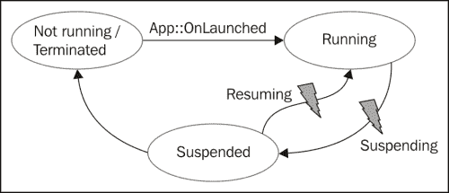

起初，一款应用没有运行。 然后，用户通常通过点击或点击开始屏幕上的磁贴来启动应用。 这会导致调用`Application::OnLaunched`虚拟方法；这是应用应该初始化并呈现主用户界面的地方。

### 备注

Visual Studio 为`OnLaunched`方法提供的默认代码创建了一个`Frame`元素，该元素成为当前`Window`(唯一的应用窗口)的`Content`。 然后调用类型名为`MainPage`的`Frame::Navigate`，使`MainPage`按预期显示。

应用现在处于运行状态，用户可以与应用交互。 如果用户通过按*Alt*+*Tab*切换到另一个应用，或者转到开始屏幕并激活另一个应用磁贴(或者从左侧滑动切换到另一个应用)，我们的应用将不再处于前台。 如果在 5 秒后，用户没有切换回应用，它就会被操作系统挂起。 在此之前，会激发`Application::Suspended`事件。 这是应用保存状态的机会，以防应用稍后终止。 应用保存状态的时间不超过 5 秒；如果时间更长，应用将被终止。 假设一切正常，该应用将被挂起。

可以在**任务管理器**中查看应用的当前状态：

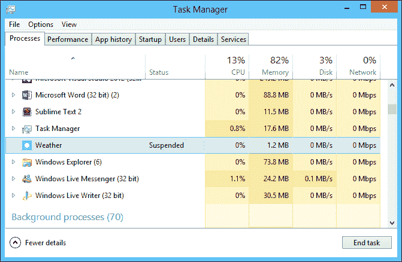

### 提示

要在**任务管理器**中查看应用的状态，首先选择**View**菜单，然后选择**Status Values，**，然后单击**Show Suspend Status**(默认情况下关闭)。

一旦挂起，应用可能会恢复，因为用户切换回了它。 这会导致`Resuming`事件在`Application`对象上激发。 在大多数情况下，该应用与此无关，因为该应用保留在内存中，因此没有丢失任何东西。 在 UI 因数据过时而应该刷新的情况下，可以使用`Resuming`事件(例如，RSS 阅读器将刷新数据，因为应用可能已暂停数小时，甚至数天)。

挂起时，Windows 可能会因为内存资源不足而终止应用。 应用没有收到发生这种情况的通知；这是有意义的，因为应用在挂起期间不能使用任何 CPU 周期。 如果用户再次激活应用，则调用`OnLaunched`，在`LaunchActivatedEventArgs::PreviousExecutionState`属性的帮助下提供恢复状态的机会。 一个可能的值是`ApplicationExecutionState::Terminated`，表示应用已从挂起状态关闭，因此应尝试恢复状态。

### 备注

应用内的各个页面可能希望在应用即将暂停或恢复时收到通知。 这可以在`Page`的构造函数中通过使用`Application::Current`访问全局`Application`对象来完成。 典型的暂停注册可能如下所示：

```cpp
Application::Current->Suspending += ref new SuspendingEventHandler(this, &MainPage::OnSuspending);
```

## 保存和恢复状态

如果应用被挂起，则应用有责任保存所需的任何状态，以防 Windows 决定在应用恢复之前终止该应用。 这是为了响应可在应用级和/或页面级处理的`Application::Suspending`事件。

假设我们有一个电影评论应用，它允许用户评论电影。 可能存在如下所示的简单 UI：

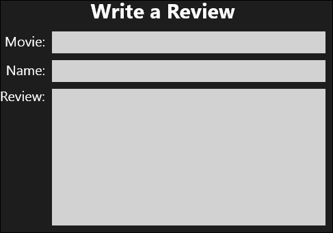

如果用户切换到另一个应用，该应用将在 5 秒后暂停，并且用户不会切换回来。 我们可以使用`Windows::Storage::ApplicationData`类来访问本地设置存储或本地文件夹(对于更复杂的存储要求)，以保存前面`TextBox`元素的状态，以便在应用被 Windows 意外终止时可以恢复它。 首先，我们需要在`MainPage`构造函数中注册`Suspending`事件：

```cpp
MainPage::MainPage() {
  InitializeComponent();

  DataContext = _review = ref new MovieReview;

  Application::Current->Suspending += 
    ref new SuspendingEventHandler(
    this, &MainPage::OnSuspending);
}
```

`MovieReview`类表示审查(实现了[第 5 章](05.html "Chapter 5. Data Binding")、*数据绑定*中讨论的`INotifyPropertyChanged`)，并且`TextBox`元素绑定到它的三个属性。 如果应用被挂起，则会执行以下命令：

```cpp
void MainPage::OnSuspending(Object^ sender, SuspendingEventArgs^ e) {
  ApplicationData::Current->LocalSettings->Values->
    Insert("MovieName", _review->MovieName);
  ApplicationData::Current->LocalSettings->Values->
    Insert("ReviewerName", _review->ReviewerName);
  ApplicationData::Current->LocalSettings->Values->
    Insert("Review", _review->Review);
}
```

代码使用`ApplicationData::LocalSettings`属性(一个`ApplicationDataContainer`对象)，该属性管理通过`Values`属性公开的键/值对的集合(带有可选的内部容器)。

### 备注

可以以这种方式存储的类型仅限于基本的 WinRT 类型，不包括自定义类型，如`MovieReview`。 可以创建一些代码，将此类对象序列化为 XML 或 JSON，然后将其另存为字符串。

如果应用确实已终止，则需要恢复状态。 这可以在`Page::OnNavigatedTo`覆盖上完成，如下所示：

```cpp
void MainPage::OnNavigatedTo(NavigationEventArgs^ e) {
  auto settings = ApplicationData::Current->LocalSettings->Values;
  if(settings->HasKey("MovieName"))
    _review->MovieName = safe_cast<String^>(
    settings->Lookup("MovieName"));
  if(settings->HasKey("ReviewerName"))
    _review->ReviewerName = safe_cast<String^>(
    settings->Lookup("ReviewerName"));
  if(settings->HasKey("Review"))
    _review->Review = safe_cast<String^>(
    settings->Lookup("Review"));
}
```

要测试这一点，我们可以在没有 Visual Studio 调试器的情况下运行应用。 但是，如果我们需要调试代码，就有一个小问题。 当应用被调试时，它永远不会进入挂起状态。 这是为了允许开发人员在应用处于后台时切换到 Visual Studio 并查看代码，并且仍然可以随时切换到该应用。

我们可以通过使用 Visual Studio 工具栏按钮强制应用进入挂起状态，该按钮允许挂起、恢复和终止应用(以及调用后台任务，我们将在本章后面的*后台任务*一节中看到)：


### 确定应用执行状态

当应用被激活时，可能是因为它是由用户启动的(还有其他选项，例如实现的契约，我们将在下一章中看到)。 了解应用上次关闭的原因通常很重要。 如果它被终止，状态应该已经恢复。 另一方面，如果它是被用户关闭的，也许状态应该已经清除，因为用户希望应用重新启动。

我们可以使用应用的`OnLaunched`方法覆盖上可用的`LaunchActivatedEventArgs::PreviousExecutionState`属性来确定此先前状态：

```cpp
ApplicationData::Current->LocalSettings->Values
    ->Insert("state", (int)args->PreviousExecutionState);

if (args->PreviousExecutionState == 
  ApplicationExecutionState::Terminated) {
    // restore state
  }
else if(args->PreviousExecutionState == 
  ApplicationExecutionState::ClosedByUser) {
    // clear state
  }
```

将状态写入`LocalSettings`容器非常有用，这样其他实体(通常是页面)就可以在`OnLaunched`完成之后访问此信息。 这允许我们的还原代码查询此状态并相应地执行操作：

```cpp
auto settings = ApplicationData::Current->LocalSettings->Values;
auto state = safe_cast<ApplicationExecutionState>(
  safe_cast<int>(settings->Lookup("state")));
  if(state == ApplicationExecutionState::Terminated) {
    // restore state...
```

### 备注

枚举也被禁止直接存储，但可以转换为`int`然后存储。

### 状态存储选项

前面的代码示例使用了`ApplicationData::LocalSettings`属性。 这使用计算机(以及当前用户和应用)的本地存储，这意味着在运行 Windows 8 的另一台设备上，即使同一用户登录，也将无法使用相同的状态。

WinRT 提供了另一种选择，它允许使用`ApplicationData::RoamingSettings`属性将设置存储在 Microsoft 云服务中，从而允许设置跨设备漫游。 使用此属性与使用`LocalSettings`完全相同；它自动与云同步。

### 备注

只有当用户使用他的 Microsoft ID(以前的 Live ID)而不是“普通”用户名/密码登录到系统时，才能与云同步。

`LocalSettings`和`RoamingSettings`对于简单的键/值对很有用。 如果需要存储更复杂的数据，我们可以创建一个文件夹(`StorageFolder`对象)，我们可以根据需要通过创建`StorageFile`对象、更多文件夹等等来使用该文件夹。 这可以通过访问其他`ApplicationData`属性来实现：`LocalFolder`、`RoamingFolder`和`TemporaryFolder`(`TemporaryFolder`在应用终止之前存储信息，通常不适用于应用状态管理)。

### 备注

存储在本地应用存储区(`ApplicationData::LocalFolder`)中的文件可以通过以下 URI 进行访问：URI 以`ms-appdata:///local/`开头，后跟文件的相对路径；将`local`替换为`roaming`可访问漫游存储区。 这些 URI 可以在 XAML 中使用，也可以在代码中使用。

### 帮助器类

一些 Visual Studio 2012 项目模板(如 Grid App)提供了两个可以帮助进行状态管理的类：`SuspensionManager`和`LayoutAwarePage`。 它们提供以下功能：

*   可以管理导航页面堆栈，该堆栈另存为本地文件夹中的 XML
*   `LayoutAwarePage`必须用作基页类
*   可以自动保存/恢复此状态

有关这些类的更多信息，感兴趣的读者应该参考源代码。

# 活动瓷砖

Windows 应用商店应用的独特特征之一是在开始屏幕上使用磁贴。 这些磁贴可以包含图像和文本，但它们不需要是恒定的，可以更改。 通过各种机制提供实时和有意义的信息，吸引用户点击/点击磁贴，以访问应用本身。 在这一节中，我们将看看如何创建和操作平铺。

## 设置应用磁贴默认值

应用磁贴的默认值可以在应用清单中设置，该清单可通过 Visual Studio 用户界面轻松访问：

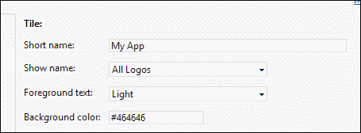

有两种大小的瓷砖可供选择，标准的和宽大的。 如果有宽徽标图像可用，则默认情况下会显示它，用户可以通过右键单击(或从底部滑动)并选择相关选项，将其更改为标准磁贴(反之亦然)：


标准平铺图像应为 150px x 150px，宽平铺图像应为 310px x 150px。 如果未提供这些大小，Visual Studio 将发出警告，并根据需要拉伸/缩小图像。

**简称**将出现在**显示名称**组合框(**所有徽标**、**无徽标**、**仅标准徽标**和**仅宽徽标**)中所选拼贴的顶部。 **前景文本**选项选择浅色或深色文本，所选的背景色将用于透明图像(PNG 文件)和其他一些对话框，作为默认的背景色。

### 备注

应用不应该定义宽磁贴，除非应用计划在该磁贴中提供有意义和有趣的内容。 仅仅使用大的静态图像不是一个好主意；用户会期望磁贴提供更多的功能。

## 更新切片的内容

瓦片可以由运行的应用更新。 即使应用关闭，更新后的磁贴也会保留其内容。 更新图块需要创建一些 XML 来指定图块的各个部分，这些部分可以包括各种布局中的图像和文本。 也有在两个平铺集之间交替的窥视平铺选项。 我们需要做的第一件事是从一组广泛的、预定义的模板中选择一个合适的瓷砖模板。 每个模板都由一个需要作为实际更新发送的 XML 字符串表示。

标准瓷砖和宽瓷砖都有瓷砖模板；它们由`Windows::UI::Notifications::TileTemplateType`枚举表示。 下面是一个具有一个文本项(称为`TileWideImageAndText01`(枚举值))的宽平铺所需的通用 XML 示例：

```cpp
<tile>
  <visual>
    <binding template="TileWideImageAndText01">
      <image id="1" src="image1.png" alt="alt text"/>
      <text id="1">Text Field 1</text>
    </binding>  
  </visual>
</tile>
```

高亮显示的元素和内部文本需要使用所需的新内容进行更新。

### 备注

完整的模板列表和 XMLSchema 可以在[http://msdn.microsoft.com/EN-US/library/windows/apps/hh761491(v=vs.10).aspx](http://msdn.microsoft.com/EN-US/library/windows/apps/hh761491(v=vs.10).aspx)中找到。

选择所需模板后，我们可以使用以下代码检索关联的 XML(不需要手动构建整个 XML)：

```cpp
auto xml = TileUpdateManager::GetTemplateContent(
    TileTemplateType::TileWideImageAndText01);
```

返回值是`Windows::Data::Xml::Dom::XmlDocument`，表示结果 XML。 现在，我们需要使用所需的更新来调整 XML。 在本例中，我们将更改图像和文本：

```cpp
((XmlElement^)xml->GetElementsByTagName("image")->GetAt(0))
  ->SetAttribute("src", "assets\\bug.png");
xml->GetElementsByTagName("text")->GetAt(0)->AppendChild(
  xml->CreateTextNode("You have a bug!!!"));
```

该代码使用 WinRT XML DOM API 来操作 XML。 图像设置为本地图像，但远程图像(`http://...`)同样有效。

最后一步是为应用创建一个磁贴更新程序，构建磁贴通知并执行实际更新：

```cpp
auto update = TileUpdateManager::CreateTileUpdaterForApplication();
auto tile = ref new TileNotification(xml);
update->Update(tile);
```

下面是生成的宽瓷砖：

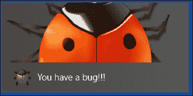

### 备注

前面的代码只更新宽平铺，保持标准平铺不变。 要同时更改标准平铺，我们可以向`<visual>`元素添加另一个`<binding>`元素，并为所需的标准平铺添加适当的 XML。 这将做出这两个更改。

### 启用周期更新

动态磁贴的一个有趣的功能是最多可以循环五次磁贴更新，默认情况下使用最后五个磁贴更新。 以下代码将启用平铺循环：

```cpp
auto update = TileUpdateManager::CreateTileUpdaterForApplication();
update->EnableNotificationQueue(true);
```

如果应该替换特定的区块(而不是丢弃第一个更新)，则可以使用标识要替换的确切区块的`TileNotification::Tag`属性，用唯一的值来标记区块。

### 瓷砖过期

通过设置`TileNotification::ExpirationTime`属性，可以将磁贴设置为在将来某个时候过期。 当时间到来时，平铺将恢复到其默认状态。

### 工卡更新

**徽章**是一个小通知符号，位于瓷砖的右下角。 它可以是 1 到 99 之间的数字，也可以是一组预定义的字形之一。 它通常用于显示状态，例如网络连接(如果适用于应用)或挂起消息的数量(在消息应用中)。

更新徽章与更新磁贴非常相似-它基于包含单个元素(`<badge>`)的 XML 字符串，并对其进行操作以获得所需的结果。 以下是使用数值更新徽章所需的代码：

```cpp
auto xml = BadgeUpdateManager::GetTemplateContent(
  BadgeTemplateType::BadgeNumber);
auto element = (XmlElement^)xml->SelectSingleNode("/badge");
element->SetAttribute("value", (++ count).ToString());

auto badge = ref new BadgeNotification(xml);
BadgeUpdateManager::CreateBadgeUpdaterForApplication()
  ->Update(badge);
```

变量`count`用作数值。

## 创建二次平铺

应用瓦片(主瓦片)可以伴随有次级瓦片。 这些通常表示到应用的深层链接。 例如，天气应用可以在天气需要更新的额外位置使用辅助瓷砖，或者商店应用可以使用辅助瓷砖作为特定产品的链接。

在任何情况下，用户都是唯一可以允许次要瓦片实际固定到开始屏幕或从开始屏幕解除固定的实体。 通常，应用中的一些用户界面允许用户固定第二个磁贴，但这只有在用户同意的情况下才会发生-否则磁贴不会被固定。

下面的代码片断创建一个辅助磁贴，并询问用户是否希望将其固定在开始屏幕上：

```cpp
using namespace Windows::UI::StartScreen;
auto tile = ref new SecondaryTile("123", "Sample tile", 
  "This is a sample tile", "123", 
  TileOptions::ShowNameOnLogo, ref new Uri(
    "ms-appx:///img/apple.png"));
create_task(tile->RequestCreateAsync()).then([](bool ok) {
  // do more stuff
});
```

前面代码使用的`SecondaryTile`构造函数按顺序接受以下参数(也可以使用属性设置它们)：

*   稍后可用于标识切片的唯一切片 ID(例如，用于取消固定)
*   将在系统提供的同意对话框中显示的短名称(必填)
*   显示名称(推荐)
*   磁贴激活参数，可帮助确定通过次要磁贴调用应用时要执行的操作(稍后将详细介绍)
*   徽标 URI

调用`SecondaryTile::RequestCreateAsync`会显示一个标准系统对话框(基于磁贴的创建参数)，询问用户是否有权实际创建并固定磁贴：


通过使用仅接受 ID 的`SecondaryTile`构造函数，可以在给定其唯一 ID 的情况下检索第二分片。 其他选项包括调用静态`SecondaryTile::FindAllAsync`来获取应用创建的所有二级磁贴的列表。

`SecondaryTile::RequestDeleteAsync`方法显示一个系统对话框，请求用户同意删除磁贴。

更新次要瓷砖的方式与更新主要瓷砖(瓷砖和徽章)的方式大致相同。 唯一不同的是更新程序，它是用`TileUpdateManager::CreateTileUpdaterForSecondaryTile`(用于磁贴更新)和`BadgeUpdateManager::CreateBadgeUpdaterForSecondaryTile`(用于徽章更新)创建的。

### 激活二级瓷砖

当轻触或单击次磁贴时，应用照常启动。 由于辅助磁贴应该提供到应用中特定位置的快捷方式，因此必须在`Application::OnLanuched`覆盖中识别和处理此场景。 以下是查找在启动时传递的参数的示例代码：

```cpp
if(args->Arguments != nullptr) {
  // assume arguments are from secondary tiles only
  rootFrame->Navigate(TypeName(DeepPage::typeid), 
    args->Arguments);
}
```

代码假定`DeepPage.xaml`是在检测到二次平铺激活时要显示的相关页面。

# 使用吐司通知

**Toast**是个小弹出窗口，显示与应用有关的重要信息，该应用当时可能正在运行，也可能没有运行。 它出现在屏幕的右上角-用户可以点击(或点击)它来运行或切换到应用，或者用户可以关闭(忽略)祝酒词，因为它现在不重要，或者如果用户现在不在计算机前面，祝酒词将在几秒钟后消失，使用户完全错过祝酒词。

祝酒词具有一定的侵入性，因为无论当前执行的应用是什么(当前应用可以是经典桌面，甚至是锁屏)，它们都会弹出。 这意味着在真正有意义的地方应该少用祝酒词。 典型的用法是在聊天应用或新电子邮件中通知用户传入的消息。

通过选择**设置**符咒，然后选择**权限**，可以逐个应用关闭吐司通知。 通过转到**Windows PC**设置并选择**通知**，也可以全局禁用 Toast。

要使 Toast 通知工作，应用应在其清单中声明其支持 Toast(Visual Studio 清单视图中的**Application UI**选项卡)：


提升吐司通知有点类似于瓷砖。 首先，我们使用`ToastTemplateType`枚举选择一个预定义的模板，然后基于该模板构建适当的 XML(内容可以通过`ToastNotificationManager::GeTemplateContent`方法获得)。 接下来，我们创建一个`ToastNotification`对象，传递最终的 XML。 最后，我们调用`ToastNotificationManager::CreateToastNotifier()->Show`，传递`ToastNotification`对象。

## 吐司选项

可以使用`ScheduledToastNotification`类而不是`ToastNotification`将 Toast 安排到未来的某个时间点。 构造函数的第二个参数是一个`DateTime`值，指示何时应该举杯。 必须将`Show`方法替换为`AddToSchedule`，这样才能正确编译和工作。

`ScheduledToastNotification`的第二个构造函数提供了一种显示反复出现的祝酒词的方法，在弹出窗口之间有一个时间间隔(1 分钟到 60 分钟)和显示祝酒词的次数(1 到 5 次)。

祝酒词可以是标准的(播放 7 秒)，也可以是长的(播放 25 秒)。 当祝酒词的另一边有人的时候，比如有来电时，长长的祝酒词是合适的。 要设置它，必须在 toast XML 中将`duration`属性设置为`long`。

当显示时，祝酒词将播放默认的声音效果。 可以将此效果更改为 Windows 中可用于此目的的一组预定义声音之一。 同样，这是通过添加`audio`元素来实现的，该元素将`src`属性设置为一个预定义的声音字符串(有关完整列表，请查看文档)。

# 推送通知

正如我们已经看到的，应用可以以任何合理的方式在中设置其平铺(和可选的次要平铺)；如果收到新信息，它甚至可以更新平铺。 但是，如果应用被挂起，会发生什么情况呢？ 它如何更新其磁贴？ 更糟糕的是，应用可能根本没有运行。 它的瓷砖将如何更新？ 想象一下，一款新闻应用可能希望它的磁贴能够反映最近的新闻。

要做到这一点，一种方法是使用推送通知。 顾名思义，这些通知是由服务器推送到设备上的，该设备当时可能正在运行该应用，也可能没有运行该应用。 这与 Pull 模型形成对比，在 Pull 模型中，应用的某个部分轮询某个服务器以获取新信息。 推送通知是节能的，不需要应用做任何特殊的事情(除了我们稍后会看到的首先注册通知)来获得通知。

## 推送通知架构

推送通知涉及多个参与者，应用只是其中之一。 推送通知本身来自 Microsoft 提供的服务，即 Windows Azure 上托管的**Windows Notification Service**(**WNS**)。 另一个主要实体是应用服务器，它具有实际发起推送通知的逻辑或受到适当控制。 在新闻应用示例中，这将是一个服务器，它接收新闻更新，然后使用推送通知将其传播到所有注册的客户端应用。

推送通知架构如下图所示：

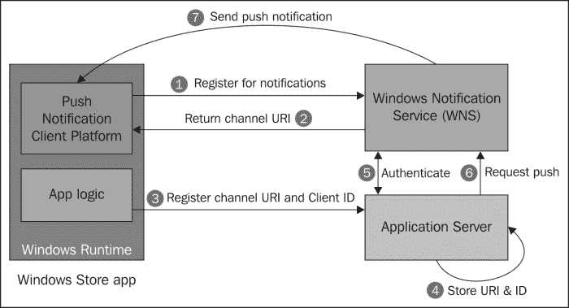

设置推送通知的基本步骤如下：

1.  Windows 应用商店应用必须注册才能接收通知。 它使用 WinRT API 调用 WNS 并请求唯一的通道 URI，该通道 URI 标识此设备上此用户的此应用(技术上是主要磁贴)。
2.  WNS 向应用返回唯一的通道 URI。
3.  应用需要将唯一的通道 URI 和一些唯一的客户端标识符传递给应用服务器。 通常需要唯一的客户端 ID，因为通道 URI 可能会过期，必须续订。 就应用服务器而言，客户端 ID 保持身份。
4.  应用服务器存储所有注册的客户端及其通道 URI 的列表。 稍后，当需要发送通知时，它将循环列表并发送通知。
5.  应用服务器需要向 WNS 进行身份验证，并返回一个身份验证令牌，以用作推送通知有效负载的一部分。 这是一次性操作，但可能需要重复，因为令牌可能会在将来过期。
6.  最后，当应用服务器逻辑决定发送推送通知(或受某些外部管理应用的指示)时，它会将通知作为 HTTP POST 请求发送。
7.  WNS 接收请求并向客户端设备执行实际的推送通知。

推送通知可以更改活动磁贴(主要磁贴或次要磁贴)、更改徽章或显示祝酒词通知。 它甚至可以发送原始的、特定于应用的通知，这些通知可以运行为应用注册的后台任务(后台任务将在本章后面讨论)。

在下一节中，我们将看到实现上述步骤以启动并运行推送通知的示例。

## 构建推送通知应用

接收推送通知的第一步是从 WNS 获取唯一的 URI。 这是一个相当简单的操作，只涉及一个方法调用：

```cpp
create_task(PushNotificationChannelManager::
  CreatePushNotificationChannelForApplicationAsync()).then(
  [this](PushNotificationChannel^ channel) {
  _channel = channel;
```

对的调用返回一个`PushNoticationChannel`对象，该对象被存储以供以后在`_channel`成员变量中使用。 这些类型驻留在`Windows::Networking::PushNotifications`名称空间中。

下一步是向应用服务器注册此 URI，因此让我们先看一下该服务器。

### 应用服务器

应用服务器可以使用 Microsoft 堆栈内部或外部的任何服务器端技术构建。 典型的服务器将公开某种类型的服务，客户端可以连接到这些服务并注册其唯一的 URI，以用于推送通知(可能还有其他目的)。

作为示例，我们将构建一个托管在 IIS 中的 WCF 服务，该服务将公开用于此目的的适当操作。 该示例假设服务器管理电影信息，并希望通知注册的客户端有新电影可用。 WCF 服务接口如下所示：

```cpp
[DataContract(Namespace="")]
public class ClientInfo {
  [DataMember]
  public string Uri { get; set; }
  [DataMember]
  public string ClientID { get; set; }
}

[ServiceContract]
public interface IMovieService {
  [OperationContract, WebInvoke(UriTemplate="add")]
  void AddNewMovie(Movie movie);

  [OperationContract, WebInvoke(UriTemplate="register")]
  void RegisterForPushNotification(ClientInfo info);
}
```

`IMoviesService`有两个操作(建模为方法)：

*   `RegisterForPushNotification`是，用于征集感兴趣的客户端作为推送通知的目标。 它传递一个`ClientInfo`对象，该对象具有唯一的通道 URI(从上一步获得)和一些唯一的客户端 ID。
*   稍后，某个控制器应用将调用`AddNewMovie`操作，以指示有新电影可用，从而调用推送操作(我们稍后将对此进行介绍)。

### 备注

**WCF**(**Windows Communication Foundation**)是用于编写服务和服务客户端的基于.NET 的技术，它不在本书的讨论范围内，因为它与 Windows 8 应用商店应用没有直接关系。 WCF 将用于服务器端代码，因为它相当知名且足够容易使用，至少对于这些目的是如此；代码自然是用 C#编写的。

这样的服务必须做的第一件事是从 WNS 获取身份验证令牌，这样它实际上就可以执行推送通知。 实现这一点的第一步是注册 Windows8 应用，并获取两条信息：安全 ID 和密钥。 有了这些信息，我们可以联系 WNS 并请求令牌。 要注册应用，我们必须浏览到[https://manage.dev.live.com](https://manage.dev.live.com)，使用我们的微软 ID(以前的 Live ID)登录，单击**创建应用**，输入一些唯一的应用名称，然后单击**是**：

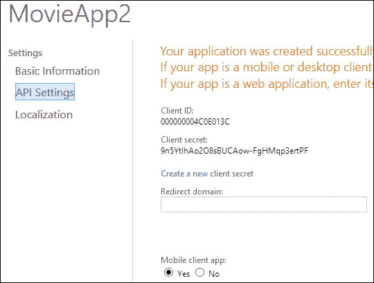

结果是**安全 ID**(**SID**)和密钥：


我们将复制这些内容，并将它们作为简单的常量或静态字段存储在服务类实现中。 应用名称本身必须复制到应用清单中(在**打包**选项卡中)，并在网页上列出一些其他详细信息。 要简化此操作，请右键单击项目，选择**Store**，然后选择**Associate App with Store**。 这将把大多数信息输入到正确的位置：

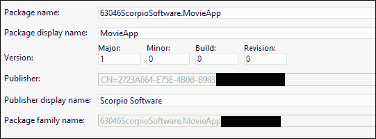

获取身份验证令牌的代码如下所示：

```cpp
private static void GetToken() {
  var body = string.Format
  ("grant_type=client_credentials&client_id={0}&client_secret={1}
  &scope=notify.windows.com",
  HttpUtility.UrlEncode(SID), HttpUtility.UrlEncode(Secret));

  var client = new WebClient();
  client.Headers.Add("Content-Type", 
     "application/x-www-form-urlencoded");
  string response = client.UploadString(new Uri(AuthUri), body);

  dynamic data = JsonConvert.DeserializeObject(response);
  _token = data.access_token; 
}
```

这段代码相当乏味。 它使用身份验证过程所需的特定格式。 `WebClient`类提供了一种在.NET 中进行 HTTP 调用的简单方法。 调用的结果是 JSON 对象的字符串表示，它由`Newtonsoft.Json.JsonConvert`类反序列化。 最后，`access_token`字段是我们需要的实际令牌，保存在静态变量`_token`中。

### 备注

`JsonConvert`是免费的`Json.NET`包的一部分，可以使用 NuGet 轻松安装(在 Visual Studio 中右键单击项目，选择**管理 Nuget Packages…。** ，搜索`Json.Net`，然后单击**安装**。

`dynamic`C#关键字允许(尤其是)通过后期绑定到实际成员(如果存在)来对对象进行无类型访问。 编译器乐于将类型检查推迟到运行时进行，因此无法识别的成员会抛出运行时异常，而不是通常的编译时错误。

既然获得了令牌，就可以用它来发送推送通知了。

### 备注

身份验证令牌实际上可能过期，这可以通过检查来自实际推送通知`POST`请求的响应，查找`WWW-Authenticate`报头的`Token expired`值来发现。 在这种情况下，只需再次调用`GetToken`即可获得新的令牌。

现在服务器已经准备好了，客户端应用需要向应用服务注册其唯一通道 URI。

### 注册推送通知

从理论上讲，这一步很容易。 只需在服务上调用`RegisterForPushNotification`方法，传递所需的参数，就完成了。 不幸的是，这并不像我们在 C++ 中希望的那样简单。

应用需要对服务进行正确的网络调用(通常是通过 HTTP)。 最简单的 HTTP 调用都是基于 REST 的，所以如果我们的服务配置为接受 REST over HTTP，情况会更简单。

### 备注

**REST**(**表述性状态转移**)超出了本书的范围。 就我们的目的而言，它意味着将 HTTP URL 上的信息编码为简单字符串，并将更复杂的信息与请求正文一起传递。 这与更复杂的协议(如 SOAP)形成了鲜明对比。

由于`[WebInvoke]`属性的原因，我们创建的 WCF 服务被配置为接受 REST 调用，为每个请求设置 URL 后缀。 这还需要将服务主机配置为使用`WebHttpBinding`WCF 绑定和`WebHttp`行为。 这是通过`MovieWorld.svc`文件完成的，其中声明了服务：

```cpp
<%@ ServiceHost Language="C#" Debug="true" 
  Service="MoviesWorld.MovieService" 
  CodeBehind="MovieService.svc.cs" 
 Factory= "System.ServiceModel.Activation.WebServiceHostFactory" %>
```

`Factory`属性是重要的(非默认)部分。

下一个挑战是从 C++ 客户端应用进行 REST(或任何 HTTP)调用。

遗憾的是，在编写本文时，还没有简单的方法来使用可以进行 HTTP 调用的 WinRT 类，类似于.NET 中的`WebClient`和`HttpClient`。文档建议使用低级的`IXMLHTTPRequest2`COM 接口来实现此目的。

虽然这当然是可能的，但这并不容易。 幸运的是，Microsoft 创建了一个 C++ 包装类`HttpRequest`，它为我们完成了大部分工作。 我几乎按原样将类复制到了项目中(做了一点小小的修改)，所以现在进行 HTTP 调用要容易得多。

### 备注

`HttpRequest`在`HttpRequest.h`或`HttpRequest.cpp`文件中实现，这些文件是`MovieApp`项目的一部分，本章的可下载源代码中提供了这些文件。

以下是注册该应用以接收推送通知的 HTTP 请求：

```cpp
Web::HttpRequest request;
wstring body = wstring(L"<ClientInfo><ClientID>123</ClientID><Uri>") + channel->Uri->Data() + L"</Uri></ClientInfo>";

return request.PostAsync(ref new Uri(
  "http://localhost:36595/MovieService.svc/register"), 
  L"text/xml", body);
```

正文由一个`ClientInfo`对象组成，该对象被序列化为 XML，其中的`Uri`元素具有在第一步中获得的唯一的通道 URI。 例如，这里的客户端 ID 编码为常量`123`；在实际的应用中，这将作为该应用在此机器上为该用户生成的唯一内容生成。 奇怪的端口号是侦听托管我的服务的本地端口 IIS。 同样，在真正的应用中，这将超过端口 80(常规 HTTP)或 443(HTTPS)。

### 备注

发出 HTTP 请求的另一种方法是使用 C++ rest SDK(Casablanca)库；在编写这些代码行时，该库已经发布到 CodePlex。 该库允许(尤其是)以一种简单且可定制的方式处理 HTTP 请求，这与.NET`HttpClient`类有些类似。 可以在[http://casablanca.codeplex.com/](http://casablanca.codeplex.com/)找到 sdk。

### 下发推送通知

当应用服务器收到对其`AddNewMovie`方法的调用时(作为服务器本身的某些逻辑的一部分，或者因为某个管理应用调用了该操作)，它需要向所有注册的客户端发送推送通知：

```cpp
public void AddNewMovie(Movie movie) {
  _movies.Add(movie);
  foreach(var uri in _pushData.Values) {
    // push new movie to registered clients
    SendPushTileNotification(uri, movie);
  }
}
```

`SendPushTileNotification`方法如下所示：

```cpp
private async Task SendPushTileNotification(string uri, Movie movie) {
  string body =
    "<tile>" +
    "<visual>" +
    "<binding template=\"TileSquareText01\">" +
    "<text id=\"1\">" + movie.Year + "</text>" +
    "<text id=\"2\">" + movie.Name + "</text>" +
    "</binding>" +
    "</visual>" +
    "</tile>";

  var client = new HttpClient();
  var content = new StringContent(body);
  content.Headers.ContentType = new  MediaTypeHeaderValue(
      "text/xml");
  client.DefaultRequestHeaders.Add("X-WNS-Type", "wns/tile");
  client.DefaultRequestHeaders.Add("Authorization", 
    string.Format("Bearer {0}", _token));
  await client.PostAsync(uri, content);
}
```

消息的正文是一个常规的 XML 块。 在本例中，它包括两行文本：

*   第一个包含电影发布的年份
*   第二个包括电影名称

通知是基于唯一通道 URI 的 HTTP`POST`请求，具有一些必须正确设置的特定标头。 另外，请注意前面从 WNS 获得的身份验证令牌的使用。

### 备注

`await`C#关键字允许在不阻塞调用线程的情况下等待异步操作。 这类似于我们将 TASK`<T>`类与`then`方法一起使用。 C#看起来仍然更容易使用。

通过将`X-WNS-Type`标题分别更改为`wns/toast`和`wns/badge`，可以将通知类型更改为吐司或徽章。 自然，身体必须进行相应的修改。

### 备注

本章的示例代码包括一个名为`MovieManager`的项目，该项目用于添加生成推送通知的新电影。

以下是原始应用磁贴(左)和新电影推送通知后的磁贴：

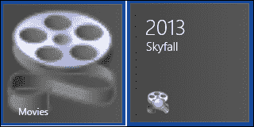

### 备注

最近可用的 Windows Azure 移动服务提供了更简单的方式来维护推送通知客户端和发送通知本身(以及其他有用的功能)。 移动服务不在本书的讨论范围内，但是可以在[http://www.windowsazure.com/en-us/develop/mobile/](http://www.windowsazure.com/en-us/develop/mobile/)上找到更多信息。

## 二次拼贴推送通知

次级瓦片也可以作为推送通知的目标。 主要区别在于客户端应用获取唯一通道 URI 的方式。 它使用带有平铺 ID 的`CreatePushNotificationChannelForSecondaryTileAsync`，而不是`CreatePushNotificationChannelForApplicationAsync`(这两个都是`PushNotificationChannelManager`类的静态方法)。

# 后台任务

当用户切换到其他应用时，Windows 应用商店应用可能会挂起。 即使在应用被暂停甚至终止的情况下，该应用可能仍希望发生一些工作。 这是后台任务的工作。

## 什么是任务？

**TASK**只是一个实现`Windows::ApplicationModel::Background::IBackgroundTask`接口的类，只有一个方法`Run`。 此类必须放在不同于主应用的单独项目中，位于**Windows Runtime Component**类型的项目中。 这是至关重要的，因为任务在单独的进程中运行，因此不能与主应用绑定(因此，如果主应用被挂起，它们也不会被挂起)。

主应用需要引用任务所在的项目，并通过其清单指示这些确实是它的任务。

### 备注

应用可以在一个或多个 Windows 运行时组件项目中实现任意数量的任务。

一个任务必须正好有一个触发器，指定触发任务执行的是什么。 任务还可以有零个或多个条件，必须指定这些条件才能使用触发器。

### 备注

一个任务只能与一个触发器相关联，但是可以注册另一个运行相同代码但配置了不同触发器的任务。 这实际上创建了一个可以使用多个触发器运行的任务。

## 创建和注册任务

创建任务的第一步是使用实现`IBackgroundTask`接口的类创建一个 Windows 运行时组件项目，如下所示：

```cpp
namespace Tasks {
  using namespace Windows::ApplicationModel::Background;

  [Windows::Foundation::Metadata::WebHostHidden]
  public ref class SimpleTask sealed : IBackgroundTask {
  public:
    virtual void Run(IBackgroundTaskInstance^ taskInstance);
  };
}
```

接下来，我们需要从主应用项目添加对任务组件的引用。 最后一个先决条件是将任务添加到主应用的清单中。 这是在**声明**选项卡中完成的：

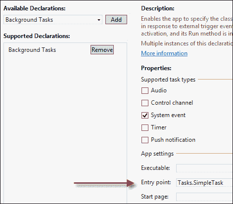

选择具有适当任务类型的后台任务声明，该任务类型大致表示触发器类型，稍后将用于在代码中进行实际注册。 我们稍后再讨论触发因素。

**入口点**字段必须设置为实现后台任务的完整类名(在本例中为`Tasks::SimpleTask`)。

结果是清单 XML 中`<extensions>`部分的一个条目：

```cpp
<Extensions>
  <Extension Category="windows.backgroundTasks" 
    EntryPoint="Tasks.SimpleTask">
    <BackgroundTasks>
      <Task Type="systemEvent" />
    </BackgroundTasks>
  </Extension>
</Extensions>
```

主应用必须在启动时进行实际任务注册，并且只能注册一次。 使用现有任务名称注册任务会引发异常。

注册涉及`BackgroundTaskBuilder`类和具有可选条件的触发器类。 下面是一段代码，它注册了前面代码片段中定义的`SimpleTask`，以便在 Internet 连接可用时执行：

```cpp
auto trigger = ref new SystemTrigger(
  SystemTriggerType::InternetAvailable, false);
auto condition = ref new SystemCondition(
  SystemConditionType::InternetAvailable);

auto builder = ref new BackgroundTaskBuilder();
builder->Name = "Simple";
builder->TaskEntryPoint = "Tasks.SimpleTask";
builder->SetTrigger(trigger);
builder->AddCondition(condition);
auto task = builder->Register();
```

必须为任务选择触发器；在本例中，它是基于`SystemTriggerType`枚举的泛型`SystemTrigger`，它具有`InternetAvailable`、`UserPresent`、`UserAway`、`SmsReceived`、`TimeZoneChange`等值。

条件是可选的；`SystemCondition`是当前唯一可用的条件，但它也是通用的，使用`SystemConditionType`枚举。 值包括`InternetAvailable`、`InternetUnavailable`、`UserPresent`、`UserNotPresent`等。

`BackgroundTaskBuilder`保存触发器和条件信息，以及任务名称和入口点。 然后调用`Register`执行系统的实际注册(返回一个`BackgroundTaskRegistration`对象)。

## 执行任务

让我们使用允许用户输入数据的应用，该数据保存在本地文件夹中。 如果用户连接到 Internet，后台任务应该对生成的文件进行一些处理，例如将它们上载到服务器、进行一些计算等。 最终，该任务将在处理完文件后将其删除。

下面是主应用用来将一些数据保存到文件中的一些简单代码：

```cpp
auto root = ApplicationData::Current->LocalFolder;

create_task(root->CreateFolderAsync("Movies", 
  CreationCollisionOption::OpenIfExists)).then([](
  StorageFolder^ folder) {
    return folder->CreateFileAsync("movie", 
    CreationCollisionOption::GenerateUniqueName);
  }).then([](StorageFile^ file) {
    // build data to write
    return file->OpenAsync(FileAccessMode::ReadWrite);
  }).then([this](IRandomAccessStream^ stm) {
    wstring data = wstring(L"<Movie><Name>") + 
    _movieName->Text->Data() + L"</Name><Year>" + 
    _year->Text->Data() + L"</Year></Movie>";
    auto writer = ref new DataWriter(stm);
    writer->WriteString(ref new String(data.c_str()));
    return writer->StoreAsync();
  }).then([this](size_t) {
  _movieName->Text = "";
  _year->Text = "";
});
```

这些文件被保存到`LocalFolder`下名为`Movies`的子文件夹中。

任务共享应用的本地文件夹，有效地使其成为一种通信机制。 下面是任务的`Run`方法实现：

```cpp
void SimpleTask::Run(IBackgroundTaskInstance^ taskInstance) {
  auto root = ApplicationData::Current->LocalFolder;
  Platform::Agile<BackgroundTaskDeferral^> deferral(
  taskInstance->GetDeferral());
  create_task(root->GetFolderAsync("Movies")).
    then([](StorageFolder^ folder) {
    return folder->GetFilesAsync(
    CommonFileQuery::DefaultQuery);
    }).then([](IVectorView<StorageFile^>^ files) {
    int count = files->Size;
    for(int i = 0; i < count; i++) {
      auto file = files->GetAt(i);
      // process each file...
      file->DeleteAsync();
    }
  }).then([deferral](task<void> t) {
    t.get();
    // error handling omitted
    deferral->Complete();
  });
}
```

任务从获取`LocalFolder`位置开始。 在实际过程开始之前，它通过调用`IBackgroundTaskInstance::GetDeferral`获得一个*扩展*对象。 为什么？

当`Run`方法终止时，任务通常被认为是完成的。 但是，如果该实现调用任何异步操作，则该方法将更快地返回给其调用方，从而使任务完成。 获得延迟实际上会将任务完成推迟到调用`BackgroundTaskDeferral::Complete`时。

接下来是实际的文件处理。 使用`StorageFolder::GetFilesAsync`枚举`Movies`文件夹中的所有文件，并在每次虚拟处理后删除该文件。 只有到那时，整个任务才能完成，并且可以调用延迟的`Complete`方法来指示任务已完成。

## 任务调试

在开发环境中不容易满足可用的触发器和条件。 我们不想断开并重新连接 Internet；也不想等待 15 分钟，直到执行带有`TimeTrigger`的任务。

Visual Studio 提供了一种随时调用任务以进行调试的方法。 此功能与暂停和恢复位于同一工具栏按钮中：


如果我们在任务的`Run`方法中放置断点，我们就可以像往常一样调试任务。 `BackgroundTaskHost.exe`是承载应用任务的流程实例。 这一事实可以在调试器**进程**工具栏按钮或 Windows 任务管理器中查看。

## 任务进度和取消

后台任务也可以在主应用运行时运行。 可以做的一件事是从后台任务的角度指示其进度。 这是使用`IBackgroundTaskInstance::Progress`属性完成的。 如果主应用没有运行，没人会在意。 如果它正在运行，它可以注册`Progress`事件(成功注册任务后返回的`IBackgroundTaskRegistration`的一部分)，并基于该进度更新 UI。

当任务完成时，会触发`IBackgoundTaskRegistration::Completed`事件，以便主应用知道任务已经完成。 如果主应用当前处于暂停状态，恢复运行时会收到通知。

在某些情况下，Windows 可能会取消正在运行的任务。 `IBackgroundTaskInstance`公开任务可以注册的`Canceled`事件。 如果任务被取消，必须在 5 秒内返回，否则将被终止。 `Canceled`事件提供指定任务取消原因的`BackgroundTaskCancellationReason`。 示例包括`ServiceUpdate`(主应用正在更新)和`LoggingOff`(用户正在注销系统)。

例如，我们可以使用 Win32 事件通知任务已请求取消。 首先，我们创建事件对象并注册`Canceled`事件：

```cpp
void SimpleTask::Run(IBackgroundTaskInstance^ taskInstance) {
  if(_hCancelEvent == nullptr) {
    _hCancelEvent = ::CreateEventEx(nullptr, nullptr, 0, 
    EVENT_ALL_ACCESS);
    taskInstance->Canceled += 
    ref new BackgroundTaskCanceledEventHandler(
    this, &SimpleTask::OnCancelled);
  }
```

`_hCancelEvent`是用`CreateEventEx`创建的`HANDLE`类型。 则`Canceled`事件与私有`OnCancelled`方法相关联。

### 备注

经典的 Win32API`CreateEvent`不能使用，因为它在 WinRT 中是非法的。 `CreateEventEx`是在 Windows Vista 中引入的，可以被视为`CreateEvent`的超集。

如果任务正在取消，我们设置 Win32 事件：

```cpp
void SimpleTask::OnCancelled(IBackgroundTaskInstance^ instance, 
  BackgroundTaskCancellationReason reason) {
  ::SetEvent(_hCancelEvent);
}
```

如果发出信号，任务主处理代码应该检查 Win32 事件并尽快退出：

```cpp
for(int i = 0; i < count; i++) {
  auto file = files->GetAt(i);
  if(::WaitForSingleObjectEx(_hCancelEvent, 0, FALSE) == 
    WAIT_OBJECT_0)
   // cancelled
    break;
    // process each file...
    file->DeleteAsync();
}
```

使用零超时调用`WaitForSingleObject`只会检查事件的状态。 如果用信号通知，则返回值为`WAIT_OBJECT_0`(否则，返回值为`WAIT_TIMEOUT`)。

## 播放背景音频

有些应用会播放音频，而用户希望即使用户切换到另一个应用，音频也会继续播放；例如，音乐播放应用会继续播放，直到用户通知其停止播放。 即使用户切换到另一个应用，IP 语音应用(如 Skype)也会保留对方的音频。 这就是背景音频任务的用武之地。

### 播放音频

通过使用`MediaElement`控件(也可以播放视频)，可以轻松实现音频播放。 它应该放在 XAML 中的某个位置，这样它就是可视树的一部分，尽管在播放音频时它没有可见部分。

实际播放是通过使用`Source`属性(或通过调用`SetSource`方法从`FileOpenPicker`获取的文件)设置要播放的 URI 来完成的。 除非将`AutoPlay`属性设置为`false`，否则播放会立即开始。

使用`MediaElement`的`Play`、`Pause`和`Stop`方法控制回放。 下面是一个从`FileOpenPicker`获取的音频文件的示例。 首先，介绍`MediaElement`和播放控件的一些基本 UI：

```cpp
<Grid>
  <Grid.RowDefinitions>
    <RowDefinition Height="Auto" />
    <RowDefinition Height="Auto" />
    <RowDefinition Height="Auto" />
  </Grid.RowDefinitions>
  <MediaElement x:Name="_media" />
  <Button Content="Select Audio File..." FontSize="30" Margin="10" 
    Click="OnSelectMediaFile" />
    <StackPanel Orientation="Horizontal" Grid.Row="2" 
    Margin="10,30">
    <Button Content="Play" FontSize="40" Click="OnPlay" 
    Margin="8"/>
    <Button Content="Pause" FontSize="40" Click="OnPause" 
    Margin="8"/>
    <Button Content="Stop" FontSize="40" Click="OnStop" 
    Margin="8"/>
  </StackPanel>
</Grid>
```

`OnSelectedMediaFile`实现如下：

```cpp
auto picker = ref new FileOpenPicker();
picker->FileTypeFilter->Append(".mp3");
create_task(picker->PickSingleFileAsync()).
  then([this](StorageFile^ file) {
    if(file == nullptr)
      throw ref new OperationCanceledException();
      return file->OpenReadAsync();
  }).then([this](IRandomAccessStreamWithContentType^ stm) {
  _media->SetSource(stm, "");
  }).then([](task<void> t) {
  try {
    t.get();
  }
  catch(Exception^ ex) {
  }
});
```

大多数代码现在应该都很熟悉了。 为 MP3 文件设置了`FileOpenPicker`的过滤器，一旦选择了，调用`MediaElement::SetSource`就会准备好播放音频流。

播放流只需在`Play`按钮的`Click`处理程序上调用`MediaElement::Play`：

```cpp
void MainPage::OnPlay(Object^ sender, RoutedEventArgs^ e) {
  _media->Play();
}
```

`OnPause`和`OnStop`分别类似地通过调用`MediaElement::Pause`和`MediaElement::Stop`来实现。

运行该应用现在可以选择并播放 MP3 文件。 然而，切换到另一款应用会立即停止播放。

### 维护背景音频

使应用继续在后台自动播放需要几个步骤。

首先，必须修改应用清单以指示需要背景音频；这是通过添加**后台任务**声明并设置**音频**复选框来完成的：

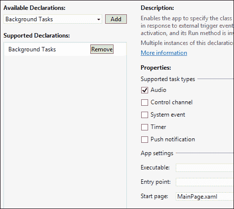

另一个必需的步骤是设置**Start**页面，如前面的屏幕截图所示。 接下来的步骤需要添加一些代码：

*   `MediaElement::AudioCategory`属性必须设置为`AudioCategory::BackgroundCapableMedia`(用于常规后台播放)或`AudioCategory::Communications`(用于对等通信，如聊天)。
*   注册`Windows::Media::MediaControl`类的静态事件，这些事件指示使用音频播放的其他应用可能导致的更改。

首先，我们将更改`MediaElement`的`AudioCategory`属性：

```cpp
<MediaElement x:Name="_media" AudioCategory="BackgroundCapableMedia"/>
```

此设置的结果使应用永远不会进入挂起状态。

接下来，我们将注册所需的活动：

```cpp
MediaControl::PlayPressed += ref new EventHandler<Object^>(
  this, &MainPage::OnPlayPressed);
MediaControl::PausePressed += ref new EventHandler<Object^>(
  this, &MainPage::OnPausePressed);
MediaControl::StopPressed += ref new EventHandler<Object^>(
  this, &MainPage::OnStopPressed);
MediaControl::PlayPauseTogglePressed += 
  ref new EventHandler<Object^>(
  this, &MainPage::OnPlayPauseTogglePressed);
```

当回放状态因系统提供的媒体控件(可通过某些键盘或其他手势访问)而发生更改时，系统会触发这些事件：

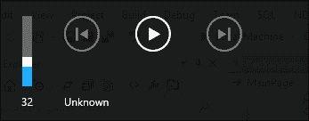

对这些(T2)事件作出反应并不困难。 下面是`PlayPressed`和`PlayPauseTogglePressed`事件的代码：

```cpp
void MainPage::OnPlayPressed(Object^ sender, Object^ e) {
  Dispatcher->RunAsync(CoreDispatcherPriority::Normal, 
    ref new DispatchedHandler([this]() {
    MediaControl::IsPlaying = true;
    _media->Play();
  }));
}

void MainPage::OnPlayPauseTogglePressed(Object^ sender, Object^ e) {
  Dispatcher->RunAsync(CoreDispatcherPriority::Normal, 
  ref new DispatchedHandler([this]() {
    if(_media->CurrentState == MediaElementState::Playing) {
      MediaControl::IsPlaying = false;
      _media->Pause();
    }
    else {
      MediaControl::IsPlaying = true;
      _media->Play();
    }
  }));
}
```

通知作为命令处理，以便应用根据需要播放或暂停播放；正确的实现可确保系统上所有音频播放的行为一致。

### 备注

请注意，事件到达线程池线程，由于需要接触`MediaElement`，因此必须使用`CoreDispatcher::RunAsync`方法将调用编组到 UI 线程。

处理`PausePressed`和`StopPressed`事件类似。

如果合适，可以处理来自`MediaControl`类的其他事件，例如`NextTrackPressed`和`PreviousTrackPressed`。

### 音量通知

如果一个后台应用正在播放音频，而另一个前台应用开始播放音频，则系统会向后台应用发送一个`MediaControl::SoundLevelChanged`事件。 此事件通过查看`MediaControl::SoundLevel`属性表示后台应用的声音发生了什么情况。 可能的值是：

*   `Muted`：应用的声音已静音，因此应用应暂停播放。 这通常意味着前台应用正在播放音频。
*   `Low`：这款应用的音量变低了。 这表明有一个 VoIP 电话打进来，降低了应用的音量。 应用可能希望暂停播放，直到触发另一个指示音量已满的`SoundLevelChanged`事件。
*   `Full`：应用的音量调到了最高音量。 如果应用正在播放音频并不得不暂停，那么现在是恢复播放的时候了。

注册这一活动是可选的，但可以增强用户体验，这表明这是一个表现良好的应用。

## 锁屏应用

锁定屏幕(在用户登录之前或设备锁定时)允许在其上安装最多七个应用-这些应用可以有一个图标(甚至是一条文本消息)；这些应用被称为锁屏应用。 七个可能的应用可以通过控制面板|**PC 设置**|**个性化**进行配置：

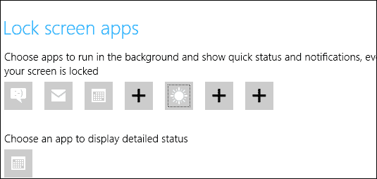

系统认为锁屏应用更重要(因为它们对用户更重要)，因此具有一些非锁屏应用无法获得的功能。 例如，某些触发器类型仅适用于锁屏应用：

*   `TimeTrigger`可用于定期工作(最短为 15 分钟)。
*   `PushNotificationTrigger`是否可以使用获取导致任务执行的原始推送通知(RAW 表示与瓷砖、烤面包或徽章无关的任何字符串)。
*   `ControlChannelTrigger`可用于保持与远程服务器的实时连接，即使在应用挂起时也是如此；对于即时消息或视频聊天应用非常有用。

### 备注

后两种触发器类型使任务实际上在应用进程内运行，而不是在标准任务托管进程中运行。

实际上还有另一个与时间相关的触发器`MaintenanceTrigger`。 这款手机不需要锁屏应用，但只有在设备连接到交流电源的情况下才能使用。 如果它已断开连接，任务将不会运行。 如果在任务执行过程中断开连接，则任务将被取消。

要使应用具有锁屏功能，需要设置以下几项内容：

*   必须为应用设置一个宽徽标。
*   还必须设置徽章徽标；这是应用锁定屏幕上显示的默认图像。
*   必须至少声明一个使用推送通知触发器、时间触发器或控制通道触发器的后台任务(在 Visual Studio 中使用清单的**声明**选项卡)。
*   The **Lock screen notifications** option must be set to **Badge** or **Badge with Tile Text**:

    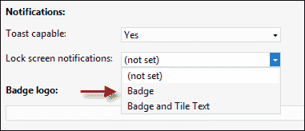

## 请求设置锁屏应用

尽管用户可以进入应用的设置并将其设置为锁屏应用，或者进入 Windows 个性化部分进行同样的操作。 如果应用询问用户(通过系统提供的对话框)，应用是否可以成为锁屏应用，就会更容易。 这是通过`BackgroundExecutionManager::RequestAccessAsync`静态方法调用实现的。 异步调用的结果指定用户是否接受建议(`BackgroundAccessStatus`枚举)。

### 备注

如果用户拒绝，则再次运行应用时不会弹出对话框；如果重新安装应用，则会再次弹出对话框。

## 锁屏应用的其他常见操作

锁屏应用通常在应用的生命周期内执行以下操作：

*   发送工卡更新(显示在锁屏上)
*   发送切片更新
*   接收和处理用于执行应用特定逻辑的原始推送通知
*   举起祝酒辞通知(即使在锁定屏幕上也会显示)

这些操作的确切细节超出了本书的范围(尽管徽章、瓷砖和烤面包的更新机制与前面讨论的类似)；更多详细信息可以在 MSDN 文档中找到。

## 后台任务限制

当执行时，后台任务会与当前运行的前台应用争夺 CPU 和网络资源，因此它们不能运行任意的时间长度；前台应用是最重要的。 任务受以下限制：

*   锁屏应用任务每 15 分钟获得 2 秒的 CPU 时间(实际运行时间，而不是挂钟时间)。
*   非锁屏应用每 2 小时接收 1 秒的 CPU 时间(同样是实际运行时间)。
*   当设备使用交流电源运行时，网络资源不受限制。 否则，根据能源消耗的不同，可能会有一些限制。
*   配置了`ChannelControlTrigger`或`PushNotificationTrigger`的任务会得到一些资源保证，因为它们被认为更重要。

此外，还有一个可供任何应用使用的 CPU 和网络资源全局池。 此游泳池每 15 分钟重新灌水一次。 这意味着，即使一个任务需要超过 1 秒的运行时间(非锁屏应用)，它也可能获得额外的 CPU 时间，前提是池没有耗尽。 当然，任务不能依赖于这个池，因为其他任务可能已经耗尽了它。

# 后台转账

现在应该清楚的是，挂起的应用本身不能做任何事情，除非它有一些后台任务代表它工作。 应用可能需要执行的操作之一是长时间下载或上传文件。 如果应用挂起，下载或上传操作将无法继续。 如果应用被终止，任何已经下载的内容都会消失。 显然，一定有更好的办法。

WinRT 提供了一种即使应用挂起也可以进行后台传输(下载和上传)的方法，方法是使用单独的进程执行实际传输(`BackgroundTransferHost.exe`)。 这一功能允许应用进行长时间的传输，而不需要用户在整个传输时间内一直使用应用。

## 示例-下载文件

下面是一个简单的示例，它启动一个针对用户文档位置中的文件的下载操作(省略了错误处理)：

```cpp
wstring filename(_url->Text->Data());
auto index = filename.rfind(L'/');
filename = filename.substr(index + 1);
create_task(
KnownFolders::DocumentsLibrary->CreateFileAsync(
  ref new String(filename.c_str()), 
CreationCollisionOption::GenerateUniqueName)).then([this](
StorageFile^ file) {
  auto downloader = ref new BackgroundDownloader();
  auto operation = downloader->CreateDownload(
  ref new Uri(_url->Text), file);
  return operation->StartAsync();
});
```

代码假设`_url`是`TextBox`，其中用户输入了他/她想要下载的文件的 URL。 首先，根据最后一个斜杠之后 URL 的结束短语创建文件名。 然后，在用户的 Documents 文件夹中创建该文件。 请注意，要获得此功能，必须在清单中声明它，并且对于文档库，必须至少选择一个文件扩展名：

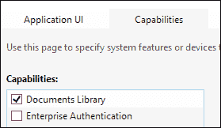

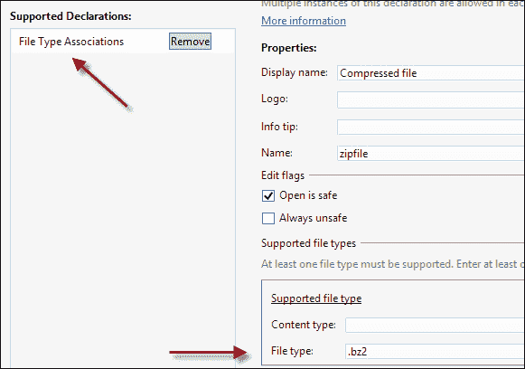

### 备注

对于`Video`、`Music`和`Pictures`库，不需要声明文件关联。

接下来，创建一个`BackgroundDownloader`实例，并调用其`CreateDownload`，将 URL 传递给下载和目标文件。 此调用返回`DownloadOperation`对象，而不实际启动下载。 要开始下载，需要调用`DownloadOperation::StartAsync`。

在下载过程中，了解它的进度是很有用的。 以下是设置进度报告的修订代码(与`StartAsync`调用不同)：

```cpp
auto async = operation->StartAsync();
async->Progress = 
  ref new AsyncOperationProgressHandler<DownloadOperation^, 
  DownloadOperation^>(this, &MainPage::OnDownloadProgress);
return async;
```

在本例中，我们实际上查看了`StartAsync`的结果，返回一个实现`IAsyncOperationWithProgress<DownloadOperation, DownloadOperation>`的对象，并使用适当的委托设置了`Progress`属性：

```cpp
void 
MainPage::OnDownloadProgress(IAsyncOperationWithProgress<DownloadOperation^, DownloadOperation^>^ operation, 
  DownloadOperation^ download) {
  auto progress = download->Progress;
  Dispatcher->RunAsync(CoreDispatcherPriority::Normal, 
    ref new DispatchedHandler([progress, this]() {
    _progress->Maximum = 
  double(progress.TotalBytesToReceive >> 10);
    _progress->Value = double(progress.BytesReceived >> 10);
    _status->Text = progress.Status.ToString();
  }));
}
```

`DownloadOperation::Progress`属性返回一个简单结构(`BackgroundDownloadProgress`)，其中包含字段`TotalBytesToReceive`、`BytesReceived`和`Status`(`Running`、`Completed`、`Cancelled`等)。 前面的代码将这些值用于`ProgressBar`控件(`_progress`)和`TextBlock`(`_status`)。

请注意，通知不会到达 UI 线程，因此必须使用`Page::Dispatcher`属性(类型为`Windows::UI::Core::CoreDispatcher`)通过调用`RunAsync`接受保证在 UI 线程上执行的委托，将对 UI 线程的任何更新封送到 UI 线程。

如果应用终止，传输也会停止，但到目前为止下载的数据不会丢失。 当应用再次启动时，它的工作是查找所有未完成的转账并恢复它们。 这可以通过调用静态`BackgroundDownloader::GetCurrentDownloadsAsync`，获取未完成下载的列表，然后附加到每个下载(例如，进度报告)，当然，恢复下载来实现。

### 备注

您可以在[http://code.msdn.microsoft.com/windowsapps/Background-Transfer-Sample-d7833f61](http://code.msdn.microsoft.com/windowsapps/Background-Transfer-Sample-d7833f61)上提供的后台传输示例中找到完整的示例。

# 摘要

Windows 应用商店应用在许多方面与桌面应用不同。 本章讲述的是应用的生命周期--应用可能会暂停甚至终止，所有这些都由操作系统控制。

动态磁贴、徽章更新和吐司通知是 Windows 应用商店应用的一些比较独特的功能-桌面应用没有这些功能(尽管桌面应用可以创建自己的吐司类弹出窗口)。 如果使用得当，这些功能可以为 Store 应用增加很大的吸引力，吸引用户频繁地使用该应用。

后台任务提供了一种绕过非自愿挂起/终止场景的方法，因此即使应用不在前台，也能保持一定程度的控制。 尽管如此，为了保持主应用的响应能力并保持良好的电池续航时间，这一点还是受到了相当大的限制。 任务是非常重要的应用的重要组成部分，因此应该明智地使用。

在下一章中，我们将了解 Windows 应用商店应用如何更好地与 Windows 集成，并通过实现契约和扩展间接与其他应用通信。