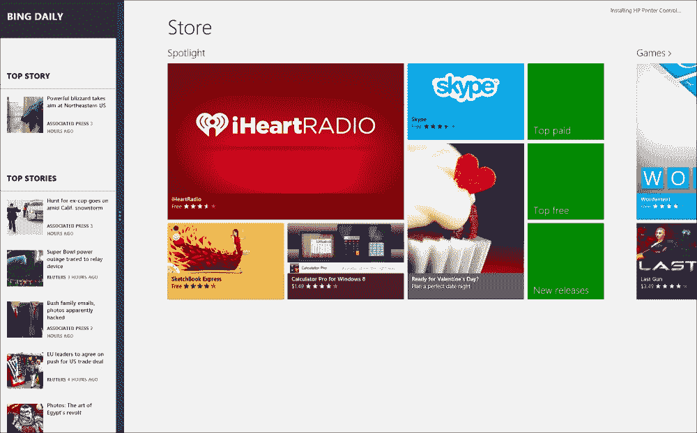
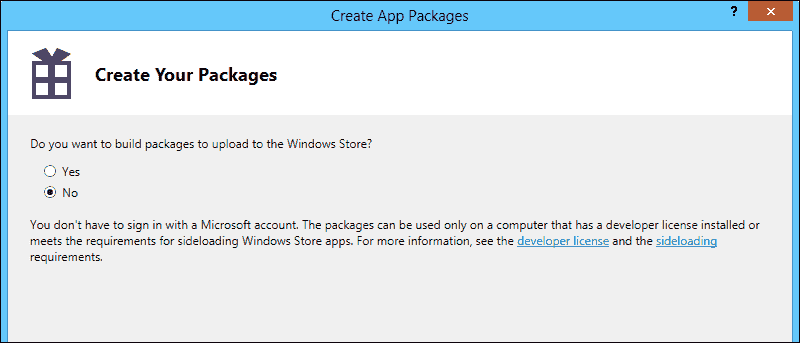
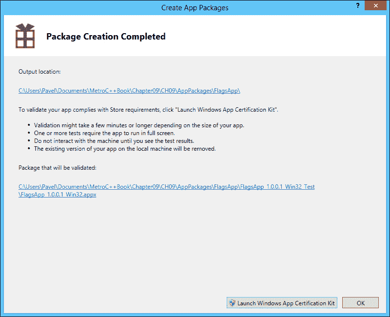
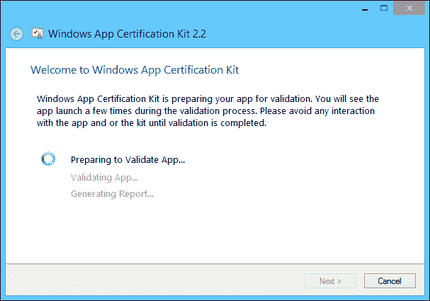

# 第 9 章：包装和 Windows 应用商店

前几章讨论了构建 Windows 应用商店应用的各种细节：从基本的 Windows 运行时概念，到构建用户界面，再到使用独特的 Windows 8 功能(例如动态磁贴、合同)。 剩下的就是构建你的应用，最后提交到应用商店，这样每个人都可以享受它。

然而，这家商店有自己的规则和指导方针。 应用经过认证过程，以确保它们的高质量，并将使用户受益。 这里的“高质量”包含了许多细节，有些与质量体验(性能、触摸体验、流动性等)直接相关，有些则更为微妙(例如适当地响应网络波动和遵守现代 UI 设计指南)。

Windows 应用商店应用为开发人员提供了许多机会。 商店还没有饱和(就像 iOS 和 Android 商店那样)，所以应用更有可能被注意到。 货币化是可能的-应用可能需要花钱，但也存在其他模式：Store 模式支持试用应用(具有各种到期机制)，可以提供应用内购买，因此可以免费下载应用，但可以在应用内出售项目或服务；应用可以显示广告-只因为用户运行应用就可以获得报酬-尽管应用本身是免费的。

在本章中，我们将介绍 Windows 应用商店的应用打包，并讨论应用成功通过认证需要考虑的一些问题。

# 应用清单

在前面的章节中，我们已经见过应用清单好几次了。 这是应用在执行之前所做的基本声明。 需要考虑的一些重要事项：

*   必须提供默认图像徽标以外的其他图像徽标-默认图像将自动导致认证失败；必须提供所有图像徽标，并且图像大小必须根据需要进行调整(无缩放)。
*   在 Capability 选项卡中，只应选中所需的功能。 检查几乎所有东西都很容易，但这会降低应用的安全性，甚至可能无法通过认证--用户将不得不授权可能不会实际使用的功能。
*   可能会提供支持的方向，省略了一些可能对特定应用没有意义的方向。 作为一个极端的例子，游戏通常只能以特定的方向(横向或纵向)运行。
*   对于某些功能，隐私政策声明必须作为应用的一部分或通过网络链接提供。 这应该说明应用正在用这些功能做什么。 需要隐私声明的示例包括 Internet(客户端、服务器)和位置(GPS)。

定位的问题提出了一个更一般的问题-应用视图。 除了明显的横向和纵向外，该应用(在横向模式下)还可以与另一个应用以对齐或填充模式共享屏幕。

# 应用视图状态

可以通过四种不同的方式查看应用：

*   **横向**-屏幕宽度大于其高度。
*   **纵向**-屏幕高度大于宽度。
*   **抓拍**-该应用占用 320 像素的宽度，而另一个应用占用剩余的屏幕宽度。 这仅在水平显示分辨率至少为 1366 像素时才有可能。
*   **填充了**-Snap 的“镜像”。 这款应用占据了大部分的水平空间，剩下 320 像素留给另一款应用。

以下是两款应用处于抓取/填充状态的屏幕截图：



用户期望应用在处于捕捉模式时相应地更改其视图。 在前面的屏幕截图中，新闻应用被截图，因此新闻文章显示为小项目，而不是其他模式下的全文。

让我们以上一章中的 Flags 应用为例，根据其当前的视图状态对其进行调整，以使其显示得更好。

## 实现视图状态更改

有几种方法可以处理视图状态更改。 我们将采取简单、务实的方法。 目前，我们的 Flags 应用呈现相同的视图，而不考虑方向或“快感”。 要测试方向和视图，我们可以使用 SDK 提供的模拟器(除非我们碰巧有基于平板电脑的设备来进行实际测试)。 下面是应用在模拟器内的捕捉模式下的外观：


显然，这不是最佳的用户体验。 每个标志旁边的文本太长，因此没有多少标志同时可见，文本可能会被截断。 一种更好的方法是只显示国旗图像，而不显示国家名称。

系统在活动页面上引发`SizeChanged`事件-这是我们可以处理并进行必要的视图更改的事情。 首先，我们将通过将`GridView`的`ItemTemplate`绑定到一个附加属性来使其更加灵活，当视图更改时，我们将根据需要更改该属性。 以下是完整的模板：

```cpp
<DataTemplate>
    <Grid Width="{Binding ColumnWidth, ElementName=_page}">
        <Grid.ColumnDefinitions>
            <ColumnDefinition Width="Auto"/>
            <ColumnDefinition />
        </Grid.ColumnDefinitions>
        <Image Margin="10,0" HorizontalAlignment="Left" 
  Height="{Binding ImageHeight, ElementName=_page}" 
  Width="{Binding ImageWidth, ElementName=_page}">
            <Image.Source>
                <BitmapImage UriSource="{Binding FlagUri}" />
            </Image.Source>
        </Image>
        <TextBlock Text="{Binding CountryName}" FontSize="25" 
            Grid.Column="1" Margin="2" />
    </Grid>
</DataTemplate>
```

更改是最上面的`Grid`中的-其`Width`被绑定到`MainPage`对象上的依赖属性(`ColumnWidth`)。

### 备注

如[第 5 章](05.html "Chapter 5. Data Binding")、*数据绑定*中所讨论的那样，在实现`INotifyPropertyChanged`的单独`ViewModel`中实现这一点会更好。 此处显示的方法速度更快，足以用于演示目的。

此`ColumnWidth`属性将根据当前视图状态而更改。

### 备注

该页面的标记可以很好地支持横向和纵向。 有时，需要更剧烈的变化才能获得良好的定向支持。 有些布局面板更适合这两个方向，例如`StackPanel`。 `Grid`不适用于此，除非它是非常简单的。 当切换方向时，复杂的`Grid`可能必须经历重大改变。

在`MainPage`构造函数中注册`SizeChanged`事件，如下所示：

```cpp
SizeChanged += ref new SizeChangedEventHandler(
   this, &MainPage::OnSizeChanged);
```

处理程序只调用帮助器方法`HandleSizeChanges`：

```cpp
void MainPage::OnSizeChanged(Object^ sender, 
   SizeChangedEventArgs^ e) {
  HandleSizeChanges();
}
```

从`OnNavigatedTo`覆盖调用相同的帮助器，以确保在第一次加载页面时调整视图。 基本思想是检查`Windows::UI::ViewManagement::ApplicationView::Value`静态属性，并根据可能的值采取适当的操作：

```cpp
void MainPage::HandleSizeChanges() {
  switch(ApplicationView::Value) {
  case ApplicationViewState::Filled:
  case ApplicationViewState::FullScreenLandscape:
    ColumnWidth = 300 + ImageWidth;
    break;

  case ApplicationViewState::FullScreenPortrait:
    ColumnWidth = 200 + ImageWidth;
    break;

  case ApplicationViewState::Snapped:
    ColumnWidth = ImageWidth;
    break;
  }
  // Force the GridView to re-evaluate its items
  auto ctx = DataContext;
  DataContext = nullptr;
  DataContext = ctx;
}
```

代码根据视图状态适当地更改`ColumnWidth`绑定属性。 填充视图和横向视图的处理方式相同，但它们可能会略有不同。 在纵向模式下，列宽较窄，因此可以在单个屏幕上显示更多标志。 在捕捉视图中，文本部分被完全删除，只留下图像。 这是捕捉视图中的结果：


处理视图状态更改的另一种常见方法是使用`ViewStateManager`类。 这允许在 XAML 中进行更改，并且不需要代码，除非使用`VisualStateManager::GoToState`静态方法更改正确的视图状态。 这种方法超出了本书的范围，但在网络上可以找到许多这样的例子。

### 备注

如果没有其他意义，应用至少应该在快照视图中显示一些徽标图像或文本。 否则，如果视图没有为捕捉视图做好准备，应用可能无法通过认证。

# 打包和验证

一旦应用完成(或者至少被认为是由开发人员完成)，就到了打包并上传到商店的时候了。 第一步应该是测试应用是否存在某些类型的错误，这些错误会导致认证失败，因此可以立即修复这些错误。

要开始，我们可以使用 Visual Studio 的**项目**|**Store**子菜单：


该菜单允许打开开发人员帐户、保留应用名称(必须是唯一的，并且将保留一年)以及执行一些其他操作(例如捕获屏幕截图-至少需要一个屏幕截图)；您可以在 Windows 应用商店应用的开发人员门户中找到有关这些选项的信息。 现在我们来看一下**创建应用包**选项。

该对话框询问的第一个问题是，我们是否要创建要上载到应用商店的包。 如果选择**是**，开发人员必须使用他/她的 Microsoft ID 签名，然后将构建包并在稍后上载。 我们现在采用**否**回答路线：



单击**下一步**会显示一个对话框，允许选择要构建(和测试)的配置：


我们必须选择版本配置来创建和测试包。 测试 Debug 配置无论如何都会失败。 上传到应用商店的内容必须仅为发布版本，否则应用将无法通过认证。 我们可以选择要为其创建包的所需体系结构。 建议使用 x86和 ARM-ARM是 Windows RT 计算机上唯一可用的体系结构，因此应受支持。 X86 是基于英特尔/AMD 架构的不错选择。

单击**创建**在所选配置中构建项目，并显示以下对话框：



这显示了创建的包的位置，所有需要上传的文件都位于该位置。 该对话框进一步建议启动**Windows 应用认证工具包**(**WACK**)对应用进行一些自动验证测试。

## 使用 Windows 应用认证工具包

运行WACK 是在商店中完成的第一步；这意味着如果应用没有通过本地 WACK 测试，它肯定也不会通过商店的认证。 选择后，将出现以下对话框：



验证过程需要几分钟，在此期间应用将自动启动和终止。 最后，结果将通过“通过”或“未通过”通知以及指向为测试创建的报告的链接显示(也可能出现警告，但它们不被视为失败)。

### 备注

Flags 应用没有通过 WACK 测试，因为它没有替换默认的图像徽标。

如果应用通过了 WACK 测试，我们就可以继续将应用上传到应用商店。 通过 WACK 并不意味着应用一定会通过商店认证。 商店进行的测试比 WACK 多得多，包括与真人进行手动测试；但通过 WACK 测试是很好的第一步。 在没有通过本地 WACK 测试的情况下，切勿上传软件包。

### 备注

应用商店应用的完整要求列表可在[http://msdn.microsoft.com/en-us/library/windows/apps/hh694083.aspx](http://msdn.microsoft.com/en-us/library/windows/apps/hh694083.aspx)找到。

# 摘要

在本章中，我们了解了打包应用并将其上载到应用商店的基本流程，并讨论了应用要成功通过认证必须解决的一些问题。 我们鼓励读者参考微软官方认证指南以获取完整的详细信息。

由于认证过程可能需要几天时间，最好在实际提交之前对应用进行尽可能多的测试。 必须使用 Windows App Certification Kit 才能提高成功认证的几率。

微软希望应用商店中的应用质量高，并为用户提供真正的价值。 当然，这意味着这款应用必须“表现良好”，但这远远不够；内容必须引人入胜和有趣，所以用户一次又一次地回到这款应用--这对一本不同的书来说是一个挑战。