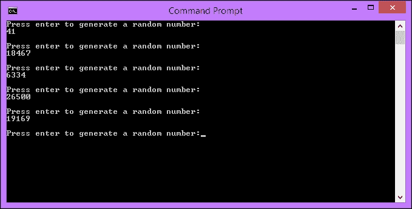

# 第一章。程序生成导论

当您在 PC 上加载图像，在 iPod 上加载歌曲或在 Kindle 上加载书籍时，就会从存储中加载它。该图像，歌曲和书籍已经作为一个整体存在，每当您想要访问它时，您就会抓住以前创建的全部内容。对于音乐或视频，您可以将其分块流式传输，但它仍然作为一个整体存在于存储中。让我们将其与从家具店购买现成的办公桌进行比较。你把整个桌子当成一件事，就是这样; 你有一张桌子。

现在，让我们想象一下，你买一张完整的桌子，而不是买一张完整的桌子。您无需获得预先构建的办公桌，而是可以获得构建办公桌所需的所有部件以及如何进行操作的说明。当你到家时，你可以按照这些指示去做，你会有一张桌子。如果您有这种倾向，甚至可以偏离说明，并创建一个与其他所有人都不同的独特办公桌。

让我们在游戏开发的背景下使用这种类比，方法是将购买办公桌替换为关卡。在第一种情况下，我们加载作为一个整体的水平，因为它是预先构建的。然而，在第二个例子中，我们得到了建立一个层次所需的所有部分，并以我们选择的任何顺序将它们自己组合在一起。

通过算法或过程创建事物的这个过程，而不是已经存在的，称为**过程生成。**当你按照一种算法把它的碎片拼凑在一起时，桌子是按程序创建的。游戏级别也是如此。这几乎可以扩展到任何东西。例如，音乐、图像、游戏和文本都可以通过程序生成。

在本章中，我们将介绍以下主题:

*   程序生成与随机生成
*   在 C 中生成伪随机数
*   种子
*   程序生成的利弊
*   类似流氓游戏的简史
*   如何实现程序化生成

# 程序生成与随机生成

我想在之前做一个区分。在这本书中，我们将讨论很多关于程序生成和随机生成的问题。这些术语经常互换使用，但它们不是一回事。因此，让我们花一点时间来定义它们。

## 程序生成

过程生成是使用算法创建内容的过程。这本身没有随机性。如果用于生成内容的函数，表达式，算法和输入保持不变，那么您将始终获得相同的结果。这是由于计算机是确定性的，我们将很快介绍这一事实。程序生成并非本质上是随机的。

## 随机生成

当我们给这些算法不同的输入或改变它们的表达式时，会产生随机性。这种差异是产生输出变化的原因。当有人说某件事是程序生成的，通常是指利用随机性进行程序生成。

# 引入随机性

计算机是**确定性**机器。这意味着，如果你给他们相同的输入，并执行相同的操作，你会得到每次相同的输出。关于办公桌示例，每个人都得到相同的作品，遵循相同的说明，因此构建了相同的办公桌。

同样，使用游戏的上下文，如果每个人都获得相同的资产和算法来将它们组合在一起，我们都会获得相同的游戏和体验。有时候，这就是目标。但是，在我们的案例中，我们希望创建不可预测且动态的游戏系统。因此，我们需要在程序生成中引入随机性元素。

## 伪随机数生成

随机数字生成只是随机挑选一个数字的过程。这对我们来说很简单，但对计算机来说却是一项艰巨的任务。实际上，如果没有特殊的硬件，计算机就不可能生成真正的随机数。你一会儿就会明白为什么会这样。

下一个最好的事情是伪随机数生成。*伪*字字面意思是*不是正版*。因此，伪随机数生成可以被认为是假随机数生成。这些数字看起来是随机的，但实际上是复杂的方程式和算法的结果，实际上可以预先计算出来。

请记住，并非所有伪随机数生成器都是平等构建的。对于诸如琐碎的模拟和游戏之类的应用，可以使用相当线性的算法，并且非常适合。但是，伪随机数生成也用于应用，例如**密码学**，并且将使用更复杂的算法，因此无法通过从早期输出创建的模式来确定结果。

我们作为开发人员使用的伪随机数生成器完全属于第一类，非常适合。对我们来说幸运的是，C 提供了许多方法来生成琐碎的伪随机数。在本书的整个过程中，我们将使用`std::rand()`和`std::srand()`，这两个标准的 C 函数都包含在`<cstdlib>`库中。

### 提示

学习如何从文档中读取和提取信息是我经常被忽视的一项技能。手头有很多很棒的论坛，很容易直接去谷歌找到你的问题的解决方案，但是首先，请务必阅读文档。[http://www.cplusplus.com](http://www.cplusplus.com)是一个很好的 C 参考，SFML 在[http:// www.sfml-dev.org/documentation/](http://www.sfml-dev.org/documentation/) 上有完整的记录。

## 为什么计算机不能生成真正的随机数

我们现在知道计算机不能生成随机数，而我们生成伪随机数。让我们看看为什么会这样。

这背后的原因与给定相同的输入和操作，两台计算机将达到相同的输出的原因相同; 计算机是确定性的。计算机产生的一切都是算法或方程式的结果。它们只不过是高度复杂的计算器。因此，你不能要求他们采取不可预测的行动。

可以生成真正的随机数，但是您需要利用机器外部的系统。对于示例，在[https://www.random.org/](https://www.random.org/) **您可以**使用大气噪声生成真正的随机数。还有其他类似的系统，但是除非您为安全目的等重要的事情生成随机数，否则琐碎的伪随机数生成就足够了。

## 在 C 中生成随机数

让我们通过编写一个小程序来生成一些伪随机数来开始编码。为此，我们将使用`std::rand()`函数。它生成一个范围在`0`到`RAND_MAX`之间的伪随机整数。`RAND_MAX`变量是在`<cstdlib>`中定义的常量。它的值将根据您正在使用的库而有所不同。在标准库实现上，它保证至少是 32767 的。

### 提示

如果您已经熟悉此主题，请随时跳到名为 Seeds 的子章节。

您可以从 Packt 网站[http://www.packtpub.com/support](http://www.packtpub.com/support)下载该程序的代码。它将出现在`Examples`文件夹中，项目名称为`random_numbers`:

```cpp
// Random number generation
// This program will generate a random number each time we press enter.

#include <iostream>

using namespace std;

int main()
{
  while (true)
  {
    cout << "Press enter to generate a random number:";
    cin.get();

    // Generate a random integer.
    int randomInteger = rand();

    cout << randomInteger << endl << endl;
  }

  return 0;
}
```

### 提示

下载示例代码

您可以从您购买的所有 Packt 出版书籍的[http://www.packtpub.com](http://www.packtpub.com)帐户下载示例代码文件。如果您在其他地方购买了这本书，则可以访问[http://www.packtpub.com/support](http://www.packtpub.com/support)并注册以将文件直接通过电子邮件发送给您。

这是一个非常简单的控制台应用，每次我们按回车键时都会调用`std::rand()`。这将返回伪随机数，我们将其传递给`std::cout`以显示它。这就是多么容易!



## 生成范围内的随机数

之前的代码生成了`0`和`RAND_MAX`之间的数字。这很好，但是我们通常希望在中对此进行更多控制，以便在一定范围内生成数字。为此，我们将使用**模****运算符**。

### 提示

在 C++ 中，模运算符是 % 符号。这在不同语言之间有所不同，但通常是 *%* 或*Mod*。

模运算符返回两个数字之间的除法的余数。所以，9 mod 2 是 1，因为 2 进入 9 四次，剩下 1。我们可以用它来创建伪随机数生成的范围。让我们生成一个介于 0 和 249 之间的数字。

为此，我们需要进行以下更改:

```cpp
// Generate a random integer.
//int randomInteger = rand();
int randomInteger = rand() % 250;

```

现在运行该程序几次，您将看到所有结果都仅限于我们刚刚定义的范围。所以现在我们可以生成一个 0 到 n 之间的数字，但是如果我们不希望我们的范围从 0 开始呢？要做到这一点，我们需要对生成数字的行进行更多更改:

```cpp
// Generate a random integer.
//int randomInteger = rand() % 250;
int randomInteger = rand() % 201 + 50;

```

请记住，我们在 mod 计算中使用的数字将生成一个 0 到 n-1 之间的数字，之后我们添加的数字将使范围增加该数量。因此，在这里，我们生成一个介于 0 和 200 之间的数字，然后将范围增加 50 以获得介于 50 和 250 之间的数字。

### 提示

如果你对我们在这里做的事情背后的数学不完全满意，那就去可汗学院吧。这是一个很棒的学习资源，有很多很棒的数学相关材料。

运行程序并记下生成的前五个数字。就我而言，它们是 91、226、153、219 和 124。现在，再运行一次。您会注意到发生了一些奇怪的事情; 我们收到了完全相同的数字。

它们是以伪随机的方式产生的，对吗？也许这只是侥幸。让我们再次运行它，看看我们得到了什么。你会再次得到同样的结果。要了解这里发生了什么，我们需要看一下种子。

# 种子

我们刚刚创建了一个程序来生成伪随机数，但是每次运行它时，我们都会得到相同的结果。我们知道这些数字是复杂方程和算法的结果，那么为什么它们是相同的呢？这是因为每次我们运行程序时，我们都从相同的种子开始。

## 定义种子

种子提供了算法的起点。所以，在前面的例子中，是的，我们使用复杂的算法来生成数字，但是我们每次都在同一点上启动算法。不管算法有多复杂，如果你从同一点开始，并执行相同的操作，你将得到相同的结果。

想象一下，我们有三个人，每个人都要走 5 步走同一条路。如果它们都从同一个正方形开始，它们将在同一个正方形结束:


现在，在下一幅图中，我们给这三个人提供了独特的起始位置。即使他们正在执行与以前相同的操作，并且在相同的路径上，它们的结果也有所不同，因为它们是从不同的位置开始的:


在这个类比中，路径是算法，起始平方是种子。通过改变种子，我们可以从相同的动作中获得不同的结果。

你会以前最有可能使用过种子，甚至不知道它。程序生成世界的游戏，如《我的世界》和《乐高世界》，让你可以选择在生成世界之前手动设置种子。如果你的朋友产生了一个看起来很棒的世界，他们可以抓住他们的种子，把它给你。当你自己输入种子时，你会在你朋友做的同一个地方启动算法，你最终会得到同样的世界。

## 使用种子

现在，我们知道什么是种子，让我们修复前面的例子，这样我们就不会继续生成相同的数字。为此，我们将使用`std::srand()`函数。它类似于`std::rand()`，但它需要一个论点。此参数用于设置算法的种子。在进入 while 循环之前，我们将调用添加到`std::srand()`。

### 提示

您只需要每次运行应用设置一次种子。一旦调用了`std::srand()`，对`std::rand()`的所有后续调用将基于更新后的初始种子。

更新的代码应该是这样的:

```cpp
// Random number generation
// This program will generate a random number each time we press enter.

#include <iostream>

using namespace std;

int main()
{
  // Here we will call srand() to set the seed for future rand() calls.
  srand(100);

  while (true)
  {
    cout << "Press enter to generate a random number:";
    cin.get();

    // Generate a random integer.
    int randomInteger = rand() % 201 + 50;

    cout << randomInteger << endl << endl;
  }

  return 0;
}
```

现在，当我们运行此代码时，我们会得到不同的结果!我有 214、60、239、71 和 233。如果您的数字与我的数字不完全匹配，请不要担心; 它们都是特定于 CPU 和供应商的。那么，如果我们再次运行程序会发生什么？我们改变了种子。所以我们应该再得到不同的数字，对吗？

不完全是。我们调用了`std::srand()`并设置了一个新的种子，但是每次运行该程序时，我们都会再次设置相同的种子。我们每次都在相同的位置启动算法，所以我们看到了相同的结果。我们真正想做的是在运行时随机生成一个种子，这样算法总是在一个新的位置开始。

## 在运行时生成随机种子

有很多方法可以实现这一点，你的用例将决定哪种方法是合适的。对于我们来说，作为游戏开发人员，相对琐碎的事情 (例如当前的系统时间) 通常就足够了。

这确实意味着，如果你在完全相同的时间运行程序，你会得到相同的结果，但这几乎永远不会成为我们使用的问题。C 为我们提供了一个很好的函数来获取当前时间，`time()`，它位于`<ctime>`。

让我们最后一次更新程序，并在`std::srand()`中传递`time()`作为参数，以便每次运行时生成唯一的数字:

```cpp
// Here we will call srand() to set the seed for future rand() calls.
//srand(100);
srand(time(nullptr));

```

现在，每次我们运行该程序时，我们都会获得唯一的数字!您可能已经注意到，如果您连续多次运行该程序，则第一个数字始终与上次运行非常相似。这是因为运行之间的时间变化不大。这意味着起点彼此接近，结果反映了这一点。

## 控制随机性是产生随机数的关键

生成随机数的过程是创建程序生成游戏内容的系统的一个巨大组成部分。产生随机数据的方法有很多，比如噪声图和其他外部系统，但在本书中，我们将坚持使用这些简单的 C 函数。

我们希望系统具有足够的可预测性，可以让我们以开发人员的身份控制它们，但是它们应该具有足够的动态功能，可以为播放器创建变化。这种平衡可能很难实现，有时游戏会出错。在本章的后面，我们将研究在将过程生成合并到游戏项目中以避免这种情况时必须注意的一些事情。

# 程序生成在游戏中的运用

现在我们知道什么是过程生成，我们添加的随机性元素让我们创建动态系统，让我们看看它是如何在游戏中使用的一些例子。有无数的方式可以利用它; 以下只是几个主要的实现。

## 节省空间

俗话说，必要性是发明之母。作为今天的开发人员，我们被我们可以使用的硬件宠坏了。即使是您今天将获得的最基准的计算机，其硬盘容量也将达到 500 GB，并且是标准配置。考虑到几十年前的 MB 而不是 GB，这是相当奢侈的。

当时的游戏发行也是非常不同的游戏。今天，我们要么在物理磁盘上购买游戏，蓝光磁盘每层提供高达 25 GB 的容量，要么从互联网上下载，那里完全没有大小限制。记住这一点，现在考虑事实上，大多数**任天堂娱乐系统** (**NES**) 游戏的大小仅 128 到 384 KB!这些存储限制意味着游戏开发人员必须将大量内容放入一个很小的空间中，而过程生成是一种很好的方法。

由于过去无法构建大型关卡并存储它们，因此游戏旨在通过算法构建其关卡和资源。您将所有需要的资源放在存储介质上，并让软件在播放器端组装关卡。

希望现在，早期的桌面类比更有意义。就像扁平包装的家具更容易运输一样，然后就可以在家中建造。随着硬件的发展，这已经不再是一个问题，但对于有存储问题的早期开发人员来说，这是一个很好的解决方案。

## 地图生成

现代视频游戏中程序生成的一个最突出的用途是游戏地图和地形的生成。可以使用的范围很大，范围从生成简单的 2D 地图到完整的 3D 世界和地形。

在程序上生成 3D 地形时，噪声图 (例如由**Perlin 噪声**生成的噪声图) 用于通过产生具有高浓度和低浓度区域的图像来表示随机分布。然后，可以以多种方式使用此数据 (浓度和强度的方差)。生成地形时，通常用于确定任何给定位置的高度。


复杂 3D 地形的程序生成超出了本书的范围。但是，我们将在本书后面生成 2D 地牢。

### 提示

如果您确实想探索 3D 地形生成，请阅读 “分形地形生成”，“高度图” 和 “噪声生成” 等术语。这些会让你走上正确的道路。

# 纹理创建

程序生成的另一个突出例子是纹理的创建。与地形生成类似，纹理的过程生成使用噪声来创建方差。然后可以用来创建不同的纹理。还使用不同的模式和方程式来创建更受控的噪声，从而形成可识别的模式。

像这样在程序上生成纹理意味着您可以潜在地拥有无限数量的可能纹理，而不会在存储上产生任何开销。从初始资源的有限池中，可以生成无尽的组合，如下图所示:


Perlin 噪声只是程序生成中常用的许多算法中的一个示例。对这些算法的研究超出了本书的范围，但是如果您想进一步探索程序生成的使用，那将是一个很好的起点。

## 动画

传统上，游戏动画由动画师创建，然后导出为动画文件，准备在游戏中使用。该文件将存储模型的每个部分在动画期间将经历的各种运动。然后在运行时将其应用于游戏角色。玩家的当前状态将决定应该播放哪个动画。例如，当您按下*A*进行跳跃时，玩家将变为跳跃状态，并且跳跃动画将被触发。这个系统工作得很好，但是非常僵化。每个步骤，跳跃和滚动都是相同的。

但是，过程生成可用于创建实时动态动画。通过获取角色骨骼的当前位置并计算施加在其上的多重力，可以计算出新的位置。程序动画最突出的例子是布娃娃物理学。

## 声音

虽然比前面的例子不常见，但程序生成也被用来创造游戏声音。这通常是操纵现有声音的形式。例如，声音可以被空间化，这意味着当用户听到声音时，声音似乎来自特定位置。

在一段时间内，可以合成短的一次性声音效果，但是由于与实现它所需的工作量相比，它带来的好处很小，因此很少使用它。加载预制声音要容易得多。

### 注意

Sfxr 是一个从零开始产生随机音效的小程序。它的来源是可用的。因此，如果声音合成对您感兴趣，它将成为一个很好的起点。您可以在[https://github.com/grimfang4/sfxr](https://github.com/grimfang4/sfxr)找到该项目。

# 程序生成的好处

我们已经研究了一些在游戏中使用程序生成的关键方式。现在让我们来看看它的一些最重要的好处。

## 可以创建更大的游戏

如果您的游戏世界是手工制作的，则由于多种原因，它将受到大小限制。每个对象都需要手动放置，每个纹理/模型都需要手工制作，并且依此类推。所有这些都需要时间和金钱。即使是最大的手工制作游戏的世界大小，例如在*《巫师 3: 荒野猎人*和*侠盗猎车手 V*中看到的那些，与程序生成的世界可以实现的相比也显得苍白。

如果游戏正确地利用了过程生成，那么从理论上讲，世界大小没有限制。例如，*无人的天空*是一个科幻游戏，设置在一个无限的，程序生成的星系中。然而，当你开始获得真正的大地图时，硬件就成了一个限制因素。已经生成的区域需要保存到磁盘上，以便重新访问它们，这很快就累加了。例如，要在 Minecraft 中生成最大的世界，您将需要大约 409 pb 的存储级别数据!

## 程序生成可用于降低预算

制作游戏很昂贵。真的很贵。实际上，大多数 AAA 游戏的制作成本甚至数百万美元。预算如此之高，任何省钱的选择都是受欢迎的。程序生成可以做到这一点。

让我们说，我们正在研究一个需要 100 砖纹理的标题。传统上，你会让你的一位艺术家创作每块砖。虽然它们将具有最高的质量，但这将花费时间和金钱。或者，通过利用程序生成技术，您可以让艺术家创建少量资源，并使用它们来生成您需要使用的资源。

这只是一个例子，建模、设计等等也是如此。以这种方式使用程序生成有利弊，但这是一个有效的选择。

## 游戏种类增加

如果您的游戏世界是手工制作的，那么玩家的体验将得到解决。每个人都将收集相同的物品，地形将相同，结果，整体体验将相同。程序生成游戏的定义特征是体验不同。游戏有一种未知的感觉，每次你玩的时候，都会有一些你还没有遇到的新的等待。

## 可重播性的提高

让我们从最后一点继续。如果一个游戏是线性的，没有任何程序生成，那么在你玩了一次游戏之后，挑战就消失了。你知道情节，你知道敌人会在哪里，除非它有一个惊人的故事或机制，否则你没有太多理由想再次玩这个游戏。

但是，如果您的游戏利用程序生成，那么每次运行游戏时，挑战都是新鲜的。游戏总是在发展; 环境总是新的。如果您查看具有最大可重玩性的游戏，它们往往是赋予玩家最大控制权的游戏。这些游戏中的大多数将利用某种形式的程序生成来做到这一点。

# 程序生成的弊端

与一样，故事也有两个方面。程序生成为游戏带来了无数的可能性和增强，但是在实现它时需要考虑一些因素。

## 更多的硬件负担

正如我们现在所知道的，过程生成是通过运行算法创建内容。这些算法可能非常激烈，需要大量的计算能力。如果您开发的游戏大量使用程序生成，则需要确保常规的消费类 PC 或控制台能够满足其需求。

对于示例，如果您选择在开放世界游戏中以程序方式生成树，则每当需要生成该区域时，CPU 和 GPU 都会承受很大的负载。较小的 pc 可能没有能力这样做，因此，它们可能会结巴。

## 世界可以感觉到重复

另一个潜在的缺点是世界可能会感到重复。如果你允许你的游戏系统产生令人难以置信的大世界，但使用很少和基本的算法来做到这一点，你将不可避免地产生很多重复的区域。模式和重复区域将非常容易发现，这将大大减少你的游戏。

## 你牺牲了质量控制

计算机在处理数字方面可能比我们人类更快，但是有一件事我们非常优越，那就是创造力。无论程序算法多么惊人，您都会失去人情味。牺牲了经验丰富的设计师可以为项目带来的小变化和微妙之处。

这也意味着您不能保证所有玩家都具有相同的游戏质量。有些玩家可能会生成一个非常出色的地图，以促进游戏玩法，而另一些玩家可能会生成一个主动禁止它的地图。

## 你可能会产生一个不可玩的世界

在上一点的极端情况下，可能会生成完全不可玩的关卡。发生这种情况的风险取决于您的程序内容的生成程度，但应始终予以考虑。

生成 3D 地形图时，您可能会意外生成对于玩家而言过高的地形，或者遮挡需要访问的区域。2D 地图也是如此。在本书的后面，我们将随机生成地牢房间。因此，例如，我们需要确保每个房间都有一个有效的入口和出口。

## 很难脚本设置游戏事件

继续前面的观点，程序生成是不确定的。如果您周围的整个世界都是程序和随机生成的，那么几乎不可能编写固定的游戏事件脚本。

游戏事件是预先编写脚本的事件，程序生成的本质是创建无脚本的世界。让两者一起工作是一项艰巨的挑战。因此，游戏倾向于使用程序生成和预制游戏开发的混合。有了这个，你得到了驱动叙事所需的固定游戏事件和时刻，在这一切之间，你创造了一个独特而开放的世界，让玩家在自己的心血来潮中探索和互动。

# 类流氓游戏简史

既然我们要以流氓的方式实现我们正在学习的东西，让我们花一点时间看看他们的历史。了解您正在做的事情的起源总是很棒的!

Rogue 是一款由*Michael Toy*和*Glenn Wichman*首先开发，最初发行 1980 年的地下城爬行游戏。地牢的每个级别都是随机生成的，以及其中对象的位置。Rogue 定义了地牢爬行类型，并且是随后许多标题的灵感来源。这就是为什么我们称这种游戏为类型**roguelikes**，因为它们实际上就像流氓!

自从 roguelikes 受孕以来，程序生成一直是其关键要素。这就是为什么我选择体裁来介绍这个话题。我们将一起重新创建定义流派的标志性特征，并以非常实用和动手的方法来处理程序生成。

# 我们将如何实现程序生成

在本书的开头，我简要概述了每一章以及我们将在其中涵盖的内容。现在我们已经介绍了程序生成是什么，让我们来具体看看在我们致力于创建自己的 roguelike 游戏时将如何实现它。这份清单并不详尽。

## 填充环境

当我们第一次加载游戏时，我们的对象将在固定的位置。我们将通过修复这个开始我们的努力，实现我们在本章学到的关于随机数生成的知识，在随机位置生成我们的对象。

在本章的最后，有一些可选的练习，包括在不同范围的集合内生成数字。如果您对它还不满意，我建议您完成它们，因为我们将依靠它来实现这一目标。

## 创建独特的游戏对象

程序生成中我个人最喜欢的一个方面是创建独特的对象和项目。知道游戏中有各种各样的物品真是太棒了。知道这些物品甚至还不存在，而且可能性是无限的，那就更好了!

我们将简单地从随机初始化对象的成员变量开始，然后向上为对象提供唯一的精灵和属性。我们还将研究创建动态类，这些类可以从单个基类创建高度唯一的对象。

# Unique art

使用过程生成从头开始生成纹理和材料是一个非常大的主题。有很多方法可以实现这一目标。传统上，我们使用诸如 Perlin 噪声之类的东西作为其基础函数，然后在其上构建图案和颜色。我们不会在这种程度上讨论这个话题。相反，我们将使用**简单快速的多媒体库** (**SFML**) 的内置图像处理功能在运行时创建独特的纹理。

从开始，通过简单的方法，我们将更改图像属性 (例如大小，颜色和比例)，以在现有资产中创建变化。然后，我们将使用渲染纹理在飞行中组合多个精灵组件，为我们的敌人创建独特的资产。

# 音频操作

与图形一样，SFML 提供了许多功能，使我们可以修改声音。因此，我们将使用这些来改变音效的音高和音量，以产生差异。然后，我们将使用高级功能来创建 3D 空间化声音，通过音频为场景带来深度。

## 行为与力学

不仅仅是可以程序化生成的静态项目和资源。为了给我们的游戏增加更多的差异，我们将使用一些程序技术来创建动态的游戏机制。具体来说，我们将创建一个系统，该系统将为玩家生成一个随机目标，并在实现该目标时向他们提供随机奖励。

我们还将给我们的敌人一些基本的**人工智能** (**AI**) 在一星 (**A *** ) 寻路，允许他们在关卡中追逐玩家。

## 地牢生成

在书的结尾，一旦我们舒适地使用**随机数生成器** (**RNG**) 和程序系统，以及我们的游戏项目，我们将实现 roguelikes 的定义功能; 随机生成的地牢。

我已经提到过几次，程序生成可以用来创建理论上永无止境的游戏世界。所以，我们要这么做。我们将实现一个系统，我们访问的每个房间都是随机生成的，我们将使用我们将在后面章节中学习的图形操作技术给每个楼层一个独特的感觉。

# 基于组件的设计

过程生成就是创建动态系统、对象和数据。因此，我们想要我们可以拥有的最灵活的游戏框架，这样它就很好地融入了这一点，这是有道理的。实现这一目标的方法之一是通过基于组件的设计。因此，为了结束我们的工作，我们将快速浏览一下，将我们的项目分解为一种更基于组件的方法。

# 完整的游戏

这些是我们将实施的主要系统更改。中间会有很多，但是这些例子将涵盖我们将使用的主要机制和技能。当我们到达本书的结尾时，您将拥有一个完全正常工作的 roguelike，它是随机生成的无尽地牢，随机生成的项目在随机位置中生成，整个地牢级别的过程纹理以及随机的敌人，所有这些都通过灵活的基于组件的体系结构实现。

你不仅会学习在你自己的游戏中实现程序生成所需的技能，还会看到它们是如何在一个-另一个的背景下工作的。孤立的练习很棒，但没有什么比在现实世界中工作更好的了。

# 练习

为了使您能够测试您对本章内容的了解，以下是一些您应该进行的练习。对于本书的其余部分来说，它们不是必不可少的，但是对它们进行研究将帮助您了解所涵盖材料中的优势和劣势。

1.  使用具有模运算符 (%) 的`std::rand()`函数，用于更新`random_numbers.cpp`生成以下范围内的数字:
    *   0 到 1000
    *   150 到 600
    *   198 到 246
2.  想出一种在运行时生成随机种子的新方法。有很多方法可以做到这一点。所以要有创造力!在我的解决方案中，第一个数字总是相似的。找出你是否可以生成一个随机的种子来缓解这种情况。
3.  看看你的游戏收藏，看看你是否能确定在哪里使用了程序生成。
4.  以下哪些是程序生成的示例？
    *   加载歌曲
    *   布娃娃物理
    *   在运行时创建唯一对象

# 总结

在本章中，我们了解到过程生成是通过使用算法来创建内容。这个概念可以应用于所有数字媒体，并在游戏中用于创建动态系统和环境。程序生成带来了更大的游戏、多样性和活力; 所有这些都是以较少的控制为代价的，并且可能会降低性能，因为它对硬件造成了负担。现代游戏中最流行的过程生成用法的一些示例包括地形生成，纹理创建和过程动画。

在下一章中，我们将看一下本书提供的项目。当我们学习创建程序系统时，我们将在一个真实的游戏项目中实施它们，最终目标是创建一个 roguelike 游戏，这是一种大量利用程序生成的类型。我们将审查游戏模板，我们将使用的 SFML 模块，并获得项目设置。然后，我们将在您的系统上编译它。

如果您熟悉 C 游戏开发，并且以前使用过 SFML，那么您可能已经熟悉下一章介绍的概念。如果是这种情况，请随意浏览本章，以直接进入[第 3 章](03.html "Chapter 3. Using RNG with C++ Data Types")，*使用 RNG 和 C 数据类型*中的编程。