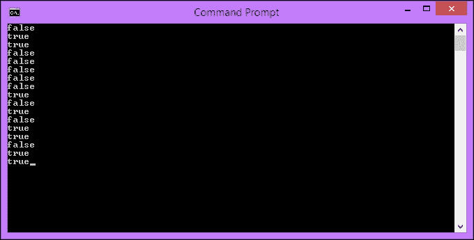

# 三、使用 RNG 与 C++ 数据类型

在[第一章](01.html "Chapter 1. An Introduction to Procedural Generation")，*对程序生成的介绍*中，我们了解到伪随机数生成是随机程序生成的核心。请记住，程序系统本质上不是随机的，我们需要诱导随机性。为了开始我们的旅程，我们将查看一系列不同的 C 数据类型，并使用随机数生成器 (RNG) 在运行时给它们随机值。这种以随机但仍可控制的方式使用核心 C 数据类型的能力将成为我们所有未来系统的基础。

在本章中，我们将介绍以下主题:

*   设置游戏种子
*   枚举器
*   随机设置布尔值
*   访问数组中的随机元素
*   生成随机字符串
*   随机数分布

# 设置游戏种子

在之前，我们会做任何我们需要设置的游戏种子。没有它，我们每次运行游戏都会得到相同的结果。如我们所知，这只需要我们调用`std::srand()`函数传递一个随机参数作为种子。我们将使用当前的系统时间作为我们的种子，它对于我们的目的来说足够随机。

我们对`std::srand()`函数的调用是任意的，只要它在对`std::rand()`函数的任何调用之前被调用。文件`main.cpp`包含函数`main()`，即应用的入口点。在这里创建了我们的游戏对象，并进入了主游戏循环，因此我们将在此处调用`std::srand()`函数。

我们更新的`main()`函数现在应该是这样的:

```cpp
// Entry point of the application.
int main()
{
    // Set a random seed.
    std:: srand(static_cast<unsigned int>(time(nullptr)));

    // Create the main game object.
    Game game;

    // Create a Boolean that we can store out result it.
    bool result;

    // Initialize and run the game object.
    result = game.Initialize();

    if (result)
    {
        game.Run();
    }

    // Shutdown and release the game object.
    game.Shutdown();

    // Exit the application.
    return 0;
}
```

每次运行游戏时，我们都会有一个随机的种子集，因此我们对`std::rand()`的调用会产生独特的结果。

### 提示

如果您希望游戏在运行之间保持一致，则可以使用硬编码值作为种子。只是不要忘记将其更改回去，否则您会想知道为什么以后事情不是随机的!

# 随机设置布尔值

也许所有数据类型中最简单的是不起眼的布尔。只有 true 和 false 两种状态，随机设置应该不会太难!当表示为整数时，两种状态具有以下性质:

*   False = 0 或更低
*   True = 1 或更高

鉴于此，要随机分配一个布尔值，我们只需要生成数字 0 或 1。

## 生成 0 到 1 之间的数字

在[第 1 章](01.html "Chapter 1. An Introduction to Procedural Generation")、*对过程生成*的介绍中，我们涵盖了在特定范围内随机数的生成。好吧，我们现在要使用它。使用`std::rand()`函数，我们将生成一个介于 0 和 1 之间的数字:

```cpp
std::rand() % 2;
```

### 提示

请记住，`std::rand()`在`0`和`RAND_MAX`之间生成一个数字函数。然后，我们计算该结果的余数除以 2。这只剩下 0 和 1 的范围。

不必使用`true`或`false`关键字设置`bool`。您可以将整数分配给`bool`，其状态将由整数的值使用前面所述的规则来确定。任何小于 1 的数字都是假的，任何高于 0 的数字都是真的。这意味着我们可以将结果直接投入到布尔中:

```cpp
bool myBool = std::rand() % 2;
```

综合起来，我们可以创建一个简单的控制台应用，每当用户按下*Enter*时，它就会随机输出 true 或 false。

您可以从 Packt 发布网站下载此程序的代码。它将在`Examples`文件夹中，项目名称为`random_boolean`:

```cpp
#include <iostream>

using namespace std;

int main()
{
  // Loop forever.
  while (true)
{
    // Generate a number between 0 and 1.
    bool myBool = rand() % 2;
    if (myBool)
    {
        cout << "true";
    }
    else
    {
        cout << "false";
    }
    return 0;
}
```

此代码产生以下输出:



每次我们点击*输入*时，我们都会得到一个随机的布尔值。即使是这种随机生成的简单情况，也可以使我们开始构建程序性流氓游戏。让我们在创建房间时立即将其应用于项目的创建。

### 提示

请记住，在这个小示例应用中，我们没有随机设置种子。结果，该程序每次运行时都会生成相同的值序列。

## 选择项目是否生成

目前，当我们开始游戏时，总是会产生宝石和黄金物品。让我们使用这个随机的 bool 分配来决定是否创建了两个对象。为此，我们将它们的生成代码封装在`if`语句中，参数将是我们随机布尔分配的结果。

`Game::PopulateLevel`方法是生成 out 项目的地方。我们将用以下内容替换当前代码:

```cpp
// Populate the level with items.
void Game::PopulateLevel()
{
    // A Boolean variable used to determine if an object should be spawned.bool canSpawn;

    // Spawn gold.
    canSpawn = std::rand() % 2;
    if (canSpawn)
    {
       std::unique_ptr<Gold> gold = std::make_unique<Gold>();
       gold->SetPosition(sf::Vector2f(m_screenCenter.x - 50.f, m_screenCenter.y));
       m_items.push_back(std::move(gold));
    }

    // Spawn a gem.
    canSpawn = std::rand() % 2;
    if (canSpawn)
    {
       std::unique_ptr<Gem> gem = std::make_unique<Gem>();
       gem->SetPosition(sf::Vector2f(m_screenCenter.x + 50.f, m_screenCenter.y));
       m_items.push_back(std::move(gem));
    }
}
```

现在，每次我们运行游戏时，是否产生宝石和黄金都是随机的。


一个简单的变化，但创建程序生成的游戏的第一步。没有单一的算法或函数可以使游戏程序化。它是诸如此类的小型技术的集合，这些技术使系统不可预测并在运行时确定。

# 随机数分布

让我们根据我们对随机数生成的了解来构建，以随机分配数字。我们将通过首先生成 0 到 100 之间的`n`数字来实现这一目标。如果我们将这些加在一起，我们会得到一个随机总数，其中每个单独的数字代表其中的百分比。然后，我们可以取目标数字的百分比来获得随机部分。下面的代码对此进行了演示，并将使其更加清晰。

您可以从 Packt 网站下载该程序的代码。它将在`Examples`文件夹中，项目名称为`random_distribution`:

```cpp
#include <iostream>

using namespace std;

// Entry method of the application.
int main()
{
  // Create and initialize our variables.
  int upperLimit = 0;

  // Output instructions.
  cout << "Enter a number, and we'll split it into three random smaller numbers:" << endl;
  cin >> upperLimit;
  cout << endl;

  float number1Bias = rand() % 101;
  float number2Bias = rand() % 101;
  float number3Bias = rand() % 101;

  float total = number1Bias + number2Bias + number3Bias;

  // Output the numbers.
  cout << upperLimit * (number1Bias / total) << endl;
  cout << upperLimit * (number2Bias / total) << endl;
  cout << upperLimit * (number3Bias / total) << endl;

  // Pause so we can see output.
  cin.get();
  cin.get();

  // Exit function.
  return 0;
}
```

这种方法保证了数字的每一段都是完全随机的。有一个轻微的舍入误差需要考虑，但这对我们的应用来说不是问题。


让我们不要浪费时间，将这项新技能应用到游戏中!

# 给玩家随机统计信息

一种经典的方式，可以使用这种数字的随机分布，是给玩家随机统计。传统上，游戏中的角色会被赋予`n`统计点，由玩家来分配它们。由于我们正在制作程序游戏，因此我们将随机分发它们以创建程序生成的角色统计信息。

为此，我们需要将先前的代码与玩家的 stat 变量的分配挂钩。我们的球员统计数据目前是固定的，并通过以下方式分配:

```cpp
m_attack = 10;
m_defense = 10;
m_strength = 10;
m_dexterity = 10;
m_stamina = 10;
```

让我们将其替换为以下内容，以随机分配统计信息。我们还将为播放器添加一个变量，以便我们可以更改播放器必须分配的点数。

首先，将以下变量添加到播放器中，不要忘记将其添加到我们的初始化列表中:

```cpp
int m_statPoints;
```

现在让我们用这个给我们的玩家随机统计:

```cpp
// Randomly distribute other stat.
m_statPoints = 50;

float attackBias = std::rand() % 101;
float defenseBias = std::rand() % 101;
float strengthBias = std::rand() % 101;
float dexterityBias = std::rand() % 101;
float staminaBias = std::rand() % 101;

float total = attackBias + defenseBias + strengthBias + dexterityBias + staminaBias;

m_attack += m_statPoints * (attackBias / total);
m_defense += m_statPoints * (defenseBias / total);
m_strength += m_statPoints * (strengthBias / total);
m_dexterity += m_statPoints * (dexterityBias / total);
m_stamina += m_statPoints * (staminaBias / total);
```

每次我们现在加载游戏时，我们的玩家都会随机分配其统计点。这种随机分配设定数量的方法可以以许多其他方式使用，例如在玩家之间共享战利品以及在多个实体之间分配损害。


# 访问集合的随机元素

当我们有相似对象的集合时，它们通常存储在数组和向量等结构中。通常，在使用这些结构时，我们会访问特定的元素，而它们的均匀性和顺序使它们有用。

要访问特定元素，我们只需在集合中提供其索引。因此，要访问数组的随机元素，我们只需提供一个随机索引，这是生成随机数的简单情况。

让我们看一个例子。在下面的示例中，我们创建了一个用动物名称填充的字符串向量。每次我们按 enter 键时，我们都会通过生成 0 和向量大小之间的数字来访问向量的随机元素。

您可以从 Packt 网站下载该程序的代码。它将在`Examples`文件夹中，项目名称为`random_element`:

```cpp
#include <iostream>
#include <vector>

using namespace std;

// Entry method of the application.
int main()
{
  // Create and populate an array of animals.
  vector<string> animals = { "Dog", "Cat", "Bird", "Fox", "Lizard" };

  // Output the instructions.
  cout << "Press enter for the name of a random animal!" << endl;

  // Loop forever.
  while (true)
  {
    // Wait for user input.
    cin.get();

    // Generate a random index.
    int randomIndex;
    randomIndex = rand() % animals.size();

    // Output the name of the randomly selected animal.
    cout << animals[randomIndex].c_str();
  }

  // Exit function.
  return 0;
}
```

的输出如下:


访问集合的随机元素是创建过程系统的一个很好的工具。在游戏中有单个对象的任何地方，您都可以创建一个交替的数组或矢量，并在运行时随机选择一个。仅此一项，您就可以创建一个高度随机的游戏，每次运行都是独一无二的。

# 生成随机项目

目前，当我们加载我们的游戏，设置的项目产生。我们需要添加一个随机性元素来做到这一点，像`switch`语句这样简单的东西就是所需要的。在我们可以的地方，我们总是希望添加选项来创建随机和程序生成的内容。

为了随机生成我们的项目，我们需要在`0`和我们拥有的项目数量之间生成一个随机数，然后在`switch`语句中使用它。如前所述，没有一种方法可以生成程序，因此还有其他方法可以做到这一点。

让我们添加数字生成和`switch`语句来选择要生成的项目。更新后的`Game::PopulateLevel`函数应该如下所示:

```cpp
// Populate the level with items.
void Game::PopulateLevel()
{
    // A Boolean variable used to determine if an object should be spawned.
    bool canSpawn;

    // Spawn an item.
    canSpawn = std::rand() % 2;
    if (canSpawn)
    {
        int itemIndex = std::rand() % 2;
        std::unique_ptr<Item> item;
        switch (itemIndex)
        {
            case 0:
                item = std::make_unique<Gold>();
            break;

            case 1:
                item = std::make_unique<Gem>();
            break;
        }
        item->SetPosition(sf::Vector2f(m_screenCenter.x, m_screenCenter.y));
        m_items.push_back(std::move(item));
    }
}
```

现在我们可以看到，当我们运行游戏时，如果一个对象可以产生，它将是黄金物品或宝石。我们在游戏中有很多项目，在下一章中，我们将扩展这个系统以包括所有这些项目，从一个函数填充我们的整个级别:


# 生成随机字符

既然我们已经涵盖了从一个集合的单词列表中生成随机字符串，让我们来看看生成随机字符。`char`数据类型是单个一个字节字符。

`string`实际上只是一个以 null 结尾的字符序列，因此以下几行代码产生完全相同的结果:

```cpp
Stirng myStringLiteral = "hello";
string myString = { 'h', 'e', 'l', 'l', 'o', '\0' };
```

同样，以下代码在语义上是正确的:

```cpp
char myCharArray[6] = { 'h', 'e', 'l', 'l', 'o', '\0' };
string stringVersion = myCharArray;
```

由于`char`是一个字节，因此它可能具有 0 到 255 的整数表示。这些十进制值中的每一个都代表一个不同的字符。可以在 ASCII 表中找到查找表。对于示例，字符*a*具有十进制值`97`。我们可以在分配`char`时使用这些整数，如下所示:

```cpp
char myChar = 97;
```

### 提示

在 C 中，a`char`的最大十进制值为 255。如果你超过这个，它将溢出并循环通过表。例如，设置等于 353 的 char 值将导致字符*a*中的。ASCII 表可以在[http://www.asciitable.com/](http://www.asciitable.com/) 找到。

因此，为了生成一个随机字符，我们需要生成一个 0 到 255 之间的数字，这是我们现在非常熟悉的。

您可以从 Packt 网站下载该程序的代码。它将在`Examples`文件夹中，项目名称为`random_character`:

```cpp
#include <iostream>

using namespace std;

// Entry method of the application.
int main()
{
  // Loop forever.
  while (true)
  {
    // Output instructions.
    cout << "Press enter to generate a random character from the ASCII standard:" << endl;

    // Pause for user input.
    cin.get();

    // The ASCII characters range from 0 - 127 in decimal.
    int randInt = rand() % 128;

    // To turn that into a char, we can just assign the int.
    char randChar = randInt;

    // Output the random char.
    cout << "Random Char: " << randChar << "\n" << endl;
  }

  // Exit function.
  return 0;
}
```

使用此代码，我们将从整个 ASCII 表中生成一个随机字符。要在更特定的范围内生成字符，我们只需要限制生成的数字范围。

对于示例，查看 ASCII 表显示，小写字母从 97 开始，一直运行到 122。让我们调整随机数生成器，仅在此范围内生成值:

```cpp
// The ASCII characters range from 0 - 127 in decimal.
//int randInt = rand() % 128;
int randInt = std::rand() % 128;
int randInt = std::rand() % 26 + 97;

```

现在我们可以看到输出是来自小写字母的字母，如下面的屏幕截图所示:


# 重复循环

生成随机数的另一种使用是在某些代码上循环不确定的次数。例如，当我们生成项目时，我们会对生成代码进行单独调用。如果我们每次只想生成一个项目，这很好，但是当我们想生成一个随机数量的项目时呢？

我们需要对我们的代码进行随机的调用，我们稍后将其包装在自己的函数中，这可以使用`for`循环来实现。在`for`循环中，我们指定要循环迭代的次数，因此，我们可以生成一个随机数，而不是像通常那样使用固定值。每次运行代码时，都会生成一个新的随机数，并且每次循环的大小都不同。

您可以从[http://www.packtpub.com/support](http://www.packtpub.com/support)下载该程序的代码。它将在文件夹`Chapter 3`中，并且被称为`random_loops.cpp`:

```cpp
// Include our dependencies.
#include <iostream>
#include <ctime>

// We include std so we don't have to fully qualify everything.
using namespace std;

void HelloWorld();

// Entry method of the application.
int main()
{
  // First we give the application a random seed.
  srand(time(nullptr));

  // Loop forever.
  while (true)
  {
    // Output the welcome message.
    cout << "Press enter to iterate a random number of times:" << endl;

    // Pause for user input.
    cin.get();

    // Generate a random number between 1 and 10.
    int iterations = rand() % 10 + 1;

    // Now loop that number of times.
    for (int i = 0; i < iterations; i++)
    {
      cout << "Iteration " << i << ": ";
      HelloWorld();
    }

    // Output ending message.
    cout << endl << "We made " << iterations << " call(s) to HelloWorld() that time!" << endl << endl;
  }

  // Exit function.
  return 0;
}

// Outputs the text Hello World!.
void HelloWorld()
{
  cout << "Hello World!" << endl;
}
```

输出显示在以下屏幕截图中:


# 产生随机数的物品

随着我们的项目在我们的`Game::PopulateLevel`函数中产生，并且能够随机次数调用一个函数，让我们更新代码，这样我们就会在开始游戏时产生一个随机数量的项目。

为了实现这一点，我们需要做的就是创建与上一个练习相同的循环，并在其中封装我们的生成代码。让我们用以下内容更新`Game::PopulateLevel`:

```cpp
// Populate the level with items.
void Game::PopulateLevel()
{
  // A Boolean variable used to determine if an object should be spawned.
  bool canSpawn;

 // Generate a random number between 1 and 10.
 int iterations = std::rand() % 10 + 1;

 // Now loop that number of times.
 for (int i = 0; i < iterations; i++)
 {
 // Spawn an item.
 canSpawn = std::rand() % 2;

    if (canSpawn)
    {
      int itemIndex = std::rand() % 2;
      std::unique_ptr<Item> item;

      switch (itemIndex)
      {
      case 0:
        item = std::make_unique<Gold>();
        break;

      case 1:
        item = std::make_unique<Gem>();
        break;
      }

      item->SetPosition(sf::Vector2f(m_screenCenter.x, m_screenCenter.y));
      m_items.push_back(std::move(item));
    }
  }
}
```

现在当我们运行代码时，我们有一堆生成的项目。它们目前正在一个之上产卵，但是不用担心，我们将在下一章中修复它!


# 练习

为了使能够测试你对本章内容的了解，这里有一些你应该练习的练习。对于本书的其余部分来说，它们不是必不可少的，但是通过它们可以帮助您评估所涵盖材料的优势和劣势。

1.  向随机字符串生成器添加更多选项尝试创建一个使用两个随机单词的生成器。
2.  修改随机字符生成程序，以便我们生成字符 A-Z 大写和 a-z 小写。
3.  玩家目前在关卡中的固定位置产生。创建一组可能的生成坐标，并在运行时在它们之间随机选择，以便生成位置变化。

# 总结

在本章中，我们研究了一系列 C 数据类型，并将 RNG 与它们的使用结合在一起。以随机但受控的方式使用这些数据类型的能力是实现随机过程系统的关键。请记住，程序生成只是计算结果的内容创建。这本质上不是随机的，我们必须像本章一样诱导随机性。我们对游戏所做的添加很少，但这是创建程序生成游戏的第一步。当我们运行游戏时，每次都会有所不同。

在下一章中，我们将通过在地图周围的随机位置产生我们的物品和敌人来进一步发展我们的水平。程序生成的环境是程序生成游戏的主要内容，在随机位置生成我们的游戏对象是实现这一目标的一大步。