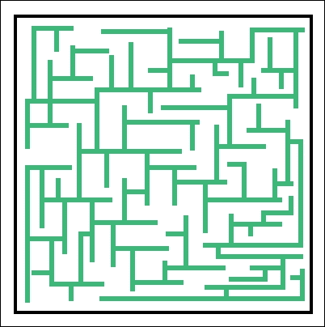
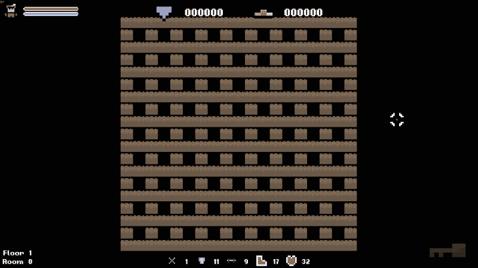
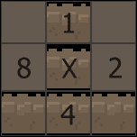
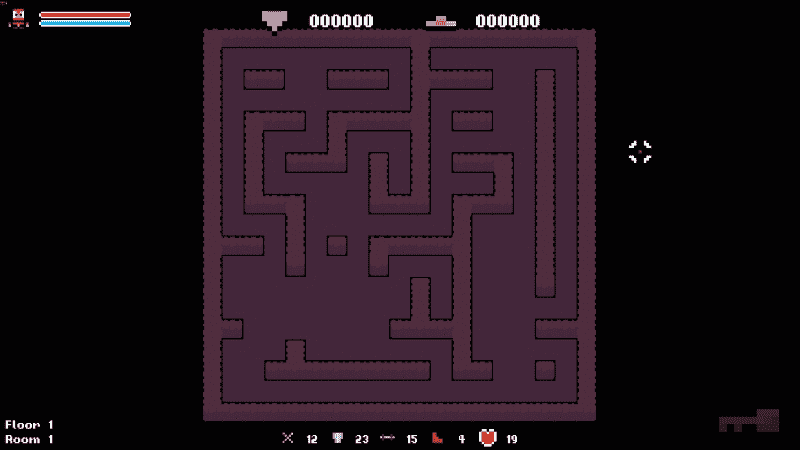
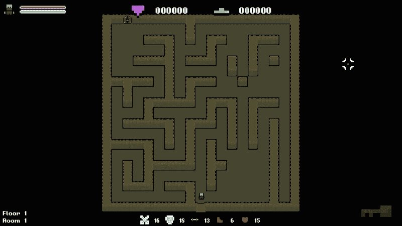

# 第九章。程序地牢生成

也许 roguelike 游戏最具标志性和决定性的功能是其程序生成的级别。这是该类型以具有的重放性而闻名的主要功能之一。它使游戏保持新鲜和挑战性，并使玩家保持警惕。

在本书的整个过程中，我们已经从单一数字的简单生成发展到复杂的程序行为的实现，例如路径寻找。现在是我们坚持的时候了: 从程序上产生我们的水平。除此之外，我们还将使用我们在第 6 章，*程序化生成 Art*中创建的函数来使级别更加独特。

在本章中，我们将介绍以下主题:

*   程序设计水平的好处
*   迷宫生成
*   房间生成
*   瓦片映射

# 程序层次设计的好处

游戏级别和环境的程序生成带来了无数的好处，不仅对玩家，而且对开发者。在我们使用一项技术之前，了解它的积极和消极总是很好的。所以，让我们来看看它给游戏带来的一些最大的好处，然后再实施它。

## 可重放性

程序生成的关卡最明显的好处是它们的多样性和它们给游戏带来的可重玩性。每次运行，环境都会发生变化。这意味着玩家无法学习物品，敌人的位置，这使挑战保持活力和新鲜感，使玩家有理由一次又一次地玩游戏。

## 开发时间的缩短

在程序生成的所有实现中常见的另一个好处是它在开发中节省了时间。在我们的 roguelike 游戏中，我们将拥有无数的独特关卡。如果我们手动创建我们的关卡，这将是不可能的。我们最多只能限制在一百个级别。

像这样利用过程生成可以减轻开发人员的工作量，节省时间和金钱，并增加了可能的范围。

## 更大的游戏世界

请记住，程序生成本身绝不是随机的。我们通过在算法和计算中使用随机值和项来诱导随机性。鉴于此，我们可以在级别设计中使用过程生成来共享级别，而无需实际存储它们。

许多随机生成世界的游戏将允许您输入世界种子。有了这个值，两个人在两台不同的机器上可以生成相同的级别。通过这种方法，您可以生成理论上永无止境的关卡，确保所有玩家都生成相同的关卡。此外，您只需要存储世界种子，而不是潜在的数百兆字节的世界数据。

# 注意事项

与一样，同一枚硬币有两面。因此，尽管程序级别的产生带来了好处，但仍需要做出一些考虑和妥协。

## 缺乏控制

总体而言，缺乏控制是程序生成的常见陷阱，但它可能从未比生成级别时更普遍。游戏关卡是讲述我们的故事并尝试我们的游戏机制的舞台。鉴于此，它们通常是由专门的关卡设计师手工制作的。将此工作留给算法会导致严重的失控。

简单的机制和故事的游戏通常会很好，但是如果你有复杂的机制或一个你想以特定方式讲述的故事，程序级生成可能需要你放弃更多的控制，你可以负担。算法永远无法复制经验丰富的专业人员带来的小触动。

## 所需计算能力

需要考虑的另一个因素是所需的计算能力。就我们而言，还不错。我们只有一个小尺寸的 2D 数组，需要生成。但是，如果您要大规模生成 3D 地形，则此成本将变得更加重要，需要考虑因素。

想象一下这样一种情况，我们需要使用 1000 1000 的水平网格。每次我们生成一个关卡时，都会需要执行大量的计算，并且我们需要确保所有玩家的硬件都能应付!随着计算能力的稳定增长，这不再是一个问题。实际上，这就是游戏变得非常复杂和动态的原因。我们拥有实现它所需的硬件，但是我们仍然需要意识到极限。

## 适宜性

最后的考虑只是你的游戏是否会从程序生成中受益。仅仅因为在技术上可以在标题中实现它，并不意味着它属于那里。如果您不需要很多级别，并且拥有复杂的机制和系统，那么可能不值得实施它。你最好把这段时间花在手工制作一些你知道会很好的关卡上。

总的来说，这是一个值得记住的好点。不要被游戏的技术细节以及代码的惊人之处所吸引。最重要的是，您的游戏需要有趣且引人入胜。总是优先考虑游戏。

# 地下城生成概述

Dungeon生成是一个广泛的主题，具有广泛的可能实现，每个实现都有自己的特点。但是，在不同算法的细微差别之下，地牢生成通常涉及房间和迷宫的生成以及两者的集成，如下图所示:


从程序上生成地牢与我们在路径查找方面所做的工作没有什么不同。这一切都是关于将一个级别视为节点并操纵它们。在实现它之前，我们将其分解为之前确定的三个主要阶段，即房间的生成，迷宫的生成以及所有房间的集成。

## Generating rooms

地牢是一系列相互连接的房间，它们的生成是许多系统中的第一步。这背后没有复杂的算法; 我们只需选择一个房间大小，并在关卡中放置一些。该级别的特征将由房间数量，大小以及放置方式等因素决定，如下图所示:


## 生成迷宫

地牢生成的另一个重要步骤是在整个可玩区域生成一个迷宫，将关卡变成一系列相连的走廊。然后，这些房间可以加入现有房间，也可以在其中雕刻房间以创建开放区域。有很多算法被用来像这样的生成的迷宫，我们将使用流行的**递归回溯跟踪**算法。别担心，我们很快就会详细看看这个算法!下面的屏幕截图显示了这样一个迷宫的例子:



## 连接房间和迷宫

如果您选择先生成房间，然后创建一个迷宫将它们连接起来，那么最后一步就是将它们集成在一起。目前，迷宫将穿过所有房间，但值得庆幸的是，加入它们很容易。我们只需要环顾每个房间，并在有效的相邻路径上添加一个连接块，如下图所示:


在我们的实现中，我们实际上会反过来做这件事。我们将生成一个迷宫，然后在其中雕刻开放区域。这种方法创建了更多的开放和迷宫般的区域，而第一种方法创建了相互连接的封闭房间。

# 递归反向跟踪器

递归反向跟踪器，顾名思义，涉及递归地调用一个函数，该函数在游戏网格中的两个图块之间雕刻通道。通过选择随机方向来雕刻此路径，该算法在解决其递归之前尽可能地通过关卡进行雕刻，并返回到开始节点。

以下是一种这样的算法的伪代码:

1.  选择随机方向，如果尚未访问相邻节点，则与该节点建立连接。此节点成为当前节点 (递归调用)。
2.  如果已经访问了每个方向上的所有相邻单元格，请返回最后一个单元格 (从上一个递归调用返回)。
3.  如果您回到开始节点，则算法完成。

正如我们所看到的，真的没有太多!唯一的陷阱是你需要在记忆中拥有整个迷宫。对于大型迷宫，此方法可能效率低下，或者根本不可能!但是，对于我们的实现，它将完美地工作。

# 程序生成地牢

现在是时候将这一理论付诸实践，并在我们的游戏中真正实现程序性地牢生成。我们将把`Level`类从加载它的数据从文本文件到在运行时生成它，我们还将在随机级别中介绍正确的精灵到图块的应用。

正如我们所确定的那样，解决此问题的一种方法是在整个游戏区域内生成一个迷宫，然后生成房间以雕刻出一些较大的开放区域。这种方法不仅生成更紧密，更交织的水平，而且还节省了我们必须将迷宫连接到房间的步骤，使我们仅需两个步骤即可生成出色的水平:


## 改变我们对迷宫的看法

在我们编写任何代码之前，我们将对项目进行更改，以便我们可以轻松地看到整个级别。目前，视图是缩放的，我们有光阻挡了水平。我们希望在研究算法时能够看到整个迷宫。所以让我们做些改变。

我们要做的第一件事是禁用主游戏视图，而是使用**UI**视图绘制所有内容。**游戏**视图绘制所有东西的尺寸是原始尺寸的两倍，而 UI 视图绘制的东西的比例为 1:1。通过禁用对**游戏**视图的更改，我们将看到更多的关卡。

更新以下代码:

```cpp
case GAME_STATE::PLAYING:
{
  // Set the main game view.
  //m_window.setView(m_views[static_cast<int>(VIEW::MAIN)]);
```

我们在这里所做的只是注释掉设置主游戏视图的行。现在让我们对负责在关卡中绘制光的代码做同样的事情:

```cpp
// Draw level light.
//for (const sf::Sprite& sprite : m_lightGrid)
//{
//  m_window.draw(sprite);
//}
```

这两个变化极大地改变了水平现在的出现方式，并将帮助我们在工作时看到迷宫:


## 更新游戏和关卡类

在我们开始实现迷宫生成器之前，我们需要定义一些我们将要使用的函数。对于初学者来说，我们的关卡目前是从`Level::LoadLevelFromFile`函数加载的。我们需要为新代码创建一个适当的函数。让我们删除`Level::LoadLevelFromFile`函数，并在`Level.h`中的位置添加以下代码:

```cpp
public:
/**
 * Generates a random level.
 */
void GenerateLevel();
```

我们将需要在`Game`类中使用一个类似的函数，它将封装所有代码以生成一个随机级别，因此请确保您也将相同的函数声明添加到`Game.h`中。我们有几个与生成一个级别相关的函数，所有这些都可以封装在这个函数中。我们需要添加以下内容:

*   对`Level::GenerateLevel`的调用: 这可以在级别中放置键
*   调用`Game::PopulateLevel`: 这有助于生成随机水平目标

请注意，其中一项是在级别上添加一个键。该项目已经存在于我们的解决方案中，就像所有支持代码一样，并且由于我们很快就能够随机生成级别，因此我们现在可以在级别中生成一个。

让我们将此函数添加到`Game.cpp`:

```cpp
// Generates a new level.
void Game::GenerateLevel()
{
  // Generate a new level.
  m_level.GenerateLevel();

  // Add a key to the level.
  SpawnItem(ITEM::KEY);

  // Populate the level with items.
  PopulateLevel();

  // 1 in 3 change of creating a level goal.
  if (((std::rand() % 3) == 0) && (!m_activeGoal))
  {
    GenerateLevelGoal();
  }
}
```

我们在[第 8 章](08.html "Chapter 8. Procedural Behavior and Mechanics")，*程序行为和力学*中创建了`Goal::GenerateLevelGoal`函数。所以，这就是我们实际实现它的地方。每次生成新级别时，如果当前没有一个处于活动状态，我们将创建一个目标的三分之一的机会。

因为我们现在有了随机生成我们的关卡的功能，并且已经添加了密钥，所以让我们快速添加代码，以便在玩家到达门时生成新的关卡。我们已经准备好 if 语句，我们只需要添加行为:

```cpp
. . .

if (playerTile.type == TILE::WALL_DOOR_UNLOCKED)
{
	// Clear all current items.
	m_items.clear();

	// Clear all current enemies.
	m_enemies.clear();

	// Generate a new room.
	GenerateLevel();

	// Set the key as not collected.
	m_keyUiSprite->setColor(sf::Color(255, 255, 255, 60));
}

. . .
```

现在完成了，我们剩下要做的就是调用我们的`Game::GenerateLevel`函数，而不是我们折旧的`Level::LoadLevelFromFile`，并删除设置玩家位置的代码和对`Game::PopulateLevel`的调用。我们新的`Game::GenerateLevel`功能将解决所有这些问题。让我们在`Game::Initialize`中更新以下代码:

```cpp
// Load the level.
//m_level.LoadLevelFromFile("../resources/data/level_data.txt");

// Set the position of the player.
//m_player.SetPosition(sf::Vector2f(1155.f, 940.f));

// Populate level.
//PopulateLevel();

// Generate a level.
GenerateLevel();
```

现在代码已经更新，我们现在可以将注意力转向地牢生成算法。

## 生成迷宫

创建随机地牢的第一个阶段是在整个游戏区生成一个迷宫。我们已经介绍了我们将要使用的递归 backtracker 方法。但是，我们需要事先做一些准备。

### 迷宫生成前的准备

递归回溯算法通过锻造两个节点之间的通道来工作。鉴于此，我们需要迷宫处于网格中所有节点都被墙壁包围的位置，也就是说，看起来像这样的东西:


阴影正方形代表墙砖，空白正方形代表地板空间。您将在左侧网格中看到每个地砖都被墙壁包围。正确的图块显示了算法运行后网格的外观，突破这些墙以创建路径。我们的任务是使网格看起来像左边的那个!

当您查看左侧的网格时，您会看到所有阴影图块都有奇数索引; 只有具有偶数列和行索引的图块是空白的。这使得创建此网格变得容易。我们需要遍历所有图块，如果两个索引都是偶数，我们将其留空。否则，我们将其转换为墙砖。

让我们通过实现这个开始定义`Level::GenerateLevel`函数:

```cpp
// Generates a random level.
void Level::GenerateLevel()
{
    // Create the initial grid pattern.
    for (int i = 0; i < GRID_WIDTH; ++ i)
    {
        for (int j = 0; j < GRID_HEIGHT; ++ j)
        {
            if ((i % 2 != 0) && (j % 2 != 0))
            {
                // Odd tiles, nothing.
                m_grid[i][j].type = TILE::EMPTY;
            }
            else
            {
                m_grid[i][j].type = TILE::WALL_TOP;
                m_grid[i][j].sprite.setTexture(TextureManager::GetTexture(m_textureIDs[static_cast<int>(TILE::WALL_TOP)]));
            }
            // Set the position.
            m_grid[i][j].sprite.setPosition(m_origin.x + (TILE_SIZE * i), m_origin.y + (TILE_SIZE * j));
        }
    }
}
```

在我们运行我们的游戏之前，我们需要快速禁用任何使用级别网格的代码。这包括我们对`Game::PopulateLevel`的调用以及密钥在`Game::GenerateLevel`中的放置。它还包括对`Game::Initialize`中的`Game::SpawnRandomTiles`的调用。这些功能依赖于已经设置的水平网格，现在还没有!如果不禁用这些，游戏将挂起，因为它正在寻找地砖!完成后，我们会重新打开它们。

如果你现在运行游戏，你会看到我们有一个网格，看起来像左边的图像。第一步完成了!

下面的屏幕截图显示了我们现在运行游戏时的结果:



### 雕刻通道

现在，棋盘格模式已经创建，是时候实现算法的主体了。以下是递归 backtracker 算法如何工作的提醒:

1.  选择一个随机方向，如果尚未访问相邻节点，则与该节点建立连接。此节点成为当前节点 (递归调用)。
2.  如果已经访问了每个方向上的所有相邻单元格，请返回最后一个单元格 (从上一个递归调用返回)。
3.  如果您回到开始节点，则算法完成。

我们知道这个算法是递归的，所以让我们从声明将包含算法的函数开始。由于此函数将在两个节点之间创建路径，因此我们将其称为`CreatePath`:

```cpp
private:
/**
 * Creates a path between two nodes in the recursive backtracker algorithm.
 */
void CreatePath(int columnIndex, int rowIndex);
```

从算法分解中的第一点开始，我们需要确定我们正在使用的节点，并选择一个随机方向。获取正确的节点很容易，并且要选择一个随机方向，我们将使用一个数组。我们可以定义一个数组`sf::vector2i`，它定义所有可能的方向。例如，`{-2, 0}`将指示向左移动图块，因为我们将列索引减 2。

请记住，由于棋盘图案，我们必须一次移动两个瓷砖。与我们直接相邻的瓷砖是一堵墙，因此我们需要进一步移动一步才能到达要处理的瓷砖。然后，我们需要重新调整方向数组，以使算法不会趋向于任何方向。例如，如果我们不这样做，它总是会先检查北，从而导致许多北行通道!

让我们开始定义`Level::CreatePath`函数，在`Level.cpp`中添加以下内容:

```cpp
// Create a path between two tiles in the level grid.
void Level::CreatePath(int columnIndex, int rowIndex)
{
  // Store the current tile.
  Tile* currentTile = &m_grid[columnIndex][rowIndex];

  // Create a list of possible directions and sort randomly.
  sf::Vector2i directions[] = { { 0, -2 }, { 2, 0 }, { 0, 2 }, { -2, 0 } };
  std::random_shuffle(std::begin(directions), std::end(directions));
```

接下来，我们遍历这些方向，并检查是否可以找到尚未访问的任何有效图块。如果一个图块存在于网格中，则该图块是有效的，并且您可以根据它是否为空来判断它是否已被访问。

让我们通过将以下代码附加到 open 函数的定义来添加此功能:

```cpp
// For each direction.
for (int i = 0; i < 4; ++ i)
{
  // Get the new tile position.
  int dx = currentTile->columnIndex + directions[i].x;
  int dy = currentTile->rowIndex + directions[i].y;

  // If the tile is valid.
  if (TileIsValid(dx, dy))
  {
    // Store the tile.
    Tile* tile = &m_grid[dx][dy];

    // If the tile has not yet been visited.
    if (tile->type == TILE::EMPTY)
    {
```

如果代码达到了这一点，我们知道我们正在寻找一个新的图块，因为它既有效又当前为空。为了创建一条通往它的道路，我们需要拆除我们之间的墙，并用地砖改变墙和新的瓷砖。现在，我们再次调用`Level::CreatPath`，将新图块的索引作为参数传递。在这里发生了递归，算法向前发展。

让我们用下面的代码来完成函数的定义，以实现这一点:

```cpp
  // Mark the tile as floor.
  tile->type = TILE::FLOOR;
  tile->sprite.setTexture(TextureManager::GetTexture(m_textureIDs[static_cast<int>(TILE::FLOOR)]));

  // Knock that wall down.
  int ddx = currentTile->columnIndex + (directions[i].x / 2);
  int ddy = currentTile->rowIndex + (directions[i].y / 2);

  Tile* wall = &m_grid[ddx][ddy];
  wall->type = TILE::FLOOR;
  wall->sprite.setTexture(TextureManager::GetTexture(m_textureIDs[static_cast<int>(TILE::FLOOR)]));

  // Recursively call the function with the new tile.
  CreatePath(dx, dy);
}}}}
```

让我们澄清一下这里到底发生了什么。每次识别空图块时，都会对`Level::CarvePath`进行递归调用，并传递该图块的索引。当它这样做时，它会通过层次工作，越来越深入地嵌套到递归中。

当所有方向都已检查并且没有有效的图块时，将返回来自`Level::CreatePath`的当前调用，从而允许上一个调用检查其剩余方向。随着此过程的继续，算法将通过路径返回，直到到达开始节点为止，在该节点上已访问了节点。

希望函数中的注释可以清楚地说明哪个部分在做什么。现在完成了，我们现在可以在设置网格后立即从`Level::GenerateLevel`函数调用它:

```cpp
// Generates a random level.
void Level::GenerateLevel()
{
  // Create the initial grid pattern.
  for (int i = 0; i < GRID_WIDTH; ++ i)
  {

 // Make the first call to CarvePassage, starting the recursive backtracker algorithm.
 CreatePath(1, 1);
}
```

让我们再次编译项目，看看我们有什么:


我们有迷宫!对于某些游戏，这就足够了，但是我们不希望所有的单个图块路径。我们想要更多的开放区域，以便我们可以与敌人作战!你还会看到瓷砖精灵看起来很奇怪。现在不用担心; 我们将在添加房间后立即修复它!

## 增加房间

以前，我们了解到增加房间是一项简单的任务。我们现在可以亲眼看到这一点。我们的目标是添加一些开放区域，最简单的方法是选择一些随机位置，并将周围的瓷砖转换为地砖。为了使`Level`类保持整洁，我们将此行为包含在它自己的函数中。在`Level.h`中添加以下函数声明:

`private`]:

```cpp
/**
 * Adds a given number of randomly sized rooms to the level to create some open space.
 */
void CreateRooms(int roomCount);
```

在我们不断努力编写通用和可扩展的代码时，我们添加了一个参数来表示我们要创建多少个房间，以便我们可以随意更改它。

让我们直接进入定义函数。首先，我们将需要一个循环来迭代我们希望添加的每个房间一次。在`Level.cpp`中添加以下方法定义:

```cpp
// Adds a given number of randomly sized rooms to the level to create some open space.
void Level::CreateRooms(int roomCount)
{
  for (int i = 0; i < roomCount; ++ i)
  {
```

现在我们可以创建我们的房间了。首要任务是决定我们希望他们有多大。在使用该算法之后，我发现拥有更多的较小房间效果很好。与往常一样，我们将通过使房间的大小在随机范围内来加入一些 RNG:

```cpp
// Generate a room size.
int roomWidth = std::rand() % 2 + 1;
int roomHeight = std::rand() % 2 + 1;
```

这将生成宽度和高度为 1 或 2 的房间。我知道这听起来很小，但是相信我。它真的很好用!

接下来，我们需要在这个房间的水平上选择一个位置。我们会随机挑选一个点，然后在它周围建造房间。为此，我们需要生成一个随机图块索引，然后创建嵌套`for`循环来迭代 2D 数组，从而描述房间:

```cpp
// Choose a random starting location.
int startI = std::rand() % (GRID_WIDTH - 2) + 1;
int startY = std::rand() % (GRID_HEIGHT - 2) + 1;

for (int j = -1; j < roomWidth; ++ j)
{
  for (int z = -1; z < roomHeight; ++ z)
  {
```

生成开始位置时，您可以看到我们一直在小心，不要在任何一个方向上包括外边缘。这些是该层的挡土墙，应单独放置。

该功能的最后一部分现在仅涉及将房间瓷砖变成地砖。首先，我们通过调用`Level::TileIsValid`来检查我们是否没有越界。然后，我们确保新标题不会位于网格的外边缘; 外部行/列都应该是包含水平的墙。如果同时满足这两个条件，我们可以通过使用以下代码将其设置为地板块:

```cpp
int newI = startI + j;
int newY = startY + z;

// Check if the tile is valid.
if (TileIsValid(newI, newY))
{
  // Check if the tile is not on an outer wall.
  if ((newI != 0) && (newI != (GRID_WIDTH - 1)) && (newY != 0) && (newY != (GRID_HEIGHT - 1)))
  {
    m_grid[newI][newY].type = TILE::FLOOR;
    m_grid[newI][newY].sprite.setTexture(TextureManager::GetTexture(m_textureIDs[static_cast<int>(TILE::FLOOR)]));
  }
}}}}}
```

是时候调用这个函数了。当前在`Level::GenerateLevel`中，我们设置了网格，然后对`Level::CreatePath`进行第一次调用以启动递归算法。当第一个初始调用返回时，我们知道迷宫已经完全生成。在这个阶段，我们将创建房间。

让我们在第一次调用`Level::CreatePath`之后立即追加对新的`Level::CreateRooms`函数的调用:

```cpp
. . .

// Make the first call to CarvePassage, starting the recursive backtracker algorithm.
CreatePath(1, 1);

// Add some rooms to the level to create some open space.
CreateRooms(10);

```

是时候进行另一次构建了，以便我们可以看到我们的工作。希望现在我们有一个随机的迷宫贯穿关卡以及许多较大的开放区域，我们可以让玩家更自由地战斗:


# 选择瓷砖纹理

直到现在，我们一直在从文本文件中加载预构建的级别。这个级别文件已经知道需要使用哪些纹理以及应该在哪里使用它们，但是由于我们现在正在程序上生成它们，所以情况并非如此。我们需要决定哪些瓷砖应该有哪些精灵。

## if/else 方法

一种常见的解决方法是简单地创建一个可怕的`if/else`语句。原则上，这是一个简单的任务; 通过一系列`if`语句定义每个图块，并设置正确的图块。但是，实际上，您最终会遇到一堆复杂的代码，很难阅读。

想象一下，您有一组五十种可能的变体的图块。选择哪个图块去哪里所需的代码量将是疯狂的。值得庆幸的是，有一个更简单的解决方案，它是我最喜欢的一个问题的优雅解决方案的例子之一。

## Bitwise tile maps

在我们的游戏中，我们关注四个方向，即上、下、左、右。鉴于此，当我们需要计算图块纹理时，我们只需要在以下四个方向上进行检查:


在上图中，您可以看到标有 0 的图块是用于确定赋予图块 X 的纹理的图块。这就是优雅解决方案发挥作用的地方。如果我们将图块读成二进制数，从顶部图块开始，从最低有效数字计数，我们得到 4 位二进制数，0000。如果瓷砖是墙，我们将相应的位设置为 1。如果瓷砖是地板，我们将其保留为 0。

如果我们将其应用于围绕图块 X 的四个可能的图块位置，则可以计算每个图块的值:


希望这张图能让事情变得更清楚。从顶部图块开始并顺时针读取，我们将图块的值输入为从最低有效数字到最高的整数。这为主图块周围的每个图块提供了一个不同的值，我们可以通过以下图像来可视化:


## 计算瓦片值

当确定我们需要的图块纹理时，我们评估目标图块周围的图块，以及在哪里我们有一个墙，我们存储它的值，我们在上一个图像中识别。一个真实的例子将帮助你可视化这个过程。假设我们需要为 tile X 找到正确的纹理:



在这种情况下，将通过以下方式计算图块值:

1 4 = 5

使用此方法，X 的每个可能的图块方向都通过从 0 到 15 的唯一值表示。它是如此优雅和简单!

## 将图块值映射到纹理

这个难题的最后块是将这些值映射到纹理。在`Util.h`中，您将看到以下枚举器定义了所有类型:

```cpp
// Tiles.
enum class TILE {
  WALL_SINGLE,
  WALL_TOP_END,
  WALL_SIDE_RIGHT_END,
  WALL_BOTTOM_LEFT,
  WALL_BOTTOM_END,
  WALL_SIDE,
  WALL_TOP_LEFT,
  WALL_SIDE_LEFT_T,
  WALL_SIDE_LEFT_END,
  WALL_BOTTOM_RIGHT,
  WALL_TOP,
  WALL_BOTTOM_T,
  WALL_TOP_RIGHT,
  WALL_SIDE_RIGHT_T,
  WALL_TOP_T,
  WALL_INTERSECTION,
  WALL_DOOR_LOCKED,
  WALL_DOOR_UNLOCKED,
  WALL_ENTRANCE,
  FLOOR,
  FLOOR_ALT,
  EMPTY,
  COUNT
};
```

虽然这些图块的顺序看起来有些随机，但实际上它们的顺序非常特定。枚举器从 0 开始计数。因此，我们可以看到第一个值`WALL_SINGLE`的值为 0。回到我们的图表，我们可以看到这是正确的，因为这是当瓷砖周围没有任何东西时我们需要的纹理。

以另一个随机示例为例，`WALL_TOP`值的值为 10。如果我们查看网格，这将意味着仅在目标图块的右侧和左侧的图块是墙。2 8 = 10。没错!对于所有可能的图块，我计算出它们的位掩码值，并确保它们的枚举器值匹配。

## 计算瓷砖纹理

让我们在项目中实现这个。首先，我们将声明一个函数，我们可以将此行为封装在我们的`Level`标头中:

```cpp
/**
 * Calculates the correct texture for each tile in the level.
 */
void CalculateTextures();
```

对于函数的主体，我们希望从遍历所有图块开始，确定其中哪些是墙。正是这些瓷砖需要他们的精灵计算正确的纹理:

```cpp
// Calculates the correct texture for each tile in the level.
void Level::CalculateTextures()
{
  // For each tile in the grid.
  for (int i = 0; i < GRID_WIDTH; ++ i)
  {
    for (int j = 0; j < GRID_HEIGHT; ++ j)
    {
      // Check that the tile is a wall block.
      if (IsWall(i, j))
      {
        // Calculate bit mask.
        int value = 0;

        // Store the current type as default.
        TILE type = m_grid[i][j].type;
```

现在，我们使用我们之前计算的值来查看我们周围的那些图块，以得出图块的最终值。我们在队伍中检查每个瓷砖，再次从顶部开始，顺时针方向，如果那里有一堵墙，则将值增加适当的数量:

```cpp
// Top.
if (IsWall(i, j - 1))
{
  value += 1;
}

// Right.
if (IsWall(i + 1, j))
{
  value += 2;
}

// Bottom.
if (IsWall(i, j + 1))
{
  value += 4;
}

// Left.
if (IsWall(i - 1, j))
{
  value += 8;
}
```

在此阶段剩下的就是为图块分配正确的纹理和 ID。我们之前介绍了我们如何设置枚举器，表示图块类型直接与此值排队，所以我们可以简单地使用纹理值作为图块类型和纹理的索引:

```cpp
// Set the new type.
m_grid[i][j].type = static_cast<TILE>(value);
m_grid[i][j].sprite.setTexture(TextureManager::GetTexture(m_textureIDs[value]));
}}}}
```

有了这个功能就完成了。最后一步是确保我们在生成房间后立即在`Level::GenerateLevel`函数中添加一个调用，如下所示:

```cpp
  . . .
  // Add some rooms to the level to create some open space.
  CreateRooms(10);

 // Finally, give each tile the correct texture.
 CalculateTextures();
}
```

让我们不要浪费任何时间，建立我们的游戏:


那看起来有多棒!运行几次，并查看生成的所有不同迷宫。我们生成一个迷宫，雕刻一些更大的区域，并解析纹理。程序生成的地牢。虽然这很棒，但我们可以做得更好。我们的迷宫缺乏个性和个性。因此，让我们向环境介绍一些美学差异。

## 创造独特的地板主题

在[第 6 章](06.html "Chapter 6. Procedurally Generating Art")，*程序化生成艺术*中，我们花了一些时间研究程序化生成精灵。我们还创建了一个名为`Level::SetColor`的函数，它允许我们为级别中的所有图块设置覆盖颜色。让我们使用它，并为地牢的每一层创造独特的感觉。

让我们创建不同的地板，每个地板都有独特的美感。每 5 个级别，我们可以生成一个新的随机颜色，并将其应用于我们的级别。我们的`Level`类已经有以下变量:

```cpp
/**
 * The floor number that the player is currently on.
 */
int m_floorNumber;

/**
 * The room number that the player is currently in.
 */
int m_roomNumber;
```

我们可以用这些来跟踪我们已经产生了多少房间，以及我们应该什么时候改变效果。首先，我们必须跟踪我们在哪个楼层和房间。在`Level::GenerateLevel`函数的末尾，我们将从递增`m_roomNumber`变量开始。当它是`5`时，我们可以增加`m_floorNumber`并生成新的颜色叠加; 不要忘记重置房间计数器:

```cpp
    . . .

    // Calculate the correct texture for each tile.
    CalculateTextures();

 // Increment our room/floor count and generate new effect if necessary.
 m_roomNumber++ ;

 // Move to next floor.
 if (m_roomNumber == 5)
 {
 m_roomNumber = 0;
 m_floorNumber++ ;
 }
}
```

正如我们在[第 6 章](06.html "Chapter 6. Procedurally Generating Art")，*程序生成 Art*中所了解到的那样，要生成新的颜色，我们需要生成介于 0 和 255 之间的三个随机值。这些值是组成颜色的红色，绿色和蓝色通道。第四个值是 alpha，表示精灵的透明度。

重要的是要记住，如果我们生成的颜色值接近 0，我们会得到白色，如果我们在另一端走得太远，颜色会太暗。由于这个原因，我们不会在 0 到 255 的范围内生成一个数字，但是稍微限制一下，以便我们总是得到一个可行的颜色。alpha 值将每次设置为 255，因为我们不希望任何图块都是透明的。

我们将生成一个随机颜色，然后调用`Level::SetColor`，将新生成的值传递给它。这将赋予水平独特的美学:

```cpp
// Increment our room/floor count and generate new effect if necessary.
m_roomNumber++ ;

if (m_roomNumber == 5)
{
  // Move to next floor.
  m_roomNumber = 0;
  m_floorNumber++ ;

 // Generate a random color and apply it to the level tiles.
 sf::Uint8 r = std::rand() % 101 + 100;
 sf::Uint8 g = std::rand() % 101 + 100;
 sf::Uint8 b = std::rand() % 101 + 100;

 SetColor(sf::Color(r, g, b, 255));
}
```

### 提示

这是我们第二次想要生成随机颜色。考虑到这一点，它可能是一个很好的候选人来接收它自己的功能。作为一个简短的练习，将这段代码抽象成自己的功能，并相应地更新游戏代码。

在之前，我们可以运行我们的游戏并查看结果，我们需要再进行一次更改。当前，仅当我们第一次移动地板时，才会设置随机级别颜色。我们需要在第一次生成我们的级别时执行相同的代码。我们可以在关卡的构造函数中做到这一点。让我们简单地将以下代码附加到`Level::Level`中，如下所示:

```cpp
. . .

// Store the column and row information for each node.
for (int i = 0; i < GRID_WIDTH; ++ i)
{
    for (int j = 0; j < GRID_HEIGHT; ++ j)
    {
        auto cell = &m_grid[i][j];
        cell->columnIndex = i;
        cell->rowIndex = j;
    }
}

// Generate a random color and apply it to the level tiles.
sf::Uint8 r = std::rand() % 101 + 100;
sf::Uint8 g = std::rand() % 101 + 100;
sf::Uint8 b = std::rand() % 101 + 100;

SetColor(sf::Color(r, g, b, 255));

```

现在我们已经准备好再次运行游戏了。我们可以看到，当我们的水平是一种随机的颜色，当我们通过 5 个水平，我们知道这种颜色会改变!

让我们运行游戏，看看这在行动:



## 增加入口和出口点

由于我们不再从预先定义的水平数据加载我们的水平，我们需要为每个房间计算一个有效的入口和出口点。由于整个关卡是一个迷宫，因此我们可以在迷宫的底部生成一个入口点，并将其作为玩家的目标，以找到关卡顶部的出口。多个通道和死角将使玩家继续搜索!

我们已经在墙枚举器中定义了这些图块，因此这是在关卡中查找位置的简单案例。与往常一样，我们将首先声明一个函数，该函数将存在此行为。在函数中封装执行单个任务的代码块总是一个好主意。这不仅使行为和责任变得清晰，而且使代码更加可重用。

让我们在`Level.h`中声明以下函数:

```cpp
private:
/**
 * Generates an entry and exit point for the given level.
 */
void GenerateEntryExit();
```

现在，对于方法主体，我们希望首先为开始和结束图块标识合适的索引。由于我们将瓷砖放置在顶部和底部行上，因此我们只需要生成单个索引，即列。这些行的指数将分别为 0 和`GRID_HEIGHT-1`。

要做到这一点，我们将随机选择一个列索引，并检查该位置是否适合入口节点。对于入口节点，我们需要确保上面没有图块。同样，对于退出节点，我们需要确保下面没有任何内容:

```cpp
// Generates an entry and exit point for the given level.
void Level::GenerateEntryExit()
{
  // Calculates new start and end locations within the level.
  int startI, endI;
  startI = endI = -1;

  while (startI == -1)
  {
    int index = std::rand() % GRID_WIDTH;

    if (m_grid[index][GRID_HEIGHT - 1].type == TILE::WALL_TOP)
    {
      startI = index;
    }
  }

  while (endI == -1)
  {
    int index = std::rand() % GRID_HEIGHT;

    if (m_grid[index][0].type == TILE::WALL_TOP)
    {
      endI = index;
    }
}
```

### 提示

像这样使用`while`循环需要非常小心。如果不存在有效的图块，则程序将挂起并崩溃。在这种情况下，由于算法的工作方式，我们可以确保始终存在有效的图块。

现在，我们已经确定了开始节点和结束节点，剩下的就是将节点设置为正确的图块类型。入口节点需要设置为`TILE::WALL_ENTRANCE`，出口节点必须设置为`TILE::WALL_DOOR_LOCKED`，如下所示:

```cpp
  // Set the tile textures for the entrance and exit tiles.
  SetTile(startI, GRID_HEIGHT - 1, TILE::WALL_ENTRANCE);
  SetTile(endI, 0, TILE::WALL_DOOR_LOCKED);
}
```

现在这个函数已经完成，我们只需要在生成一个级别后调用它。我们将在计算纹理后在`Level::GenreateLevel`函数的末尾执行此操作:

```cpp
    . . .

        // Generate a random color and apply it to the level tiles.
        sf::Uint8 r = std::rand() % 101 + 100;
        sf::Uint8 g = std::rand() % 101 + 100;
        sf::Uint8 b = std::rand() % 101 + 100;

        SetColor(sf::Color(r, g, b, 255));
    }

 // Add entrance and exit tiles to the level.
 GenerateEntryExit();
}
```

## 设置玩家的生成位置

现在我们已经确定了入口和出口节点，我们需要相应地移动我们的玩家。生成开始节点的代码位于级别类中，所以我们需要添加一个函数来返回这个开始位置。我们可以在游戏类中生成入口和出口节点，但这将是糟糕的设计。最好将代码放置在它所属的位置，并创建`getter`和`setter`方法来访问它。

但是，在返回生成位置之前，我们实际上必须对其进行计算!为此，我们需要知道入口节点在哪里。一旦`Level::GenerateEntryExit`函数返回该信息就会丢失。我们可以遍历图块的底部行来找到它，但这将是低效的。相反，我们将在`Level`类中创建一个变量来保存此信息并计算`Level::GenerateEntryExit`中的生成位置。

让我们通过在`Level.h`中声明这些变量开始，如下所示:

```cpp
/**
 * The spawn location for the current level.
 */
sf::Vector2f m_spawnLocation;
```

现在，我们知道每个级别的入口将在底部行的某个地方。这意味着要计算生成位置，我们只需要找到正上方的图块的绝对位置。`Level`类已经有一个函数来获取图块的绝对位置，所以它就像对该函数进行一次调用并传递正确的图块一样简单。

当我们在这里时，我们需要潜入一些类似的代码。我们需要存储新出口的位置，以便`Level::UnlockDoor`函数知道要更改哪个图块。级别类已经有了这个信息的变量，所以这是一个简单的单线代码，我们将潜入。

让我们将此行为附加到`Level::GenerateEntryExit`函数的末尾，如下所示:

```cpp
  // Set the tile textures for the entrance and exit tiles.
  SetTile(startI, GRID_HEIGHT - 1, TILE::WALL_ENTRANCE);
  SetTile(endI, 0, TILE::WALL_DOOR_LOCKED);

 // Save the location of the exit door.
 m_doorTileIndices = sf::Vector2i(endI, 0);

 // Calculate the spawn location.
 m_spawnLocation = GetActualTileLocation(startI, GRID_HEIGHT - 2);
}
```

现在我们所需要的只是一个死的简单`getter`函数来返回玩家的生成位置，不要忘记声明:

```cpp
// Returns the spawn location for the current level.
sf::Vector2f Level::SpawnLocation()
{
  return m_spawnLocation;
}
```

现在是时候将此生成位置应用于玩家了。`Game::GenerateLevel`是函数，我们在这里生成一个关卡，因此我们将在此处设置玩家的位置。调用`Level::GenerateLevel`后，我们可以获取生成位置，知道它将被更新，并使用此值作为玩家的位置。

现在，我们还可以取消注释生成密钥的代码，对`Game::PopulateLevel`的调用以及对`Game::SpawnRandomTiles`的调用。通过我们现在的级别设置，这些功能将按预期工作。让我们得到该代码 un 注释，并使用以下内容更新`Game::GenerateLevel`:

```cpp
// Generates a new level.
void Game::GenerateLevel()
{
  // Generate a new level.
  m_level.GenerateLevel();

  // Add a key to the level.
  SpawnItem(ITEM::KEY);

  // Populate the level with items.
  PopulateLevel();

  // 1 in 3 change of creating a level goal.
  if (((std::rand() % 3) == 0) && (!m_activeGoal))
  {
    GenerateLevelGoal();
  }

 // Moves the player to the start.
 m_player.SetPosition(m_level.SpawnLocation());
}
```

是时候测试代码了。现在，当我们运行游戏时，我们不仅应该看到一个看起来很棒的迷宫，而且还应该看到一个底部的入口，我们的玩家就在它的正上方，以及一个在关卡顶部的出口:



## 取消调试更改

我们地牢一代的工作现在完成了!让我们快速恢复对代码所做的调试更改。我们需要取消注释启用游戏视图和照明代码的行; 这两行都在`Game::Draw`功能中:

```cpp
. . .

case GAME_STATE::Playing:
{
  // Set the main game view.
  //m_window.setView(m_views[static_cast<int>(VIEW::MAIN)]);

 // Set the main game view.
 m_window.setView(m_views[static_cast<int>(VIEW::MAIN)]);

  // Draw level light.
  //for (const sf::Sprite& sprite : m_lightGrid)
  //{
  //  m_window.draw(sprite);
  //}

 // Draw level light.
 for (const sf::Sprite& sprite : m_lightGrid)
 {
 m_window.draw(sprite);
 }

```

### 提示

代替像这样添加或删除调试代码的，您可以创建一个可以切换的`dev`模式，该模式在调试模式下可用。

# 练习

为了帮助你测试你对本章内容的了解，这里有一些你应该做的练习。对于本书的其余部分来说，它们不是必须的，但是对它们进行研究将帮助您评估所涵盖材料中的优势和劣势:

1.  可以使用许多不同的算法来生成迷宫，例如，例如随机**Prim**算法和**Kruskal**算法。选择这些算法之一，然后用自己的实现替换递归回溯实现。
2.  我们的工作水平相当小。尝试增加它并改变生成的级别的特征。增加房间的数量，大小等等。
3.  你可能已经注意到我们的火把不见了!由于我们不再从级别文件加载级别，因此我们需要自己添加它们。火炬应放在`TILE::WALL_TOP`类型的瓷砖上。自己去创建这个函数吧。如果你卡住了，你可以随时看下一章的代码，从哪里开始。

# 总结

在本章中，我们了解了我们的游戏 (以前从文本文件加载了预定义的级别数据) 如何在运行时生成自己的级别数据。这为游戏带来了很高的可重玩性，确保游戏保持新鲜和挑战性。我们还使用了在前几章中定义的功能，以使更多的角色达到我们的水平; 我们使用精灵效果为每个楼层创建独特的感觉。实际上，我们游戏的所有方面都是程序生成的，并且我们拥有一个成熟的 roguelike 项目。

现在我们在模板项目上的工作已经完成，我们将使用最后一章来看看基于组件的设计。程序生成完全是关于灵活性的。因此，我们想要使用最灵活的架构是有意义的。基于组件的体系结构可以实现这一点。对这种设计方法有很好的了解将帮助您进步并构建更大，更灵活的系统。