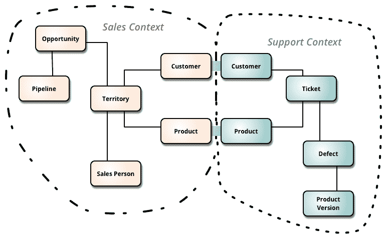
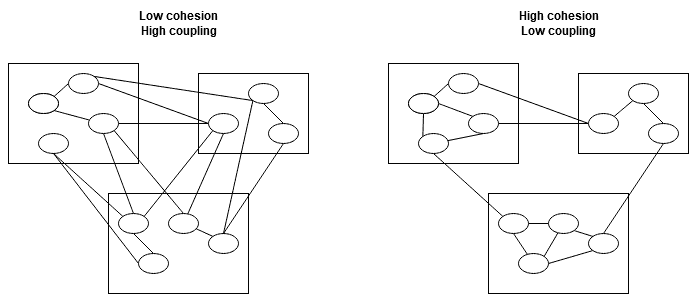

Importance of Software Architecture and Principles of Great Design

本介绍性章节的目的是展示软件体系结构在软件开发中的作用。它将重点放在设计 C 解决方案的体系结构时要记住的关键方面。我们将讨论如何设计具有方便和功能接口的高效代码。我们还将介绍一种用于代码和体系结构的域驱动方法。

在本章中，我们将介绍以下主题:

*   了解软件体系结构
*   学习正确架构的重要性
*   探索良好建筑的基础
*   使用敏捷原则开发架构
*   C 的哲学
*   遵循固体和干燥原则
*   领域驱动设计
*   耦合和内聚

# 技术要求

要使用本章中的代码，您需要以下内容:

*   一个 Git 客户端，用于签出很快给出的存储库。
*   一个符合 C 20 的编译器来编译所有的片段。它们中的大多数是用 C 11/14/17 编写的，但是需要概念支持才能尝试与主题接触的少数人。

*   代码片段的 GitHub 链接: [https://github.com/PacktPublishing/ 软件-体系结构-带有-Cpp/tree/master/Chapter01](https://github.com/PacktPublishing/Software-Architecture-with-Cpp/tree/master/Chapter01)。
*   GSL 的 GitHub 链接: [https://github.com/Microsoft/GSL](https://github.com/Microsoft/GSL)

# 了解软件体系结构

让我们首先定义什么是软件体系结构。当您创建应用程序、库或任何软件组件时，您需要考虑您编写的元素将看起来如何，以及它们将如何相互交互。换句话说，您正在设计它们以及它们与周围环境的关系。就像城市建筑一样，重要的是要考虑更大的图景，以免最终处于随意状态。在小规模上，每座建筑物看起来都不错，但是它们并没有组合成一个明智的更大的图景-它们只是不能很好地组合在一起。这就是所谓的意外架构，它是您要避免的结果之一。但是，请记住，无论您是否将想法投入其中，在编写软件时，您都在创建体系结构。

那么，如果你想用心定义解决方案的体系结构，你到底应该创造什么？软件工程学院有这样的说法:

The software architecture of a system is the set of structures needed to reason about the system, which comprise software elements, relations among them, and properties of both.

这意味着，为了彻底定义一个体系结构，我们应该从几个角度来思考它，而不是仅仅跳槽编写代码。

## 看待建筑的不同方式

有几个作用域可以用来看架构:

*   企业架构涉及整个公司甚至一组公司。它采取整体方法，并关注整个企业的战略。在考虑企业架构时，您应该考虑公司中的所有系统如何表现并相互协作。它担心业务与 It 之间的一致性。
*   解决方案体系结构不如企业对应的抽象。它位于企业架构和软件架构之间的中间位置。通常，解决方案体系结构涉及一个特定的系统及其与周围环境的交互方式。解决方案架构师需要提出一种满足特定业务需求的方法，通常是通过设计整个软件系统或修改现有软件系统。
*   软件架构甚至比解决方案架构更具体。它专注于特定项目，使用的技术以及与其他项目的交互方式。软件架构师对项目组件的内部感兴趣。
*   顾名思义，基础架构体系结构是关注软件将使用的基础架构。它定义了部署环境和策略，应用程序如何扩展，故障转移处理，站点可靠性以及其他面向基础架构的方面。

解决方案体系结构基于软件和基础架构，以满足业务需求。在以下各节中，我们将讨论这两个方面，以使您为小型和大型架构设计做好准备。在我们开始讨论这个问题之前，让我们回答一个基本问题: 为什么建筑很重要？

# 学习正确架构的重要性

实际上，一个更好的问题是: 为什么关心您的架构很重要？正如我们前面提到的，不管你是否有意识地努力构建它，你最终都会得到某种架构。如果经过几个月甚至几年的开发，您仍然希望您的软件保持其质量，则需要在此过程中更早地采取一些步骤。如果您不考虑自己的架构，那么它很可能永远不会呈现所需的品质。

所以，为了使您的产品能够满足性能、可维护性、可伸缩性等业务需求和属性，或者其他，您需要照顾好它的架构，最好在这个过程中尽早做到。现在让我们讨论每个优秀的建筑师想要保护他们的项目的两件事。

## 软件衰减

即使您完成了最初的工作并考虑了特定的体系结构，您也需要不断监视系统的发展方式以及它是否仍然符合用户的需求，因为在软件的开发和生命周期中，这些需求也可能会发生变化。当实现决策与计划的体系结构不符时，就会发生软件衰减 (有时也称为侵蚀)。所有这些差异都应被视为技术债务。

## 意外建筑

未能跟踪开发是否遵循所选架构或未能有意规划架构的外观通常会导致所谓的意外架构，并且无论在其他领域应用最佳实践 (例如测试或具有任何特定的开发文化)，都可能发生这种情况。

有几种反模式表明您的架构是偶然的。像一个大泥球的代码是最明显的代码。拥有上帝的对象是这方面的另一个重要标志。一般来说，如果你的软件越来越紧密地耦合，也许是循环依赖，但一开始就不是这样，这是一个重要的信号，那就是把更多的精力放在架构的外观上。

现在让我们来描述架构师必须理解什么才能提供可行的解决方案。

# 探索良好建筑的基础

知道如何从坏架构中识别出好的架构很重要，但这并不是一件容易的事。识别反模式是 it 的一个重要方面，但是对于一个良好的体系结构来说，它首先必须支持提供软件的预期，无论是关于功能需求、解决方案的属性，还是处理来自不同地方的约束。其中许多可以很容易地从体系结构上下文中得出。

## 架构上下文

上下文是架构师在设计固体解决方案时要考虑的内容。它包括需求，假设和约束，这些需求，假设和约束可能来自利益相关者以及业务和技术环境。它还会影响利益相关者和环境，例如，通过允许公司进入新的细分市场。

## 利益相关者

利益相关者是所有以某种方式参与产品的人。这些可以是您的客户，系统的用户或管理层。沟通是每个架构师的关键技能，正确管理利益相关者的需求是实现他们期望的和他们想要的方式的关键。

不同的事情对不同的利益相关者群体很重要，因此请尝试从所有这些群体中收集意见。

您的客户可能会关心编写和运行软件的成本、它提供的功能、它的生命周期、上市时间以及解决方案的质量。

您系统的用户可以分为两组: 最终用户和管理员。第一个通常关心软件的可用性、用户体验和性能等问题。对于后者，更重要的方面是用户管理，系统配置，安全性，备份和恢复。

最后，对于从事管理工作的利益相关者而言，可能重要的事情是保持较低的开发成本，实现业务目标，按计划进行开发计划并保持产品质量。

## 商业和技术环境

架构可以受到公司业务方面的影响。重要的相关方面是上市时间，推出时间表，组织结构，劳动力利用率以及对现有资产的投资。

在技术环境中，我们指的是公司中已经使用的技术或出于任何原因需要成为解决方案一部分的技术。我们需要与之集成的其他系统也是技术环境的重要组成部分。现有软件工程师的技术专长在这里也很重要: 架构师做出的技术决策会影响项目的人员配置，而初级开发人员与高级开发人员的比例会影响项目的管理方式。好的架构应该考虑到所有这些。

掌握了所有这些知识，现在让我们讨论一个有争议的话题，您在日常工作中很可能会遇到这个话题。

# 使用敏捷原则开发架构

看起来，架构和敏捷开发方法是一种对抗关系，围绕这个话题有很多神话。为了以敏捷的方式开发产品，同时仍然关心其架构，您应该遵循一些简单的原则。

敏捷本质上是迭代和增量的。这意味着在敏捷的架构方法中，准备大型的前期设计不是一种选择。相反，应该提出一个小的，但仍然合理的前期设计。最好是附带一份决策日志，其中包含每个决策的理由。这样，如果产品愿景发生变化，架构就可以随之发展。为了支持频繁的发布，前期设计应该逐步更新。这样发展起来的建筑被称为进化建筑。

管理架构不需要意味着保留大量文档。实际上，文档应仅涵盖必不可少的内容，因为这样可以更轻松地使其保持最新状态。它应该很简单，只涵盖系统的相关视图。

还有建筑师作为真理的单一来源和最终决策者的神话。在敏捷环境中，是团队在做决定。话虽如此，至关重要的是，利益相关者为决策过程做出了贡献-毕竟，他们的观点决定了解决方案的外观。

架构师应该仍然是开发团队的一部分，因为他们经常会带来强大的技术专长和多年的经验。他们还应该参与评估，并在每次迭代之前计划所需的架构更改。

为了让你的团队保持敏捷，你应该想办法高效地工作，只在重要的事情上工作。实现这些目标的一个好主意是领域驱动的设计。

## 领域驱动设计

域驱动设计 (Domain-driven design)，简称 DDD，是埃里克·埃文斯 (Eric Evans) 在其同名著作中引入的一个术语。本质上，它是关于改善业务和工程之间的沟通，并将开发人员的注意力转移到域模型上。基于此模型的实现通常会导致设计更易于理解并随着模型更改而发展。

DDD 与敏捷有什么关系？让我们回忆一下敏捷宣言的一部分:

**个人和互动**超过流程和工具
**工作软件**超过综合文档
**客户协作**超过合同谈判
**响应变更**超过计划

-敏捷宣言

为了做出正确的设计决策，您必须首先了解域。要做到这一点，您需要与人们进行大量交谈，并鼓励您的开发团队缩小他们与业务人员之间的差距。代码中的概念应以属于*普适语言*的实体命名。这基本上是商业专家行话和技术专家行话的共同部分。这些组中的每一个使用对方理解不同的术语可能会引起无数的误解，从而导致业务逻辑实现中的缺陷以及通常是微妙的错误。谨慎命名事物并使用两组同意的条款可能意味着该项目的幸福。让业务分析师或其他业务领域专家作为团队的一部分可以在这里提供很多帮助。

如果您要建模更大的系统，则可能很难使所有术语对不同的团队都具有相同的含义。这是因为每个团队实际上都在不同的环境中运作。DDD 提出使用*有界上下文*来处理这个问题。如果你正在建模，比如说，一个电子商务系统，你可能想仅仅从购物的角度来考虑这些术语，但是仔细观察，你可能会发现库存、交付和会计团队实际上都有自己的模型和术语。

每个都是您的电子商务域的不同子域。理想情况下，每个都可以映射到自己的有界上下文-系统的一部分具有自己的词汇表。在将解决方案拆分为较小的模块时，设置此类上下文的清晰边界非常重要。就像它的上下文一样，每个模块都有明确的责任、自己的数据库模式和自己的代码库。为了帮助较大系统中的团队之间进行通信，您可能需要引入一个上下文映射，该映射将显示来自不同上下文的术语如何相互关联:



Figure 1.1 – Two bounding contexts with the matching terms mapped between them (image from one of Martin Fowler's articles on DDD: https://martinfowler.com/bliki/BoundedContext.html)

当您现在了解一些重要的项目管理主题时，我们可以切换到更多的技术主题。

# C 的哲学

现在，让我们更接近在本书中使用最多的编程语言。C 是一种多范式语言，已经存在了几十年。自成立以来的几年中，它发生了很大变化。当 C 11 问世时，该语言的创造者 Bjarne Stroustrup 说，感觉就像是一种全新的语言。C 20 的发布标志着这只野兽进化的又一个里程碑，给我们如何编写代码带来了类似的革命。然而，在所有这些年中，有一件事保持不变: 语言的哲学。

简而言之，可以用三个规则来概括:

*   C 下面不应有任何语言 (汇编除外)。
*   你只为你使用的东西付费。
*   以低成本提供高级抽象 (零成本有一个强烈的目标)。

不为你不使用的东西付费意味着，例如，如果你想让你的数据成员在堆栈上创建，你可以许多语言在堆上分配他们的对象，但它不是必要的 C。在堆上分配有一些成本-可能您的分配器将不得不为此锁定互斥锁，这在某些类型的应用程序中可能是一个很大的负担。好的部分是你可以很容易地分配变量，而不必每次都很容易动态分配内存。

高级抽象是 C 与低级语言 (例如 C 或汇编) 的区别。它们允许直接在源代码中表达想法和意图，这与语言的类型安全性非常相关。考虑以下代码片段:

```cpp
struct Duration {
  int millis_;
};

void example() {
  auto d = Duration{};
  d.millis_ = 100;

  auto timeout = 1; // second
  d.millis_ = timeout; // ouch, we meant 1000 millis but assigned just 1
}
```

一个更好的主意是利用该语言提供的类型安全功能:

```cpp
#include <chrono>

using namespace std::literals::chrono_literals;

struct Duration {
  std::chrono::milliseconds millis_;
};

void example() {
  auto d = Duration{};
  // d.millis_ = 100; // compilation error, as 100 could mean anything
  d.millis_ = 100ms; // okay

  auto timeout = 1s; // or std::chrono::seconds(1);
  d.millis_ =
      timeout; // okay, converted automatically to milliseconds
}

```

前面的抽象可以使我们免于错误，并且在这样做时不会花费我们任何费用; 生成的程序集将与第一个示例相同。这就是为什么它被称为零成本抽象。有时 C 允许我们使用抽象，这些抽象实际上会比不使用它们带来更好的代码。一种语言功能的一个示例是 C 20 的协程序，该功能在使用时通常会带来这种好处。

标准库提供的另一组很好的抽象是算法。您认为以下哪些代码片段更容易阅读，更容易证明没有错误？哪个更好地表达了意图？

```cpp
// Approach #1
int count_dots(const char *str, std::size_t len) {
  int count = 0;
  for (std::size_t i = 0; i < len; ++ i) {
    if (str[i] == '.') count++ ;
  }
  return count;
}

// Approach #2
int count_dots(std::string_view str) {
  return std::count(std::begin(str), std::end(str), '.');
}
```

好的，第二个函数有一个不同的接口，但是即使它保持不变，我们也可以从指针和长度创建`std::string_view`。因为它是这样一个轻量级的类型，它应该被你的编译器优化掉。

使用更高级别的抽象会导致更简单、更可维护的代码。C 语言自成立以来就一直在努力提供零成本抽象，因此在此基础上建立起来，而不是使用较低级别的抽象来重新设计轮子。

说到简单且可维护的代码，下一节将介绍一些规则和启发式方法，这些规则和启发式方法在编写此类代码的过程中非常宝贵。

# 遵循固体和干燥原则

编写代码时要牢记很多原则。在编写面向对象的代码时，您应该熟悉抽象，封装，继承和多态性的四重奏。无论您是否以主要面向对象的编程方式编写 C，都应牢记两个首字母缩写词背后的原理: SOLID 和 DRY。

SOLID 是一套实践，可以帮助您编写更干净，更不易出错的软件。它是由其背后的五个概念的首字母组成的首字母缩写:

*   单一责任原则
*   开闭原则
*   利斯科夫替代原理
*   界面隔离
*   依赖反转

我们假设你已经有了这些原则与面向对象编程的关系的想法，但是由于 C 并不总是面向对象的，让我们看看它们如何应用于不同的领域。

一些示例使用动态多态性，但同样适用于静态多态性。如果你正在编写面向性能的代码 (如果你选择了 C，你可能是)，你应该知道使用动态多态在性能方面可能是一个坏主意，尤其是在热路径上。在本书的进一步内容中，您将学习如何使用**奇怪的循环模板模式** (**CRTP**) 编写静态多态类。

## 单一责任原则

简而言之，**单一责任原则** (**SRP**) 意味着每个代码单元应该有恰好一个责任。这意味着编写仅执行一件事的函数，创建负责单个事情的类型，并创建仅专注于一个方面的更高级别的组件。

这意味着，如果您的类管理某种类型的资源，如文件句柄，它应该只这样做，留下解析它们，例如，另一种类型。

通常，如果您看到名称中带有 “And” 的函数，则它违反了 SRP，应进行重构。另一个标志是当一个函数有注释指示函数的每个部分 (原文如此!) 做什么。作为一个独特的功能，每个这样的部分可能会更好。

一个相关的主题是最少知识原则。从本质上讲，它说任何对象都不应该对其他对象了解更多，因此，例如，它不依赖于它们的任何内部。应用它会导致更可维护的代码，组件之间的相互依赖性更少。

## 开闭原则

**开闭式原则** (**OCP**) 是指代码应该开放进行扩展，但关闭进行修改。开放进行扩展意味着我们可以轻松扩展代码支持的类型列表。关闭以进行修改意味着现有代码不应更改，因为这通常会导致系统中其他地方的错误。展示这一原理的一个很大的特点是`ostream`的`operator<<`。要扩展它，以便它支持您的自定义类，您需要做的就是编写类似于以下内容的代码:

```cpp
std::ostream &operator<<(std::ostream &stream, const MyPair<int, int> 
    &mp) {
  stream << mp.firstMember() << ", ";
  stream << mp.secondMember();
  return stream;
}
```

请注意，我们实现的`operator<<`是一个自由 (非成员) 函数。如果可能的话，你应该更喜欢那些成员函数，因为它实际上有助于封装。有关此的更多详细信息，请参阅 Scott Meyers 在本章末尾的*进一步阅读*部分中的文章。如果您不想为希望打印到`ostream`的某个字段提供公共访问权限，则可以将`operator<<`设为好友功能，如下所示:

```cpp
class MyPair {
// ...
  friend std::ostream &operator<<(std::ostream &stream, 
    const MyPair &mp);
};
std::ostream &operator<<(std::ostream &stream, const MyPair &mp) {
  stream << mp.first_ << ", ";
  stream << mp.second_ << ", ";
  stream << mp.secretThirdMember_;
  return stream;
}
```

请注意，OCP 的这个定义与与多态性相关的更常见的定义略有不同。后者是关于创建不能自己修改的基类，但开放给其他人继承。

说到多态性，让我们继续下一个原则，因为它是关于正确使用它的。

## 利斯科夫替代原理

本质上，**Liskov 替换原理** (**LSP**) 指出，如果函数使用指针或对基础对象的引用来工作，则它也必须使用指针或对其任何派生对象的引用来工作。这个规则有时被打破，因为我们在源代码中应用的技术并不总是在现实世界的抽象中工作。

一个著名的例子是正方形和长方形。从数学上讲，前者是后者的专业化，因此存在一个 “is a” 关系。这诱使我们创建一个从`Rectangle`类继承的`Square`类。所以，我们可以得到如下代码:

```cpp
class Rectangle {
 public:
  virtual ~Rectangle() = default;
  virtual double area() { return width_ * height_; }
  virtual void setWidth(double width) { width_ = width; }
  virtual void setHeight(double height) { height_ = height; }
 private:
  double width_;
  double height_;
};

class Square : public Rectangle {
 public:
  double area() override;
  void setWidth(double width) override;
  void setHeight(double height) override;
};
```

我们应该如何实现`Square`类的成员？如果我们想遵循 LSP 并使此类类的用户免于意外，我们不能: 如果我们称为`setWidth`，我们的广场将不再是一个广场。我们可以停止使用正方形 (无法使用前面的代码表示)，也可以修改高度，从而使正方形看起来与矩形不同。

如果您的代码违反了 LSP，则很可能您使用的是不正确的抽象。在我们的例子中，`Square`毕竟不应该从`Rectangle`继承。更好的方法可能是使两者实现`GeometricFigure`接口。

既然我们是关于界面的话题，那么我们就继续下一项，这也与它们有关。

## 界面隔离原理

界面隔离原理就是它的名字所暗示的。其表述如下:

No client should be forced to depend on methods that it does not use.

这听起来很明显，但它有一些不那么明显的含义。首先，您应该更喜欢更多但更小的接口，而不是单个大接口。其次，当您添加派生类或扩展现有类的功能时，您应该在扩展类实现的接口之前考虑一下。

让我们在违反此原则的示例中展示一下，从以下界面开始:

```cpp
class IFoodProcessor {
 public:
  virtual ~IFoodProcessor() = default;
  virtual void blend() = 0;
};
```

我们可以有一个简单的类实现它:

```cpp
class Blender : public IFoodProcessor {
 public:
  void blend() override;
};
```

到目前为止还不错。现在说我们想模拟另一个更先进的食品加工机，我们不顾一切地试图添加更多的方法到我们的界面:

```cpp
class IFoodProcessor {
 public:
  virtual ~IFoodProcessor() = default;
  virtual void blend() = 0;
  virtual void slice() = 0;
  virtual void dice() = 0;
};

class AnotherFoodProcessor : public IFoodProcessor {
 public:
  void blend() override;
  void slice() override;
  void dice() override;
};
```

现在我们对`Blender`类有一个问题，因为它不支持这个新接口-没有适当的方法来实现它。我们可以尝试破解一个变通方法或抛出`std::logic_error`，但更好的解决方案是将接口分成两个，每个都有单独的责任:

```cpp
class IBlender {
 public:
  virtual ~IBlender() = default;
  virtual void blend() = 0;
};

class ICutter {
 public:
  virtual ~ICutter() = default;
  virtual void slice() = 0;
  virtual void dice() = 0;
};
```

现在我们的`AnotherFoodProcessor`可以只实现两个接口，我们不需要改变我们现有的食品处理器的实现。

我们还有最后一个坚实的原则，所以现在让我们来了解一下。

## 依赖反转原理

依赖反转是解耦有用的原理。本质上，这意味着高级模块不应依赖于低级模块。相反，两者都应该依赖于抽象。

C 允许两种方法来反转你的类之间的依赖关系。第一个是常规的多态方法，第二个使用模板。让我们看看如何在实践中同时应用它们。

假设您正在建模一个软件开发项目，该项目应该有前端和后端开发人员。一个简单的方法是这样写:

```cpp
class FrontEndDeveloper {
 public:
  void developFrontEnd();
};

class BackEndDeveloper {
 public:
  void developBackEnd();
};

class Project {
 public:
  void deliver() {
    fed_.developFrontEnd();
    bed_.developBackEnd();
  }
 private:
  FrontEndDeveloper fed_;
  BackEndDeveloper bed_;
};
```

每个开发人员都是由`Project`类构建的。然而，这种方法并不理想，因为现在更高级别的概念，`Project`，依赖于更低级别的模块-面向单个开发人员的模块。让我们看看使用多态性应用依赖反转如何改变这一点。我们可以定义我们的开发人员依赖于一个接口如下:

```cpp
class Developer {
 public:
  virtual ~Developer() = default;
  virtual void develop() = 0;
};

class FrontEndDeveloper : public Developer {
 public:
  void develop() override { developFrontEnd(); }
 private:
  void developFrontEnd();
};

class BackEndDeveloper : public Developer {
 public:
  void develop() override { developBackEnd(); }
 private:
  void developBackEnd();
};
```

现在，`Project`类不再需要知道开发人员的实现。因此，它必须接受它们作为构造函数参数:

```cpp
class Project {
 public:
  using Developers = std::vector<std::unique_ptr<Developer>>;
  explicit Project(Developers developers)
      : developers_{std::move(developers)} {}

  void deliver() {
    for (auto &developer : developers_) {
      developer->develop();
    }
  }

 private:
  Developers developers_;
};
```

在这种方法中，`Project`与具体实现解耦，而是仅依赖于名为`Developer`的多态接口。“较低级别” 的具体类也取决于此接口。这可以帮助您缩短构建时间，并允许更容易的单元测试-现在您可以轻松地将模拟作为参数在测试代码中传递。

使用依赖关系反转与虚拟调度是有代价的，但是，现在我们正在处理内存分配，动态调度本身就有开销。有时 C 编译器可以检测到给定接口仅使用了一个实现，并通过执行去虚拟化来消除开销 (通常需要将函数标记为`final`才能正常工作)。但是这里使用了两种实现方式，因此必须支付动态调度的成本 (通常实现为跳过**虚拟方法表**，或**vtables**)。

还有另一种反转依赖关系的方法，它没有这些缺点。让我们看看如何使用 variadic 模板 (来自 C 14 的通用 lambda) 和`variant` (来自 C 17 或第三方库 (例如 Abseil 或 Boost)) 来完成此操作。首先是开发人员类:

```cpp
class FrontEndDeveloper {
 public:
  void develop() { developFrontEnd(); }
 private:
  void developFrontEnd();
};

class BackEndDeveloper {
 public:
  void develop() { developBackEnd(); }
 private:
  void developBackEnd();
};
```

现在我们不再依赖接口，所以不会进行虚拟调度。`Project`类仍然会接受`Developers`的向量:

```cpp
template <typename... Devs>
class Project {
 public:
  using Developers = std::vector<std::variant<Devs...>>;

  explicit Project(Developers developers)
      : developers_{std::move(developers)} {}

  void deliver() {
    for (auto &developer : developers_) {
      std::visit([](auto &dev) { dev.develop(); }, developer);
    }
  }

 private:
  Developers developers_;
};
```

如果您不熟悉`variant`，它只是一个类，可以容纳作为模板参数传递的任何类型。因为我们使用的是可变模板，所以我们可以传递我们喜欢的许多类型。要在变量中存储的对象上调用函数，我们可以使用`std::get`提取它，也可以使用`std::visit`和可调用对象-在我们的例子中，通用 lambda。它显示了鸭子打字在实践中的样子。由于我们所有的开发人员类都实现了`develop`功能，因此代码将编译并运行。如果您的开发人员类有不同的方法，例如，您可以创建一个函数对象，该函数对象的重载为不同类型的`operator()`。

因为`Project`现在是一个模板，所以我们必须在每次创建它时指定类型列表，或者提供类型别名。你可以使用像这样的最终类:

```cpp
using MyProject = Project<FrontEndDeveloper, BackEndDeveloper>;
auto alice = FrontEndDeveloper{};
auto bob = BackEndDeveloper{};
auto new_project = MyProject{{alice, bob}};
new_project.deliver();
```

这种方法保证不会为每个开发人员分配单独的内存或使用虚拟表。但是，在某些情况下，这种方法会导致较少的可扩展性，因为一旦声明了变体，就无法向其添加其他类型。

作为关于依赖反转的最后一件事，我们想指出的是，有一个类似命名的想法称为依赖注入，我们甚至在我们的示例中使用了它。这是关于通过构造函数或设置器注入依赖关系，这可能有利于代码的可测试性 (例如，考虑注入模拟对象)。甚至还有用于在整个应用程序中注入依赖关系的整个框架，例如 Boost.DI。这两个概念是相关的，经常一起使用。

## 干法则

DRY 是 “不要重复自己” 的缩写。这意味着您应该在可能的情况下避免代码重复和重用。这意味着当您的代码重复几次类似的操作时，您应该提取函数或函数模板。另外，与其创建几个类似的类型，不如考虑编写一个模板。

同样重要的是，在不必要的时候不要重新发明轮子，也就是说，不要重复别人的工作。如今，有数十个编写良好且成熟的库可以帮助您更快地编写高质量的软件。我们想特别提到其中的几个:

*   Boost C 库 ([https://www.boost.org/](https://www.boost.org/) )
*   脸书的愚蠢 ([https://github.com/facebook/folly](https://github.com/facebook/folly))
*   电子艺术的 EASTL ([https://github.com/electronicarts/EASTL](https://github.com/electronicarts/EASTL))
*   彭博的 BDE ([https://github.com/bloomberg/bde](https://github.com/bloomberg/bde))
*   谷歌的 Abseil ([https://abseil.io/](https://abseil.io/) )
*   令人敬畏的 Cpp 列表 ([https://github.com/fffaraz/ 令人敬畏的 cpp](https://github.com/fffaraz/awesome-cpp))，还有几十个

然而，有时复制代码会有它的好处。一种这样的方案是开发微服务。当然，在单个微服务中遵循 DRY 始终是一个好主意，但是违反用于多个服务的代码的 DRY 规则实际上是值得的。无论我们谈论的是模型实体还是逻辑，在允许代码重复的情况下，维护多个服务都更加容易。

想象一下，让多个微服务为一个实体重用相同的代码。突然其中一个需要修改一个字段。现在还必须修改所有其他服务。任何通用代码的依赖关系也是如此。由于与之无关的更改，必须修改数十个或更多的微服务，因此仅复制代码通常更容易进行维护。

既然我们谈论的是依赖关系和维护，那么让我们进入下一节，讨论一个密切相关的话题。

# 耦合和内聚

耦合和内聚是软件中同时存在的两个术语。让我们看看它们的含义以及它们之间的关系。

## 联轴器

耦合是衡量一个软件单元对其他单元的依赖程度的一种度量。具有高耦合的单元依赖于许多其他单元。耦合越低越好。

例如，如果一个类依赖于另一个类的私有成员，这意味着它们是紧密耦合的。第二类的改变可能意味着第一类也需要改变，这就是为什么这不是一个理想的情况。

为了削弱前面场景中的耦合，我们可以考虑为成员函数添加参数，而不是直接访问其他类的私有成员。

紧耦合类的另一个示例是依赖反转部分中的`Project`和开发人员类的第一个实现。让我们看看如果我们添加另一个开发人员类型会发生什么:

```cpp
class MiddlewareDeveloper {
 public:
  void developMiddleware() {}
};

class Project {
 public:
  void deliver() {
    fed_.developFrontEnd();
    med_.developMiddleware();
    bed_.developBackEnd();
  }

 private:
  FrontEndDeveloper fed_;
  MiddlewareDeveloper med_;
  BackEndDeveloper bed_;
};
```

看起来，我们不仅要添加`MiddlewareDeveloper`类，还必须修改`Project`类的公共接口。这意味着它们是紧密耦合的，并且这个实现的`Project`类实际上破坏了 OCP。为了进行比较，现在让我们看看如何使用依赖反转将相同的修改应用于实现:

```cpp
class MiddlewareDeveloper {
 public:
  void develop() { developMiddleware(); }

 private:
  void developMiddleware();
};
```

不需要对`Project`类进行任何更改，因此现在这些类是松散耦合的。我们需要做的就是添加`MiddlewareDeveloper`类。以这种方式构建我们的代码可以实现较小的重建，更快的开发和更容易的测试，所有这些都可以使用较少的代码来维护。要使用我们的新类，我们只需要修改调用代码:

```cpp
using MyProject = Project<FrontEndDeveloper, MiddlewareDeveloper, BackEndDeveloper>;
auto alice = FrontEndDeveloper{};
auto bob = BackEndDeveloper{};
auto charlie = MiddlewareDeveloper{};
auto new_project = MyProject{{alice, charlie, bob}};
new_project.deliver();
```

这显示了类级别上的耦合。在更大的范围内，例如，在两个服务之间，可以通过引入诸如消息排队之类的技术来实现低耦合。这些服务不会直接相互依赖，而只是依赖于消息格式。如果你有一个微服务体系结构，一个常见的错误是让多个服务使用同一个数据库。这会导致这些服务之间的耦合，因为您无法在不影响使用它的所有微服务的情况下自由修改数据库架构。

现在让我们继续进行凝聚力。

## 凝聚力

凝聚力是衡量软件单元元素关联程度的一种度量。在高度内聚的系统中，同一模块中的组件提供的功能密切相关。感觉这些组件只是属于一起。

在类级别上，方法操作的字段越多，它与类的凝聚力就越大。这意味着最常见的低内聚数据类型是那些大的单片数据类型。当课堂上发生太多事情时，很可能没有凝聚力，也会破坏 SRP。这使得此类类难以维护且容易出错。

较小的类也可能不具有凝聚力。请考虑以下示例。这似乎微不足道，但是发布现实生活中的场景 (通常是数百行甚至数千行) 是不切实际的:

```cpp
class CachingProcessor {
 public:
  Result process(WorkItem work);
  Results processBatch(WorkBatch batch);
  void addListener(const Listener &listener);
  void removeListener(const Listener &listener);

 private:
  void addToCache(const WorkItem &work, const Result &result);
  void findInCache(const WorkItem &work);
  void limitCacheSize(std::size_t size);
  void notifyListeners(const Result &result);
  // ...
};
```

我们可以看到，我们的处理器实际上做了三种类型的工作: 实际工作、结果的缓存和管理侦听器。在这种情况下增加凝聚力的一种常见方法是提取一个类甚至多个类:

```cpp
class WorkResultsCache {
 public:
  void addToCache(const WorkItem &work, const Result &result);
  void findInCache(const WorkItem &work);
  void limitCacheSize(std::size_t size);
 private:
  // ...
};

class ResultNotifier {
 public:
  void addListener(const Listener &listener);
  void removeListener(const Listener &listener);
  void notify(const Result &result);
 private:
  // ...
};

class CachingProcessor {
 public:
  explicit CachingProcessor(ResultNotifier &notifier);
  Result process(WorkItem work);
  Results processBatch(WorkBatch batch);
 private:
  WorkResultsCache cache_;
  ResultNotifier notifier_;
  // ...
};
```

现在，每个部分都是由一个单独的，有凝聚力的实体完成的。现在可以轻松地重复使用它们。即使使它们成为模板类也不需要什么工作。最后但并非最不重要的一点是，测试此类类也应该更容易。

将其放在组件或系统级别很简单-您设计的每个组件，服务和系统都应该简洁明了，并专注于做一件事并正确地做:



Figure 1.2 – Coupling versus cohesion

低内聚力和高耦合通常与难以测试，重用，维护甚至理解的软件相关联，因此它缺乏软件中通常希望具有的许多质量属性。

这些术语经常合并在一起，因为通常一个特征会影响另一个特征，而不管我们谈论的单元是功能，类别，图书馆，服务甚至整个系统。举个例子，通常，单片是高度耦合和低内聚的，而分布式服务往往位于频谱的另一端。

我们的介绍性章节到此结束。现在让我们总结一下我们学到的东西。

# 摘要

在本章中，我们讨论了什么是软件体系结构，以及为什么它值得关心它。我们已经展示了当体系结构没有更新时会发生什么，以及不断变化的需求和实现，以及如何在敏捷环境中处理体系结构。然后我们继续讨论 c 语言的一些核心原则。

我们了解到，软件开发中的许多术语在 C 中可以被不同地感知，因为 C 允许的不仅仅是编写面向对象的代码。最后，我们讨论了耦合和内聚等术语。

您现在应该能够指出代码审查中的许多设计缺陷，并重构您的解决方案以获得更大的可维护性，以及作为开发人员不容易出现错误。现在，您可以设计健壮，不言自明且完整的类接口。

在下一章中，我们将了解不同的建筑方法或风格。我们还将了解如何以及何时可以使用它们来获得更好的结果。

# 问题

1.  为什么要关心软件架构？
2.  架构师应该是敏捷团队中的最终决策者吗？
3.  SRP 与凝聚力有何关系？
4.  在项目生命周期的哪些阶段，它可以从拥有一名建筑师中受益？
5.  遵循 SRP 有什么好处？

# 进一步阅读

1.  Eric Evans，*领域驱动设计: 解决软件核心的复杂性*
2.  Scott Meyers，*非成员函数如何改进封装*，[https://www.drdobbs.com/cpp/ 如何-非成员函数-改进-encapsu/184401197](https://www.drdobbs.com/cpp/how-non-member-functions-improve-encapsu/184401197)