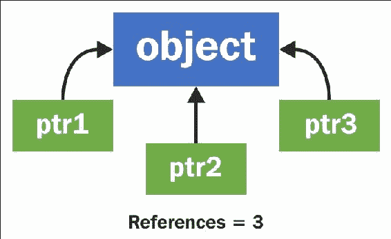
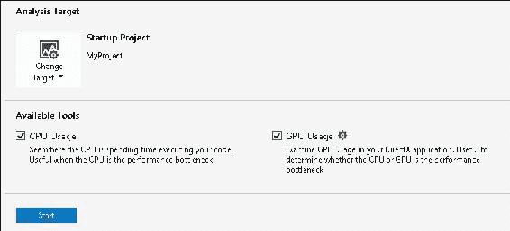

# 简介

内存管理一直是最重要的事情之一，要在你的计算机程序中得到正确的，以确保你的代码的稳定性和良好的，无错误的操作。悬空指针 (指针指的是已从内存中删除的内容) 是一个错误的示例，如果发生该错误，则很难跟踪。


在任何计算机程序中，内存管理是极其重要的。UE4 的`UObject`参考计数系统是为演员和`UObject`衍生工具管理内存的默认方式。这是在 UE4 程序中管理内存的默认方式。

如果您编写自己的自定义 C 类，这些类不是从`UObject`派生的，您可能会发现`TSharedPtr`/`TWeakPtr`引用计数类很有用。这些类为 0 个引用对象提供引用计数和自动删除。

本章提供了 ue4 内内存管理的配方。

# 非托管内存-使用 malloc( )/free()

为 C (和 C) 中的计算机程序分配内存的基本方法是使用`malloc()`。`malloc()`指定计算机系统内存的一个块供程序使用。一旦你的程序使用了一段内存，没有其他程序可以使用或访问该段内存。尝试访问未分配给程序的内存段将产生 “分段错误”，并表示大多数系统上的非法操作。

## 怎么做...

让我们看一个示例代码，该代码分配一个指针变量`i`，然后使用`malloc()`为其分配内存。我们在`int*`指针后面分配一个整数。分配后，我们使用 dereferencing 运算符`*`在`int`中存储一个值:

```cpp
// CREATING AND ALLOCATING MEMORY FOR AN INT VARIABLE i
int* i; // Declare a pointer variable i
i = ( int* )malloc( sizeof( int ) ); // Allocates system memory
*i = 0; // Assign the value 0 into variable i
printf( "i contains %d", *i ); // Use the variable i, ensuring to 
// use dereferencing operator * during use
// RELEASING MEMORY OCCUPIED BY i TO THE SYSTEM
free( i ); // When we're done using i, we free the memory 
// allocated for it back to the system.
i = 0;// Set the pointer's reference to address 0
```

## 它是如何工作的…

之前的代码执行下图所示的操作:

1.  第一行创建了一个`int*`指针变量`i`，它作为一个悬空指针开始，它指的是一段内存，它可能对您的程序无法引用。
2.  在第二张图中，我们使用`malloc()`调用来初始化变量`i`，以精确地指向内存的一段，该内存的大小与`int`变量的大小相同，这对于您的程序来说是有效的。
3.  We then initialize the contents of that memory segment to the value `0` using the command `*i = 0;`.

    

    ### 提示

    注意分配给指针变量 (`i =`) 和分配给指针变量 (`*i =`) 之间的区别，指针变量告诉指针要引用的内存地址是什么 (`*i =`)。

当变量`i`中的内存需要释放回系统时，我们使用`free()`解除分配调用进行释放，如下图所示。然后将`i`分配给指向存储器地址`0`，(由**电气接地**符号参考图示)。


我们将变量`i`设置为指向`NULL`引用的原因是为了明确变量`i`不引用有效的内存段。

# 非托管内存-使用 new/delete

`new`运算符与`malloc`调用几乎相同，只是它在分配内存后立即创建的对象上调用构造函数调用。与运算符`new`分配的对象应与运算符`delete` (而不是`free()`) 解除分配。

## 准备就绪

在 C 中，作为最佳实践，使用`malloc()`被使用运算符`new`代替。`malloc()`的功能和运算符`new`的主要区别在于`new`在内存分配后会调用对象类型上的构造函数。

<colgroup class="calibre17"><col class="calibre18"> <col class="calibre18"></colgroup> 
| 

`malloc`]

 | 

`new`]

 |
| --- | --- |
| 分配一个连续空间的区域供使用。 | 分配一个连续空间的区域供使用。调用构造函数作为用作运算符`new`参数的对象类型。 |

## 怎么做...

在下面的代码中，我们声明一个简单的`Object`类，然后使用运算符`new`构造它的一个实例:

```cpp
class Object
{
  Object()
  {
    puts( "Object constructed" );
  }
  ~Object()
  {
    puts( "Object destructed" );
  }
};
Object* object= new Object(); // Invokes ctor
delete object; // Invokes dtor
object = 0; // resets object to a null pointer
```

## 它是如何工作的…

运算符`new`通过分配空间来工作，就像`malloc()`一样。如果与运算符`new`一起使用的类型是对象类型，则使用关键字`new`自动调用构造函数，而使用`malloc()`不会调用构造函数。

## 还有更多…

您应该避免使用带有关键字`new` (或`malloc`的裸堆分配)。在引擎中首选托管内存，以便跟踪和清理所有内存使用。如果你分配一个`UObject`导数，你肯定需要使用`NewObject< >`或`ConstructObject< >` (在随后的食谱中概述)。

# 托管内存-使用 NewObject<>和 ConstructObject<>

托管内存是指由 c 语言中的、`delete`、`malloc,`和`free`调用上面的某个编程子系统分配和释放的内存。通常创建这些子系统，以便程序员在分配内存后不会忘记释放内存。未释放、占用但未使用的内存块称为内存泄漏。例如:

```cpp
for( int i = 0; i < 100; i++ )
int** leak = new int[500]; // generates memory leaks galore!
```

在前面的示例中，分配的内存是不能被任何变量引用!所以你既不能在`for`循环后使用分配的内存，也不能释放它。如果您的程序分配了所有可用的系统内存，那么将会发生的是，您的系统将完全耗尽内存，并且您的操作系统将标记您的程序并关闭它，以耗尽过多的内存。

内存管理防止忘记释放内存。在内存管理的程序中，通常由动态分配引用对象的指针数量的对象记住它。当有零个指针引用该对象时，它要么被自动立即删除，要么在下一次运行**垃圾收集器**时被标记为删除。

在 ue4 中自动使用托管内存。要在引擎中使用的对象的任何分配都必须使用`NewObject< >()`或`SpawnActor< >()`完成。对象的释放是通过删除对对象的引用来完成的，然后偶尔调用垃圾清理例程 (在本章中进一步列出)。

## 准备就绪

当需要构造任何不是`Actor`类的导数的`UObject`导数时，应始终使用`NewObject< >`。仅当对象是`Actor`或其导数时才应使用`SpawnActor< >`。

## 怎么做...

假设我们正在尝试构造一个类型为`UAction`的对象，它本身源自`UObject`。例如，以下类:

```cpp
UCLASS(BlueprintType, Blueprintable, meta=(ShortTooltip="Base class for any Action type") )
Class WRYV_API UAction : public UObject
{
  GENERATED_UCLASS_BODY()
  public:
  UPROPERTY(EditAnywhere, BlueprintReadWrite, Category=Properties)
  FString Text;
  UPROPERTY(EditAnywhere, BlueprintReadWrite, Category=Properties)
  FKey ShortcutKey;
};
```

要构造`UAction`类的实例，我们将执行以下操作:

```cpp
UAction* action = NewObject<UAction>( GetTransientPackage(),
UAction::StaticClass() /* RF_* flags */ );
```

## 它是如何工作的…

在这里，`UAction::StaticClass()`为您获取`UAction`对象的基础`UClass*`。对`NewObject< >`的第一个参数是`GetTransientPackage()`，它只是简单地检索游戏的瞬态包。UE4 中的一个包 (`UPackage`) 只是一个数据集团。在这里，我们使用**瞬态包**来存储我们的堆分配数据。您也可以使用蓝图中的`UPROPERTY() TSubclassOf<AActor>`来选择`UClass`实例。

第三个参数 (可选) 是指示内存管理系统如何处理`UObject`的参数组合。

## 还有更多…

还有一个和`NewObject< >`非常相似的函数叫做`ConstructObject< >`。`ConstructObject< >`在构造中提供了更多的参数，如果需要指定这些参数，您可能会发现它很有用。否则，`NewObject`工作正常。

## 另见

*   您可能还想在[https://docs.unrealengine.com/latest/INT/Programming/UnrealArchitecture/Objects/Creation/index.html#objectflags](https://docs.unrealengine.com/latest/INT/Programming/UnrealArchitecture/Objects/Creation/index.html#objectflags)查看`RF_*`标志的文档

# 托管内存-释放内存

当没有更多的引用时，`UObject`是引用计数和垃圾收集。使用`ConstructObject<>`或`NewObject< >`在`UObject`类导数上分配的内存也可以通过调用`UObject::ConditionalBeginDestroy()`成员函数手动释放 (在引用计数降至 0 之前)。

## 准备就绪

只有当你确定你不再想要内存中的`UObject`或`UObject`类派生实例时，你才会这样做。使用`ConditionalBeginDestroy()`功能释放内存。

## 怎么做...

下面的代码演示了`UObject class`的解除分配:

```cpp
UObject *o = NewObject< UObject >( ... );
o->ConditionalBeginDestroy();
```

## 它是如何工作的…

命令`ConditionalBeginDestroy()`开始释放过程，调用`BeginDestroy()`和`FinishDestroy()`可覆盖函数。

## 还有更多…

注意不要在其他对象的指针仍在内存中引用的任何对象上调用`UObject::ConditionalBeginDestroy()`。

# 托管内存-跟踪对象的智能指针 (TSharedPtr，TWeakPtr，TAutoPtr)

当人们 害怕他们会忘记他们创建的标准 C 对象的 `delete` 调用时，他们 经常使用智能指针来防止内存 泄漏。`TSharedPtr`是一个非常有用的 C 类，它将使任何自定义 C 对象引用-计数-除了`UObject`导数，它们已经被引用-计数。还提供了一个替代类`TWeakPtr`，用于指向具有无法阻止删除 (因此为 “弱”) 的奇怪属性的引用计数对象。



### 提示

`UObject`和它的派生类 (任何用`NewObject`或`ConstructObject`创建的) 都不能使用`TSharedPtr`!

## 准备就绪

如果你不想使用原始指针，并手动跟踪删除到不使用`UObject`衍生的 C 代码，那么该代码是使用智能指针的一个很好的候选者，如`TSharedPtr`，`TSharedRef`，等。当您使用动态分配的对象 (使用关键字`new`创建) 时，您可以将其包装在引用计数指针中，以便自动进行解除分配。不同类型的智能指针决定了智能指针的行为和删除调用时间。它们如下:

*   `TSharedPtr`: 一个线程安全 (前提是您提供`ESPMode::ThreadSafe`作为模板的第二个参数) 引用计数指针类型，指示共享对象。当没有更多的引用时，共享对象将被释放。
*   `TAutoPtr`: 非线程安全共享指针。

## 怎么做...

我们可以演示以前使用短代码段引用的四种类型的智能指针的使用。在所有这些代码中，起始指针可以是原始指针，也可以是另一个智能指针的副本。您所要做的就是获取 C 原始指针，并将其包装在构造函数调用中，以实现`TSharedPtr`，`TSharedRef`，`TWeakPtr,`或`TAutoPtr`中的任何一个。

例如:

```cpp
// C++ Class NOT deriving from UObject
class MyClass { };
TSharedPtr<MyClass>sharedPtr( new MyClass() );
```

## 它是如何工作的…

弱指针和共享指针有一些区别。当引用计数降至 0 时，弱指针没有将对象保留在内存中的能力。

使用弱指针 (超过原始指针) 的优点是，当手动删除弱指针下方的对象 (使用`ConditionalBeginDestroy()`) 时，弱指针的引用将成为`NULL`引用。这使您能够通过检查表单的语句来检查指针下方的资源是否仍然正确分配:

```cpp
if( ptr.IsValid() ) // Check to see if the pointer is valid
{
}
```

## 还有更多…

共享指针是线程安全的。这意味着底层对象可以安全地在单独的线程上操作。始终记住，您不能将`TSharedRef`与`UObject`或`UObject`导数一起使用-仅在您的自定义 C 类上，或者在您的`FStructures`上，您可以使用`TSharedPtr`，`TSharedRef`，`TWeakPtr`中的任何一个类来包装原始指针。使用智能指针指向对象必须使用`TWeakObjectPointer`或`UPROPERTY()`作为起点。

如果不需要`TSharedPtr`的线程安全保证，可以使用`TAutoPtr`。当对对象的引用数降至 0 时，将自动删除该对象。

# 使用 TScopedPointer 跟踪对象

作用域指针是在声明它的块的末尾自动删除的指针。回想一下，作用域只是一段代码，在此期间变量是 “活的”。作用域将持续到出现第一个闭合大括号`}`为止。

例如，在下面的块中，我们有两个作用域。外部作用域声明一个整数变量`x` (对整个外部块有效)，而内部作用域声明一个整数变量`y` (对内部块有效，在声明它的行之后):

```cpp
{
  int x;
  {
    int y;
  } // scope of y ends
} // scope of x ends
```

## 准备就绪

当重要的是在使用期间保留引用计数的对象 (有超出范围的危险) 时，作用域指针很有用。

## 怎么做...

要声明作用域指针，我们只需使用以下语法:

```cpp
TScopedPointer<AWarrior> warrior(this );
```

这将声明一个作用域指针，该指针引用在尖括号中声明的类型的对象: `< AWarrior >`。

## 它是如何工作的…

`TScopedPointer`变量类型自动为指向的变量添加引用计数。这至少可以在作用域指针的生命周期内防止基础对象的释放。

# 虚幻的垃圾回收系统和 UPROPERTY()

当您有对象 (如`TArray< >`) 作为`UCLASS()`的`UPROPERTY()`成员时，您需要将该成员声明为`UPROPERTY()` (即使您不会在蓝图中对其进行编辑)，否则`TArray`将无法正确分配。

## 怎么做...

假设我们有一个`UCLASS()`宏，如下所示:

```cpp
UCLASS()
class MYPROJECT_API AWarrior : public AActor
{
  //TArray< FSoundEffect > Greets; // Incorrect
  UPROPERTY() TArray< FSoundEffect > Greets; // Correct
};
```

您必须将`TArray`成员列为`UPROPERTY()`，才能对其进行正确的引用计数。如果不这样做，代码中会出现一个意外的内存错误类型错误。

## 它是如何工作的…

`UPROPERTY()`声明告诉 UE4`TArray`必须正确管理内存。如果没有`UPROPERTY()`声明，你的`TArray`将无法正常工作。

# 强制垃圾回收

当内存填满，并且您想释放其中的一部分时，可以强制进行垃圾回收。你很少需要这样做，但是你可以在有一个非常大的纹理 (或一组纹理) 的情况下做到这一点，这些纹理是参考计数的，你需要清除。

## 准备就绪

只需在要从内存中释放的所有`UObject`上调用`ConditionalBeginDestroy()`，或将它们的引用计数设置为 0。

## 怎么做...

通过调用以下内容来执行垃圾回收:

```cpp
GetWorld()->ForceGarbageCollection( true );
```

# 断点和遍历代码

断点是您暂停 C 程序以暂时停止代码运行的方式，并有机会分析和检查程序的操作。您可以对等变量，逐步执行代码并更改变量值。

## 准备就绪

断点很容易在 Visual Studio 中设置。您所要做的就是在要暂停操作的代码行上按*F9*，或者单击要暂停操作的代码行左侧的灰色边距。当操作到达指示的行时，代码将暂停。

## 怎么做...

1.  Press *F9* on the line you want execution to pause at. This will add a breakpoint to the code, indicated by a red dot, as shown in the screenshot below. Clicking on the red dot toggles it.

    

2.  将**构建配置**设置为标题中带有**Debug**的任何配置 (**DebugGame**编辑器，或者简单地**DebugGame**，如果您将在没有编辑器的情况下启动)。
3.  按*F5* (不按住*Ctrl*) 启动代码，或选择**调试** | **开始调试**菜单选项。
4.  当代码到达红点时，代码的执行将暂停。
5.  暂停的视图将带您进入**调试模式**中的代码编辑器。在这种模式下，窗口可能会出现重新排列的情况，其中**解决方案资源管理器**可能会向右移动，新窗口出现在底部，包括**本地**，**手表 1**，和**调用堆栈**。如果没有出现这些窗口，请在**调试** | **窗口**子菜单下找到它们。
6.  在**本地**窗口 (**调试** | **窗口** | **本地**) 下查看您的变量。
7.  按*F10*越过一行代码。
8.  按*F11*进入一行代码。

## 它是如何工作的…

调试器是功能强大的工具，可让您在代码运行时查看有关代码的所有内容，包括变量状态。

跨过一行代码 (*F10*) 执行整个代码行，然后在下一行立即再次暂停程序。如果代码行是函数调用，则在函数调用的第一行代码处不停顿地执行函数。例如:

```cpp
void f()
{
  // F11 pauses here
  UE_LOG( LogTemp, Warning, TEXT( "Log message" ) );
}
int main()
{
  f(); // Breakpoint here: F10 runs and skips to next line
}
```

进入一行代码 (*F11*) 将在下一行代码运行时暂停执行。

# 查找 bug 并使用调用栈

当你的代码中有一个错误时，Visual Studio 会停止并允许你检查代码。Visual Studio 停止的地方并不总是错误的确切位置，但可以靠近。它至少会在一行代码中执行不正确。

## 准备就绪

在此食谱中，我们将描述**调用堆栈，**以及如何跟踪您认为错误可能来自何处。尝试在代码中添加一个 bug，或者在某个有趣的地方添加一个断点，您想暂停检查。

## 怎么做...

1.  通过按*F5，*或选择**调试** | **启动调试**菜单选项，将代码运行到出现错误的点。例如，添加这几行代码:

    ```cpp
    UObject *o = 0; // Initialize to an illegal null pointer
    o->GetName(); // Try and get the name of the object (has bug)
    ```

2.  代码将在第二行 (`o->GetName()`) 暂停。
3.  当代码暂停时，导航到**调用堆栈**窗口 (**调试** | **窗口** | **调用堆栈**)。

## 它是如何工作的…

**调用堆栈**是已执行的函数调用的列表。当出现错误时，它发生的行会在**调用堆栈**的顶部列出。


# 使用探查器识别热点

C Profiler 对于查找需要 大量处理时间的代码部分非常有用。使用探查器可以帮助您找到优化过程中要关注的代码部分。如果您怀疑某个代码区域运行缓慢，那么您实际上可以确认，如果它没有在探查器中突出显示，它就不会变慢。

## 怎么做...

1.  Go to **Debug** | **Start Diagnostic Tools Without Debugging…**

    

2.  在上面的屏幕截图中显示的对话框中，选择要显示的分析类型。您可以选择分析**CPU 使用情况**、**GPU 使用情况**、**内存使用情况**，或者通过**性能向导**一步来帮助您选择想要查看的内容。
3.  单击对话框底部的**Start**按钮。
4.  Stop the code after a brief time (less than a minute or two) to halt sample collection.

    ### 提示

    不要收集太多样本，否则探查器将需要很长时间才能启动。

5.  检查出现在`.diagsession`文件中的结果。请务必浏览所有打开的可用标签。可用选项卡将根据执行的分析类型而有所不同。

## 它是如何工作的…

C 探查器对正在运行的代码进行采样和分析，并向您展示一系列有关代码执行方式的图表和图形。