# 四、演员和组件

在本章中，我们将介绍以下食谱:

*   在 C 中创建自定义`Actor`
*   使用`SpawnActor`实例化`Actor`
*   使用`Destroy`和计时器销毁`Actor`
*   使用`SetLifeSpan`延迟后销毁`Actor`
*   通过组合实现`Actor`功能
*   使用`FObjectFinder`将资产加载到组件中
*   通过继承实现`Actor`功能
*   附加组件以创建层次结构
*   创建自定义`Actor`组件
*   创建自定义`Scene`组件
*   创建自定义`Primitive`组件
*   为 RPG 创建`InventoryComponent`
*   创建`OrbitingMovement`组件
*   创建生成单元的建筑物

# 简介

演员是在游戏世界中有一些存在的类。参与者通过合并组件来获得其专业功能。本章涉及创建自定义参与者和组件，它们服务的目的以及它们如何协同工作。

# 在 C 中创建一个自定义演员

虽然有许多不同类型的 actor 与 Unreal 一起作为默认安装的一部分，但您会发现自己需要在项目开发过程中的某个时刻创建自定义 actor。当您需要向现有类添加功能、以默认子类中不存在的组合组合组件或向类添加其他成员变量时，可能会发生这种情况。接下来的两个食谱演示了如何使用合成或继承来定制演员。

## 准备就绪

确保您已按照[第 1 章](01.html#E9OE1-c0ca69a0411046888a488e5085138121 "Chapter 1\. UE4 Development Tools")，*UE4 开发工具中的配方安装了 Visual Studio 和虚幻 4。*您还需要拥有一个现有项目，或者使用虚幻提供的向导创建一个新项目。

## 怎么做...

1.  Open up your project within the Unreal Editor, then click on the **Add New** button in **Content Browser**:

    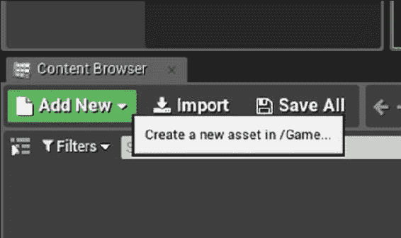

2.  Select **New C++ Class...**

    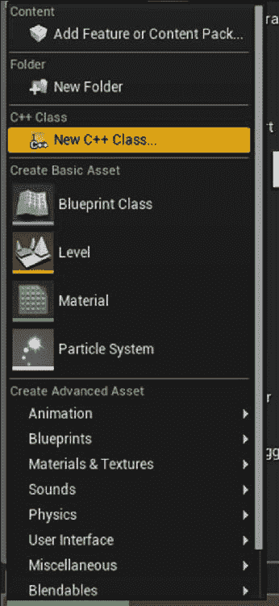

3.  In the dialog that opens, select **Actor** from the list:

    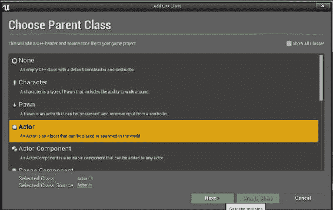

4.  Give your Actor a name, such as `MyFirstActor`, then click on **OK** to launch Visual Studio.

    ### 提示

    按照惯例，`Actor`子类的类名以`A`开头。使用此类创建向导时，请确保您的类不以`A`为前缀，因为引擎会自动为您添加前缀。

    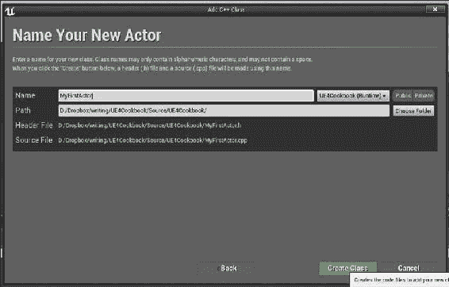

5.  当 Visual Studio 加载时，您应该看到与以下列表非常相似的内容:

    ```cpp
    MyFirstActor.h
    #pragma once

    #include "GameFramework/Actor.h"
    #include "MyFirstActor.generated.h"

    UCLASS()
    class UE4COOKBOOK_API AMyFirstActor : public AActor
    {
      GENERATED_BODY()
      public:
      AMyFirstActor(); 
    };
    MyFirstActor.cpp
    #include "UE4Cookbook.h"
    #include "MyFirstActor.h"
    AMyFirstActor::AMyFirstActor()
    {
      PrimaryActorTick.bCanEverTick = true;
    }
    ```

## 它是如何工作的...

随着时间的发展，您将对标准代码变得足够熟悉，因此，您将能够从 Visual Studio 创建新类，而无需使用虚幻向导。

*   `#pragma once`: 这个预处理器语句，或`pragma`，是 Unreal 期望的实现方法，包括保护程序-防止`include`文件被多次引用而导致错误的代码段。
*   `#include "GameFramework/Actor.h"`: 我们要创建一个`Actor`子类，所以自然地，我们需要为我们继承的类包含`header`文件。
*   `#include "MyFirstActor.generated.h"`: 所有 actor 类都需要包含其`generated.h`文件。该文件由**虚幻头工具** (**UHT**) 根据文件中检测到的宏自动创建。
*   `UCLASS()`: `UCLASS`是一个这样的宏，它允许我们指示一个类将暴露于虚幻的反射系统。反射使我们能够在运行时检查和迭代对象属性，并管理对我们对象的引用以进行垃圾收集。
*   `class UE4COOKBOOK_API AMyFirstActor : public AActor`: 这是我们班的实际声明。`UE4COOKBOOK_API`宏是由 UHT 创建的，它是通过确保我们的项目模块的类在 DLL 中正确导出来帮助我们的项目在 Windows 上正确编译所必需的。您还会注意到，`MyFirstActor`和`Actor`都有前缀`A` -- 这是 Unreal 对继承自`Actor`的原生类所要求的命名约定。
*   `GENERATED_BODY()`: `GENERATED_BODY`是另一个 UHT 宏，已扩展到包括基础 UE 类型系统所需的自动生成功能。
*   `PrimaryActorTick.bCanEverTick = true;`: 在构造函数实现内部，这一行为这个`Actor`启用了勾选。所有参与者都有一个称为`Tick`的函数，这个布尔变量意味着`Actor`将使该函数每帧调用一次，使参与者能够根据需要在每帧中执行动作。作为性能优化，默认情况下禁用此功能。

# 使用 SpawnActor 实例化演员

对于这个配方，你需要有一个`Actor`子类准备实例化。你可以使用一个内置的类，比如`StaticMeshActor`，但是用你在之前的食谱中做的自定义`Actor`来练习会有所帮助。

## 怎么做...

1.  创建一个新的 C 类，就像以前的食谱一样。这次，选择`GameMode`作为你的基类，给它起一个名字，比如`UE4CookbookGameMode`。
2.  在新的`GameMode`类中声明一个函数覆盖:

    ```cpp
    virtual void BeginPlay() override;
    ```

3.  在`.cpp`文件中实施`BeginPlay`:

    ```cpp
    void AUE4CookbookGameMode::BeginPlay()
    {
      Super::BeginPlay();
      GEngine->AddOnScreenDebugMessage(-1, -1, FColor::Red, TEXT("Actor Spawning"));

      FTransform SpawnLocation;
      GetWorld()->SpawnActor<AMyFirstActor>( AMyFirstActor::StaticClass(), &SpawnLocation);
    }
    ```

4.  Compile your code, either through Visual Studio or by clicking on the **Compile** button in Unreal Editor.

    

5.  Open the **World Settings** panel for the current level by clicking on the **Settings** toolbar icon, then pick **World Settings** from the drop-down menu. In the **GameMode Override** section, change the game mode to the `GameMode` subclass you just created as shown in the following two screenshots:

    

    

6.  Start the level, and verify that `GameMode` spawns a copy of your `Actor` in the world by looking at the **World Outliner** panel. You can verify that the `BeginPlay` function is being run by viewing the **Actor Spawning** text being displayed on screen. If it doesn't spawn, make sure there are no obstructions at the world origin to prevent the `Actor` from being spawned. You can search the list of objects in the world by typing in the search bar at the top of the **World Outliner** panel to filter the entities shown.

    

## 它是如何工作的...

1.  `GameMode`是一种特殊类型的演员，是虚幻游戏框架的一部分。你的地图的`GameMode`是由引擎在游戏开始时自动实例化的。
2.  通过将一些代码放入我们自定义`GameMode`的`BeginPlay`方法中，我们可以在游戏开始时自动运行它。
3.  在`BeginPlay`内部，我们创建一个`FTransform`供`SpawnActor`函数使用。默认情况下，`FTransform`被构造为具有零旋转和在原点的位置。
4.  然后，我们使用`GetWorld`获取当前级别的`UWorld`实例的引用，然后调用其`SpawnActor`函数。我们传入我们之前创建的`FTransform,`，以指定应该在其位置 (即原点) 创建对象。

# 使用 Destroy 和计时器摧毁演员

这个食谱将重复使用上一个食谱中的`GameMode`，所以你应该先完成它。

## 怎么做...

1.  将以下更改为`GameMode`声明:

    ```cpp
    UPROPERTY()
    AMyFirstActor* SpawnedActor;
    UFUNCTION()
    void DestroyActorFunction();
    ```

2.  将`#include "MyFirstActor.h"`添加到实现文件的包含。
3.  将`SpawnActor`的结果分配给新的`SpawnedActor`变量:

    ```cpp
    SpawnedActor = GetWorld()->SpawnActor<AMyFirstActor> (AMyFirstActor::StaticClass(), SpawnLocation);
    ```

4.  在`BeginPlay`函数的末尾添加以下内容:

    ```cpp
    FTimerHandle Timer;
    GetWorldTimerManager().SetTimer(Timer, this, &AUE4CookbookGameMode::DestroyActorFunction, 10);
    ```

5.  最后，实施`DestroyActorFunction`:

    ```cpp
    void AUE4CookbookGameMode::DestroyActorFunction()
    {
      if (SpawnedActor != nullptr)
      {
        SpawnedActor->Destroy();
      }
    }
    ```

6.  加载您在上一个配方中创建的关卡，该关卡将游戏模式设置为您的自定义类。
7.  播放您的级别，，并使用大纲验证您的`SpawnedActor`在 10 秒后被删除。

## 它是如何工作的...

*   我们声明一个`UPROPERTY`来存储我们生成的`Actor`实例，并声明一个自定义函数来调用，以便我们可以在计时器上调用`Destroy()`:

    ```cpp
    UPROPERTY()
    AMyFirstActor* SpawnedActor;
    UFUNCTION()
    void DestroyActorFunction();
    ```

*   在`BeginPlay`中，我们将生成的`Actor`分配给我们的新`UPROPERTY`:

    ```cpp
    SpawnedActor = GetWorld()->SpawnActor<AMyFirstActor> (AMyFirstActor::StaticClass(), SpawnLocation);
    ```

*   然后，我们声明一个`TimerHandle`对象，并将其传递给`GetWorldTimerManager::SetTimer`。`SetTimer`10 秒后，在这个指针指向的对象上调用`DestroyActorFunction`。`SetTimer`返回一个对象-一个句柄-允许我们在必要时取消计时器。`SetTimer`函数将`TimerHandle`对象作为引用参数，因此，我们提前声明它，以便我们可以将其正确传递到函数中:

    ```cpp
    FTimerHandle Timer;
    GetWorldTimerManager().SetTimer(Timer, this, &AUE4CookbookGameMode::DestroyActorFunction, 10);
    ```

*   `DestroyActorFunction`检查我们是否有对生成的`Actor`的有效引用:

    ```cpp
    void AUE4CookbookGameMode::DestroyActorFunction()
    {
      if (SpawnedActor != nullptr)
    }
    ```

*   如果这样做，它会在实例上调用`Destroy`，因此它将被销毁，最终，垃圾回收:

    ```cpp
    SpawnedActor->Destroy();
    ```

# 使用 setlifetes 在延迟后销毁演员

让我们看看我们如何摧毁一个`Actor`。

## 怎么做...

1.  使用向导创建一个新的 C++ 类。选择`Actor`作为您的基类。
2.  在`Actor`的实现中，在`BeginPlay`函数中添加以下代码:

    ```cpp
    SetLifeSpan(10);
    ```

3.  将自定义`Actor`的副本拖到编辑器中的视口中。
4.  发挥你的水平，并查看大纲以验证你的`Actor`实例在 10 秒后消失，已经破坏了自己。

## 它是如何工作的...

1.  我们将我们的代码插入到`BeginPlay`函数中，以便它在游戏开始时执行。
2.  `SetLifeSpan(10);`: `SetLifeSpan`函数允许我们指定一个以秒为单位的持续时间，之后`Actor`调用自己的`Destroy()`方法。

# 通过组合实现 Actor 功能

没有组件的自定义演员没有位置，并且不能附加到其他演员。如果没有根组件，演员就没有基本变换，因此它没有位置。因此，大多数参与者要求至少一个组件是有用的。

我们可以通过组合创建自定义参与者-向我们的`Actor`添加多个组件，其中每个组件提供所需的一些功能。

## 准备就绪

此配方将使用在*中创建的`Actor`类在 C*配方中创建自定义 Actor。

## 怎么做...

1.  通过在`public`部分中进行以下更改，将新成员添加到 C 中的自定义类中:

    ```cpp
    UPROPERTY()
    UStaticMeshComponent* Mesh;
    ```

2.  在 cpp 文件内部的构造函数中添加以下行:

    ```cpp
    Mesh = CreateDefaultSubobject<UStaticMeshComponent>("BaseMeshComponent");
    ```

3.  验证您的代码看起来像下面的片段，并通过使用编辑器中的**compile**按钮进行编译，或者在 Visual Studio 中构建项目:

    ```cpp
    UCLASS()
    class UE4COOKBOOK_API AMyFirstActor : public AActor
    {
      GENERATED_BODY()
      public:
      AMyFirstActor();

      UPROPERTY() 
      UStaticMeshComponent* Mesh;
    };

    #include "UE4Cookbook.h"
    #include "MyFirstActor.h"
    AMyFirstActor::AMyFirstActor()
    {
      PrimaryActorTick.bCanEverTick = true;

      Mesh = CreateDefaultSubobject<UStaticMeshComponent>("BaseMeshComponent");
    }
    ```

4.  编译完这段代码后，将您的类的实例从**内容浏览器**拖出到游戏环境中，您将能够验证它现在具有 transform 和其他属性，例如静态网格，这来自我们添加的`StaticMeshComponent`。

## 它是如何工作的...

1.  我们添加到类声明中的`UPROPERTY macro`是一个指针，用于保存我们用作`Actor`子对象的组件。

    ```cpp
    UPROPERTY()
    UStaticMeshComponent* Mesh;
    ```

2.  使用`UPROPERTY()`宏可以确保指针中声明的对象被认为是被引用的，并且不会从我们下面被垃圾收集 (即删除)，从而使指针悬空。
3.  我们正在使用一个静态网格组件，但是任何`Actor`组件子类都可以工作。注意星号根据 Epic 的样式指南连接到变量类型。
4.  在构造函数中，我们使用`template`函数`template<class TReturnType> TReturnType* CreateDefaultSubobject(FName SubobjectName, bool bTransient = false)`将指针初始化为已知有效值。
5.  这个函数负责调用引擎代码来适当地初始化组件，并返回一个指向新构造的对象的指针，这样我们就可以给我们的组件指针一个默认值。显然，这很重要，以确保指针始终具有有效值，从而最大程度地降低了取消引用未初始化的内存的风险。
6.  该函数是根据要创建的对象类型进行模板化的，但也需要两个参数-第一个是子对象的名称，理想情况下应该是人类可读的，第二个是对象是否应该是瞬态的 (即-不与父对象一起保存)。

## 另见

*   下面的配方向您展示了如何在静态网格组件中引用网格资产，以便可以显示它，而无需用户在编辑器中指定网格

# 使用 FObjectFinder 将资产加载到组件中

在最后一个食谱中，我们创建了一个静态网格组件，但是我们没有尝试加载网格以显示该组件。虽然可以在编辑器中执行此操作，但有时在 C 中指定默认值会有所帮助。

## 准备就绪

遵循前面的配方，这样你就有一个自定义的`Actor`子类，并准备好静态网格组件。

在**内容浏览器**中，单击**查看选项**按钮，然后选择**显示引擎内容**:

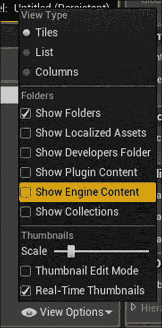

浏览到**引擎内容**，然后**基本形状**以查看我们将在此配方中使用的**立方体**。


## 怎么做...

1.  将下面的代码添加到您的类的构造函数中:

    ```cpp
    auto MeshAsset = ConstructorHelpers::FObjectFinder<UStaticMesh>(TEXT("StaticMesh'/Engine/BasicShapes/Cube.Cube'"));
    if (MeshAsset.Object != nullptr)
    {
      Mesh->SetStaticMesh(MeshAsset.Object);
    }
    ```

2.  编译，并在编辑器中验证您的类的实例现在具有网格作为其视觉表示。

## 它是如何工作的...

*   我们创建一个`FObjectFinder`类的实例，传递我们试图作为模板参数加载的资产类型。
*   `FObjectFinder`是帮助我们加载资产的类模板。当我们构造它时，我们传入一个字符串，其中包含我们试图加载的资产的路径。
*   字符串的格式为`"{ObjectType}'/Path/To/Asset.Asset'"`。注意在字符串中使用单引号。
*   In order to get the string for an asset that already exists in the editor, you can right-click on the asset in the **Content Browser** and select **Copy Reference**. This gives you the string so you can paste it into your code.

    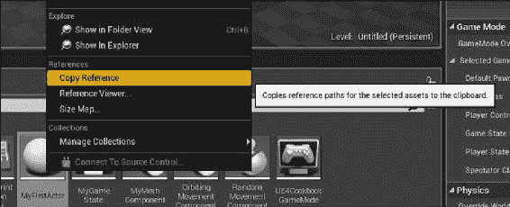

*   我们使用 C++ 11 中的`auto`关键字来避免在声明中输入我们的整个对象类型; 编译器为我们推导它。如果没有`auto`，我们将不得不使用以下代码:

    ```cpp
    ConstructorHelpers::FObjectFinder<UStaticMesh> MeshAsset = ConstructorHelpers::FObjectFinder<UStaticMesh>(TEXT("StaticMesh'/Engine/BasicShapes/Cube.Cube'"));
    ```

*   `FObjectFinder`类具有一个名为`Object`的属性，该属性将具有指向所需资产的指针，或者如果找不到资产，则为`NU``LL`。
*   这意味着我们可以对照`nullptr`检查它，如果它不是 null，则使用`SetStaticMesh`将其分配给`Mesh`。

# 通过继承实现 Actor 功能

继承是实现自定义`Actor`的第二种方式。这通常是为了制作一个新的子类，它将成员变量、函数或组件添加到现有的`Actor`类中。在这个食谱中，我们将在自定义`GameState`子类中添加一个变量。

## 怎么做...

1.  在虚幻编辑器中，在**内容浏览器**中点击**添加新**，然后在**新增 C 类...**然后选择**GameState**作为基类，然后给你的新类起一个名字。
2.  在新的类头中添加以下代码:

    ```cpp
    AMyGameState(); 

    UFUNCTION()
    void SetScore(int32 NewScore);

    UFUNCTION()
    int32 GetScore();
    private:
    UPROPERTY()
    int32 CurrentScore;
    ```

3.  在 cpp 文件中添加以下代码:

    ```cpp
    AMyGameState::AMyGameState()
    {
      CurrentScore = 0;
    }

    int32 AMyGameState::GetScore()
    {
      return CurrentScore;
    }

    void AMyGameState::SetScore(int32 NewScore)
    {
      CurrentScore = NewScore;
    }
    ```

4.  确认您的代码看起来像下面的清单，并使用虚幻编辑器中的**编译**按钮进行编译:

    ```cpp
    MyGameState.h
    #pragma once

    #include "GameFramework/GameState.h"
    #include "MyGameState.generated.h"

    /**
    *
    */
    UCLASS()
    class UE4COOKBOOK_API AMyGameState : public AGameState
    {
      GENERATED_BODY()
      public:
      AMyGameState();

      UPROPERTY()
      int32 CurrentScore;

      UFUNCTION()
      int32 GetScore();

      UFUNCTION()
      void SetScore(uint32 NewScore);
    };
    MyGameState.cpp
    #include "UE4Cookbook.h"
    #include "MyGameState.h"

    AMyGameState::AMyGameState()
    {
      CurrentScore = 0;
    }

    int32 AMyGameState::GetScore()
    {
      return CurrentScore;
    }

    void AMyGameState::SetScore(uint32 NewScore)
    {
      CurrentScore = NewScore;
    }
    ```

## 它是如何工作的...

1.  首先，我们添加的声明一个默认构造函数:

    ```cpp
    AMyGameState();
    ```

2.  这使我们可以在对象初始化时将新成员变量设置为安全默认值`0`:

    ```cpp
    AMyGameState::AMyGameState()
    {
      CurrentScore = 0;
    }
    ```

3.  在声明新变量时，我们使用`int32`类型，以确保虚幻引擎支持的各种编译器之间的可移植性。此变量将负责在运行时存储当前游戏分数。与往常一样，我们将使用`UPROPERTY`标记变量，以便对其进行适当的垃圾收集。此变量标记为`private`，因此更改值的唯一方法是通过我们的函数:

    ```cpp
    UPROPERTY()
    int32 CurrentScore;
    ```

4.  `GetScore`函数将检索当前分数，并将其返回给调用者。它被实现为一个简单的访问器，它只返回基础成员变量。
5.  第二个函数`SetScore`设置成员变量的值，允许外部对象请求更改分数。将此请求作为函数放置，可确保`GameState`可以审核此类请求，并且仅在有效时才允许它们，以防止作弊。这种检查的细节超出了本食谱的范围，但`SetScore`功能是制作它的适当位置。
6.  出于多种原因，我们的 score 函数是使用`UFUNCTION`宏声明的。首先，具有一些附加代码的`UFUNCTION`可以被 Blueprint 调用或重写。其次，`UFUNCTION`可以标记为`exec—`，这意味着它们可以在播放会话期间由播放器或开发人员作为控制台命令运行，从而可以进行调试。

## 另见

*   [第 8 章](08.html#318PC1-c0ca69a0411046888a488e5085138121 "Chapter 8\. Integrating C++ and the Unreal Editor")，*集成 C 和虚幻编辑器，*有一个配方，*创建新的控制台命令*，有关`exec`和控制台命令功能的更多信息，您可以参考

# 附加组件以创建层次结构

当从组件创建自定义 actor 时，重要的是要考虑**附加**的概念。将组件附加在一起会产生一种关系，其中应用于父组件的转换也会影响附加到它的组件。

## 怎么做...

1.  使用编辑器基于`Actor`创建一个新类，并将其称为`HierarchyActor`。
2.  将以下属性添加到您的新类中:

    ```cpp
    UPROPERTY()
    USceneComponent* Root;
    UPROPERTY()
    USceneComponent* ChildSceneComponent;
    UPROPERTY()
    UStaticMeshComponent* BoxOne;
    UPROPERTY()
    UStaticMeshComponent* BoxTwo;
    ```

3.  在类构造函数中添加以下代码:

    ```cpp
    Root = CreateDefaultSubobject<USceneComponent>("Root");
    ChildSceneComponent = CreateDefaultSubobject<USceneComponent>("ChildSceneComponent");
    BoxOne = CreateDefaultSubobject<UStaticMeshComponent>("BoxOne");
    BoxTwo = CreateDefaultSubobject<UStaticMeshComponent>("BoxTwo");

    auto MeshAsset = ConstructorHelpers::FObjectFinder<UStaticMesh>(TEXT("StaticMesh'/Engine/BasicShapes/Cube.Cube'"));
    if (MeshAsset.Object != nullptr)
    {
      BoxOne->SetStaticMesh(MeshAsset.Object);
      BoxTwo->SetStaticMesh(MeshAsset.Object);
    }
    RootComponent = Root;
    BoxOne->AttachTo(Root);
    BoxTwo->AttachTo(ChildSceneComponent);
    ChildSceneComponent->AttachTo(Root);
    ChildSceneComponent->SetRelativeTransform(FTransform(FRotator(0, 0, 0), FVector(250, 0, 0), FVector(0.1f)));
    ```

4.  验证您的代码如下所示:

    ```cpp
    HierarchyActor.h
    #pragma once

    #include "GameFramework/Actor.h"
    #include "HierarchyActor.generated.h"

    UCLASS()
    class UE4COOKBOOK_API AHierarchyActor : public AActor
    {
      GENERATED_BODY()
      public:
      AHierarchyActor();
      virtual void BeginPlay() override;
      virtual void Tick( float DeltaSeconds ) override;
      UPROPERTY()
      USceneComponent* Root;
      UPROPERTY()
      USceneComponent* ChildSceneComponent;
      UPROPERTY()
      UStaticMeshComponent* BoxOne;
      UPROPERTY()
      UStaticMeshComponent* BoxTwo;
    };
    HierarchyActor.cpp

    #include "UE4Cookbook.h"
    #include "HierarchyActor.h"

    AHierarchyActor::AHierarchyActor()
    {
      PrimaryActorTick.bCanEverTick = true;
      Root = CreateDefaultSubobject<USceneComponent>("Root");
      ChildSceneComponent = CreateDefaultSubobject<USceneComponent>("ChildSceneComponent");
      BoxOne = CreateDefaultSubobject<UStaticMeshComponent>("BoxOne");
      BoxTwo = CreateDefaultSubobject<UStaticMeshComponent>("BoxTwo");
      auto MeshAsset = ConstructorHelpers::FObjectFinder<UStaticMesh>(TEXT("StaticMesh'/Engine/BasicShapes/Cube.Cube'"));
      if (MeshAsset.Object != nullptr)
      {
        BoxOne->SetStaticMesh(MeshAsset.Object);
        BoxOne->SetCollisionProfileName(UCollisionProfile::Pawn_ProfileName);
        BoxTwo->SetStaticMesh(MeshAsset.Object);
        BoxTwo->SetCollisionProfileName(UCollisionProfile::Pawn_ProfileName);	
      }
      RootComponent = Root;
      BoxOne->AttachTo(Root);
      BoxTwo->AttachTo(ChildSceneComponent);
      ChildSceneComponent->AttachTo(Root);
      ChildSceneComponent->SetRelativeTransform(FTransform(FRotator(0, 0, 0), FVector(250, 0, 0), FVector(0.1f)));
    }
    void AHierarchyActor::BeginPlay()
    {
      Super::BeginPlay();
    }
    void AHierarchyActor::Tick( float DeltaTime )
    {
      Super::Tick( DeltaTime );
    }
    ```

5.  Compile and launch the editor. Drag a copy of HierarchyActor into the scene.

    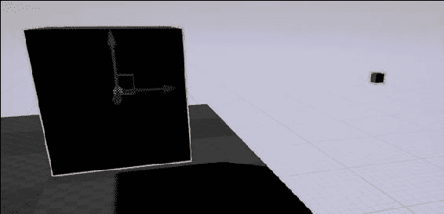

6.  Verify that `Actor` has components in a hierarchy, and that the second box has a smaller size.

    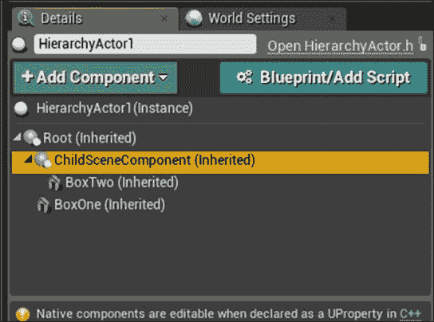

## 它是如何工作的...

1.  像往常一样，我们为演员创建一些带有`UPROPERTY`标签的组件。我们创建两个场景组件和两个静态网格组件。
2.  在构造函数中，我们像往常一样为每个组件创建默认的子对象。
3.  然后我们加载静态网格，如果加载成功，则将其分配给两个静态网格组件，以便它们具有视觉表示。
4.  然后，我们通过附加组件在我们的`Actor`中构造一个层次结构。
5.  我们将第一个场景组件设置为`Actor`根。此组件将确定应用于层次结构中所有其他组件的转换。
6.  然后，我们将第一个框附加到新的根组件，并将第二个场景组件附加到第一个。
7.  我们将第二个框附加到我们的子场景组件上，以演示更改该场景组件上的变换如何影响其子场景，但对象中没有其他组件。
8.  最后，我们设置该场景组件的相对变换，使其远离原点移动一定距离，并且 10 分之 1 比例。
9.  这意味着在编辑器中，您可以看到`BoxTwo`组件继承了其父组件`ChildSceneComponent`的转换和缩放。

# 创建自定义 Actor 组件

Actor 组件是实现应在 Actor 之间共享的通用功能的一种简单方法。Actor 组件不会呈现，但仍可以执行操作，例如订阅事件或与 Actor 中存在的其他组件进行通信。

## 怎么做...

1.  使用编辑器向导创建一个名为`RandomMovementComponent`的`ActorComponent`。在`UCLASS`宏中添加以下类说明符:

    ```cpp
    UCLASS( ClassGroup=(Custom), meta=(BlueprintSpawnableComponent) )
    ```

2.  在类标头中添加以下`UPROPERTY`:

    ```cpp
    UPROPERTY()
    float MovementRadius;
    ```

3.  在构造函数的实现中添加以下内容:

    ```cpp
    MovementRadius = 0;
    ```

4.  最后，将其添加到`TickComponent( )`的实现中:

    ```cpp
    AActor* Parent = GetOwner();
    if (Parent)
    {
      Parent->SetActorLocation(
      Parent->GetActorLocation() +
      FVector(
      FMath::FRandRange(-1, 1)* MovementRadius,
      FMath::FRandRange(-1, 1)* MovementRadius,
      FMath::FRandRange(-1, 1)* MovementRadius));
    }
    ```

5.  验证您的代码如下所示:

    ```cpp
    #pragma once
    #include "Components/ActorComponent.h"
    #include "RandomMovementComponent.generated.h"
    UCLASS( ClassGroup=(Custom), meta=(BlueprintSpawnableComponent) )
    class UE4COOKBOOK_API URandomMovementComponent : public UActorComponent
    {
      GENERATED_BODY()
      public:
      URandomMovementComponent();
      virtual void BeginPlay() override;
      virtual void TickComponent( float DeltaTime, ELevelTick TickType, FActorComponentTickFunction* ThisTickFunction ) override;
      UPROPERTY()
      float MovementRadius;
    };

    #include "UE4Cookbook.h"
    #include "RandomMovementComponent.h"
    URandomMovementComponent::URandomMovementComponent()
    {
      bWantsBeginPlay = true;
      PrimaryComponentTick.bCanEverTick = true;
      MovementRadius = 5;
    }

    void URandomMovementComponent::BeginPlay()
    {
      Super::BeginPlay();
    }

    void URandomMovementComponent::TickComponent( float DeltaTime, ELevelTick TickType, FActorComponentTickFunction* ThisTickFunction )
    {
      Super::TickComponent( DeltaTime, TickType, ThisTickFunction );
      AActor* Parent = GetOwner();
      if (Parent)
      {
        Parent->SetActorLocation(
        Parent->GetActorLocation() +
        FVector(
        FMath::FRandRange(-1, 1)* MovementRadius,
        FMath::FRandRange(-1, 1)* MovementRadius,
        FMath::FRandRange(-1, 1)* MovementRadius));
      }
    }
    ```

6.  Compile your project. In the editor, create an empty `Actor`, and add your **Random Movement** Component to it. To do this, drag an **Empty Actor** from the **Placement** tab out into the level, then click on **Add Component** in the **Details** panel, and select **Random Movement**. Do the same thing to add a **Cube** Component so that you have something to visualize your actor's position with.

    

    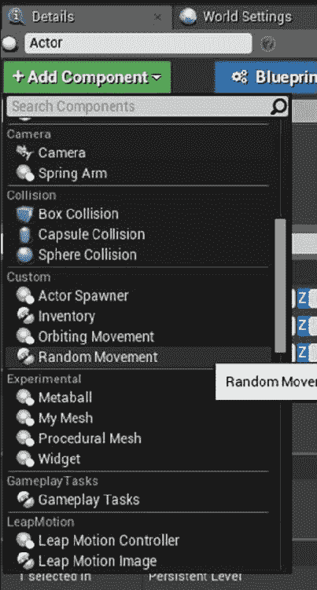

7.  播放你的级别，观察演员在每次调用`TickComponent`函数时，随着其位置的变化而随机移动。

## 它是如何工作的...

1.  首先，我们在组件声明中使用的`UCLASS`宏中添加了一些说明符。将`BlueprintSpawnableComponent`添加到类的元值意味着可以将组件的实例添加到编辑器中的蓝图类。`ClassGroup`说明符允许我们在类列表中指示我们的组件属于什么类:

    ```cpp
    UCLASS( ClassGroup=(Custom), meta=(BlueprintSpawnableComponent) )
    ```

2.  将`MovementRadius`作为属性添加到新组件中，使我们可以指定允许组件在单个帧中徘徊的距离:

    ```cpp
    UPROPERTY()
    float MovementRadius;
    ```

3.  在构造函数中，我们将此属性初始化为安全默认值:

    ```cpp
    MovementRadius =5;
    ```

4.  `TickComponent`是一个被引擎调用每一帧的函数，就像`Tick`是针对演员的。在其实现中，我们检索组件所有者的当前位置，即包含我们组件的`Actor`，并且我们在世界空间中生成一个偏移量:

    ```cpp
    AActor* Parent = GetOwner();
    if (Parent)
    {
      Parent->SetActorLocation(
      Parent->GetActorLocation() +
      FVector(
      FMath::FRandRange(-1, 1)* MovementRadius,
      FMath::FRandRange(-1, 1)* MovementRadius,
      FMath::FRandRange(-1, 1)* MovementRadius)
      );
    }
    ```

5.  我们将随机偏移量添加到当前位置以确定新位置，并将拥有的演员移至该位置。这会导致演员的位置在帧之间随机变化并跳舞。

# 创建自定义场景组件

`Scene`组件是具有变换 (即相对位置、旋转和缩放) 的`Actor`组件的子类。就像`Actor`组件一样，`Scene`组件本身不会渲染，但可以将它们的变换用于各种事物，例如在与`Actor`的固定偏移量处生成其他对象。

## 怎么做...

1.  创建一个名为`ActorSpawnerComponent`的自定义`SceneComponent`。对标题进行以下更改:

    ```cpp
    UFUNCTION()
    void Spawn();
    UPROPERTY()
    TSubclassOf<AActor> ActorToSpawn;
    ```

2.  在 cpp 文件中添加以下功能实现:

    ```cpp
    void UActorSpawnerComponent::Spawn()
    {
      UWorld* TheWorld = GetWorld();
      if (TheWorld != nullptr)
      {
        FTransform ComponentTransform(this->GetComponentTransform());
        TheWorld->SpawnActor(ActorToSpawn,&ComponentTransform);
      }
    }
    ```

3.  根据此代码段验证您的代码:

    ```cpp
    ActorSpawnerComponent.h
    #pragma once

    #include "Components/SceneComponent.h"
    #include "ActorSpawnerComponent.generated.h"

    UCLASS( ClassGroup=(Custom), meta=(BlueprintSpawnableComponent) )
    class UE4COOKBOOK_API UActorSpawnerComponent : public USceneComponent
    {
      GENERATED_BODY()

      public:
      UActorSpawnerComponent();

      virtual void BeginPlay() override;

      virtual void TickComponent( float DeltaTime, ELevelTick TickType, FActorComponentTickFunction* ThisTickFunction ) override;

      UFUNCTION(BlueprintCallable, Category=Cookbook)
      void Spawn();

      UPROPERTY(EditAnywhere)
      TSubclassOf<AActor> ActorToSpawn;

    };
    ActorSpawnerComponent.cpp
    #include "UE4Cookbook.h"
    #include "ActorSpawnerComponent.h"

    UActorSpawnerComponent::UActorSpawnerComponent()
    {
      bWantsBeginPlay = true;
      PrimaryComponentTick.bCanEverTick = true;
    }

    void UActorSpawnerComponent::BeginPlay()
    {
      Super::BeginPlay();
    }

    void UActorSpawnerComponent::TickComponent( float DeltaTime, ELevelTick TickType, FActorComponentTickFunction* ThisTickFunction )
    {
      Super::TickComponent( DeltaTime, TickType, ThisTickFunction );
    }

    void UActorSpawnerComponent::Spawn()
    {
      UWorld* TheWorld = GetWorld();
      if (TheWorld != nullptr)
      {
        FTransform ComponentTransform(this->GetComponentTransform());
        TheWorld->SpawnActor(ActorToSpawn,&ComponentTransform);
      }
    }
    ```

4.  编译并打开你的项目。将空的`Actor`拖到场景中，并将您的`ActorSpawnerComponent`添加到场景中。在`Details`面板中选择您的新组件，并为`ActorToSpawn`赋值。现在，每当在组件的实例上调用`Spawn()`时，它将实例化在`ActorToSpawn`中指定的`Actor`类的副本。

## 它是如何工作的...

1.  We create the `Spawn UFUNCTION` and a variable called `ActorToSpawn`. The `ActorToSpawn` `UPROPERTY` is of type `TSubclassOf< >`, a template type that allows us to restrict a pointer to either a base class or subclasses thereof. This also means that within the editor, we will get a pre-filtered list of classes to pick from, preventing us from accidentally assigning an invalid value.

    

2.  在`Spawn`函数的实现中，我们可以访问我们的世界，并检查它的有效性。
3.  `SpawnActor`想要一个`FTransform*`来指定生成新 actor 的位置，因此我们创建一个新的堆栈变量来包含当前组件的转换的副本。
4.  如果`TheWorld`有效，我们请求它生成一个指定的子类的实例，传递我们刚刚创建的`FTransform`的地址，该地址现在包含新 actor 的所需位置。

## 另见

*   [第 8 章](08.html#318PC1-c0ca69a0411046888a488e5085138121 "Chapter 8\. Integrating C++ and the Unreal Editor")，*集成了 C 和虚幻编辑器，*包含了关于如何使事物具有蓝图可访问性的更详细的调查。

# 创建自定义原语组件

`Primitive`组件是最复杂的类型的`Actor`组件，因为它们不仅具有变换，而且还在屏幕上呈现。

## 怎么做...

1.  基于`MeshComponent`创建自定义 C 类。当 Visual Studio 加载时，将以下内容添加到您的类头文件中:

    ```cpp
    UCLASS(ClassGroup=Experimental, meta = (BlueprintSpawnableComponent))
    public:
    virtual FPrimitiveSceneProxy* CreateSceneProxy() override;
    TArray<int32> Indices;
    TArray<FVector> Vertices;
    UPROPERTY(EditAnywhere, BlueprintReadWrite, Category = Materials)
    UMaterial* TheMaterial;
    ```

2.  我们需要为 cpp 文件中的重写`CreateSceneProxy`函数创建一个实现:

    ```cpp
    FPrimitiveSceneProxy* UMyMeshComponent::CreateSceneProxy()
    {
      FPrimitiveSceneProxy* Proxy = NULL;
      Proxy = new FMySceneProxy(this);
      return Proxy;
    }
    ```

3.  这个函数返回一个实例`FMySceneProxy`，我们需要实现。通过在`CreateSceneProxy`函数上方添加以下代码来做到这一点:

    ```cpp
    class FMySceneProxy : public FPrimitiveSceneProxy
    {
      public:
      FMySceneProxy(UMyMeshComponent* Component)
      :FPrimitiveSceneProxy(Component),
      Indices(Component->Indices),
      TheMaterial(Component->TheMaterial)
      {
        VertexBuffer = FMyVertexBuffer();
        IndexBuffer = FMyIndexBuffer();
        for (FVector Vertex : Component->Vertices)
        {
          Vertices.Add(FDynamicMeshVertex(Vertex));
        }
      };
      UPROPERTY()
      UMaterial* TheMaterial;
      virtual FPrimitiveViewRelevance GetViewRelevance(const FSceneView* View)  const override
      {
        FPrimitiveViewRelevance Result;
        Result.bDynamicRelevance = true;
        Result.bDrawRelevance = true;
        Result.bNormalTranslucencyRelevance = true;
        return Result;
      }
      virtual void GetDynamicMeshElements(const TArray<const FSceneView*>& Views, const FSceneViewFamily& ViewFamily, uint32 VisibilityMap, FMeshElementCollector& Collector) const override
      {
        for (int32 ViewIndex = 0; ViewIndex < Views.Num(); ViewIndex++)
        {
          FDynamicMeshBuilder MeshBuilder;
          if (Vertices.Num() == 0)
          {
            return;
          }
          MeshBuilder.AddVertices(Vertices);
          MeshBuilder.AddTriangles(Indices);
          MeshBuilder.GetMesh(FMatrix::Identity, new FColoredMaterialRenderProxy(TheMaterial->GetRenderProxy(false), FLinearColor::Gray), GetDepthPriorityGroup(Views[ViewIndex]), true, true, ViewIndex, Collector);
        }
      }
      uint32 FMySceneProxy::GetMemoryFootprint(void) const override
      {
        return sizeof(*this);
      }
      virtual ~FMySceneProxy() {};
      private:
      TArray<FDynamicMeshVertex> Vertices;
      TArray<int32> Indices;
      FMyVertexBuffer VertexBuffer;
      FMyIndexBuffer IndexBuffer;
    };
    ```

4.  我们的场景代理需要一个顶点缓冲区和一个索引缓冲区。应将以下子类放在场景代理的实现上方:

    ```cpp
    class FMyVertexBuffer : public FVertexBuffer
    {
      public:
      TArray<FVector> Vertices;
      virtual void InitRHI() override
      {
        FRHIResourceCreateInfo CreateInfo;
        VertexBufferRHI = RHICreateVertexBuffer(Vertices.Num() * sizeof(FVector), BUF_Static, CreateInfo);
        void* VertexBufferData = RHILockVertexBuffer(VertexBufferRHI, 0, Vertices.Num() * sizeof(FVector), RLM_WriteOnly);
        FMemory::Memcpy(VertexBufferData, Vertices.GetData(), Vertices.Num() * sizeof(FVector));
        RHIUnlockVertexBuffer(VertexBufferRHI);
      }
    };
    class FMyIndexBuffer : public FIndexBuffer
    {
      public:
      TArray<int32> Indices;
      virtual void InitRHI() override
      {
        FRHIResourceCreateInfo CreateInfo;
        IndexBufferRHI = RHICreateIndexBuffer(sizeof(int32), Indices.Num() * sizeof(int32), BUF_Static, CreateInfo);
        void* Buffer = RHILockIndexBuffer(IndexBufferRHI, 0, Indices.Num() * sizeof(int32), RLM_WriteOnly);
        FMemory::Memcpy(Buffer, Indices.GetData(), Indices.Num() * sizeof(int32));
        RHIUnlockIndexBuffer(IndexBufferRHI);
      }
    };
    ```

5.  添加以下构造函数实现:

    ```cpp
    UMyMeshComponent::UMyMeshComponent()
    {
      static ConstructorHelpers::FObjectFinder<UMaterial> Material(TEXT("Material'/Engine/BasicShapes/BasicShapeMaterial'"));
      if (Material.Object != NULL)
      {
        TheMaterial = (UMaterial*)Material.Object;
      }
      Vertices.Add(FVector(10, 0, 0));
      Vertices.Add(FVector(0, 10, 0));
      Vertices.Add(FVector(0, 0, 10));
      Indices.Add(0);
      Indices.Add(1);
      Indices.Add(2);
    }
    ```

6.  验证您的代码如下所示:

    ```cpp
    #pragma once

    #include "Components/MeshComponent.h"
    #include "MyMeshComponent.generated.h"

    UCLASS(ClassGroup = Experimental, meta = (BlueprintSpawnableComponent))
    class UE4COOKBOOK_API UMyMeshComponent : public UMeshComponent
    {
      GENERATED_BODY()
      public:
      virtual FPrimitiveSceneProxy* CreateSceneProxy() override;
      TArray<int32> Indices;
      TArray<FVector> Vertices;

      UPROPERTY(EditAnywhere, BlueprintReadWrite, Category = Materials)
      UMaterial* TheMaterial;
      UMyMeshComponent();
    };

    #include "UE4Cookbook.h"
    #include "MyMeshComponent.h"
    #include <VertexFactory.h>
    #include "DynamicMeshBuilder.h"

    class FMyVertexBuffer : public FVertexBuffer
    {
      public:
      TArray<FVector> Vertices;

      virtual void InitRHI() override
      {
        FRHIResourceCreateInfo CreateInfo;
        VertexBufferRHI = RHICreateVertexBuffer(Vertices.Num() * sizeof(FVector), BUF_Static, CreateInfo);

        void* VertexBufferData = RHILockVertexBuffer(VertexBufferRHI, 0, Vertices.Num() * sizeof(FVector), RLM_WriteOnly);
        FMemory::Memcpy(VertexBufferData, Vertices.GetData(), Vertices.Num() * sizeof(FVector));
        RHIUnlockVertexBuffer(VertexBufferRHI);
      }
    };

    class FMyIndexBuffer : public FIndexBuffer
    {
      public:
      TArray<int32> Indices;

      virtual void InitRHI() override
      {
        FRHIResourceCreateInfo CreateInfo;
        IndexBufferRHI = RHICreateIndexBuffer(sizeof(int32), Indices.Num() * sizeof(int32), BUF_Static, CreateInfo);

        void* Buffer = RHILockIndexBuffer(IndexBufferRHI, 0, Indices.Num() * sizeof(int32), RLM_WriteOnly);
        FMemory::Memcpy(Buffer, Indices.GetData(), Indices.Num() * sizeof(int32));
        RHIUnlockIndexBuffer(IndexBufferRHI);
      }
    };
    class FMySceneProxy : public FPrimitiveSceneProxy
    {
      public:
      FMySceneProxy(UMyMeshComponent* Component)
      :FPrimitiveSceneProxy(Component),
      Indices(Component->Indices),
      TheMaterial(Component->TheMaterial)
      {
        VertexBuffer = FMyVertexBuffer();
        IndexBuffer = FMyIndexBuffer();

        for (FVector Vertex : Component->Vertices)
        {
          Vertices.Add(FDynamicMeshVertex(Component->GetComponentLocation() + Vertex));
        }
      };

    UPROPERTY()
      UMaterial* TheMaterial;

      virtual FPrimitiveViewRelevance GetViewRelevance(const FSceneView* View)  const override
      {
        FPrimitiveViewRelevance Result;
        Result.bDynamicRelevance = true;
        Result.bDrawRelevance = true;
        Result.bNormalTranslucencyRelevance = true;
        return Result;
      }

      virtual void GetDynamicMeshElements(const TArray<const FSceneView*>& Views, const FSceneViewFamily& ViewFamily, uint32 VisibilityMap, FMeshElementCollector& Collector) const override
      {
        for (int32 ViewIndex = 0; ViewIndex < Views.Num(); ViewIndex++)
        {
          FDynamicMeshBuilder MeshBuilder;
          if (Vertices.Num() == 0)
          {
            return;
          }
          MeshBuilder.AddVertices(Vertices);
          MeshBuilder.AddTriangles(Indices);

          MeshBuilder.GetMesh(FMatrix::Identity, new FColoredMaterialRenderProxy(TheMaterial->GetRenderProxy(false), FLinearColor::Gray), GetDepthPriorityGroup(Views[ViewIndex]), true, true, ViewIndex, Collector);

        }
      }

      void FMySceneProxy::OnActorPositionChanged() override
      {
        VertexBuffer.ReleaseResource();
        IndexBuffer.ReleaseResource();
      }

      uint32 FMySceneProxy::GetMemoryFootprint(void) const override
      {
        return sizeof(*this);
      }
      virtual ~FMySceneProxy() {};
      private:
      TArray<FDynamicMeshVertex> Vertices;
      TArray<int32> Indices;
      FMyVertexBuffer VertexBuffer;
      FMyIndexBuffer IndexBuffer;
    };

    FPrimitiveSceneProxy* UMyMeshComponent::CreateSceneProxy()
    {
      FPrimitiveSceneProxy* Proxy = NULL;
      Proxy = new FMySceneProxy(this);
      return Proxy;
    }

    UMyMeshComponent::UMyMeshComponent()
    {
      static ConstructorHelpers::FObjectFinder<UMaterial> Material(TEXT("Material'/Engine/BasicShapes/BasicShapeMaterial'"));

      if (Material.Object != NULL)
      {
        TheMaterial = (UMaterial*)Material.Object;
      }
      Vertices.Add(FVector(10, 0, 0));
      Vertices.Add(FVector(0, 10, 0));
      Vertices.Add(FVector(0, 0, 10));
      Indices.Add(0);
      Indices.Add(1);
      Indices.Add(2);
    }
    ```

7.  Create an empty `Actor` in the editor and add the new mesh component to it to see that your triangle is rendered. Experiment by changing the values added with Vertices. Add and see how the geometry changes after a recompile.

    

## 它是如何工作的...

1.  在中，要呈现一个`Actor`，描述它的数据需要被呈现线程访问。
2.  最简单的方法是使用场景代理-在渲染线程上创建的代理对象，旨在为数据传输提供线程安全性。
3.  `PrimitiveComponent`类定义一个返回`FPrimitiveSceneProxy*`的`CreateSceneProxy`函数。这个函数允许像我们这样的自定义组件返回基于`FPrimitiveSceneProxy`的对象，利用多态性。
4.  我们定义`SceneProxy`对象的构造函数，以获取组件的实例，以便每个创建的`SceneProxy`都知道与之关联的组件实例。
5.  然后将该数据缓存在场景代理中，并使用`GetDynamicMeshElements`传递给渲染器。
6.  我们创建了一个`IndexBuffer`和一个`VertexBuffer`。我们创建的每个缓冲区类都是帮助场景代理为两个缓冲区分配平台特定内存的助手。他们在`InitRHI` (也称为 Initialize Render Hardware Interface) 函数中这样做，其中他们使用来自 RHI API 的函数来创建顶点缓冲区，锁定它，复制所需的数据，然后解锁它。
7.  在组件的构造函数中，我们寻找一个用`ObjectFinder`模板内置到引擎中的材质资产，以便我们的网格将具有材质。
8.  然后，我们将一些顶点和索引添加到我们的缓冲区中，以便在渲染器请求场景代理时可以绘制网格。

# 为 RPG 创建库存组件

`InventoryComponent`使其包含的`Actor`能够将`InventoryActors`存储在其库存中，并将其放回游戏世界中。

## 准备就绪

确保你已经按照*轴映射-键盘，鼠标和游戏手柄方向输入 FPS 字符*配方在[第 6 章](06.html#2BASE1-c0ca69a0411046888a488e5085138121 "Chapter 6\. Input and Collision")，*输入和碰撞，*之前继续这个配方，因为它向您展示了如何创建一个简单的角色。

此外，本章中使用 SpawnActor 实例化 Actor 的配方*向您展示了如何创建自定义`GameMode`。*

## 怎么做...

1.  使用名为`InventoryComponent`的引擎创建一个`ActorComponent`子类，然后向其中添加以下代码:

    ```cpp
    UPROPERTY()
    TArray<AInventoryActor*> CurrentInventory;
    UFUNCTION()
    int32 AddToInventory(AInventoryActor* ActorToAdd);

    UFUNCTION()
    void RemoveFromInventory(AInventoryActor* ActorToRemove);
    ```

2.  在源文件中添加以下函数实现:

    ```cpp
    int32 UInventoryComponent::AddToInventory(AInventoryActor* ActorToAdd)
    {
      return CurrentInventory.Add(ActorToAdd);
    }

    void UInventoryComponent::RemoveFromInventory(AInventoryActor* ActorToRemove)
    {
      CurrentInventory.Remove(ActorToRemove);
    }
    ```

3.  接下来，创建一个新的`StaticMeshActor`子类，称为`InventoryActor`。在其声明中添加以下内容:

    ```cpp
    virtual void PickUp();
    virtual void PutDown(FTransform TargetLocation);
    ```

4.  实现文件中的新功能:

    ```cpp
    void AInventoryActor::PickUp()
    {
      SetActorTickEnabled(false);
      SetActorHiddenInGame(true);
      SetActorEnableCollision(false);
    }

    void AInventoryActor::PutDown(FTransform TargetLocation)
    {
      SetActorTickEnabled(true);
      SetActorHiddenInGame(false);
      SetActorEnableCollision(true);
      SetActorLocation(TargetLocation.GetLocation());
    }
    ```

5.  另外，将构造函数更改为如下所示:

    ```cpp
    AInventoryActor::AInventoryActor()
    :Super()
    {
      PrimaryActorTick.bCanEverTick = true;
      auto MeshAsset = ConstructorHelpers::FObjectFinder<UStaticMesh>(TEXT("StaticMesh'/Engine/BasicShapes/Cube.Cube'"));
      if (MeshAsset.Object != nullptr)
      {
        GetStaticMeshComponent()->SetStaticMesh(MeshAsset.Object);
        GetStaticMeshComponent()->SetCollisionProfileName(UCollisionProfile::Pawn_ProfileName);
      }
      GetStaticMeshComponent()->SetMobility(EComponentMobility::Movable);
      SetActorEnableCollision(true);
    }
    ```

6.  我们需要在我们的角色中添加一个`InventoryComponent`，这样我们就有了一个可以存储物品的库存。使用编辑器创建一个新的`SimpleCharacter`子类，并在其声明中添加以下内容:

    ```cpp
    UPROPERTY()
    UInventoryComponent* MyInventory;

    UFUNCTION()
    virtual void SetupPlayerInputComponent(class UInputComponent* InputComponent) override;

    UFUNCTION()
    void DropItem();
    UFUNCTION()
    void TakeItem(AInventoryActor* InventoryItem);

    UFUNCTION()
    virtual void NotifyHit(class UPrimitiveComponent* MyComp, AActor* Other, class UPrimitiveComponent* OtherComp, bool bSelfMoved, FVector HitLocation, FVector HitNormal, FVector NormalImpulse, const FHitResult& Hit) override;
    ```

7.  将该行添加到角色的构造函数实现:

    ```cpp
    MyInventory = CreateDefaultSubobject<UInventoryComponent>("MyInventory");
    ```

8.  将此代码添加到 overriden`SetupPlayerInputComponent`:

    ```cpp
    void AInventoryCharacter::SetupPlayerInputComponent(class UInputComponent* InputComponent)
    {
      Super::SetupPlayerInputComponent(InputComponent);
      InputComponent->BindAction("DropItem", EInputEvent::IE_Pressed, this, &AInventoryCharacter::DropItem);
    }
    ```

9.  最后，添加以下函数实现:

    ```cpp
    void AInventoryCharacter::DropItem()
    {
      if (MyInventory->CurrentInventory.Num() == 0)
      {
        return;
      }

      AInventoryActor* Item = MyInventory->CurrentInventory.Last();
      MyInventory->RemoveFromInventory(Item);
      FVector ItemOrigin;
      FVector ItemBounds;
      Item->GetActorBounds(false, ItemOrigin, ItemBounds);
      FTransform PutDownLocation = GetTransform() + FTransform(RootComponent->GetForwardVector() * ItemBounds.GetMax());
      Item->PutDown(PutDownLocation);
    }

    void AInventoryCharacter::NotifyHit(class UPrimitiveComponent* MyComp, AActor* Other, class UPrimitiveComponent* OtherComp, bool bSelfMoved, FVector HitLocation, FVector HitNormal, FVector NormalImpulse, const FHitResult& Hit)
    {
      AInventoryActor* InventoryItem = Cast<AInventoryActor>(Other);
      if (InventoryItem != nullptr)
      {
        TakeItem(InventoryItem);
      }
    }

    void AInventoryCharacter::TakeItem(AInventoryActor* InventoryItem)
    {
      InventoryItem->PickUp();
      MyInventory->AddToInventory(InventoryItem);
    }
    ```

10.  编译你的代码，并在编辑器中测试它。创建一个新的级别，并将几个实例`InventoryActor`拖出到您的场景中。
11.  如果需要提醒您如何覆盖当前游戏模式，请参考*使用 SpawnActor*方法实例化演员。从该配方将以下行添加到游戏模式的构造函数中，然后将等级的`GameMode`设置为您在该配方中创建的等级:

    ```cpp
    DefaultPawnClass = AInventoryCharacter::StaticClass();
    ```

12.  在编译和启动项目之前，请根据此处的列表验证您的代码。

    ```cpp
    #pragma once

    #include "GameFramework/Character.h"
    #include "InventoryComponent.h"
    #include "InventoryCharacter.generated.h"

    UCLASS()
    class UE4COOKBOOK_API AInventoryCharacter : public ACharacter
    {
      GENERATED_BODY()

      public:
      AInventoryCharacter();
      virtual void BeginPlay() override;
      virtual void Tick( float DeltaSeconds ) override;
      virtual void SetupPlayerInputComponent(class UInputComponent* InputComponent) override;

      UPROPERTY()
      UInventoryComponent* MyInventory;
      UPROPERTY()
      UCameraComponent* MainCamera;
      UFUNCTION()
      void TakeItem(AInventoryActor* InventoryItem);
      UFUNCTION()
      void DropItem();
      void MoveForward(float AxisValue);
      void MoveRight(float AxisValue);
      void PitchCamera(float AxisValue);
      void YawCamera(float AxisValue);

      UFUNCTION()
      virtual void NotifyHit(class UPrimitiveComponent* MyComp, AActor* Other, class UPrimitiveComponent* OtherComp, bool bSelfMoved, FVector HitLocation, FVector HitNormal, FVector NormalImpulse, const FHitResult& Hit) override;
      private:
      FVector MovementInput;
      FVector CameraInput;
    };

    #include "UE4Cookbook.h"
    #include "InventoryCharacter.h"

    AInventoryCharacter::AInventoryCharacter()
    :Super()
    {
      PrimaryActorTick.bCanEverTick = true;
      MyInventory = CreateDefaultSubobject<UInventoryComponent>("MyInventory");
      MainCamera = CreateDefaultSubobject<UCameraComponent>("MainCamera");
      MainCamera->bUsePawnControlRotation = 0;
    }

    void AInventoryCharacter::BeginPlay()
    {
      Super::BeginPlay();
      MainCamera->AttachTo(RootComponent);
    }

    void AInventoryCharacter::Tick( float DeltaTime )
    {
      Super::Tick( DeltaTime );
      if (!MovementInput.IsZero())
      {
        MovementInput *= 100;
        FVector InputVector = FVector(0,0,0);
        InputVector += GetActorForwardVector()* MovementInput.X * DeltaTime;
        InputVector += GetActorRightVector()* MovementInput.Y * DeltaTime;
        GetCharacterMovement()->AddInputVector(InputVector);
        GEngine->AddOnScreenDebugMessage(-1, 1, FColor::Red, FString::Printf(TEXT("x- %f, y - %f, z - %f"),InputVector.X, InputVector.Y, InputVector.Z));
      }

      if (!CameraInput.IsNearlyZero())
      {
        FRotator NewRotation = GetActorRotation();
        NewRotation.Pitch += CameraInput.Y;
        NewRotation.Yaw += CameraInput.X;
        APlayerController* MyPlayerController =Cast<APlayerController>(GetController());
        if (MyPlayerController != nullptr)
        {
          MyPlayerController->AddYawInput(CameraInput.X);
          MyPlayerController->AddPitchInput(CameraInput.Y);
        }
        SetActorRotation(NewRotation);
      }
    }
    void AInventoryCharacter::SetupPlayerInputComponent(class UInputComponent* InputComponent)
    {
      Super::SetupPlayerInputComponent(InputComponent);
      InputComponent->BindAxis("MoveForward", this, &AInventoryCharacter::MoveForward);
      InputComponent->BindAxis("MoveRight", this, &AInventoryCharacter::MoveRight);
      InputComponent->BindAxis("CameraPitch", this, &AInventoryCharacter::PitchCamera);
      InputComponent->BindAxis("CameraYaw", this, &AInventoryCharacter::YawCamera);
      InputComponent->BindAction("DropItem", EInputEvent::IE_Pressed, this, &AInventoryCharacter::DropItem);
    }
    void AInventoryCharacter::DropItem()
    {
      if (MyInventory->CurrentInventory.Num() == 0)
      {
        return;
      }
      AInventoryActor* Item = MyInventory->CurrentInventory.Last();
      MyInventory->RemoveFromInventory(Item);
      FVector ItemOrigin;
      FVector ItemBounds;
      Item->GetActorBounds(false, ItemOrigin, ItemBounds);
      FTransform PutDownLocation = GetTransform() + FTransform(RootComponent->GetForwardVector() * ItemBounds.GetMax());
      Item->PutDown(PutDownLocation);
    }

    void AInventoryCharacter::MoveForward(float AxisValue)
    {
      MovementInput.X = FMath::Clamp<float>(AxisValue, -1.0f, 1.0f);
    }

    void AInventoryCharacter::MoveRight(float AxisValue)
    {
      MovementInput.Y = FMath::Clamp<float>(AxisValue, -1.0f, 1.0f);
    }

    void AInventoryCharacter::PitchCamera(float AxisValue)
    {
      CameraInput.Y = AxisValue;
    }
    void AInventoryCharacter::YawCamera(float AxisValue)
    {
      CameraInput.X = AxisValue;
    }
    void AInventoryCharacter::NotifyHit(class UPrimitiveComponent* MyComp, AActor* Other, class UPrimitiveComponent* OtherComp, bool bSelfMoved, FVector HitLocation, FVector HitNormal, FVector NormalImpulse, const FHitResult& Hit)
    {
      AInventoryActor* InventoryItem = Cast<AInventoryActor>(Other);
      if (InventoryItem != nullptr)
      {
        TakeItem(InventoryItem);
      }
    }
    void AInventoryCharacter::TakeItem(AInventoryActor* InventoryItem)
    {
      InventoryItem->PickUp();
      MyInventory->AddToInventory(InventoryItem);
    }

    #pragma once

    #include "Components/ActorComponent.h"
    #include "InventoryActor.h"
    #include "InventoryComponent.generated.h"

    UCLASS( ClassGroup=(Custom), meta=(BlueprintSpawnableComponent))
    class UE4COOKBOOK_API UInventoryComponent : public UActorComponent
    {
      GENERATED_BODY()

      public:
      UInventoryComponent();
      virtual void TickComponent( float DeltaTime, ELevelTick TickType, FActorComponentTickFunction* ThisTickFunction ) override;

      UPROPERTY()
      TArray<AInventoryActor*> CurrentInventory;
      UFUNCTION()
      int32 AddToInventory(AInventoryActor* ActorToAdd);

      UFUNCTION()
      void RemoveFromInventory(AInventoryActor* ActorToRemove);
    };
    #include "UE4Cookbook.h"
    #include "InventoryComponent.h"

    UInventoryComponent::UInventoryComponent()
    {
      bWantsBeginPlay = true;
      PrimaryComponentTick.bCanEverTick = true;
    }
    void UInventoryComponent::TickComponent( float DeltaTime, ELevelTick TickType, FActorComponentTickFunction* ThisTickFunction )
    {
      Super::TickComponent( DeltaTime, TickType, ThisTickFunction );
    }

    int32 UInventoryComponent::AddToInventory(AInventoryActor* ActorToAdd)
    {
      return CurrentInventory.Add(ActorToAdd);
    }

    void UInventoryComponent::RemoveFromInventory(AInventoryActor* ActorToRemove)
    {
      CurrentInventory.Remove(ActorToRemove);
    }

    #pragma once

    #include "GameFramework/GameMode.h"
    #include "UE4CookbookGameMode.generated.h"

    UCLASS()
    class UE4COOKBOOK_API AUE4CookbookGameMode : public AGameMode
    {
      GENERATED_BODY()

      public:
      AUE4CookbookGameMode();
      };

    #include "UE4Cookbook.h"
    #include "MyGameState.h"
    #include "InventoryCharacter.h"
    #include "UE4CookbookGameMode.h"

    AUE4CookbookGameMode::AUE4CookbookGameMode()
    {
      DefaultPawnClass = AInventoryCharacter::StaticClass();
      GameStateClass = AMyGameState::StaticClass();
    }
    ```

13.  Lastly, we need to add our `InputAction` to the bindings in the editor. To do this, bring up the **Project Settings...** window by selecting **Edit** | **Project Settings...**:

    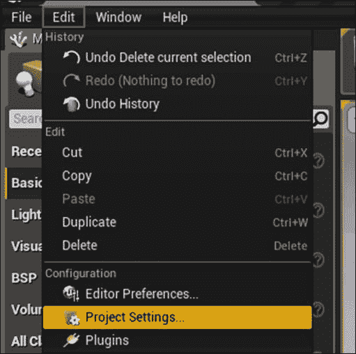

    然后，在左侧选择**Input**。选择**操作映射**旁边的加号，然后在出现的文本框中键入`DropItem`。它下面是您可以绑定到此操作的所有潜在键的列表。选择标记为`E`的一个。您的设置现在应该如下所示:

    

14.  然后我们可以点击播放，走过到我们的库存演员，它会被拿起。按*E*将演员放置在新的位置!使用多个库存参与者对此进行测试，以确保它们都被正确收集和放置。

## 它是如何工作的...

1.  我们的新组件包含一个 actor 数组，通过指针存储它们以及声明向数组添加或删除项目的函数。这些功能是围绕`TArray`添加/删除功能的简单包装，但允许我们可选地执行操作，例如在继续存储项目之前检查数组是否在指定的大小限制内。
2.  `InventoryActor`是一个基类，可以用于玩家可以拿走的所有物品。
3.  在`PickUp`功能中，我们需要在 actor 被拾取时禁用它。为此，我们必须执行以下操作:
    *   禁用演员滴答作响
    *   隐藏演员
    *   禁用碰撞
4.  我们使用函数`SetActorTickEnabled`、`SetActorHiddenInGame`和`SetActorEnableCollision`来执行此操作。
5.  `PutDown`函数是相反的。我们启用演员滴答，取消隐藏演员，然后将其碰撞重新打开，然后将演员运送到所需的位置。
6.  我们在我们的新角色中添加了一个`InventoryComponent`，以及一个取物品的功能。
7.  在角色的构造函数中，我们为我们的`InventoryComponent`创建了一个默认的子对象。
8.  我们还添加了一个`NotifyHit`覆盖，以便在角色击中其他演员时得到通知。
9.  在这个函数中，我们将另一个演员转换为`InventoryActor`。如果强制转换成功，那么我们知道我们的`Actor`是`InventoryActor`，因此我们可以调用`TakeItem`函数来接受它。
10.  在`TakeItem`功能中，我们通知库存项目参与者我们想要提取它，然后我们将其添加到我们的库存中。
11.  `InventoryCharacter`中的最后一块功能是`DropItem`函数。此功能检查我们的库存中是否有任何物品。如果它有任何物品，我们将其从库存中删除，然后我们计算玩家角色前面的安全距离，以使用物品边界删除物品以获得其最大边界框尺寸。
12.  然后，我们通知该物品我们将其放置在所需的位置。

## 另见

*   [第 5 章](05.html#22O7C1-c0ca69a0411046888a488e5085138121 "Chapter 5\. Handling Events and Delegates")，*处理事件和委托，*详细解释了事件和输入处理如何在引擎内协同工作，以及本食谱中提到的`SimpleCharacter`类的配方
*   [第 6 章](06.html#2BASE1-c0ca69a0411046888a488e5085138121 "Chapter 6\. Input and Collision")，*输入和碰撞，*也有关于输入动作和轴的绑定的食谱

# 创建轨道运动组件

该组件与`RotatingMovementComponent`类似，它的设计目的是使与其相关的组件以特定的方式移动。在这种情况下，它将以固定距离围绕固定点在轨道上移动任何连接的组件。

例如，这可以用于在**动作 RPG**中围绕角色运行的盾牌。

## 怎么做...

1.  创建一个新的`SceneComponent`子类，并将以下属性添加到类声明中:

    ```cpp
    UPROPERTY()
    bool RotateToFaceOutwards;
    UPROPERTY()
    float RotationSpeed;
    UPROPERTY()
    float OrbitDistance;
    float CurrentValue;
    ```

2.  将下面的添加到构造函数中:

    ```cpp
    RotationSpeed = 5;
    OrbitDistance = 100;
    CurrentValue = 0;
    RotateToFaceOutwards = true;
    ```

3.  在`TickComponent`函数中添加以下代码:

    ```cpp
    float CurrentValueInRadians = FMath::DegreesToRadians<float>(CurrentValue);
    SetRelativeLocation(FVector(OrbitDistance * FMath::Cos(CurrentValueInRadians), OrbitDistance * FMath::Sin(CurrentValueInRadians), RelativeLocation.Z));
    if (RotateToFaceOutwards)
    {
      FVector LookDir = (RelativeLocation).GetSafeNormal();
      FRotator LookAtRot = LookDir.Rotation();
      SetRelativeRotation(LookAtRot);
    }
    CurrentValue = FMath::Fmod(CurrentValue + (RotationSpeed* DeltaTime) ,360);
    ```

4.  根据以下列表验证您的工作:

    ```cpp
    #pragma once
    #include "Components/SceneComponent.h"
    #include "OrbitingMovementComponent.generated.h"

    UCLASS( ClassGroup=(Custom), meta=(BlueprintSpawnableComponent) )
    class UE4COOKBOOK_API UOrbitingMovementComponent : public USceneComponent
    {
      GENERATED_BODY()
      public:
      // Sets default values for this component's properties
      UOrbitingMovementComponent();

      // Called when the game starts
      virtual void BeginPlay() override;
      // Called every frame
      virtual void TickComponent( float DeltaTime, ELevelTick TickType, FActorComponentTickFunction* ThisTickFunction ) override;

      UPROPERTY()
      bool RotateToFaceOutwards;
      UPROPERTY()
      float RotationSpeed;
      UPROPERTY()
      float OrbitDistance;
      float CurrentValue;
    };
    #include "UE4Cookbook.h"
    #include "OrbitingMovementComponent.h"
    // Sets default values for this component's properties
    UOrbitingMovementComponent::UOrbitingMovementComponent()
    {
      // Set this component to be initialized when the game starts, and to be ticked every frame. You can turn these features
      // off to improve performance if you don't need them.
      bWantsBeginPlay = true;
      PrimaryComponentTick.bCanEverTick = true;
      RotationSpeed = 5;
      OrbitDistance = 100;
      CurrentValue = 0;
      RotateToFaceOutwards = true;
      //...
    }

    // Called when the game starts
    void UOrbitingMovementComponent::BeginPlay()
    {
      Super::BeginPlay();
      //...
    }
    // Called every frame
    void UOrbitingMovementComponent::TickComponent( float DeltaTime, ELevelTick TickType, FActorComponentTickFunction* ThisTickFunction )
    {
      Super::TickComponent( DeltaTime, TickType, ThisTickFunction );
      float CurrentValueInRadians = FMath::DegreesToRadians<float>(CurrentValue);
      SetRelativeLocation(
      FVector(OrbitDistance * FMath::Cos(CurrentValueInRadians),
      OrbitDistance * FMath::Sin(CurrentValueInRadians),
      RelativeLocation.Z));
      if (RotateToFaceOutwards)
      {
        FVector LookDir = (RelativeLocation).GetSafeNormal();
        FRotator LookAtRot = LookDir.Rotation();
        SetRelativeRotation(LookAtRot);
      }
      CurrentValue = FMath::Fmod(CurrentValue + (RotationSpeed* DeltaTime) ,360);
      //...
    }
    ```

5.  您可以通过创建一个简单的`Actor`蓝图来测试这个组件。
6.  Add an `OrbitingMovement` Component to your `Actor`, then add a few meshes using the `Cube` component. Parent them to the `OrbitingMovement` component by dragging them on to it in the **Components** panel. The resulting hierarchy should look like the following:

    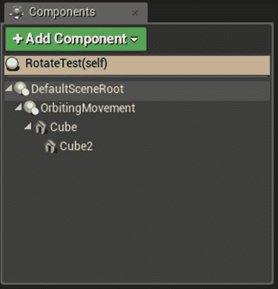

7.  如果不确定该过程，请参考*创建自定义 Actor 组件*配方。
8.  点击播放，看到网格在`Actor`中心周围以圆形模式移动。

## 它是如何工作的...

1.  添加到组件中的属性是我们用于自定义组件圆周运动的基本参数。
2.  `RotateToFaceOutwards`指定组件在每次更新时是否将面向远离旋转中心。`RotationSpeed`是元件每秒旋转的度数。
3.  `OrbitDistance`表示旋转的组件必须从原点移动的距离。`CurrentValue`是以度为单位的当前旋转位置。
4.  在构造函数中，我们为新组件建立了一些合理的默认值。
5.  在`TickComponent`函数中，我们计算组件的位置和旋转。
6.  下一步的公式要求我们的角度用弧度而不是度数来表示。弧度用 *π* 来描述一个角度。我们首先使用`DegreesToRadians`函数将我们的当前值 (以度为单位) 转换为弧度。
7.  `SetRelativeLocation`函数使用圆周运动的一般方程，即-*Pos(θ) = cos (弧度为 θ)，sin (弧度为 θ)* 。我们保留每个对象的 z 轴位置。
8.  下一步是将对象旋转回原点 (或者直接远离原点)。这仅在`RotateToFaceOutwards`为`true`时计算，并且涉及获取组件与其父级的相对偏移量，并基于从父级指向当前相对偏移量的向量创建旋转器。然后，我们将相对旋转设置为所得旋转器。
9.  最后，我们以度为单位增加当前值，使其每秒移动`RotationSpeed`单位，将结果值夹在 0 和 360 之间，以允许旋转循环。

# 创建生成单位的建筑物

对于这个配方，我们将创建一个在特定位置以固定时间间隔生成单元的建筑物。

## 怎么做...

1.  像往常一样，在编辑器中创建一个新的`Actor`子类，然后将以下实现添加到类中:

    ```cpp
    UPROPERTY()
    UStaticMeshComponent* BuildingMesh;
    UPROPERTY()
    UParticleSystemComponent* SpawnPoint;

    UPROPERTY()
    UClass* UnitToSpawn;

    UPROPERTY()
    float SpawnInterval;

    UFUNCTION()
    void SpawnUnit();

    UFUNCTION()
    void EndPlay(const EEndPlayReason::Type EndPlayReason) override;

    UPROPERTY()
    FTimerHandle SpawnTimerHandle;
    ```

2.  将以下内容添加到构造函数中:

    ```cpp
    BuildingMesh = CreateDefaultSubobject<UStaticMeshComponent>("BuildingMesh");
    SpawnPoint = CreateDefaultSubobject<UParticleSystemComponent>("SpawnPoint");
    SpawnInterval = 10;
    auto MeshAsset = ConstructorHelpers::FObjectFinder<UStaticMesh>(TEXT("StaticMesh'/Engine/BasicShapes/Cube.Cube'"));
    if (MeshAsset.Object != nullptr)
    {
      BuildingMesh->SetStaticMesh(MeshAsset.Object);
      BuildingMesh->SetCollisionProfileName(UCollisionProfile::Pawn_ProfileName);

    }
    auto ParticleSystem =
    ConstructorHelpers::FObjectFinder<UParticleSystem>(TEXT("ParticleSystem'/Engine/Tutorial/SubEditors/Tutorialimg/TutorialParticleSystem.TutorialParticleSystem'"));
    if (ParticleSystem.Object != nullptr)
    {
      SpawnPoint->SetTemplate(ParticleSystem.Object);
    }
    SpawnPoint->SetRelativeScale3D(FVector(0.5, 0.5, 0.5));
    UnitToSpawn = ABarracksUnit::StaticClass();
    ```

3.  将下面的添加到`BeginPlay`函数中:

    ```cpp
    RootComponent = BuildingMesh;
    SpawnPoint->AttachTo(RootComponent);
    SpawnPoint->SetRelativeLocation(FVector(150, 0, 0));
    GetWorld()->GetTimerManager().SetTimer(SpawnTimerHandle, this, &ABarracks::SpawnUnit, SpawnInterval, true);
    ```

4.  创建`SpawnUnit`函数的实现:

    ```cpp
    void ABarracks::SpawnUnit()
    {
      FVector SpawnLocation = SpawnPoint->GetComponentLocation();
      GetWorld()->SpawnActor(UnitToSpawn, &SpawnLocation);
    }
    ```

5.  实现重写的`EndPlay`功能:

    ```cpp
    void ABarracks::EndPlay(const EEndPlayReason::Type EndPlayReason)
    {
      Super::EndPlay(EndPlayReason);
      GetWorld()->GetTimerManager().ClearTimer(SpawnTimerHandle);
    }
    ```

6.  接下来，创建一个新的字符子类，并添加一个属性:

    ```cpp
    UPROPERTY()
    UParticleSystemComponent* VisualRepresentation;
    ```

7.  在构造函数实现中初始化组件:

    ```cpp
    VisualRepresentation = CreateDefaultSubobject<UParticleSystemComponent>("SpawnPoint");
    auto ParticleSystem =ConstructorHelpers::FObjectFinder<UParticleSystem>(TEXT("ParticleSystem'/Engine/Tutorial/SubEditors/Tutorialimg/TutorialParticleSystem.TutorialParticleSystem'"));
    if (ParticleSystem.Object != nullptr)
    {
      SpawnPoint->SetTemplate(ParticleSystem.Object);
    }
    SpawnPoint->SetRelativeScale3D(FVector(0.5, 0.5, 0.5));
    SpawnCollisionHandlingMethod = ESpawnActorCollisionHandlingMethod::AlwaysSpawn;
    ```

8.  将可视化的表示形式附加到根组件:

    ```cpp
    void ABarracksUnit::BeginPlay()
    {
      Super::BeginPlay();
      SpawnPoint->AttachTo(RootComponent);
    }
    ```

9.  最后，在`Tick`函数中添加以下内容以获取生成的 actor 移动:

    ```cpp
    SetActorLocation(GetActorLocation() + FVector(10, 0, 0));
    ```

10.  根据以下代码片段进行验证，然后编译您的项目。将军营演员的副本放入关卡。然后，您可以观察到它以固定的间隔生成角色:

    ```cpp
    #pragma once
    #include "GameFramework/Actor.h"
    #include "Barracks.generated.h"
    UCLASS()
    class UE4COOKBOOK_API ABarracks : public AActor
    {
      GENERATED_BODY()
      public:
      ABarracks();
      virtual void BeginPlay() override;
      virtual void Tick( float DeltaSeconds ) override;

      UPROPERTY()
      UStaticMeshComponent* BuildingMesh;
      UPROPERTY()
      UParticleSystemComponent* SpawnPoint;

      UPROPERTY()
      UClass* UnitToSpawn;

      UPROPERTY()
      float SpawnInterval;

      UFUNCTION()
      void SpawnUnit();
      UFUNCTION()
      void EndPlay(const EEndPlayReason::Type EndPlayReason) override;

      UPROPERTY()
      FTimerHandle SpawnTimerHandle;
    };

    #include "UE4Cookbook.h"
    #include "BarracksUnit.h"
    #include "Barracks.h"

    // Sets default values
    ABarracks::ABarracks()
    {
      // Set this actor to call Tick() every frame. You can turn this off to improve performance if you don't need it.
      PrimaryActorTick.bCanEverTick = true;
      BuildingMesh = CreateDefaultSubobject<UStaticMeshComponent>("BuildingMesh");
      SpawnPoint = CreateDefaultSubobject<UParticleSystemComponent>("SpawnPoint");
      SpawnInterval = 10;
      auto MeshAsset = ConstructorHelpers::FObjectFinder<UStaticMesh>(TEXT("StaticMesh'/Engine/BasicShapes/Cube.Cube'"));
      if (MeshAsset.Object != nullptr)
      {
        BuildingMesh->SetStaticMesh(MeshAsset.Object);
        BuildingMesh->SetCollisionProfileName(UCollisionProfile::Pawn_ProfileName);

      }
      auto ParticleSystem = ConstructorHelpers::FObjectFinder<UParticleSystem>(TEXT("ParticleSystem'/Engine/Tutorial/SubEditors/Tutorialimg/TutorialParticleSystem.TutorialParticleSystem'"));
      if (ParticleSystem.Object != nullptr)
      {
        SpawnPoint->SetTemplate(ParticleSystem.Object);
      }
      SpawnPoint->SetRelativeScale3D(FVector(0.5, 0.5, 0.5));
      UnitToSpawn = ABarracksUnit::StaticClass();
    }
    void ABarracks::BeginPlay()
    {
      Super::BeginPlay();
      RootComponent = BuildingMesh;
      SpawnPoint->AttachTo(RootComponent);
      SpawnPoint->SetRelativeLocation(FVector(150, 0, 0));
      GetWorld()->GetTimerManager().SetTimer(SpawnTimerHandle, this, &ABarracks::SpawnUnit, SpawnInterval, true);
    }

    void ABarracks::Tick( float DeltaTime )
    {
      Super::Tick( DeltaTime );
    }
    void ABarracks::SpawnUnit()
    {
      FVector SpawnLocation = SpawnPoint->GetComponentLocation();
      GetWorld()->SpawnActor(UnitToSpawn, &SpawnLocation);
    }

    void ABarracks::EndPlay(const EEndPlayReason::Type EndPlayReason)
    {
      Super::EndPlay(EndPlayReason);
      GetWorld()->GetTimerManager().ClearTimer(SpawnTimerHandle);
    }

    #pragma once

    #include "GameFramework/Character.h"
    #include "BarracksUnit.generated.h"

    UCLASS()
    class UE4COOKBOOK_API ABarracksUnit : public ACharacter
    {
      GENERATED_BODY()

      public:
      ABarracksUnit();

      virtual void BeginPlay() override;
      virtual void Tick( float DeltaSeconds ) override;

      virtual void SetupPlayerInputComponent(class UInputComponent* InputComponent) override;

      UPROPERTY()
      UParticleSystemComponent* SpawnPoint;
    };

    #include "UE4Cookbook.h"
    #include "BarracksUnit.h"

    ABarracksUnit::ABarracksUnit()
    {
      PrimaryActorTick.bCanEverTick = true;
      SpawnPoint = CreateDefaultSubobject<UParticleSystemComponent>("SpawnPoint");
      auto ParticleSystem =ConstructorHelpers::FObjectFinder<UParticleSystem>(TEXT("ParticleSystem'/Engine/Tutorial/SubEditors/Tutorialimg/TutorialParticleSystem.TutorialParticleSystem'"));
      if (ParticleSystem.Object != nullptr)
      {
        SpawnPoint->SetTemplate(ParticleSystem.Object);
      }
      SpawnPoint->SetRelativeScale3D(FVector(0.5, 0.5, 0.5));
      SpawnCollisionHandlingMethod = ESpawnActorCollisionHandlingMethod::AlwaysSpawn;
    }
    void ABarracksUnit::BeginPlay()
    {
      Super::BeginPlay();
      SpawnPoint->AttachTo(RootComponent);
    }

    void ABarracksUnit::Tick( float DeltaTime )
    {
      Super::Tick( DeltaTime );
      SetActorLocation(GetActorLocation() + FVector(10, 0, 0));
    }
    void ABarracksUnit::SetupPlayerInputComponent(class UInputComponent* InputComponent)
    {
      Super::SetupPlayerInputComponent(InputComponent);
    }
    ```

## 它是如何工作的...

1.  首先，我们创建军营演员。我们添加了一个粒子系统组件来指示新单元将在哪里产生，并添加了一个静态网格来表示建筑物的视觉表示。
2.  在构造函数中，我们初始化组件，然后使用`FObjectFinder`设置它们的值。我们还使用`StaticClass`函数将类设置为 spawn，以从类类型中检索`UClass*`实例。
3.  在兵营的`BeginPlay`函数中，我们创建了一个计时器，该计时器以固定的间隔调用我们的`SpawnUnit`函数。我们将计时器句柄存储在类中的成员变量中，以便当我们的实例被销毁时，我们可以停止计时器; 否则，当计时器再次触发时，我们将遇到对象指针被取消引用的崩溃。
4.  `SpawnUnit`函数获取`SpawnPoint`对象的世界空间位置，然后要求世界在该位置生成我们的单元类的实例。
5.  `BarracksUnit`在其`Tick()`函数中有代码，每帧向前移动 10 个单元，以便每个生成的单元都将移动以腾出空间给下一个单元。
6.  `EndPlay`函数 override 调用函数的父类实现，如果在父类中执行了取消或去初始化的计时器，这一点很重要。然后，它使用存储在`BeginPlay`中的计时器句柄来取消计时器。