# 第七章。类和接口之间的通信

本章向您展示了如何编写自己的 UInterfaces，并演示了如何在 C 中利用它们来最小化类耦合并帮助保持代码整洁。本章将介绍以下食谱:

*   创建`UInterface`
*   在对象上实现`UInterface`
*   检查一个类是否实现了`UInterface`
*   转换为在本机代码中实现的`UInterface`
*   从 C 调用本机`UInterface`函数
*   相互继承`UInterface`
*   在 C 中覆盖`UInterface`函数
*   从本机基类向蓝图公开`UInterface`方法
*   在蓝图中实现`UInterface`功能
*   创建可以在蓝图中覆盖的 C`UInterface`函数实现
*   从 C 调用蓝图定义的接口函数
*   用 UInterfaces 实现简单的交互系统

# 简介

在你的游戏项目中，你有时会需要一系列潜在的不同对象来共享一个共同的功能，但是使用继承是不合适的，因为在所讨论的不同对象之间没有 “is-a” 关系。C 等语言倾向于使用多重继承来解决这个问题。

但是，在虚幻中，如果您希望两个父类中的函数都可以访问 Blueprint，则需要将它们都设为`UCLASS`。这是一个问题，有两个原因。在同一对象中两次从`UClass`继承将打破`UObject`应该形成一个可整齐遍历的层次结构的概念。这也意味着对象上有两个`UClass`方法的实例，它们必须在代码中明确区分。虚幻代码库通过借用 C # 的概念来解决此问题-显式接口类型。

使用这种方法而不是组合的原因是，组件仅在 actor 上可用，而在 UObjects 上不可用。接口可以应用于任何`UObject`。此外，这意味着我们不再建模对象和组件之间的 “is-a” 关系; 相反，它将只能表示 “具有-a” 关系。

# 创建 UInterface

UInterfaces 是一对类，它们一起工作以使类能够在多个类层次结构之间表现出多态行为。此食谱向您展示了纯粹在代码中创建`UInterface`所涉及的基本步骤。

## 怎么做...

1.  UInterfaces 不会显示在 Unreal 中的主类向导中，因此我们需要使用 Visual Studio 手动添加类。
2.  右键单击**解决方案资源管理器中的源文件夹，然后选择**添加** | **新项**。**
3.  选择一个要启动的`.h`文件，并命名为`MyInterface.h.`
4.  确保将要放置的项目的目录从中间更改为源/项目名称。
5.  单击**确定**在您的项目文件夹中创建一个新的头文件。
6.  重复这些步骤，以创建`MyInterface.cpp`作为您的实现文件。
7.  在头文件中添加以下代码:

    ```cpp
    #include "MyInterface.generated.h"
    /**  */
    UINTERFACE()
    class UE4COOKBOOK_API UMyInterface: public UInterface
    {
      GENERATED_BODY()
    };

    /**  */
    class UE4COOKBOOK_API IMyInterface
    {
      GENERATED_BODY()

      public:
      virtualFStringGetTestName();
    };
    ```

8.  在`.cpp`文件中使用此代码实现类:

    ```cpp
    #include "UE4Cookbook.h"
    #include "MyInterface.h"

    FString IMyInterface::GetTestName()
    {
      unimplemented();
      return FString();
    }
    ```

9.  编译您的项目以验证代码编写时是否没有错误。

## 它是如何工作的...

1.  UInterfaces 被实现为在接口标头中声明的一对类。
2.  与往常一样，因为我们正在利用虚幻的反射系统，所以我们需要包含生成的头文件。请参阅[第 5 章](05.html#22O7C1-c0ca69a0411046888a488e5085138121 "Chapter 5\. Handling Events and Delegates")、*处理事件和委托*中通过虚拟函数实现的处理事件，了解更多信息。
3.  与使用`UCLASS`继承自`UObject`的类一样，我们需要使用`UINTERFACE`宏来声明我们的新`UInterface`。
4.  该类被标记为`UE4COOKBOOK_API`，以帮助导出库符号。
5.  接口的`UObject`部分的基类是`UInterface`。
6.  就像`UCLASS`类型一样，我们需要在类的主体内部放置一个宏，以便将自动生成的代码插入其中。
7.  对于 UInterfaces，该宏是`GENERATED_BODY()`。宏必须放在类主体的开头。
8.  第二类也被标记为`UE4COOKBOOK_API`，并以特定方式命名。
9.  请注意，`UInterface`派生类和标准类的名称相同，但前缀不同。`UInterface`派生类有前缀`U`，标准类有前缀`I`。
10.  这个很重要，因为这是虚幻头工具期望为它生成的代码命名类以正常工作的方式。
11.  纯原生接口类需要自己的自动生成内容，我们使用`GENERATED_BODY()`宏将其包括在内。
12.  我们声明继承接口的类应该在`IInterface`内部实现的函数。
13.  在实现文件中，我们为我们的`UInterface`实现构造函数，因为它是由虚幻头工具声明的，并且需要实现。
14.  我们还为我们的`GetTestName()`函数创建了一个默认实现。没有这个，编译的链接阶段就会失败。此默认实现使用`unimplemented()`宏，当代码行执行时，该宏会发出 debug assert。

## 另见

*   参考[第 5 章](05.html#22O7C1-c0ca69a0411046888a488e5085138121 "Chapter 5\. Handling Events and Delegates")、*处理事件和委托*中的*传递带有委托绑定的有效负载数据*; 第一个配方特别解释了我们在这里应用的一些原则

# 在对象上实现 UInterface

确保您已遵循先前的配方，以便准备好实施`UInterface`。

## 怎么做...

1.  使用名为`SingleInterfaceActor`的虚幻向导创建一个新的`Actor`类。
2.  将`IInterface`-在这种情况下，`IMyInterface`-添加到我们新的`Actor`类的公共继承列表中:

    ```cpp
    class UE4COOKBOOK_API ASingleInterfaceActor : public AActor, public IMyInterface
    ```

3.  在我们希望覆盖的`IInterface`函数的类中添加一个`override`声明:

    ```cpp
    FStringGetTestName() override;
    ```

4.  通过添加以下代码来实现实现文件中的重写函数:

    ```cpp
    FStringASingleInterfaceActor::GetTestName()
    {
      return IMyInterface::GetTestName();
    }
    ```

## 它是如何工作的...

1.  C 使用多重继承来实现接口，因此我们在这里利用该机制与`SingleInterfaceActor`类的声明，在其中添加`public IMyInterface`。
2.  我们从`IInterface`而不是`UInterface`继承，以防止`SingleInterfaceActor`继承`UObject`的两个副本。
3.  鉴于接口声明了一个`virtual`函数，如果我们想自己实现它，我们需要用覆盖说明符重新声明该函数。
4.  在我们的实现文件中，我们实现了重写的`virtual`函数。
5.  在我们的函数 override 中，出于演示目的，我们调用该函数的基本`IInterface`实现。或者，我们可以编写自己的实现，并避免完全调用基类。
6.  我们使用`IInterface:: specifier`而不是`Super`，因为`Super`指的是我们类的父级的`UClass`，而 IInterfaces 不是 UClasses (因此没有`U`前缀)。
7.  您可以根据需要在对象上实现第二个或多个 iinterface。

# 检查一个类是否实现了 UInterface

遵循前两个食谱，以便您有一个我们可以检查的`UInterface`，以及一个实现接口的类，可以对其进行测试。

## 怎么做...

1.  在您的游戏模式实现中，将以下代码添加到`BeginPlay`功能中:

    ```cpp
    FTransformSpawnLocation;
    ASingleInterfaceActor* SpawnedActor = GetWorld()->SpawnActor<ASingleInterfaceActor> (ASingleInterfaceActor::StaticClass(), SpawnLocation);
    if (SpawnedActor->GetClass()->ImplementsInterface(UMyInterface::StaticClass()))
    {
      GEngine->AddOnScreenDebugMessage(-1, 1, FColor::Red, TEXT("Spawned actor implements interface!"));
    }
    ```

2.  鉴于我们同时引用`ASingleInterfaceActor`和`IMyInterface`，我们需要在源文件中`#include`和`MyInterface.h`和`SingleInterfaceActor.h`。

## 它是如何工作的...

1.  在`BeginPlay`内部，我们创建了一个空的`FTransform`函数，它对所有平移和旋转分量的默认值为`0`，因此我们不需要显式设置它们中的任何一个。
2.  然后，我们使用`UWorld`中的`SpawnActor`函数，这样我们就可以创建我们的`SingleActorInterface`的实例，将指向该实例的指针存储到一个临时变量中。
3.  然后，我们在实例上使用`GetClass()`来获取对其关联的`UClass`的引用。我们需要引用`UClass,`，因为该对象是保存该对象的所有反射数据的对象。
4.  反射数据包括对象上所有`UPROPERTY`的名称和类型、对象的继承层次结构以及它实现的所有接口的列表。
5.  结果，我们可以在`UClass`上调用`ImplementsInterface()`，如果对象实现了有问题的`UInterface`，它将返回`true`。
6.  如果对象实现了接口，因此从`ImplementsInterface`返回`true`，然后我们将消息打印到屏幕上。

## 另见

*   [第 5 章](05.html#22O7C1-c0ca69a0411046888a488e5085138121 "Chapter 5\. Handling Events and Delegates")，*处理事件和代表，*有许多与演员产卵有关的食谱

# 转换为在本机代码中实现的 UInterface

UInterfaces 作为开发人员为您提供的一个优势是能够使用`Cast< >`来处理转换，将实现公共接口的异构对象集合视为同一对象的集合。

### 注意

请注意，如果您的类通过蓝图实现接口，这将不起作用。

## 准备就绪

您应该有一个`UInterface`和一个`Actor`实现该配方的接口。

在虚幻中使用向导创建新的游戏模式，或者可选地，重用项目并从先前的配方中`GameMode`。

## 怎么做...

1.  打开你的游戏模式的声明，并添加一个新的`UPROPERTY() macro`到它:

    ```cpp
    UPROPERTY()
    TArray<IMyInterface*>MyInterfaceInstances;
    ```

2.  将`#include "MyInterface.h"`添加到标题的包含部分。
3.  在游戏模式的`BeginPlay`实现中添加以下内容:

    ```cpp
    for (TActorIterator<AActor> It(GetWorld(), AActor::StaticClass()); It; ++It)
    {
      AActor* Actor = *It;
      IMyInterface* MyInterfaceInstance = Cast<IMyInterface>(Actor);
      if (MyInterfaceInstance)
      {
        MyInterfaceInstances.Add(MyInterfaceInstance);
      }
    }
    GEngine->AddOnScreenDebugMessage(-1, 1, FColor::Red, FString::Printf(TEXT("%d actors implement the interface"), MyInterfaceInstances.Num()));
    ```

4.  将关卡的游戏模式覆盖设置为您的游戏模式，然后将几个自定义界面实现 actor 的实例拖到关卡中。
5.  When you play your level, a message should be printed on screen that indicates the number of instances of the interface that have been implemented in Actors in the level:

    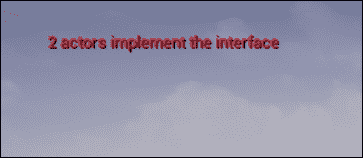

## 它是如何工作的...

1.  我们创建一个指向`MyInterface`实现的指针数组。
2.  在`BeginPlay`内部，我们使用`TActorIterator<AActor>`来获取我们级别中的所有`Actor`实例。
3.  `TActorIterator`具有以下构造函数:

    ```cpp
    explicitTActorIterator( UWorld* InWorld, TSubclassOf<ActorType>InClass = ActorType::StaticClass() )
    : Super(InWorld, InClass )
    ```

4.  `TActorIterator`期望一个世界和`UClass`实例一起行动，以指定我们感兴趣的演员类型。
5.  `ActorIterator`是类似于 STL 迭代器类型的迭代器。这意味着我们可以编写以下形式的`for`循环:

    ```cpp
    for (iterator-constructor;iterator;++iterator)
    ```

6.  在循环内部，我们取消引用迭代器以获取`Actor`指针。
7.  然后，我们尝试将其强制转换到我们的接口; 如果它确实实现了，它将返回一个指向接口的指针，否则它将返回`nullptr`。
8.  结果，我们可以检查接口指针是否为`null`，如果不是，我们可以将接口指针引用添加到我们的数组中。
9.  最后，一旦我们遍历了`TActorIterator`中的所有参与者，我们就可以在屏幕上显示一条消息，该消息显示实现该界面的项目的计数。

# 从 C 调用本机 UInterface 函数

按照之前的配方来理解将`Actor`指针投射到接口指针。

### 注意

请注意，由于此配方依赖于先前配方中使用的铸造技术，因此它仅适用于使用 C 而不是 Blueprint 实现接口的对象。这是因为蓝图类在编译时不可用，因此，从技术上讲，不要继承接口。

## 怎么做...

1.  使用编辑器向导创建一个新的`Actor`类。称之为`AntiGravityVolume`。
2.  将`BoxComponent`添加到新的`Actor`。

    ```cpp
    UPROPERTY()
    UBoxComponent* CollisionComponent;
    ```

3.  重写标题中的以下`Actor``virtual`函数:

    ```cpp
    virtual void NotifyActorBeginOverlap(AActor* OtherActor) override;
    virtual void NotifyActorEndOverlap(AActor* OtherActor) override;
    ```

4.  在源文件中创建一个实现，如下所示:

    ```cpp
    voidAAntiGravityVolume::NotifyActorBeginOverlap(AActor* OtherActor)
    {
      IGravityObject* GravityObject = Cast<IGravityObject>(OtherActor);
      if (GravityObject != nullptr)
      {
        GravityObject->DisableGravity();
      }
    }

    voidAAntiGravityVolume::NotifyActorEndOverlap(AActor* OtherActor)
    {
      IGravityObject* GravityObject = Cast<IGravityObject>(OtherActor);
      if (GravityObject != nullptr)
      {
        GravityObject->EnableGravity();
      }
    }
    ```

5.  在构造函数中初始化`BoxComponent`:

    ```cpp
    AAntiGravityVolume::AAntiGravityVolume()
    {
      PrimaryActorTick.bCanEverTick = true;
      CollisionComponent = CreateDefaultSubobject<UBoxComponent>("CollisionComponent");
      CollisionComponent->SetBoxExtent(FVector(200, 200, 400));
      RootComponent = CollisionComponent;

    }
    ```

6.  创建一个名为`GravityObject`的接口。
7.  将以下`virtual`函数添加到`IGravityObject`:

    ```cpp
    virtual void EnableGravity();
    virtual void DisableGravity();
    ```

8.  在`IGravityObject`实现文件中创建`virtual`函数的默认实现:

    ```cpp
    voidIGravityObject::EnableGravity()
    {
      AActor* ThisAsActor = Cast<AActor>(this);
      if (ThisAsActor != nullptr)
      {
        TArray<UPrimitiveComponent*>PrimitiveComponents;
        ThisAsActor->GetComponents(PrimitiveComponents);
        for (UPrimitiveComponent* Component : PrimitiveComponents)
        {
          Component->SetEnableGravity(true);
        }
      }
    }

    voidIGravityObject::DisableGravity()
    {
      AActor* ThisAsActor = Cast<AActor>(this);
      if (ThisAsActor != nullptr)
      {
        TArray<UPrimitiveComponent*>PrimitiveComponents;
        ThisAsActor->GetComponents(PrimitiveComponents);
        for (UPrimitiveComponent* Component : PrimitiveComponents)
        {
          Component->SetEnableGravity(false);
        }
      }
    }
    ```

9.  创建一个名为`PhysicsCube`的子类。
10.  添加静态网格:

    ```cpp
    UPROPERTY()
    UStaticMeshComponent* MyMesh;
    ```

11.  在构造函数中初始化组件:

    ```cpp
    MyMesh = CreateDefaultSubobject<UStaticMeshComponent>("MyMesh");
    autoMeshAsset = ConstructorHelpers::FObjectFinder<UStaticMesh>(TEXT("StaticMesh'/Engine/BasicShapes/Cube.Cube'"));
    if (MeshAsset.Object != nullptr)
    {
      MyMesh->SetStaticMesh(MeshAsset.Object);
    }
    MyMesh->SetMobility(EComponentMobility::Movable);
    MyMesh->SetSimulatePhysics(true);
    SetActorEnableCollision(true);
    ```

12.  要让`PhysicsCube`实现`GravityObject`，首先在头文件中`#include "GravityObject.h"`，然后修改类声明:

    ```cpp
    class UE4COOKBOOK_API APhysicsCube : public AActor, public IGravityObject
    ```

13.  编译您的项目。
14.  创建一个新的级别，并在场景中放置我们的重力体积实例。
15.  Place an instance of `PhysicsCube` above the gravity volume, then rotate it slightly so that it has one corner lower than the others, as shown in the following image:

    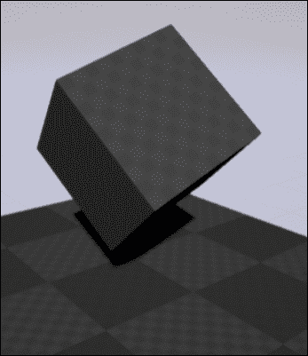

16.  Verify that the gravity is turned off on the object when it enters the volume, then turns back on again.

    ### 注意

    请注意，重力体积不需要了解您的`PhysicsCube`演员的任何信息，只需重力对象界面即可。

## 它是如何工作的...

1.  我们创建了一个新的`Actor`类，并添加了一个盒子组件，给演员一些会与角色碰撞的东西。或者，如果您想使用 BSP 功能来定义卷的形状，则可以对`AVolume`进行子类。
2.  `NotifyActorBeginOverlap`和`NotifyActorEndOverlap`被覆盖，以便当对象进入或离开`AntiGravityVolume`区域时，我们可以执行一些操作。
3.  在`NotifyActorBeginOverlap`实现中，我们尝试将与我们重叠的对象强制转换为`IGravityObject`指针。
4.  这将测试所讨论的对象是否实现了接口。
5.  如果指针有效，则对象确实实现了接口，因此使用接口指针调用对象上的接口方法是安全的。
6.  鉴于我们在`NotifyActorBeginOverlap`内部，我们想禁用物体上的重力，因此我们将其称为`DisableGravity()`。
7.  在`NotifyActorEndOverlap`内部，我们执行相同的检查，但是我们重新启用对对象的重力。
8.  在`DisableGravity`的默认实现中，我们将自己的指针 (`this`指针) 投射到`AActor`。
9.  这允许我们确认接口仅在`Actor`子类上实现，并调用`AActor`中定义的方法。
10.  如果指针是有效的，我们知道我们是一个`Actor`，所以我们可以使用`GetComponents<class ComponentType>()`从我们自己得到一个特定类型的所有组件的`TArray`。
11.  `GetComponents`是一个`template`函数。它期望一些模板参数:

    ```cpp
    template<class T, class AllocatorType>
    voidGetComponents(TArray<T*, AllocatorType>&OutComponents) const
    ```

12.  由于标准的2014 版本，C 支持模板参数的编译时推导。这意味着，如果编译器可以从我们提供的正常函数参数中计算出来，我们在调用函数时不需要实际指定模板参数。
13.  `TArray`的默认实现是`template<typename T, typename Allocator = FDefaultAllocator>`类`TArray;`
14.  这意味着我们不需要默认指定分配器，所以我们在声明数组时只需使用`TArray<UPrimitiveComponent*>`。
15.  当`TArray`传入`GetComponents`函数时，编译器知道它实际上是`TArray<UPrimitiveComponent*, FDefaultAllocator>`，并且能够用`UPrimitiveComponent`和`FDefaultAllocator`填写模板参数`T`和`AllocatorType`，因此，这些都不需要作为函数调用的模板参数。
16.  `GetComponents`遍历`Actor`具有的组件，任何从`typename T`继承的组件都有指向它们的指针存储在`PrimitiveComponents`数组中。
17.  使用基于范围的`for`循环，这是 C 的另一个新功能，我们可以迭代函数放入我们的`TArray`中的组件，而不需要使用传统的`for`循环结构。
18.  每个组件都有调用它们的`SetEnableGravity(false)`，这会禁用重力。
19.  同样，`EnableGravity`函数迭代包含在 actor 中的所有原始组件，并使用`SetEnableGravity(true)`启用重力。

## 另见

*   看[第四章](04.html#1KEEU1-c0ca69a0411046888a488e5085138121 "Chapter 4\. Actors and Components")，*演员和组件，*关于演员和组件的广泛讨论。[第五章，](05.html#22O7C1-c0ca69a0411046888a488e5085138121 "Chapter 5\. Handling Events and Delegates")*处理事件和委托，*讨论事件如`NotifyActorOverlap`。

# 相互继承 UInterface

有时，您可能需要创建一个专门针对更通用的`UInterface`的`UInterface`。

此食谱向您展示了如何使用 UInterfaces 继承来特化一个**可杀死的**接口，该接口具有无法通过正常方式杀死的**不死的**接口。

## 怎么做...

1.  创建一个名为`UKillable`的`UINTERFACE`/`IInterface`。
2.  在`UInterface`声明中添加`UINTERFACE(meta=(CannotImplementInterfaceInBlueprint))`。
3.  在头文件中添加以下功能:

    ```cpp
    UFUNCTION(BlueprintCallable, Category=Killable)
    virtual bool IsDead();
    UFUNCTION(BlueprintCallable, Category = Killable)
    virtual void Die();
    ```

4.  为实现文件内部的接口提供默认实现:

    ```cpp
    boolIKillable::IsDead()
    {
      return false;
    }

    voidIKillable::Die()
    {
      GEngine->AddOnScreenDebugMessage(-1,1, FColor::Red,"Arrrgh");
      AActor* Me = Cast<AActor>(this);
      if (Me)
      {
        Me->Destroy();
      }

    }
    ```

5.  创建一个名为`Undead`的新的`UINTERFACE`/`IInterface`。修改它们从`UKillable`/`IKillable`继承:

    ```cpp
    UINTERFACE()
    class UE4COOKBOOK_API UUndead: public UKillable
    {
      GENERATED_BODY()
    };

    /**  */
    class UE4COOKBOOK_API IUndead: public IKillable
    {
      GENERATED_BODY()

    };
    ```

6.  确保包含定义`Killable`接口的头。
7.  在新接口中添加一些覆盖和新方法声明:

    ```cpp
    virtual bool IsDead() override;
    virtual void Die() override;
    virtual void Turn();
    virtual void Banish();
    ```

8.  为函数创建实现:

    ```cpp
    boolIUndead::IsDead()
    {
      return true;
    }

    voidIUndead::Die()
    {
      GEngine->AddOnScreenDebugMessage(-1,1, FColor::Red,"You can't kill what is already dead. Mwahaha");
    }

    voidIUndead::Turn()
    {
      GEngine->AddOnScreenDebugMessage(-1,1, FColor::Red, "I'm fleeing!");

    }

    voidIUndead::Banish()
    {
      AActor* Me = Cast<AActor>(this);
      if (Me)
      {
        Me->Destroy();
      }
    }
    ```

9.  在 C 中创建两个新的`Actor`类: 一个称为`Snail`，另一个称为`Zombie`。
10.  设置`Snail`类以实现`IKillable`接口，并添加适当的头文件`#include`。
11.  同样，将`Zombie`类设置为实现`IUndead`和`#include "Undead.h"`。
12.  编译您的项目。
13.  启动编辑器，并将`Zombie`和`Snail`的实例拖入您的级别。
14.  在**级别蓝图**中添加对它们中的每一个的引用。
15.  Call `Die` (Message) on each reference.

    

16.  Connect the execution pins of the two message calls, then wire it up to `Event BeginPlay`.

    运行游戏，然后验证`Zombie`是不屑于你的努力杀死它，但`Snail`呻吟然后死亡 (被从世界 outliner 删除)。

    

## 它是如何工作的...

1.  为了使在**级别蓝图**中测试此配方成为可能，我们需要使接口函数可通过蓝图调用，因此我们需要在我们的`UFUNCTION`上使用`BlueprintCallable`说明符。
2.  但是，在`UInterface`中，编译器希望默认情况下可以通过 C 和 Blueprint 实现该接口。这与`BlueprintCallable`相冲突，这只是说可以从蓝图中调用该函数，而不是说可以在其中覆盖。
3.  我们可以通过将接口标记为`CannotImplementInterfaceInBlueprint`来解决冲突。
4.  这使得可以使用`BlueprintCallable`作为我们的`UFUNCTION`说明符，而不是`BlueprintImplementableEvent` (由于额外的代码允许通过蓝图重写函数，因此有额外的开销)。
5.  我们将`IsDead`和`Die`定义为`virtual`，以使它们能够在继承此 C 的另一个 C 类中重写。
6.  在我们的默认接口实现中，`IsDead`总是返回`false`。

`Die`的默认实现会在屏幕上打印一条死亡消息，如果是`Actor`，则会破坏实现此接口的对象。

1.  我们现在可以创建第二个接口，称为`Undead`，它继承自`Killable`。
2.  我们在类声明中使用`public UKillable`/`public IKillable`来表达这一点。
3.  当然，因此，我们需要包含定义`Killable`接口的头文件。
4.  我们的新接口覆盖了`Killable`定义的两个函数，为`Undead`提供更合适的`IsDead`/`Die`定义。
5.  通过从`IsDead`返回`true`，我们覆盖的定义已经死了`Undead`。
6.  当在`Undead`上调用`Die`时，我们简单地打印一条信息，其中`Undead`嘲笑我们微弱的试图再次杀死它，什么也不做。
7.  我们还可以为我们的`Undead`特定函数指定默认实现，即`Turn()`和`Banish()`。
8.  当`Undead`被转动时，他们逃跑了，为了演示的目的，我们在屏幕上打印一条信息。
9.  然而，如果一个`Undead`被放逐，它们就会被消灭和无影无踪地摧毁。
10.  为了测试我们的实现，我们创建了两个`Actors`，每个都从两个接口之一继承。
11.  将每个 actor 的实例添加到我们的级别后，我们使用**级别蓝图**访问级别的`BeginPlay`事件。
12.  当关卡开始播放时，我们使用消息调用来尝试在实例上调用`Die`函数。
13.  打印出来的消息是不同的，并且对应于显示僵尸的`Die`的实现不同的两个函数实现，并且已经覆盖了蜗牛的。

# 在 C 中覆盖 UInterface 函数

允许在 C 中继承的 uinterface 的一个副作用是，我们可以覆盖子类和蓝图中的默认实现。这个配方向您展示了如何做到这一点。

## 准备就绪

按照配方*从 C*调用本机 UInterface 函数，其中创建了一个物理立方体，以便您准备好类。

## 怎么做...

1.  创建一个名为`Selectable`的新接口。
2.  在`ISelectable`内部定义以下函数:

    ```cpp
    virtual bool IsSelectable();

    virtual bool TrySelect();

    virtual void Deselect();
    ```

3.  为这样的函数提供默认实现:

    ```cpp
    boolISelectable::IsSelectable()
    {
      GEngine->AddOnScreenDebugMessage(-1, 1, FColor::Red, "Selectable");
      return true;
    }

    boolISelectable::TrySelect()
    {
      GEngine->AddOnScreenDebugMessage(-1, 1, FColor::Red, "Accepting Selection");
      return true;
    }

    voidISelectable::Deselect()
    {
      unimplemented();
    }
    ```

4.  基于名为`SelectableCube`的`APhysicsCube`创建一个类。
5.  `#include "Selectable.h"`在`SelectableCube`类 '头内。
6.  像这样修改`ASelectableCube`声明:

    ```cpp
    class UE4COOKBOOK_API ASelectableCube : public APhysicsCube, public ISelectable
    ```

7.  在标题中添加以下功能:

    ```cpp
    ASelectableCube();
    virtual void NotifyHit(class UPrimitiveComponent* MyComp, AActor* Other, class UPrimitiveComponent* OtherComp, bool bSelfMoved, FVectorHitLocation, FVectorHitNormal, FVectorNormalImpulse, constFHitResult& Hit) override;
    ```

8.  实现功能:

    ```cpp
    ASelectableCube::ASelectableCube()
    : Super()
    {
      MyMesh->SetNotifyRigidBodyCollision(true);
    }

    voidASelectableCube::NotifyHit(class UPrimitiveComponent* MyComp, AActor* Other, class UPrimitiveComponent* OtherComp, bool bSelfMoved, FVectorHitLocation, FVectorHitNormal, FVectorNormalImpulse, constFHitResult& Hit)
    {
      if (IsSelectable())
      {
        TrySelect();
      }
    }
    ```

9.  创建一个从`SelectableCube`继承的新类，称为`NonSelectableCube`。
10.  `NonSelectableCube`应该覆盖`SelectableInterface`中的函数:

    ```cpp
    virtual bool IsSelectable() override;

    virtual bool TrySelect() override;

    virtual void Deselect() override;
    ```

11.  应将实现文件更改为包括以下内容:

    ```cpp
    boolANonSelectableCube::IsSelectable()
    {
      GEngine->AddOnScreenDebugMessage(-1, 1, FColor::Red, "Not Selectable");
      return false;
    }

    boolANonSelectableCube::TrySelect()
    {
      GEngine->AddOnScreenDebugMessage(-1, 1, FColor::Red, "Refusing Selection");
      return false;
    }

    voidANonSelectableCube::Deselect()
    {
      unimplemented();
    }
    ```

12.  Place an instance of `SelectableCube` into the level at a certain range above the ground, and play your game. You should get messages verifying that the actor is selectable, and that it has accepted the selection, when the cube hits the ground.

    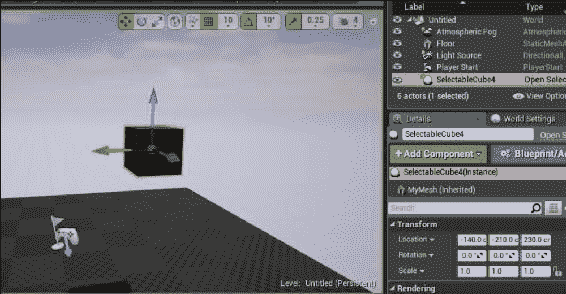

13.  删除`SelectableCube`并将其替换为`NonSelectableCube`到的实例，请参阅替代消息，该消息指示此 actor 不可选择，并且已拒绝选择。

## 它是如何工作的...

1.  我们在`Selectable`接口内创建三个函数。
2.  `IsSelectable`返回一个布尔值，以指示对象是否可选。您可以避免这种情况，只需使用`TrySelect`，因为它返回一个布尔值来指示成功，但是，例如，您可能想知道 UI 中的对象是否是有效的选择，而不必实际尝试。
3.  `TrySelect`实际上尝试选择对象。没有明确的合同迫使用户在尝试选择对象时尊重`IsSelectable`，因此`TrySelect`被命名为传达选择可能并不总是成功的信息。
4.  最后，`Deselect`是一个添加的函数，允许对象处理丢失的玩家选择。这可能涉及更改 UI 元素，停止声音或其他视觉效果，或者只是从单元周围删除选择轮廓。
5.  函数的默认实现为`IsSelectable`返回`true` (默认为任何对象可选择)，`true`返回`TrySelect` (选择尝试总是成功)，如果调用`Deselect`而没有被类实现，则发出 debug assert。
6.  如果您愿意，您也可以将`Deselect`实现为纯`virtual`函数。
7.  `SelectableCube`是一个从`PhysicsCube`继承的新类，也实现了`ISelectable`接口。
8.  它还覆盖`NotifyHit`，这是在`AActor`中定义的`virtual`函数，当参与者经历**刚体**碰撞时触发。
9.  我们从`PhysicsCube`中调用构造函数，在`SelectableCube`的实现中调用`Super()`构造函数调用。然后我们添加我们自己的实现，它在我们的静态网格实例上调用`SetNotifyRigidBodyCollision(true)`。这是必要的，因为默认情况下，刚体 (如具有碰撞的`PrimitiveComponents`) 不会触发`Hit`事件作为性能优化。结果，我们重写的`NotifyHit`函数将永远不会被调用。
10.  在的实现中，我们自己调用了一些`ISelectable`接口函数。鉴于我们知道我们是一个从`ISelectable`继承的对象，我们不需要强制转换到`ISelectable*`来调用它们。
11.  我们检查对象是否可以选择`IsSelectable`，如果是，我们尝试使用`TrySelect`实际执行选择。
12.  `NonSelectableCube`继承自`SelectableCube`，因此我们可以强制对象永远不可选择。
13.  我们通过再次覆盖`ISelectable`接口函数来完成此操作。
14.  在`ANonSelectableCube::IsSelectable()`内，我们在屏幕上打印一条消息，这样我们就可以验证该函数是否正在被调用，然后返回`false`以指示该对象根本不可选择。
15.  如果用户不尊重`IsSelectable()`，`ANonSelectableCube::TrySelect()`总是返回`false`以表示选择不成功。
16.  鉴于无法选择`NonSelectableCube`，因此`Deselect()`调用`unimplemented()`，这会引发 assert 警告该函数未实现。
17.  现在，当播放你的场景时，每次`SelectableCube`/`NonSelectableCube`击中另一个物体，导致刚体碰撞，有问题的演员将尝试选择自己，并将消息打印到屏幕上。

## 另见

*   参考[第 6 章](06.html#2BASE1-c0ca69a0411046888a488e5085138121 "Chapter 6\. Input and Collision")，*输入和碰撞，*它向您展示了如何从鼠标光标进入游戏世界，以确定正在点击什么，并可用于扩展此配方，以允许玩家单击项目以选择它们

# 从本机基类向蓝图公开 UInterface 方法

能够在 C 中定义`UInterface`方法是很好的，但是它们也应该可以从蓝图中访问。否则，设计师或其他使用蓝图的人将无法与您的`UInterface`进行交互。此配方向您展示了如何从蓝图系统内可调用的接口制作函数。

## 怎么做...

1.  创建一个名为`UPostBeginPlay`/`IPostBeginPlay`的`UInterface`。
2.  在`IPostBeginPlay`中添加以下`virtual`方法:

    ```cpp
    UFUNCTION(BlueprintCallable, Category=Test)
    virtual void OnPostBeginPlay();
    ```

3.  提供功能的实现:

    ```cpp
    voidIPostBeginPlay::OnPostBeginPlay()
    {
      GEngine->AddOnScreenDebugMessage(-1, 1, FColor::Red, "PostBeginPlay called");
    }
    ```

4.  创建一个名为`APostBeginPlayTest`的新的`Actor`类。
5.  修改类声明，使其也继承`IPostBeginPlay`:

    ```cpp
    UCLASS()
    class UE4COOKBOOK_API APostBeginPlayTest : public AActor, public IPostBeginPlay
    ```

6.  Compile your project. Inside the editor, drag an instance of `APostBeginPlayTest` into your level. With the instance selected, click on **Open Level Blueprint**:

    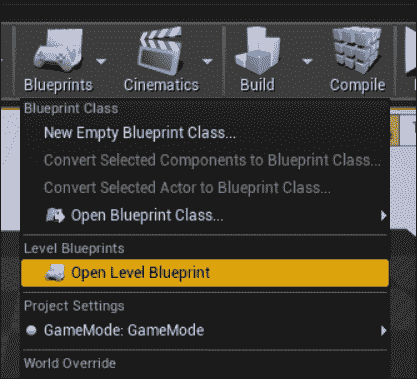

7.  Inside the Level Blueprint, right-click and **Create a Reference to PostBeginPlayTest1**.

    

8.  Drag away from the blue pin on the right-hand side of your actor reference, then search the context menu for `onpost` to see your new interface function available. Click on it to insert a call to your native `UInterface` implementation from Blueprint.

    

9.  Finally, connect the execution pin (white arrow) from the `BeginPlay` node to the execution pin for `OnPostBeginPlay`.

    

10.  当你玩你的关卡时，你应该会在屏幕上看到消息**PostBeginPlay 称为**在短时间内显示，验证蓝图已成功访问并调用到你的本机代码实现`UInterface`。

## 它是如何工作的...

1.  `UINTERFACE`/`IInterface`对的功能与其他配方相同，其中`UInterface`包含反射信息和其他数据，`IInterface`作为可以继承的实际接口类。
2.  允许将`IInterface`内部的函数暴露给蓝图的最重要的元素是`UFUNCTION`说明符。
3.  `BlueprintCallable`将此函数标记为可以从蓝图系统调用的函数。
4.  以任何方式向蓝图公开的任何函数也需要一个`Category`值。此`Category`值指定将在上下文菜单中列出函数的标题。
5.  函数还必须标记为`virtual`-这样，通过本机代码实现接口的类可以覆盖其中函数的实现。如果没有`virtual`说明符，虚幻标题工具将给您一个错误，指示您必须添加`virtual`或`BlueprintImplementableEvent`作为`UFUNCTION`说明符。
6.  这样做的原因是，如果没有其中任何一个，接口函数将不会在 C (由于不存在`virtual`) 或蓝图 (因为`BlueprintImplementableEvent`丢失) 中覆盖。无法覆盖但只能继承的接口的效用有限，因此 Epic 选择不在 UInterfaces 中支持它。
7.  然后，我们提供`OnPostBeginPlay`函数的默认实现，该函数使用`GEngine`指针显示调试消息，确认该函数已被调用。

## 另见

*   请参阅[第 8 章](08.html#318PC1-c0ca69a0411046888a488e5085138121 "Chapter 8\. Integrating C++ and the Unreal Editor")，*集成 C 和虚幻编辑器，*有关如何将 C 类与蓝图集成的许多食谱

# 在蓝图中实现 UInterface 功能

UInterface 在虚幻中的主要优势之一是用户能够在编辑器中实现`UInterface`功能。这意味着接口可以在蓝图中严格实现，而不需要任何 C 代码，这对设计人员很有帮助。

## 怎么做...

1.  创建一个名为`AttackAvoider`的新`UInterface`。
2.  在标头中添加以下函数声明:

    ```cpp
    UFUNCTION(BlueprintImplementableEvent, BlueprintCallable, Category = AttackAvoider)
    voidAttackIncoming(AActor* AttackActor);
    ```

3.  Create a new **Blueprint Class** within the Editor:

    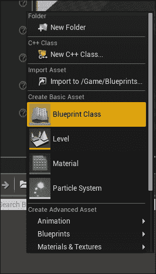

4.  Base the class on **Actor**:

    

5.  Open **Class Settings**:

    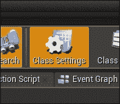

6.  Click on the drop-down menu for **Implement Interface**, and select **AttackAvoider**:

    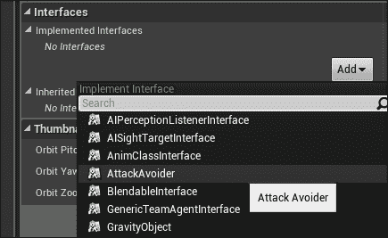

7.  **Compile** your blueprint:

    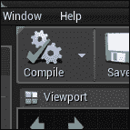

8.  Right-click in the Event Graph, and type `event attack`. Within the **Context Sensitive** menu, you should see **Event Attack Incoming**. Select it to place an event node in your graph:

    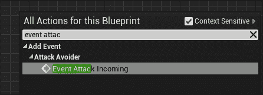

9.  Drag out from the execution pin on the new node, and release. Type `print string` into the **Context Sensitive** menu to add a **Print String** node.

    

10.  您现在已经在蓝图中实现了`UInterface`功能。

## 它是如何工作的...

1.  `UINTERFACE`/`IInterface`的创建方式与我们在本章其他食谱中看到的完全相同。
2.  但是，当我们向接口添加函数时，我们使用了一个新的`UFUNCTION`说明符: `BlueprintImplementableEvent`。
3.  `BlueprintImplementableEvent`告诉虚幻头工具生成代码，该代码创建一个空的存根函数，该函数可以由 Blueprint 实现。我们不需要为函数提供默认的 C 实现。
4.  我们在 Blueprint 内部实现接口，该接口以允许我们在 Blueprint 中定义其实现的方式为我们公开了该功能。
5.  头工具创建的自动生成代码将对`UInterface`函数的调用转发到我们的蓝图实现。

## 另见

*   下面的配方向您展示了如何在 C 中定义`UInterface`函数的默认实现，然后在必要时可选地在蓝图中覆盖它

# 创建可以在蓝图中覆盖的 C ++ UInterface 函数实现

就像前面的配方一样，UInterfaces 是有用的，但是该实用程序受到严重限制，而设计师无法使用其功能。

前面的配方向您展示了如何从蓝图中调用 C`UInterface`函数; 这个配方将向您展示如何用自己的自定义仅蓝图函数替换`UInterface`函数的实现。

## 怎么做...

1.  创建一个名为`Wearable` (`IWearable`，`UWearable`) 的新接口。
2.  在标题中添加以下功能:

    ```cpp
    UFUNCTION(BlueprintNativeEvent, BlueprintCallable, Category = Wearable)
    int32GetStrengthRequirement();
    UFUNCTION(BlueprintNativeEvent, BlueprintCallable, Category = Wearable)
    boolCanEquip(APawn* Wearer);
    UFUNCTION(BlueprintNativeEvent, BlueprintCallable, Category = Wearable)
    voidOnEquip(APawn* Wearer);
    ```

3.  在实现文件中添加以下函数实现:

    ```cpp
    int32 IWearable::GetStrengthRequirement_Implementation()
    {
      return 0;
    }

    Bool IWearable::CanEquip_Implementation(APawn* Wearer)
    {
      return true;
    }

    Void IWearable::OnEquip_Implementation(APawn* Wearer)
    {

    }
    ```

4.  在编辑器中创建一个名为`Boots`的新的`Actor`类。
5.  将`#include "Wearable.h"`添加到`Boots`的头文件中。
6.  修改类声明如下:

    ```cpp
    UCLASS()
    class UE4COOKBOOK_API ABoots : public AActor, public IWearable
    ```

7.  添加由我们的接口创建的纯`virtual`函数的以下实现:

    ```cpp
    virtual void OnEquip_Implementation(APawn* Wearer) override
    {
      IWearable::OnEquip_Implementation(Wearer);
    }
    virtual bool CanEquip_Implementation(APawn* Wearer) override
    {
      return IWearable::CanEquip_Implementation(Wearer);
    }
    virtual int32 GetStrengthRequirement_Implementation() override
    {
      return IWearable::GetStrengthRequirement_Implementation();
    }
    ```

8.  基于`Actor`新建一个名为`Gloves`的蓝图类。
9.  在类设置中，选择`Wearable`作为`Gloves`演员将实现的接口。
10.  Within `Gloves`, override the `OnEquip` function like this:

    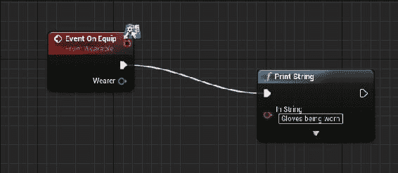

11.  将`Gloves`和`Boots`两者的副本拖入您的关卡，以进行测试。
12.  Add the following blueprint code to your level:

    

13.  Verify that `Boots` performs the default behavior, but `Gloves` performs the blueprint-defined behavior.

    

## 它是如何工作的...

1.  此配方一起使用两个`UFUNCTION`说明符: `BlueprintNativeEvent`和`BlueprintCallable`。
2.  `BlueprintCallable`已在以前的食谱中显示，并且是在蓝图编辑器中标记您的`UFUNCTION`可见和可调用的一种方式。
3.  `BlueprintNativeEvent`表示具有默认 C (本机代码) 实现的`UFUNCTION`，但在蓝图中也可覆盖。它是一个虚函数与`BlueprintImplementableEvent`的结合。
4.  在中，为了使这种机制工作，虚幻头工具会生成函数的主体，以便在存在时调用函数的蓝图版本; 否则，它会将方法调用发送到本机实现。
5.  为了将您的默认实现与调度功能分开，UHT 定义了一个新函数，该函数从您声明的函数中取其名称，但在末尾附加`_Implementation`。
6.  这就是为什么头文件声明`GetStrengthRequirement`，但没有实现的原因，因为这是自动生成的。
7.  这也是为什么您的实现文件定义`GetStrengthRequirement_Implementation`，但没有声明它，因为它也是自动生成的。
8.  `Boots`类实现`IWearable`，但不覆盖默认功能。但是，由于`_Implementation`函数定义为`virtual`，因此我们仍然需要显式实现接口函数，然后直接调用默认实现。
9.  相比之下，`Gloves`也实现了`IWearable`，但在蓝图中定义了`OnEquip`的重写实现。
10.  当我们使用**级别蓝图**为两个演员调用`OnEquip`时，可以验证这一点。

# 从 C 调用蓝图定义的接口函数

虽然以前的配方集中在 C 可以在蓝图中使用，例如能够在蓝图中从 C 调用函数，并使用蓝图覆盖 C 函数，但这个配方向您展示了相反的情况: 从 C 调用蓝图定义的接口函数。

## 怎么做...

1.  创建一个名为`UTalker`/`ITalker`的新`UInterface`。
2.  添加以下`UFUNCTION`实现:

    ```cpp
    UFUNCTION(BlueprintNativeEvent, BlueprintCallable, Category = Talk)
    void StartTalking();
    ```

3.  在`.cpp`文件内部提供默认的空实现:

    ```cpp
    void ITalker::StartTalking_Implementation()
    {

    }
    ```

4.  基于`StaticMeshActor`创建一个新类。
5.  添加`#include`并修改类声明以包含 talker 接口:

    ```cpp
    #include "Talker.h"
    class UE4COOKBOOK_API ATalkingMesh : public AStaticMeshActor, public ITalker
    ```

6.  另外，在类声明中添加以下函数:

    ```cpp
    void StartTalking_Implementation();
    ```

7.  在实现中，将以下内容添加到构造函数中:

    ```cpp
    ATalkingMesh::ATalkingMesh()
    :Super()
    {
      autoMeshAsset = ConstructorHelpers::FObjectFinder<UStaticMesh>(TEXT("StaticMesh'/Engine/BasicShapes/Cube.Cube'"));
      if (MeshAsset.Object != nullptr)
      {
        GetStaticMeshComponent()->SetStaticMesh(MeshAsset.Object);
        //GetStaticMeshComponent()->SetCollisionProfileName(UCollisionProfile::Pawn_ProfileName);
        GetStaticMeshComponent()->bGenerateOverlapEvents = true;
      }
      GetStaticMeshComponent()->SetMobility(EComponentMobility::Movable);
      SetActorEnableCollision(true);
    }
    Implmement the default implementation of our StartTalking function:
    voidATalkingMesh::StartTalking_Implementation()
    {
      GEngine->AddOnScreenDebugMessage(-1, 1, FColor::Red, TEXT("Hello there. What is your name?"));
    }
    ```

8.  创建一个基于`DefaultPawn`的新类，作为我们的玩家角色。
9.  在我们的类标题中添加一些`UPROPERTY`/`UFUNCTION`:

    ```cpp
    UPROPERTY()
    UBoxComponent* TalkCollider;
    UFUNCTION()
    voidOnTalkOverlap(AActor* OtherActor, UPrimitiveComponent* OtherComp, int32 OtherBodyIndex, bool bFromSweep, constFHitResult&SweepResult);
    ```

10.  修改构造函数:

    ```cpp
    ATalkingPawn::ATalkingPawn()
    :Super()
    {
      // Set this character to call Tick() every frame. You can turn this off to improve performance if you don't need it.
      PrimaryActorTick.bCanEverTick = true;
      TalkCollider = CreateDefaultSubobject<UBoxComponent>("TalkCollider"); 
      TalkCollider->SetBoxExtent(FVector(200, 200, 100));
      TalkCollider->OnComponentBeginOverlap.AddDynamic(this, &ATalkingPawn::OnTalkOverlap);
      TalkCollider->AttachTo(RootComponent);
    }
    ```

11.  实施`OnTalkOverlap`:

    ```cpp
    voidATalkingPawn::OnTalkOverlap(AActor* OtherActor, UPrimitiveComponent* OtherComp, int32 OtherBodyIndex, bool bFromSweep, constFHitResult&SweepResult)
    {
      if (OtherActor->GetClass()->ImplementsInterface(UTalker::StaticClass()))
      {
        ITalker::Execute_StartTalking(OtherActor);
      }
    }
    ```

12.  创建一个新的`GameMode`，并将`TalkingPawn`设置为玩家的默认棋子类。
13.  将您的`ATalkingMesh`类的实例拖到级别中。
14.  Create a new Blueprint class based on `ATalkingMesh` by right-clicking on it, and selecting the appropriate option from the context menu:

    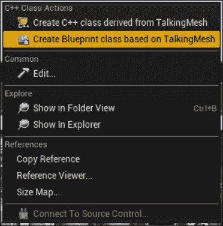

15.  命名为`MyTalkingMesh`。
16.  Inside the blueprint editor, create an implementation for `StartTalking` like this:

    

17.  将新蓝图的副本拖到`ATalkingMesh`实例旁边的级别中。
18.  Walk up to the two actors, and verify that your custom Pawn is correctly invoking either the default C++ implementation or the Blueprint implementation, as appropriate.

    

## 它是如何工作的...

1.  像一样，我们创建一个新接口，然后在`IInterface`类中添加一些函数定义。
2.  我们使用`BlueprintNativeEvent`说明符来指示我们要在 C 中声明一个默认实现，然后可以在 Blueprint 中覆盖。
3.  我们创建一个新类 (为了方便起见从`StaticMeshActor`继承)，并在其上实现接口。
4.  在新类构造函数的实现中，我们加载一个静态网格，并照常设置我们的冲突。
5.  然后，我们为接口功能添加一个实现，该实现只需将消息打印到屏幕即可。
6.  如果您在一个成熟的项目中使用它，您可以播放动画，播放音频，更改用户界面，以及与您的`Talker`开始对话所需的任何其他内容。
7.  不过，在这一点上，我们没有任何东西可以在我们的`Talker`上实际调用`StartTalking`。
8.  实现这一点的最简单的方法是创建一个新的`Pawn`子类 (同样，为了方便起见，从`DefaultPawn`继承)，它可以开始与任何`Talker`的参与者进行对话。
9.  为了使它起作用，我们创建了一个新的`BoxComponent`来建立我们将触发对话的半径。
10.  与往常一样，它是`UPROPERTY`，因此不会收集垃圾。
11.  我们还为函数创建定义，当新的`BoxComponent`与场景中的另一个`Actor`重叠时，该函数将被触发。
12.  我们的`TalkingPawn`的构造函数初始化新的`BoxComponent`，并适当地设置其范围。
13.  构造函数还将`OnTalkOverlap`函数绑定为事件处理程序，以处理与我们的`BoxComponent`的冲突。
14.  它还将盒子组件附加到我们的`RootComponent`上，以便当玩家在关卡中移动时，它与玩家角色的其余部分一起移动。
15.  在`OnTalkOverlap`内部，我们需要检查与我们的框重叠的另一个 actor 是否实现了`Talker`接口。
16.  最可靠的方法是使用`UClass`中的`ImplementsInterface`函数。该函数使用虚幻头工具在编译过程中生成的类信息，并正确处理 C 和蓝图实现的接口。
17.  如果函数返回`true`，我们可以使用我们的`IInterface`中包含的一个特殊的自动生成函数在我们的实例上调用我们选择的接口方法。
18.  这是一种形式为`<IInterface>::Execute_<FunctionName>`的静态方法。在我们的实例中，我们的`IInterface`是`ITalker`，函数是`StartTalking`，所以我们要调用的函数是`ITalker::Execute_StartTalking()`。
19.  我们需要这个函数的原因是，当在 Blueprint 中实现接口时，实际上并没有在编译时建立关系。因此，C 不知道接口已实现这一事实，因此我们无法将 Blueprint 类强制转换为`IInterface`来直接调用函数。
20.  `Execute_`函数将指向实现该接口的对象的指针，并调用许多内部方法来调用所需函数的蓝图实现。
21.  当你玩的水平，并走动，自定义的`Pawn`不断收到通知时，它的`BoxComponent`与其他对象重叠。
22.  如果他们实现了`UTalker`/`ITalker`接口，则典当会尝试在所讨论的`Actor`实例上调用`StartTalking`，然后在屏幕上打印相应的消息。

# 用 UInterfaces 实现简单的交互系统

这个食谱将向您展示如何结合本章中的许多其他食谱来演示一个简单的交互系统，以及一个带有可交互门铃的门来使门打开。

## 怎么做...

1.  创建一个新接口，`Interactable`。
2.  在`IInteractable`类声明中添加以下函数:

    ```cpp
    UFUNCTION(BlueprintNativeEvent, BlueprintCallable, Category=Interactable)
    boolCanInteract();
    UFUNCTION(BlueprintNativeEvent, BlueprintCallable, Category = Interactable)
    voidPerformInteract();
    ```

3.  为实现文件中的两个函数创建默认实现:

    ```cpp
    boolIInteractable::CanInteract_Implementation()
    {
      return true;
    }

    voidIInteractable::PerformInteract_Implementation()
    {

    }
    ```

4.  创建第二个接口，`Openable`。
5.  将此函数添加到其声明中:

    ```cpp
    UFUNCTION(BlueprintNativeEvent, BlueprintCallable, Category=Openable)
    void Open();
    ```

6.  与`Interactable`一样，为`Open`函数创建默认实现:

    ```cpp
    voidIOpenable::Open_Implementation()
    {
    }
    ```

7.  创建一个基于`StaticMeshActor`的新类，称为`DoorBell`。
8.  `DoorBell.h`中的`#include "Interactable.h"`，并在类声明中添加以下函数:

    ```cpp
    virtual bool CanInteract_Implementation() override;
    virtual void PerformInteract_Implementation() override;
    UPROPERTY(BlueprintReadWrite, EditAnywhere)
    AActor* DoorToOpen;
    private:
    boolHasBeenPushed;
    ```

9.  在`DoorBell`、`#include "Openable.h"`的`.cpp`文件中。
10.  在构造函数中为我们的`DoorBell`加载静态网格:

    ```cpp
    HasBeenPushed = false;
    autoMeshAsset = ConstructorHelpers::FObjectFinder<UStaticMesh>(TEXT("StaticMesh'/Engine/BasicShapes/Cube.Cube'"));
    if (MeshAsset.Object != nullptr)
    {
      GetStaticMeshComponent()->SetStaticMesh(MeshAsset.Object);
      //GetStaticMeshComponent()->SetCollisionProfileName(UCollisionProfile::Pawn_ProfileName);
      GetStaticMeshComponent()->bGenerateOverlapEvents = true;
    }
    GetStaticMeshComponent()->SetMobility(EComponentMobility::Movable);
    GetStaticMeshComponent()-> SetWorldScale3D(FVector(0.5, 0.5, 0.5));
    SetActorEnableCollision(true);

    DoorToOpen = nullptr;
    ```

11.  添加以下功能实现，在我们的`DoorBell`上实现`Interactable`接口:

    ```cpp
    boolADoorBell::CanInteract_Implementation()
    {
      return !HasBeenPushed;
    }

    voidADoorBell::PerformInteract_Implementation()
    {
      HasBeenPushed = true;
      if (DoorToOpen->GetClass()->ImplementsInterface(UOpenable::StaticClass()))
      {
        IOpenable::Execute_Open(DoorToOpen);
      }
    }
    ```

12.  现在创建一个新的基于`StaticMeshActor`的类，称为`Door`。
13.  `#include`将可打开和可交互的接口放入类头，然后修改 Door 的声明:

    ```cpp
    class UE4COOKBOOK_API ADoor : public AStaticMeshActor, public IInteractable, public IOpenable
    ```

14.  将接口函数添加到`Door`:

    ```cpp
    UFUNCTION()
    virtual bool CanInteract_Implementation() override { return IInteractable::CanInteract_Implementation(); };
    UFUNCTION()
    virtual void PerformInteract_Implementation() override;

    UFUNCTION()
    virtual void Open_Implementation() override;
    ```

15.  与`DoorBell`一样，在`Door`构造函数中，初始化我们的网格组件，然后在:

    ```cpp
    autoMeshAsset = ConstructorHelpers::FObjectFinder<UStaticMesh>(TEXT("StaticMesh'/Engine/BasicShapes/Cube.Cube'"));
    if (MeshAsset.Object != nullptr)
    {
      GetStaticMeshComponent()->SetStaticMesh(MeshAsset.Object);
      //GetStaticMeshComponent()->SetCollisionProfileName(UCollisionProfile::Pawn_ProfileName);
      GetStaticMeshComponent()->bGenerateOverlapEvents = true;
    }
    GetStaticMeshComponent()->SetMobility(EComponentMobility::Movable);
    GetStaticMeshComponent()->SetWorldScale3D(FVector(0.3, 2, 3));
    SetActorEnableCollision(true);
    ```

    中加载模型
16.  实现接口功能:

    ```cpp
    voidADoor::PerformInteract_Implementation()
    {
      GEngine->AddOnScreenDebugMessage(-1, 5, FColor::Red, TEXT("The door refuses to budge. Perhaps there is a hidden switch nearby?"));
    }

    voidADoor::Open_Implementation()
    {
      AddActorLocalOffset(FVector(0, 0, 200));
    }
    ```

17.  创建一个新的基于`DefaultPawn`的类，称为`AInteractingPawn`。
18.  在`Pawn`类头中添加以下函数:

    ```cpp
    voidTryInteract();

    private:
    virtual void SetupPlayerInputComponent(UInputComponent* InInputComponent) override;
    ```

19.  在实现文件中，用于`Pawn`，`#include "Interactable.h"`，然后是，从头提供两个函数的实现:

    ```cpp
    voidAInteractingPawn::TryInteract()
    {
      APlayerController* MyController = Cast<APlayerController>(Controller);
      if (MyController)
      {
        APlayerCameraManager* MyCameraManager = MyController->PlayerCameraManager;
        autoStartLocation = MyCameraManager->GetCameraLocation();
        autoEndLocation = MyCameraManager->GetCameraLocation() + (MyCameraManager->GetActorForwardVector() * 100);
        FHitResultHitResult;
        GetWorld()->SweepSingleByObjectType(HitResult, StartLocation, EndLocation, FQuat::Identity, 
        FCollisionObjectQueryParams(FCollisionObjectQueryParams::AllObjects),FCollisionShape::MakeSphere(25),
        FCollisionQueryParams(FName("Interaction"),true,this));
        if (HitResult.Actor != nullptr)
        {
          if (HitResult.Actor->GetClass()->ImplementsInterface(UInteractable::StaticClass()))
          {
            if (IInteractable::Execute_CanInteract(HitResult.Actor.Get()))
            {
              IInteractable::Execute_PerformInteract(HitResult.Actor.Get());
            }
          }
        }
      }
    }
    voidAInteractingPawn::SetupPlayerInputComponent(UInputComponent* InInputComponent)
    {
      Super::SetupPlayerInputComponent(InInputComponent);
      InInputComponent->BindAction("Interact", IE_Released, this, &AInteractingPawn::TryInteract);
    }
    ```

20.  现在，要么在 C 或蓝图中创建一个新的`GameMode`，并将`InteractingPawn`设置为我们的默认`Pawn`类。
21.  Drag a copy of both `Door` and `Doorbell` into the level:

    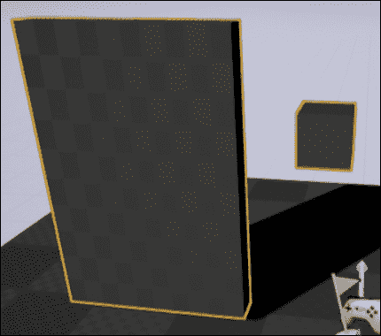

22.  Use the eyedropper beside doorbell's **Door to Open**, as shown in the following screenshot, then click on the door actor instance in your level:

    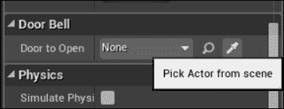

    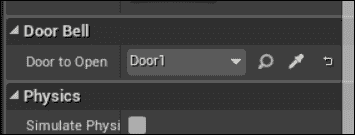

23.  Create a new Action binding in the editor called `Interact`**,** and bind it to a key of your choice:

    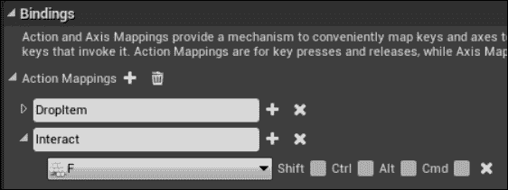

24.  发挥你的水平，走到门铃前。看看它，然后按你绑定的任何键`Interact`。确认门移动一次。
25.  您也可以直接与门互动，以接收有关它的一些信息。

## 它是如何工作的...

1.  与以前的食谱一样，我们将`UFUNCTION`标记为`BlueprintNativeEvent`和`BlueprintCallable`，以允许`UInterface`在本机代码或蓝图中实现，并允许使用任何一种方法调用函数。
2.  为方便起见，我们基于`StaticMeshActor`创建`DoorBell`，并有`DoorBell`实现`Interactable`接口。
3.  在`DoorBell`的构造函数中，我们将`HasBeenPushed`和`DoorToOpen`初始化为默认的安全值。
4.  在`CanInteract`的实现中，我们返回`HasBeenPushed`的逆，以便一旦按下按钮，就无法与之交互。
5.  在`PerformInteract`内部，我们检查是否有要打开的门对象的引用。
6.  如果我们有一个有效的引用，我们验证 door actor 实现了`Openable`，然后我们在我们的 door 上调用`Open`函数。
7.  在`Door`内，我们同时实现`Interactable`和`Openable`，并覆盖每个函数。
8.  我们将`CanInteract`的`Door`实现定义为与默认值相同。
9.  在`PerformInteract`内，我们向用户显示一条消息。
10.  在`Open`内部，我们使用`AddActorLocalOffset`将门移动一定距离。使用蓝图中的时间线或线性插值，我们可以使过渡平滑而不是传送。
11.  最后，我们创建一个新的`Pawn`，以便玩家可以实际与对象交互。
12.  我们创建一个`TryInteract`函数，我们将其绑定到重写的`SetupPlayerInputComponent`函数中的`Interact`输入操作。
13.  这意味着当播放器执行绑定到`Interact`的输入时，我们的`TryInteract`功能将运行。
14.  `TryInteract`获取对`PlayerController`的引用，施放所有棋子都具有的通用控制器引用。
15.  通过`PlayerController`检索到`PlayerCameraManager`，因此我们可以访问播放器摄像机的当前位置和旋转。
16.  我们使用相机的位置创建起点和终点，然后在远离相机位置的正向方向上 100 单元，并将它们传递到`GetWorld::SweepSingleByObjectType`。
17.  此函数包含许多参数。`HitResult`是一个变量，它允许函数返回有关跟踪命中的任何对象的信息。`CollisionObjectQueryParams`允许我们指定我们对动态项、静态项或两者都感兴趣。
18.  我们通过使用`MakeSphere`函数传递形状来完成球体跟踪。
19.  通过定义一个圆柱体来检查对象而不是一条直线，球体轨迹允许出现稍微更多的人为错误。鉴于玩家可能不会完全看你的物体，你可以根据需要调整球体的半径。
20.  最后一个参数，`SweepSingleByObjectType`，是一个给跟踪一个名称的结构，让我们指定我们是否在碰撞复杂的碰撞几何，最重要的是，允许我们指定我们要忽略启动跟踪的对象。
21.  如果跟踪完成后，`HitResult`包含一个 actor，我们检查 actor 是否实现了我们的接口，然后尝试在其上调用`CanInteract`。
22.  如果演员指示是，则可以与之交互，因此我们告诉它实际执行交互。