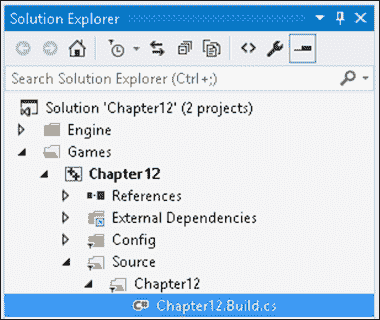
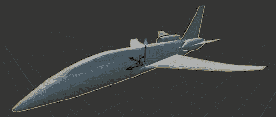
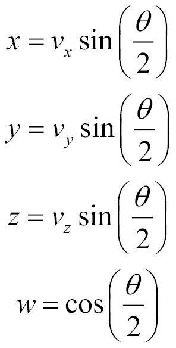
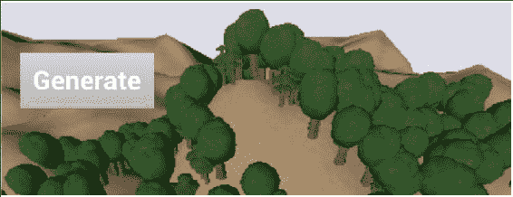
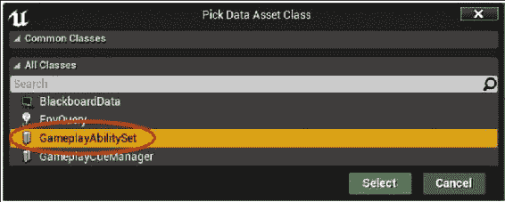

# 十二、使用 UE4 API

**应用编程接口** (**API**) 是您作为程序员指导引擎的方式，从而指导 PC 做什么。UE4 的所有功能都被封装到模块中，包括非常基本的和核心的功能。每个模块都有一个用于它的 API。要使用 API，有一个非常重要的链接步骤，您必须在`ProjectName.Build.cs`文件中列出您将在构建中使用的所有 API，该文件位于**解决方案资源管理器**窗口中。

### 提示

不要将任何 UE4 项目命名为与 UE4 API 名称之一完全相同的名称!



UE4 引擎内部有各种各样的 api，它们将功能暴露给它的各个基本部分。我们将在本章中探讨的一些有趣的 api 如下:

*   Core/Logging API-定义自定义日志类别
*   Core/Logging API-`FMessageLog`将消息写入**消息日志**
*   核心/数学应用编程接口-使用`FRotator`旋转
*   核心/数学应用编程接口-使用`FQuat`旋转
*   核心/数学 API-使用`FRotationMatrix`旋转使一个对象面对另一个对象
*   景观 API-带 Perlin 噪声的景观生成
*   树叶 API-将树木添加到您的水平
*   景观和树叶 APIs-使用景观和树叶 APIs 生成地图
*   游戏能力 API-用游戏控制触发演员的游戏能力
*   游戏能力应用编程接口-用`AttributeSet`实现统计信息
*   GameplayAbilities API-用`GameplayEffect`实现 buffs
*   GameplayTags API-将`GameplayTags`附加到演员
*   游戏任务应用编程接口 -- 让事情发生在`GameplayTasks`
*   HTTP API-Web 请求
*   HTTP API-进度条

# 简介

编辑器中提供的 UE4 引擎的基本功能非常广泛。C 代码中的功能实际上被分成称为 api 的小部分。UE4 代码库中的每个重要功能都有一个单独的 API 模块。这样做是为了保持代码库高度组织化和模块化。

### 提示

使用不同的 api 可能需要在您的`Build.cs`文件中进行特殊链接!如果遇到构建错误，请确保检查是否存在与正确 api 的链接!

完整的 API 列表位于以下文档中: [https://docs.unrealengine.com/latest/INT/API/](https://docs.unrealengine.com/latest/INT/API/) 。

# Core/Logging API-定义自定义日志类别

UE4 本身定义了几个日志记录类别，包括类别，如`LogActor`，它与`Actor`类有任何日志消息，`LogAnimation`，它记录关于动画的消息。通常，UE4 为每个模块定义了一个单独的日志记录类别。这允许开发人员将其日志消息输出到不同的日志流。每个日志 steam 的名称都以输出的消息为前缀，如以下来自引擎的示例日志消息所示:

```cpp
LogContentBrowser: Native class hierarchy updated for 'HierarchicalLODOutliner' in 0.0011 seconds. Added 1 classes and 2 folders.
LogLoad: Full Startup: 8.88 seconds (BP compile: 0.07 seconds)
LogStreaming:Warning: Failed to read file '../../../Engine/Content/Editor/Slate/Common/Selection_16x.png' error.
LogExternalProfiler: Found external profiler: VSPerf
```

以上是来自引擎的示例日志消息，每个都以其日志类别为前缀。警告消息显示为黄色，并且前面也添加了**警告**。

您将在 Internet 上找到的示例代码倾向于将`LogTemp`用于 UE4 项目自己的消息，如下所示:

```cpp
UE_LOG( LogTemp, Warning, TEXT( "Message %d" ), 1 );
```

我们实际上可以通过定义我们自己的自定义`LogCategory`来改进这个公式。

## 准备就绪

准备一个 UE4 项目，您想在其中定义自定义日志。使用此日志打开一个头文件，该头文件将包含在几乎所有文件中。

## 怎么做…

1.  Open the main header file for your project; for example, if your project's name is `Pong`, you'll open `Pong.h`. Add the following line of code after `#include Engine.h`:

    ```cpp
    DECLARE_LOG_CATEGORY_EXTERN( LogPong, Log, All ); // Pong.h
    ```

    在`AssertionMacros.h`中定义，此声明有三个参数，分别如下:

    *   `CategoryName`: 这是正在定义的日志类别名称 (`LogPong`这里)
    *   `DefaultVerbosity`: 这是在日志消息上使用的默认详细信息
    *   `CompileTimeVerbosity`: 这是烘焙成编译代码的冗长
2.  在项目的主`.cpp`文件中，包括以下代码行:

    ```cpp
    DEFINE_LOG_CATEGORY( LogPong ); // Pong.cpp
    ```

3.  Use your log with the various display categories, as follows:

    ```cpp
    UE_LOG( LogPong, Display, TEXT( "A display message, log is working" ) ); // shows in gray
    UE_LOG( LogPong, Warning, TEXT( "A warning message" ) );
    UE_LOG( LogPong, Error, TEXT( "An error message " ) );
    ```

    

## 它是如何工作的…

通过将消息输出到**输出日志** (**窗口** | **开发人员工具** | **输出日志**) 以及文件来进行日志记录。输出到**输出日志**的所有信息也被镜像到位于项目的`/Saved/Logs`文件夹中的简单文本文件。日志文件的扩展名是`.log`，最近的一个名为`YourProjectName.log`。

## 还有更多…

您可以使用以下控制台命令从编辑器中启用或抑制特定日志通道的日志消息:

```cpp
Log LogName off // Stop LogName from displaying at the output
Log LogName Log // Turn LogName's output on again
```

如果要编辑某些内置日志类型的输出级别的初始值，可以使用 C 类创建对`Engine.ini`配置文件的更改。您可以在`engine.ini`配置文件中更改初始值。有关更多详细信息，请参见[https://wiki.unrealengine.com/Logs,_](https://wiki.unrealengine.com/Logs,_Printing_Messages_To_Yourself_During_Runtime) 。

## 另见

*   `UE_LOG`将其输出发送到**输出窗口**。如果您还想使用更专业的**消息日志**窗口，您可以使用`FMessageLog`对象来编写输出消息。`FMessageLog`同时写入**消息日志**和**输出窗口**。有关详细信息，请参阅下一个食谱。

# Core/Logging API-FMessageLog 将消息写入消息日志

`FMessageLog`是一个对象，它允许您将输出消息写入**消息日志** (**窗口** | **开发人员工具** | **消息日志**) 和**输出日志** (**窗口** | **开发者工具** | **输出日志**)。

## 准备就绪

准备好您的项目，并提供一些信息以登录到**消息日志**。在 UE4 编辑器中显示**消息日志**。以下是**消息日志**的截图:


## 怎么做…

1.  Add `#define` to your main header file (`ProjectName.h`) defining `LOCTEXT_NAMESPACE` as something unique to your codebase:

    ```cpp
    #define LOCTEXT_NAMESPACE "Chapter12Namespace"
    ```

    这个`#define`被我们用来生成`FText`对象的`LOCTEXT()`宏使用，但在输出消息中看不到。

2.  通过在非常全局的地方构建它来声明你的`FMessageLog`。您可以在您的`ProjectName.h`文件中使用`extern`。以下面一段代码为例:

    ```cpp
    extern FName LoggerName;
    extern FMessageLog Logger;
    ```

3.  And then, create your `FMessageLog` by defining it in a `.cpp` file and registering it with `MessageLogModule`. Be sure to give your logger a clear and unique name on construction. It's the category of your log that will appear to the left of your log messages in **Output Log**. For example, `ProjectName.cpp`:

    ```cpp
    #define FTEXT(x) LOCTEXT(x, x)
    FName LoggerName( "Chapter12Log" );
    FMessageLog CreateLog( FName name )
    {
      FMessageLogModule& MessageLogModule = 
      FModuleManager::LoadModuleChecked<FMessageLogModule>
      ("MessageLog");
      FMessageLogInitializationOptions InitOptions;
      InitOptions.bShowPages = true;// Don't forget this!
      InitOptions.bShowFilters = true;
      FText LogListingName = FTEXT( "Chapter 12's Log Listing" );
      MessageLogModule.RegisterLogListing( LoggerName, LogListingName, InitOptions );
    }
    // Somewhere early in your program startup
    // (eg in your GameMode constructor)
    AChapter12GameMode::AChapter12GameMode()
    {
      CreateLogger( LoggerName );
      // Retrieve the Log by using the LoggerName.
      FMessageLog logger( LoggerName );
      logger.Warning(
      FTEXT( "A warning message from gamemode ctor" ) );
    }
    ```

    ### 提示

    `KEY`到`LOCTEXT` (第一个参数) 必须是唯一的，否则你会得到一个先前散列的字符串。如果你愿意，你可以加入一个`#define`，重复参数到`LOCTEXT`两次，就像我们之前做的那样。

    ```cpp
    #define FTEXT(x) LOCTEXT(x, x)
    ```

4.  Log your messages using the following code:

    ```cpp
    Logger.Info( FTEXT( "Info to log" ) );
    Logger.Warning( FTEXT( "Warning text to log" ) );
    Logger.Error( FTEXT( "Error text to log" ) );
    ```

    此代码使用前面定义的`FTEXT()`宏。确保它在你的代码库中。

    ### 提示

    初始化后再次构造消息日志将检索原始消息日志的副本。例如，在代码中的任何位置，您都可以编写以下代码:

    ```cpp
    FMessageLog( LoggerName ).Info( FTEXT( "An info message" ) );
    ```

# 核心/数学 API-使用 FRotator 旋转

UE4 中的旋转具有这样的完整的实现，很难选择如何旋转对象。主要有三种方法 -- `FRotator`、`FQuat`、`FRotationMatrix`。这个配方概述了三种不同的物体旋转方法中的第一种 -- `FRotator`的构造和使用。使用此方法以及以下两个食谱，您可以一目了然地选择一种用于旋转对象的方法。

## 准备就绪

有一个 UE4 项目，它有一个对象，你可以得到一个 C 接口。例如，您可以构造一个从`Actor`派生的 C 类硬币来测试旋转。重写`Coin::Tick()`方法，从 C 代码应用您的旋转。或者，您可以从蓝图中调用`Tick`事件中的这些旋转函数。

在这个例子中，我们将以每秒一度的速度旋转对象。实际旋转将是自创建对象以来的累积时间。要得到这个值，我们只需要调用`GetWorld()->TimeSeconds`。

## 怎么做…

1.  创建一个名为`Coin`的`Actor`类的自定义 C 派生。
2.  在 C 代码中，重写`Coin`actor 导数的`::Tick()`函数。这将允许您对每个帧中的 actor 进行更改。
3.  可以使用 stock pitch，yaw 和 roll 构造函数来构造您的`FRotator. FRotators`，如下面的示例所示:

    ```cpp
    FRotator( float InPitch, float InYaw, float InRoll );
    ```

4.  您的`FRotator`将按如下方式构建:

    ```cpp
    FRotator rotator( 0, GetWorld()->TimeSeconds, 0 );
    ```

5.  The standard orientation for an object in UE4 is with Forward facing down the *+X* axis. Right is the *+Y* axis, and Up is *+Z*.

    

6.  俯仰是绕*Y*轴 (横越) 旋转，偏航是绕*Z*轴 (向上) 旋转，滚转是绕*X*轴旋转。最好从以下三点来理解:
    *   **俯仰**: 如果你想到 UE4 标准坐标中的飞机，*Y*轴沿着翼展 (俯仰使它向前和向后倾斜)
    *   **偏航**: *Z*轴直线上下 (偏航左右转)
    *   **Roll**: The *X* axis goes straight along the fuselage of the plane (rolling does barrel rolls)

        ### 提示

        您应该注意，在其他约定中，*X*轴是俯仰，*Y*轴是偏航，*Z*轴是滚动。

7.  使用`SetActorRotation`成员函数将您的`FRotator`应用于您的演员，如下所示:

    ```cpp
    FRotator rotator( 0, GetWorld()->TimeSeconds, 0 );
    SetActorRotation( rotation );
    ```

# 使用 FQuat 的核心/数学 API-旋转

四元数听起来令人生畏，但它们非常容易使用。您可能需要使用以下视频回顾背后的理论数学:

*   神奇四元数由 phermile-[https://www.youtube.com/watch？v= 3BR8tK-LuB0](https://www.youtube.com/watch?v=3BR8tK-LuB0)
*   理解四元数，吉姆·范·弗斯-[http://gdcvault.com/play/ 1017653/游戏数学程序员-理解](http://gdcvault.com/play/1017653/Math-for-Game-Programmers-Understanding)

不过，我们这里就不讲数学背景了!实际上，您不需要对数学背景四元数了解很多，就可以非常有效地使用它们。

## 准备就绪

准备一个项目和一个带有 override`::Tick()`函数的`Actor`，我们可以在其中输入 C 代码。

## 怎么做…

1.  To construct a quaternion, the best constructor to use is as follows:

    ```cpp
    FQuat( FVector Axis, float AngleRad );
    ```

    ### 注意

    **例如，要定义一个扭转旋转**:

    四元数具有四元数加法，四元数减法，与标量的乘法以及为它们定义的标量的除法等功能。它们对于以任意角度旋转事物并将物体指向彼此非常有用。

## 它是如何工作的…

四元数有点奇怪，但是使用它们相当简单。如果*v*是绕其旋转的轴，是旋转角度的大小，那么对于四元数的分量，我们得到以下方程:



因此，例如，以的角度旋转将具有以下四元数分量:


四元数的四个分量中的三个 (*x*，*y*和*z*) 定义了要旋转的轴 (由旋转角度的一半的正弦缩放)，而第四个分量 (*w*) 只有一半的余弦可以与之旋转。

## 还有更多…

四元数本身就是向量，可以旋转。只需提取四元数的 (*x*，*y*，*z*) 分量，归一化，然后旋转该向量。从具有所需旋转角的新单位向量构造一个新的四元数。

将四元数相乘在一起表示随后发生的一系列旋转。例如，绕*X*轴旋转 45 °，然后绕*Y*轴旋转 45 °，将由以下内容组成:

```cpp
FQuat( FVector( 1, 0, 0 ), PI/4.f ) *
FQuat( FVector( 0, 1, 0 ), PI/4.f );
```

# Core/Math API-使用 FRotationMatrix 旋转使一个对象面对另一个对象

`FRotationMatrix`使用一系列`::Make*`例程提供矩阵构造。它们易于使用，并且对于使一个对象面对另一个对象很有用。假设您有两个对象，其中一个跟随另一个。我们希望追随者的旋转始终面对它所跟随的东西。`FRotationMatrix`的构造方法使这一点变得容易。

## 准备就绪

一个场景中有两个演员，其中一个应该面对另一个。

## 怎么做…

1.  在 followder 的`Tick()`方法中，查看`FRotationMatrix`类下的可用构造函数。可用的是一堆构造函数，可让您通过重新定位*X*，*Y*，*Z*轴中的一个或多个来指定对象的旋转 (从股票位置)，以`FRotationMatrix::Make*()`模式命名。
2.  假设你的演员有一个默认的股票方向 (向前朝下的*X*轴，向上朝上的*Z*轴)，找到从跟随者到他正在关注的对象的向量，如这段代码所示:

    ```cpp
    FVector toFollow = target->GetActorLocation() - GetActorLocation();
    FMatrix rotationMatrix = FRotationMatrix::MakeFromXZ( toTarget, GetActorUpVector() );
    SetActorRotation( rotationMatrix.Rotator() );
    ```

## 它是如何工作的…

可以通过调用正确的函数 (取决于对象的股票方向) 来使一个对象查看另一个对象，并具有所需的向上向量。通常，您希望重新定位*X*轴 (向前)，同时指定*Y*轴 (右) 或*Z*轴 (上) 向量 (`FRotationMatrix::MakeFromXY()`)。例如，为了使演员沿着`lookAlong`向量看起来，其右侧面向右侧，我们将为其构造并设置`FRotationMatrix`如下:

```cpp
FRotationMatrix rotationMatrix = FRotationMatrix::MakeFromXY( lookAlong, right );
actor->SetActorRotation( rotationMatrix.Rotator() );
```

# 景观 API-带 Perlin 噪声的景观生成

如果您在场景中使用`ALandscape`，您可能希望使用代码对其上的高度进行编程，而不是手动将其刷入。要访问您的代码中的`ALandscape`对象及其函数，您必须在`Landscape`和`LandscapeEditor`api 中进行编译和链接。


## 准备就绪

生成景观并不具有挑战性。您需要同时链接`Landscape`和`LandscapeEditor`api，并且还需要一种编程方式来设置地图上的高度值。在这个食谱中，我们将展示如何使用 Perlin 噪声。

以前，您可能已经看到过用于着色的 Perlin 噪声，但这并不是它的全部好处。它也非常适合地形高度。您可以将多个 Perlin 噪声值求和，以获得漂亮的分形噪声。值得对 Perlin 噪声进行简要研究，以了解如何获得良好的输出。

## 怎么做…

1.  从[http://webstaff.itn.liu.se/~stegu/aqsis/ aqsis-newnoise/](http://webstaff.itn.liu.se/~stegu/aqsis/aqsis-newnoise/) 检索 Perlin 噪声模块。您需要的两个文件是`noise1234.h`和`noise1234.cpp` (或者如果您愿意，可以从该存储库中选择另一对噪声生成文件)。将这些文件链接到您的项目中，并确保将`#include YourPrecompiledHeader.h`链接到`noise1234.cpp`。
2.  链接您的`Project.Build.cs`文件中的`Landscape`和`LandscapeEditor`api。
3.  Construct an interface using UMG that allows you to click a **Generate** button to call a C++ function that will ultimately populate the current Landscape with Perlin noise values. You can do this as follows:
    *   右键单击您的**内容浏览器**，然后选择**用户界面** | **小部件蓝图**。
    *   Populate **Widget Blueprint** with a single button that kicks off a single `Gen()` function. The `Gen()` function can be attached to your `Chapter12GameMode` derived class object as that is easy to retrieve from the engine. The `Gen()` function must be `BlueprintCallable UFUNCTION()`. (See the *Creating a UFUNCTION* section in [Chapter 2](02.html#UGI01-c0ca69a0411046888a488e5085138121 "Chapter 2\. Creating Classes"), *Creating Classes*, for details on how to do so.)

        

    *   确保通过创建 UI 并将其添加到启动蓝图之一中的视口来显示您的 UI; 例如，在 HUD 的`BeginPlay`事件中。

    

4.  使用 UE4 编辑器创建景观。景观将被假定保持在屏幕上。我们只会使用代码修改它的值。
5.  在地图生成例程中，使用执行以下操作的代码修改`ALandscape`对象:
    *   通过搜索 `Level` 中的所有对象，找到级别中的`Landscape`对象。我们使用一个 C 函数来执行此操作，该函数返回级别中所有`Landscape`实例的`TArray`:

        ```cpp
        TArray<ALandscape*> AChapter12GameMode::GetLandscapes()
        {
          TArray<ALandscape*> landscapes;
          ULevel *level = GetLevel();
          for( int i = 0; i < level->Actors.Num(); i++ )
          if( ALandscape* land = Cast<ALandscape>(level->Actors[i]) )
          landscapes.Push( land );
          return landscapes;
        }
        ```

    *   Initialize the world's `ULandscapeInfo` objects for `ALandscape` editing using the very important line, which is as follows:

        ```cpp
        ULandscapeInfo::RecreateLandscapeInfo( GetWorld(), 1 );
        ```

        ### 注意

        前面的代码行非常重要。没有它，`ULandscapeInfo`对象将无法初始化，您的代码将无法工作。令人惊讶的是，这是`ULandscapeInfo`类的静态成员函数，因此它初始化了级别内的所有`ULandscapeInfo`对象。

    *   获取您的`ALandscape`对象的区，以便我们可以计算需要生成的高度值的数量。
    *   创建一组高度值来替换原始值。
    *   Calls `LandscapeEditorUtils::SetHeightmapData( landscape, data );` to park new landscape height values into your `ALandscape` object.

        例如，使用以下代码:

        ```cpp
        // a) REQUIRED STEP: Call static function
        // ULandscapeInfo::RecreateLandscapeInfo().
        // What this does is populate the Landscape object with
        // data values so you don't get nulls for your 
        // ULandscapeInfo objects on retrieval.
        ULandscapeInfo::RecreateLandscapeInfo( GetWorld(), 1 );

        // b) Assuming landscape is your landscape object pointer,
        // get extents of landscape, to compute # height values
        FIntRect landscapeBounds = landscape->GetBoundingRect();

        // c) Create height values.
        // LandscapeEditorUtils::SetHeightmapData() adds one to 
        // each dimension because the boundary edges may be used.
        int32 numHeights = (rect.Width()+1)*(rect.Height()+1);
        TArray<uint16> Data;
        Data.Init( 0, numHeights );
        for( int i = 0; i < Data.Num(); i++ ) {
          float nx = (i % cols) / cols; // normalized x value
          float ny = (i / cols) / rows; // normalized y value
          Data[i] = PerlinNoise2D( nx, ny, 16, 4, 4 );
        }

        // d) Set values in with call:
        LandscapeEditorUtils::SetHeightmapData( landscape, Data );
        ```

        ### 提示

        当地图完全平坦时，`heightmap`的初始值将全部为`32768` (`SHRT_MAX` (或`USHRT_MAX/2+1`)。这是因为地图使用无符号短裤 (`uint16`) 作为其值，使其无法接受负值。为了使地图下降到`z=0`以下，程序员将默认值设为`heightmap`最大值的一半。

## 它是如何工作的…

Perlin 噪声函数用于为 (*x*，*y*) 坐标对生成高度值。使用了 2D 版本的 Perlin 噪声，以便我们可以基于 2 空间空间坐标获得 Perlin 噪声值。

## 还有更多…

您可以使用地图的空间坐标来处理 Perlin 噪声函数，并将地图的高度分配给 Perlin 噪声函数的不同组合。您将需要使用 Perlin 噪声功能的多个八度的总和来获得更多细节。

`PerlinNoise2D`生成函数如下所示:

```cpp
uint16 AChapter12GameMode::PerlinNoise2D( float x, float y,
  float amp, int32 octaves, int32 px, int32 py )
{
  float noise = 0.f;
  for( int octave = 1; octave < octaves; octave *= 2 )
  {
    // Add in fractions of faster varying noise at lower 
    // amplitudes for higher octaves. Assuming x is normalized, 
    // WHEN octave==px  you get full period. Higher frequencies 
    // will go out and also meet period.
    noise += Noise1234::pnoise( x*px*octave, y*py*octave, px, py ) / octave;
  }
  return USHRT_MAX/2.f + amp*noise;
}
```

`PerlinNoise2D`函数说明了该函数的中层值 (海平面或平坦土地) 的值应为`SHRT_MAX` (`32768`)。

# 树叶 API-将树添加到您的级别

**叶子**API 是使用代码用树填充您的级别的好方法。如果你这样做，那么你可以得到一些好的结果，而不必手动产生一个自然外观的随机性手工。

我们将树叶的位置与 Perlin 噪声值相关联，以便当 Perlin 噪声值较高时，将树放置在给定位置的机会更高。

## 准备就绪

在使用 Foliage API 的代码接口之前，应尝试使用编辑器内功能以熟悉该功能。之后，我们将讨论使用代码界面将树叶放置在关卡中。

### 提示

重要!请记住，`FoliageType`对象的材质必须在其面板中选中**与实例化静态网格**一起使用的复选框。如果不这样做，则该材质不能用于遮荫树叶材质。


对于您在您的`FoliageType`上使用的材质，请务必选中与实例化静态网格一起使用的**复选框，否则您的树叶将显示为灰色。**

## 怎么做…

### 手动

1.  从**模式**面板中，选择有叶子的小植物的图片。
2.  单击**添加叶子类型**下拉菜单，然后选择构建一个新的`Foliage`对象。
3.  以您想要的任何名称保存`Foliage`对象。
4.  双击以编辑新的`Foliage`对象。从您的项目中选择网格，最好是一个树形的对象，以将树叶绘制到景观中。
5.  根据您的喜好调整油漆刷大小和油漆密度。左键单击以开始在树叶中绘画。
6.  *Shift*单击以擦除已放下的树叶。擦除密度值告诉你擦除时要留下多少树叶。

### 程序上

如果您希望引擎为您分配关卡中的树叶，则在编辑器中进行操作之前，您需要介绍一些步骤。这些步骤如下:

1.  转到**内容浏览器**，然后右键单击以创建一些`FoliageType`对象以程序方式在级别中分发。
2.  单击**编辑** | **编辑器首选项**。
3.  单击**实验**选项卡。
4.  启用**程序叶子**复选框。这允许您从编辑器中访问**Procedural Foliage**类。
5.  返回**内容浏览器**，右键创建**杂项** | **程序叶子产卵器**。
6.  双击以打开您的**程序叶子产卵器**，然后在您在步骤 1 中创建的`FoliageTypes`中选择-。
7.  将您的**程序性树叶产卵器**拖到水平上并将其大小，以使其包含您想要布置程序性树叶的区域。
8.  从 “画笔” 菜单中，拖动一些程序叶子阻滞剂卷。将其中一些放在**程序叶子产卵器**体积内，以阻止叶子出现在这些区域中。
9.  向下打开菜单，然后单击**模拟**。**程序叶子产卵器**应充满叶子。
10.  实验用设置来获得你喜欢的树叶分布。

## 另见

*   前面的食谱会在游戏开始之前产生叶子。如果您对程序性树叶在运行时产生感兴趣，请参阅下一个配方，*景观和树叶 API-使用景观和树叶 API 生成地图*。

# 景观和树叶 API-使用景观和树叶 API 生成地图

我们可以使用前面提到的景观生成代码来创建景观，而程序树叶功能可以在上面随机分布一些树叶。

结合景观 API 和树叶 API 的功能，您可以按程序生成完整的地图。在这个食谱中，我们将概述如何做到这一点。

我们将以编程方式创建一个景观，并使用代码用树叶填充它。



## 准备就绪

为了准备执行此食谱，我们将需要一个带有`Generate`按钮的 UE4 项目来开始生成。您可以看到*景观 API-景观生成与 Perlin 噪声*配方的示例如何做到这一点。您只需创建一个具有`Generate`按钮的小 UMG UI 小部件。将`Generate`按钮的`OnClick`事件连接到将用于生成地形的任何 C 全局对象 (例如`Chapter12GameMode`对象) 中的 C`UFUNCTION()`。

## 怎么做…

1.  进入一个尝试放置*N*树的循环，其中*N*是要随机放置的树的数量，在`Chapter12GameMode`对象的`UPROPERTY()`中指定。
2.  从界定横向对象的 2D 框中获取随机 XY 坐标。
3.  获取 Perlin 噪声值`@ (x, y)`。您可以使用不同于用于确定树叶放置的景观高度的 Perlin 噪声公式。
4.  生成一个随机数。如果生成的数字在 Perlin 噪声函数的单位范围内，则使用`SpawnFoliageInstance`函数放置一棵树。否则，不要在那里放一棵树。

### 提示

您应该注意，我们正在使用我们选择测试树位置的位置中的潜在随机性来覆盖位置的随机性。在那里放置一棵树的实际机会取决于那里的 Perlin 噪声值，以及它是否在`PerlinTreeValue`的单位范围内。

非常密集的树分布在地图上看起来像等值线。等值线的宽度是单位范围。

## 它是如何工作的…

Perlin 噪声通过产生平滑噪声来工作。对于间隔中的每个位置 (例如 *[-1,1]* )，都有一个平滑的变化的 Perlin 噪声值。


Perlin 噪声值是在 2D 纹理上采样的。在每个像素处 (甚至在两者之间)，我们都可以获得非常平滑变化的噪声值。

将八度音阶 (或整数倍数) 添加到一些在 Perlin 噪声函数中沿距离传播的变量中，可以使我们获得锯齿状的效果; 例如，云层中的簇或山脉中的峭壁是通过较宽间隔的样本获得的，从而产生更快的变化噪声。

为了获得看起来很酷的 Perlin 噪声输出，我们将简单地将数学函数应用于采样的 Perlin 噪声值; 例如，sin 和 cos 函数可以为您生成一些看起来很酷的大理石效果。

### 提示

Perlin 噪声变得周期性，即可平铺，此配方中较早链接的实现提供了 Perlin 噪声函数。默认情况下，Perlin 噪声不是周期性的。如果你需要你的 Perlin 噪音是周期性的，小心你正在调用哪个库函数。

基 Perlin 噪声函数是一个确定性的函数，每次调用它都返回相同的值。

## 还有更多…

您还可以在您的`Chapter12GameMode`对象派生中设置滑块来影响树叶和景观生成，包括以下参数:

*   景观的振幅
*   树叶的密度
*   树叶等轮廓水平
*   树叶高度或尺度的差异

# GameplayAbilities API-用游戏控件触发演员的游戏能力

**GameplayAbilities**API 可用于附加 C 函数以在某些按钮按下时调用，从而触发游戏单元在游戏过程中对击键事件的响应中展现其能力。在这个食谱中，我们将向您展示如何做到这一点。

## 准备就绪

列举并描述你的游戏角色的能力。您将需要知道您的角色在响应此配方中的关键事件时会做什么。

我们需要在这里使用几个对象; 它们如下所示:

*   `UGameplayAbility`类-需要这来派生`UGameplayAbility`类的 C 类实例，每个能力一个派生类。
    *   通过重写可用函数来定义每个能力在`.h`和`.cpp`中的作用，例如`UGameplayAbility::ActivateAbility`，`UGameplayAbility::InputPressed`，`UGameplayAbility::CheckCost`，`UGameplayAbility::ApplyCost`，`UGameplayAbility::ApplyCooldown`等
*   `GameplayAbilitiesSet`-这是一个`DataAsset`派生对象，它包含一个系列的 enum 'd 命令值，以及相应的`UGameplayAbility`派生类的蓝图，这些类定义了该特定输入命令的行为。每个游戏可玩性都通过按键或鼠标点击开始，这在`DefaultInput.ini`中设置。

## 怎么做…

在下文中，我们将为`Warrior`类对象实现一个名为`UGameplayAbility_Attack`的`UGameplayAbility`导数。我们将把这个游戏功能附加到输入命令字符串`Ability1`，我们将在鼠标左键点击时激活它。

1.  在您的`ProjectName.Build.cs`文件中链接`GameplayAbilities`API。
2.  从`UGameplayAbility`派生一个 C 类。例如，写一个 C`UCLASS UGameplayAbility_Attack`。
3.  至少，您要覆盖以下内容:
    *   `UGameplayAbility_Attack::CanActivateAbility`成员函数，用于指示何时允许 actor 调用该能力。
    *   `UGameplayAbility_Attack::CheckCost`功能，用于指示玩家是否有能力使用能力。这是非常重要的，因为如果这返回 false，能力调用应该失败。
    *   `UGameplayAbility_Attack::ActivateAbility`成员函数，并编写`Warrior`激活其`Attack`能力时要执行的代码。
    *   `UGameplayAbility_Attack::InputPressed` 成员函数并响应分配给该能力的键输入事件。
4.  从 UE4 编辑器中的`UGameplayAbility_Attack`对象派生一个蓝图类。
5.  Inside the editor, navigate to **Content Browser** and create a `GameplayAbilitiesSet` object by:
    *   右键单击**内容浏览器**，选择**杂项** | **数据资产**
    *   In the dialog box that follows, select `GameplayAbilitySet` for Data Asset Class

        ### 提示

        实际上，`GameplayAbilitySet`对象是`UDataAsset`导数。它位于`GameplayAbilitySet.h`中，包含一个成员函数`GameplayAbilitySet::GiveAbilities()`，出于后面步骤中列出的原因，我强烈建议您不要使用它。

    

6.  将您的`GameplayAbilitySet`数据资产命名为与`Warrior`对象相关的内容，以便我们知道将其选择到`Warrior`类中 (例如`WarriorGameplayAbilitySet`)。
7.  双击打开并编辑新的`WarriorAbilitySet`数据资产。通过在其中的`TArray`对象上单击**，堆叠在`GameplayAbility`类衍生蓝图列表中。您的`UGameplayAbility_Attack`对象必须出现在下拉列表中。**
***   将`UPROPERTY UGameplayAbilitySet* gameplayAbilitySet`成员添加到您的`Warrior`类。编译，运行和选择`WarriorAbilitySet`，因为它位于**内容浏览器** (在步骤 5 到 7 中创建)，这个`Warrior`能够的能力。*   确保你的`Actor`类导数也从`UAbilitySystemInterface`接口派生。这是非常重要的，所以调用`(Cast<IAbilitySystemInterface>(yourActor))->GetAbilitySystemComponent()`成功。*   在构建演员之后的某个时候，调用`gameplayAbilitySet->GiveAbilities( abilitySystemComponent );`或进入一个循环，如以下步骤所示，您为`gameplayAbilitySet`中列出的每个能力调用`abilitySystemComponent->GiveAbility()`。*   Write an override for `AWarrior::SetupPlayerInputComponent( UInputComponent* Input )` to connect the input controller to the Warrior's GameplayAbility activations. After doing so, iterate over each GameplayAbility listed in your GameplayAbilitySet's **Abilities** group.

    ### 提示

    不要使用`GameplayAbilitySet::GiveAbilities()`成员函数，因为它不允许您访问实际需要稍后绑定和调用输入组件的一组`FGameplayAbilitySpecHandle`对象。** 

```cpp
void AWarrior::SetupPlayerInputComponent( UInputComponent* Input )
{
  Super::SetupPlayerInputComponent( Input );
  // Connect the class's AbilitySystemComponent
  // to the actor's input component
  AbilitySystemComponent->BindToInputComponent( Input );

  // Go thru each BindInfo in the gameplayAbilitySet.
  // Give & try and activate each on the AbilitySystemComponent.
  for( const FGameplayAbilityBindInfo& BindInfo : 
  gameplayAbilitySet->Abilities )
  {
    // BindInfo has 2 members:
    //   .Command (enum value)
    //   .GameplayAbilityClass (UClass of a UGameplayAbility)
    if( !BindInfo.GameplayAbilityClass )
    {
      Error( FS( "GameplayAbilityClass %d not set",
      (int32)BindInfo.Command ) );
      continue;
    }

    FGameplayAbilitySpec spec(
    // Gets you an instance of the UClass
    BindInfo.GameplayAbilityClass->
    GetDefaultObject<UGameplayAbility>(),
    1, (int32)BindInfo.Command ) ;

 // STORE THE ABILITY HANDLE FOR LATER INVOKATION
 // OF THE ABILITY
    FGameplayAbilitySpecHandle abilityHandle = 
    AbilitySystemComponent->GiveAbility( spec );

    // The integer id that invokes the ability 
    // (ith value in enum listing)
    int32 AbilityID = (int32)BindInfo.Command;

    // CONSTRUCT the inputBinds object, which will
    // allow us to wire-up an input event to the
    // InputPressed() / InputReleased() events of
    // the GameplayAbility.
    FGameplayAbiliyInputBinds inputBinds(
      // These are supposed to be unique strings that define
      // what kicks off the ability for the actor instance.
      // Using strings of the format 
      // "ConfirmTargetting_Player0_AbilityClass"
      FS( "ConfirmTargetting_%s_%s", *GetName(), 
        *BindInfo.GameplayAbilityClass->GetName() ),
      FS( "CancelTargetting_%s_%s", *GetName(), 
        *BindInfo.GameplayAbilityClass->GetName() ),
      "EGameplayAbilityInputBinds", // The name of the ENUM that 
      // has the abilities listing (GameplayAbilitySet.h).
      AbilityID, AbilityID
    );
 // MUST BIND EACH ABILITY TO THE INPUTCOMPONENT, OTHERWISE
 // THE ABILITY CANNOT "HEAR" INPUT EVENTS.
    // Enables triggering of InputPressed() / InputReleased() 
    // events, which you can in-turn use to call 
    // TryActivateAbility() if you so choose.
    AbilitySystemComponent->BindAbilityActivationToInputComponent(
      Input, inputBinds
    );

    // Test-kicks the ability to active state.
    // You can try invoking this manually via your
    // own hookups to keypresses in this Warrior class
    // TryActivateAbility() calls ActivateAbility() if
    // the ability is indeed invokable at this time according
    // to rules internal to the Ability's class (such as cooldown
    // is ready and cost is met)
    AbilitySystemComponent->TryActivateAbility( 
      abilityHandle, 1 );
  }
}
```

## 它是如何工作的…

您必须通过一系列对具有适当构造的`FGameplayAbilitySpec`对象的`UAbilitySystemComponent::GiveAbility( spec )`的调用，将一组`UGameplayAbility`对象中的`UAbilitySystemComponent`对象分类并链接到您的演员的`UAbilitySystemComponent`对象。这就是用这堆`GameplayAbilities`来装饰你的演员。每个`UGameplayAbility`的功能，它的成本，冷却时间和激活都被巧妙地包含在你将构建的`UGameplayAbility`类派生中。

## 还有更多…

您需要仔细编写一堆在`GameplayAbility.h`头文件中可用的其他函数，包括以下实现:

*   `SendGameplayEvent`: 这是一个通知 GameplayAbility 某些一般游戏事件发生的函数。
*   `CancelAbility`: 这是一个功能，用于在中途停止能力的使用，并使能力处于中断状态。
*   请记住，在`UGameplayAbility`类声明的底部附近有一堆现有的`UPROPERTY`，它们在添加或删除某些`GameplayTags`时激活或取消该功能。有关详细信息，请参见以下*GameplayTags API-将 GameplayTags 附加到 actor*食谱。
*   再多一堆!探索 API 并实现您发现在代码中有用的功能。

## 另见

*   `GameplayAbilities`API 是一系列丰富且交织的对象和功能。真正探索`GameplayEffects`、`GameplayTags`和`GameplayTasks`，以及它们如何与`UGameplayAbility`类集成，以充分探索库所提供的功能。

# GameplayAbilities API-使用 utattributeset 实现统计信息

`GameplayAbilities`API 允许您将一组属性 (即`UAttributeSet`) 关联到 Actor。`UAttributeSet`描述了适合该演员游戏内属性的属性，如`Hp`、`Mana`、`Speed`、`Armor`、`AttackDamage`等。您可以定义一个游戏范围内所有演员共有的属性集，或者为不同类别的演员定义几个不同的属性集。

## 准备就绪

`AbilitySystemComponent`是你需要添加到你的演员来装备他们使用*游戏能力 API*和`UAttributeSet`s 的第一件事。要定义自定义`UAttributeSet`，您只需从`UAttributeSet`基类派生，并使用自己的`UPROPERTY`系列成员扩展基类。之后，您必须将您的自定义`AttributeSet`注册到您的`Actor`类 '`AbilitySystemComponent`。

## 怎么做…

1.  链接到您的`ProjectName.Build.cs`文件中的`GameplayAbilities`API。
2.  In its own file, derive from the `UAttributeSet` class and deck the class out with a set of `UPROPERTY` that you want each Actor to have in their property set. For example, you might want to declare your `UAttributeSet` derivate class similar to the following piece of code:

    ```cpp
    #include "Runtime/GameplayAbilities/Public/AttributeSet.h"
    #include "GameUnitAttributeSet.generated.h"

    UCLASS(Blueprintable, BlueprintType)
    class CHAPTER12_API UGameUnitAttributeSet : public UAttributeSet
    {
      GENERATED_BODY()
      public:
      UGameUnitAttributeSet( const FObjectInitializer& PCIP );
      UPROPERTY( EditAnywhere, BlueprintReadWrite, Category = GameUnitAttributes )  float Hp;
      UPROPERTY( EditAnywhere, BlueprintReadWrite, Category = GameUnitAttributes )  float Mana;
      UPROPERTY( EditAnywhere, BlueprintReadWrite, Category = GameUnitAttributes )  float Speed;
    };
    ```

    ### 提示

    如果您的代码是联网的，您可能希望在每个`UPROPERTY`上使用`UPROPERTY`宏中的复制声明启用复制。

3.  Connect `GameUnitAttributeSet` with your `AbilitySystemComponent` inside your `Actor` class by calling the following code:

    ```cpp
    AbilitySystemComponent->InitStats( 
      UGameUnitAttributeSet::StaticClass(), NULL );
    ```

    您可以将此调用放在`PostInitializeComponents()`中的某个地方，或者放在比该调用更晚的代码中。

4.  一旦你注册了`UAttributeSet`，你就可以继续下一个配方，并将`GameplayEffect`应用于属性集中的某些元素。
5.  确保您的`Actor`类对象通过派生来实现`IAbilitySystemInterface`。这是非常重要的，因为`UAbilitySet`对象将尝试在代码的各个位置对`IAbilitySystemInterface`进行强制转换以调用`GetAbilitySystemComponent()`。

## 它是如何工作的…

`UAttributeSets`只允许您枚举和定义不同参与者的属性。`GameplayEffects`将是您更改特定参与者属性的方法。

## 还有更多…

您可以在`GameplayEffects`的定义中编码，这将是作用于 AbilitySystemComponent 的`AttributeSet`集合的东西。您还可以为在特定时间或事件运行的通用函数编写`GameplayTasks`，甚至可以响应标签添加 (`GameplayTagResponseTable.cpp`)。您可以定义`GameplayTags`来修改游戏可玩性行为，以及在游戏过程中选择和匹配游戏单元。

# GameplayAbilities API-用 GameplayEffect 实现 buffs

buff 只是一种效果，它从游戏单元的`AttributeSet`中引入了对游戏单元属性的临时、永久或重复更改。Buffs 可以是好是坏，提供奖金或罚款。例如，您可能有一个将单位速度降低到一半的十六进制 buff，一个将单位速度提高 2 倍的天使翼 buff，或者一个每 5 秒恢复`5 hp`三分钟的天使翼 buff。`GameplayEffect`影响演员的`AbilitySystemComponent`所附的`UAttributeSet`中的单个游戏属性。

## 准备就绪

头脑风暴你的游戏单位在游戏中发生的效果。确保您已经创建了一个`AttributeSet`，显示在上一个食谱中，并带有您想要影响的游戏属性。选择要实现的效果，并按照示例中的后续步骤进行操作。

### 提示

您可能希望通过转到**输出日志**并输入```cpp，然后再输入`Log LogAbilitySystem` `All`来将`LogAbilitySystem`变为`VeryVerbose`设置。

这将在**输出日志**中显示更多来自`AbilitySystem`的信息，从而更容易查看系统中发生的事情。

## 怎么做…

在以下步骤中，我们将构造一个快速`GameplayEffect`，将`50 hp`治愈到所选单元的`AttributeSet`:

1.  使用具有以下代码行的`CONSTRUCT_CLASS`宏构造`UGameplayEffect`类对象:

    ```
    // Create GameplayEffect recovering 50 hp one time only to unit
    CONSTRUCT_CLASS( UGameplayEffect, RecoverHP );
    ```cpp

2.  使用`AddModifier`功能更改`GameUnitAttributeSet`的`Hp`字段，如下所示:

    ```
    AddModifier( RecoverHP,
    GET_FIELD_CHECKED( UGameUnitAttributeSet, Hp ),
    EGameplayModOp::Additive, FScalableFloat( 50.f ) );
    ```cpp

3.  填写`GameplayEffect`的其他属性，包括`DurationPolicy`、`ChanceToApplyToTarget`等字段或其他要修改的字段，如下所示:

    ```
    RecoverHP->DurationPolicy = EGameplayEffectDurationType::HasDuration;
    RecoverHP->DurationMagnitude = FScalableFloat( 10.f );
    RecoverHP->ChanceToApplyToTarget = 1.f;
    RecoverHP->Period = .5f;
    ```cpp

4.  将效果应用于您选择的`AbilitySystemComponent`。底层`UAttributeSet`会受到您调用的影响和修改，如下面的代码所示:

    ```
    FActiveGameplayEffectHandle recoverHpEffectHandle = 
    AbilitySystemComponent->ApplyGameplayEffectToTarget( RecoverHP, 
    AbilitySystemComponent, 1.f );
    ```cpp

## 它是如何工作的…

`GameplayEffects`是简单的影响演员的`AttributeSet`变化的小对象。`GameplayEffects`可以在`Period`的间隔中发生一次或重复发生。您可以快速编程效果，并且`GameplayEffect`类创建旨在内联。

## 还有更多…

一旦`GameplayEffect`处于活动状态，您将收到`FActiveGameplayEffectHandle`。您可以使用此句柄附加函数委托，以便在效果结束时使用`FActiveGameplayEffectHandle`的`OnRemovedDelegate`成员运行。例如，您可能会调用:

```
FActiveGameplayEffectHandle recoverHpEffectHandle = 
AbilitySystemComponent->ApplyGameplayEffectToTarget( RecoverHP, 
AbilitySystemComponent, 1.f );
if( recoverHpEffectHandle ) {
  recoverHpEffectHandle->AddLambda( []() { 
    Info( "RecoverHp Effect has been removed." );
  } );
}
```cpp

# GameplayTags API-将 GameplayTags 附加到演员

`GameplayTags`只是小的位文本，描述玩家的状态 (或增益) 或可以附加到诸如`GameplayAbilities`和描述`GameplayEffects`的属性，以及清除这些效果的状态。所以，我们可以有`GameplayTags`，比如`Healing`或`Stimmed`，触发各种`GameplayAbilities`或`GameplayEffects`来满足我们的喜好。如果我们选择的话，我们也可以通过`GameplayTags`搜索东西，并将它们附加到我们的`AbilitySystemComponents`上。

## 怎么做…

有几个步骤可以使`GameplayTags`在您的引擎构建中正常工作; 它们如下所示:

1.  First, we will need to create a Data Table asset to carry all of our game's tag names. Right-click on **Content Browser** and select **Miscellaneous** | **Data Table**. Select a table class structure deriving from `GameplayTagTableRow`.

    

    在该数据结构下列出游戏内可用的所有标签。

2.  将`UPROPERTY() TArray<FString>`添加到您的`GameMode`对象中，以列出要加载到`GameplayTags`模块管理器中的`TagTableNames`的名称:

    ```
    UPROPERTY( EditAnywhere, BlueprintReadWrite, Category = GameplayTags )
    TArray<FString> GameplayTagTableNames;
    ```cpp

3.  在您的 GameMode 的`PostInitializeComponents`函数中，或使用`GetGameplayTagsManager`加载您选择的表中的标签:

    ```
    IGameplayTagsModule::Get().GetGameplayTagsManager().
    LoadGameplayTagTable( GameplayTagTableNames );
    ```cpp

4.  Use your `GameplayTags`. Inside each of your GameplayAbility objects, you can modify the blockedness, cancelability, and activation requirements for each GameplayAbility using tag attachment or removal.

    

您必须重建引擎，以便让您的标签在编辑器中加载。建议的引擎源补丁程序允许您挂接对`IGameplayTagsModule::Get().GetGameplayTagsManager().LoadGameplayTagTable( GameplayTagTableNames )`的调用。

要将此调用嵌入到编辑器的启动中，您需要编辑引擎的源代码。

# GameplayTasks API-让事情发生在 GameplayTasks

`GameplayTasks`用于在可重用对象中包装一些游戏功能。使用它们所要做的就是从`UGameplayTask`基类派生并覆盖一些您喜欢实现的成员函数。

## 准备就绪

进入 UE4 编辑器，导航到**类查看器**。确保已将`GameplayTasks`API 链接到`ProjectName.Build.cs`文件中，并仅使用**actor**在`GameplayTask`对象类型中进行搜索。

## 怎么做…

1.  确保已将`GameplayTasks`API 链接到`ProjectName.Build.cs`文件中。
2.  点击**文件** | **添加 C 类…** 选择从`GameplayTask`派生。为此，您必须首先勾选**显示所有类**，然后在过滤器框中键入`gameplaytask`。单击**下一个**，命名您的 C 类 (类似于`GameplayTask_TaskName`是约定)，然后将该类添加到您的项目中。该示例产生了一个粒子发射器，称为`GameplayTask_CreateParticles`。
3.  创建您的`GameplayTask_CreateParticles.h`和`.cpp`对后，导航到`.h`文件并声明一个静态构造函数，该函数为您创建`GameplayTask_CreateParticles`对象:

    ```
    // Like a constructor.
    UGameplayTask_CreateParticles* UGameplayTask_CreateParticles::ConstructTask(
      TScriptInterface<IGameplayTaskOwnerInterface> TaskOwner, 
      UParticleSystem* particleSystem,
      FVector location )
    {
      UGameplayTask_CreateParticles* task = 
      NewTask<UGameplayTask_CreateParticles>( TaskOwner );
      // Fill fields
      if( task )
      {
        task->ParticleSystem = particleSystem;
        task->Location = location;
      }
      return task;
    }
    ```cpp

4.  重写`UGameplayTask_CreateEmitter::Activate()`函数，该函数包含在`GameplayTask`生效时运行的代码，如下所示:

    ```
    void UGameplayTask_CreateEmitter::Activate()
    {
      Super::Activate();
      UGameplayStatics::SpawnEmitterAtLocation( GetWorld(), 
      ParticleSystem->GetDefaultObject<UParticleSystem>(),
      Location );
    }
    ```cpp

5.  将`GameplayTasksComponent`添加到您的`Actor`类派生，可在蓝图编辑器中**组件**选项卡的**组件**下拉列表中找到。
6.  使用以下代码在您的`Actor`衍生实例中创建并添加您的`GameplayTask`实例:

    ```
    UGameplayTask_CreateParticles* task = 
      UGameplayTask_CreateParticles::ConstructTask( this,
      particleSystem, FVector( 0.f, 0.f, 200.f ) );
    if( GameplayTasksComponent )
    {
      GameplayTasksComponent->AddTaskReadyForActivation( *task );
    }
    ```cpp

7.  此代码在您的`Actor`类派生中的任何位置运行，在`GameplayTasksComponent`之后的任何时间初始化 (`PostInitializeComponents()`之后的任何时间)。

## 它是如何工作的…

`GameplayTasks`简单地与位于您选择的`Actor`类导数内的`GameplayTasksComponent`注册。您可以在游戏过程中的任何时间激活任意数量的`GameplayTasks`来触发它们的效果。

如果您愿意，`GameplayTasks`也可以启动`GameplayEffects`来更改`AbilitySystemsComponents`的属性。

## 还有更多…

您可以为游戏中的任意数量的事件派生`GameplayTasks`。更重要的是，您可以覆盖更多的虚拟函数来挂入附加功能。

# HTTP API-Web 请求

当您在维护记分牌或其他需要对服务器进行常规 HTTP 请求访问的东西时，您可以使用 HTTP API 来执行此类 web 请求任务。

## 准备就绪

拥有允许您通过 HTTP 请求数据的服务器。如果您愿意，可以使用任何类型的公共服务器来尝试 HTTP 请求。

## 怎么做…

1.  链接到您的`ProjectName.Build.cs`文件中的 HTTP API。
2.  在您将发送 web 请求的文件中，包括`HttpModule.h`头文件、`HttpManager.h`头文件和`HttpRetrySystem.h`文件，如以下代码片段所示:

    ```
    #include "Runtime/Online/HTTP/Public/HttpManager.h"
    #include "Runtime/Online/HTTP/Public/HttpModule.h"
    #include "Runtime/Online/HTTP/Public/HttpRetrySystem.h"
    ```cpp

3.  Construct an `IHttpRequest` object from `FHttpModule` using the following code:

    ```
    TSharedRef<IHttpRequest> http=FHttpModule::Get().CreateRequest();
    ```cpp

    ### 提示

    `FHttpModule`是一个单例对象。它的一个副本存在于整个程序中，您打算将其用于与`FHttpModule`类的所有交互。

4.  将您的函数附加到`IHttpRequest`对象的`FHttpRequestCompleteDelegate`，该对象具有如下签名:

    ```
    void HttpRequestComplete( FHttpRequestPtr request,
    FHttpResponsePtr response, bool success );
    ```cpp

5.  The delegate is found inside of the `IHttpRequest` object as `http->OnProcessRequestComplete()`:

    ```
    FHttpRequestCompleteDelegate& delegate = http->OnProcessRequestComplete();
    ```cpp

    有几种方法可以将回调函数附加到委托。您可以使用以下内容:

    *   使用`delegate.BindLambda()`的 λ:

        ```
        delegate.BindLambda(
          // Anonymous, inlined code function (aka lambda)
          []( FHttpRequestPtr request, FHttpResponsePtr response, bool success ) -> void
        {
          UE_LOG( LogTemp, Warning, TEXT( "Http Response: %d, %s" ),
          request->GetResponse()->GetResponseCode(),
          *request->GetResponse()->GetContentAsString() );
        });
        ```cpp

    *   Any UObject's member function:

        ```
        delegate.BindUObject( this, &AChapter12GameMode::HttpRequestComplete );
        ```cpp

        ### 提示

        您不能在这里直接附加到`UFunction`，因为`.BindUFunction()`命令请求的参数都是`UCLASS`，`USTRUCT`或`UENUM`。

    *   Any plain old C++ object's member function using `.BindRaw`:

        ```
        PlainObject* plainObject = new PlainObject();
        delegate.BindRaw( plainObject, &PlainObject::httpHandler );
        // plainObject cannot be DELETED Until httpHandler gets called..
        ```cpp

        ### 提示

        您必须确保您的`plainObject`在 HTTP 请求完成时引用内存中的有效对象。这意味着您不能在`plainObject`上使用`TAutoPtr`，因为这将在声明它的块的末尾释放`plainObject`，但这可能是在 HTTP 请求完成之前。

    *   A 全局 C 式静态函数:

        ```
        // C-style function for handling the HTTP response:
        void httpHandler( FHttpRequestPtr request, 
        FHttpResponsePtr response, bool success )
        {
          Info( "static: Http req handled" );
        }
        delegate.BindStatic( &httpHandler );
        ```cpp

    ### 注意

    当将委托回调与对象一起使用时，请确保您正在调用的对象实例至少在`HttpResponse`从服务器返回之前一直存在。处理`HttpRequest`需要实时运行。毕竟这是一个 web 请求-考虑等待网页加载。

    您必须确保在调用回调函数的对象实例在初始调用和调用您的`HttpHandler`函数之间没有在您身上释放。当 HTTP 请求完成后回调返回时，对象必须仍在内存中。

    您不能简单地期望在附加回调函数并调用`ProcessRequest()`之后立即发生`HttpResponse`函数!使用引用计数的`UObject`实例来附加`HttpHandler`成员函数是一个很好的主意，以确保对象在 HTTP 请求完成之前一直保持在内存中。

6.  指定您要点击的网站的 URL:

    ```
    http->SetURL( TEXT( "http://unrealengine.com" ) );
    ```cpp

7.  通过调用`ProcessRequest`处理请求:

    ```
    http->ProcessRequest();
    ```cpp

## 它是如何工作的…

HTTP 对象是向服务器发送 HTTP 请求并获得 HTTP 响应所需的全部内容。您可以将 HTTP 请求/响应用于您想要的任何内容; 例如，将分数提交到高分表或从服务器检索文本以在游戏中显示。

它们带有要访问的 URL 和要在请求完成时运行的函数回调。最后，他们通过`FManager`被送走。当 web 服务器响应时，将调用您的回调，并且可以显示 HTTP 响应的结果。

## 还有更多…

您可以通过以下成员函数设置其他 HTTP 请求参数:

*   `SetVerb()`更改您的 HTTP 请求中使用的是`GET`还是`POST`方法
*   `SetHeaders()`修改您想要的任何常规标题设置

# HTTP API-进度条

来自 HTTP API 的`IHttpRequest`对象将通过在可通过`OnRequestProgress()`访问的`FHttpRequestProgressDelegate`上的回调报告 HTTP 下载进度。我们可以附加到`OnRequestProgress()`委托的函数的签名如下:

```
HandleRequestProgress( FHttpRequestPtr request, int32 sentBytes, int32 receivedBytes )
```cpp

你可能写的函数的三个参数包括: 原始的`IHttpRequest`对象、发送的字节和到目前为止收到的字节。这个函数会定期被调用，直到`IHttpRequest`对象完成，也就是你附加到`OnProcessRequestComplete()`的函数被调用。您可以使用传递给`HandleRequestProgress`函数的值来推进将在 UMG 中创建的进度条。

## 准备就绪

你需要一个互联网连接才能使用这个食谱。我们将从公共服务器请求文件。如果您愿意，您可以为您的 HTTP 请求使用公共服务器或您自己的私有服务器。

在此配方中，我们将把回调函数绑定到`OnRequestProgress()`委托，以显示从服务器下载文件的进度。准备一个项目，我们可以在其中编写一段代码，该代码将执行`IHttpRequest,`，并在其上显示百分比进度的漂亮界面。

## 怎么做…

1.  链接到您的`ProjectName.Build.cs`文件中的`UMG`和`HTTP`api。
2.  使用`ProgressBar`构建一个小的 UMG UI 来显示您的 HTTP 请求的进度。
3.  使用以下代码构造一个`IHttpRequest`对象:

    ```
    TSharedRef<IHttpRequest> http = HttpModule::Get().CreateRequest();
    ```cpp

4.  提供一个回调函数，在请求进行时调用，更新一个 visual GUI 元素:

    ```
    http->OnRequestProgress().BindLambda( []( FHttpRequestPtr request, int32 sentBytes, int32 receivedBytes ) -> void
    {
      int32 totalLen = request->GetResponse()->GetContentLength();
      float perc = (float)receivedBytes/totalLen;
      if( HttpProgressBar ) 
      HttpProgressBar->SetPercent( perc );
    } );
    ```

5.  用`http->ProcessRequest()`处理您的请求。

## 它是如何工作的…

`OnRequestProgress()`回调会随着发送字节和接收到 HTTP 进度的字节而被触发。我们将通过计算`(float)receivedBytes/totalLen`来计算完成的下载的总百分比，其中`totalLen`是以字节为单位的 HTTP 响应的总长度。使用我们附加到`OnRequestProgress()`委托回调的 lambda 函数，我们可以调用 UMG widget 的`.SetPercent()`成员函数来反映下载的进度。**