# 设置您的开发环境

本章的目标是帮助您在虚幻引擎中进行开发。 即使您已经安装并开始在引擎中工作，您可能仍会发现看一看本章是值得的，因为安装过程中的一些细节可能会对您有用。

我们还将看看 Epic Games 的启动器。 人们很容易养成习惯，把它看作是更新引擎和启动项目的一种方式，但那里也有大量有用的学习和开发资源。 忽视它们将是错误的。

对于那些计划在 Oculus Go 或 Samsung Gear 上开发移动 VR 的人，我们将带你完成设置 Android SDK 和设置一个项目以部署到设备上的过程；最后，对于那些对 C++ 开发感兴趣的人，我们将向你展示如何设置 Visual Studio 2017 以用于虚幻，以及对于那些对前沿感兴趣的人，如何下载虚幻引擎源代码并自己构建它。

通过本章的课程，我们将了解以下主题：

*   使用 Epic Games 启动器安装虚幻引擎
*   设置您的开发环境以构建移动 VR 项目
*   了解有关虚幻引擎的更多信息，以及从哪里获得帮助
*   设置开发环境以使用 C++ 构建项目
*   从源代码下载并构建虚幻引擎

# 必备条件-VR 硬件

如果您计划为桌面 VR 硬件(如 Oculus Rift 或 HTC Vive)进行开发，我们将在此假定您已经设置好耳机并确保其工作正常。 如果你还没有，现在是个好时机。 前往[https://www.vive.com/eu/setup/](https://www.vive.com/eu/setup/)或[https://www.oculus.com/setup/](https://www.oculus.com/setup/)，并在那里进行指导安装和设置操作。

请记住，当您使用耳机时，您的 VR 耳机驱动软件 Oculus Home 或 Steam VR 需要处于运行状态。

如果你要为移动独立 VR 开发，你的设置过程将涉及其他几个步骤，我们将在安装虚幻引擎后带你完成这些步骤。 我们甚至推荐那些正在开发移动 VR 的用户，您也可以使用台式 VR 耳机。 它极大地加快了调试速度，能够将您的软件直接启动到耳麦中，而不必每次都将其煮熟并部署到设备上。 这不是必须的，但你会发现它很有帮助。

无论哪种方式，测试您的耳机，确保它工作正常，然后让我们准备好我们的开发环境。

# 设置虚拟引擎

如果你要使用虚幻引擎开发 VR 应用程序，你首先需要的当然是引擎。 让我们来介绍一下设置它的过程。

# 它的成本是多少？

当考虑虚幻引擎时，一个自然的问题是它的成本。 这里的消息是好消息。 虚幻引擎是免费下载和使用的，如果你将其用于商业用途，条款是合理的。

下载引擎时，系统会要求您同意两个许可协议中的一个，具体取决于您要使用它的用途。 如果你是一名游戏开发商，你使用虚幻制作了一款游戏或应用程序并进行销售，那么你需要为每一日历季度超过 3,000 美元的总销售额支付 5%的版税。 如果你不卖你的游戏或应用程序，或者它每季度的收入低于这个数字，那么“虚幻”是可以免费使用的。

如果您将虚幻用于不打算向公众出售的东西(培训模拟、架构可视化或其他任何东西)，则根据企业许可协议的条款，虚幻是完全免费的。 对于大多数企业来说，标准的企业版**最终用户许可协议**(**EULA**)就可以了，但如果您确实需要进行更改，您可以联系 EPIC 在这里设置不同条款的企业许可：[https://www.unrealengine.com/en-US/enterprise/contact-us](https://www.unrealengine.com/en-US/enterprise/contact-us)。 史诗会和你合作的。

归根结底，现在你可以下载虚拟现实并免费使用它，如果你开始用它赚钱，条款是合理和明确的。

While we're on the topic, it's worth mentioning that the version of Unreal you get when you download the engine is the same version professional developers use, including the devs at Epic. There's no split between a "pro" version and everything else: everything's included and everything's turned on.

# 创建 Epic Games 帐户

那我们就开始吧。 我们将首先转到[https://www.unrealengine.com](https://www.unrealengine.com)并点击下载链接。 如果您已经在 Epic.com 上创建了帐户，请在此处登录。 如果还没有，现在是创建一个的时候了。

在您注册或登录之后，系统会询问您需要同意哪种许可证-游戏开发者许可证还是企业许可证。 选一件适合你情况的。 接下来，选择是下载 Windows 版还是 Mac 版，下载相应的 EpicInstaller，然后运行它。

这将安装 Epic Games 启动器，您将使用它作为管理引擎版本、插件、库内容和学习资源的中心。 这里有一些有用的东西。

# Epic Games 发射器

下载并安装启动程序后，打开它。 它将要求您使用刚刚登录 Etic 网站时使用的相同帐户进行登录。 (启动器也可以离线使用，因此您仍然可以在没有互联网连接的情况下运行引擎，但当然，如果您在线，您可以使用更多有用的东西。)

登录后，请查看启动器左边缘的选项卡集。 有一个虚幻引擎的标签，然后是一系列关于 Epics 商店、你的游戏库和你的朋友的标签。 选择虚幻引擎选项卡。 我们将在这里度过我们所有的时间：

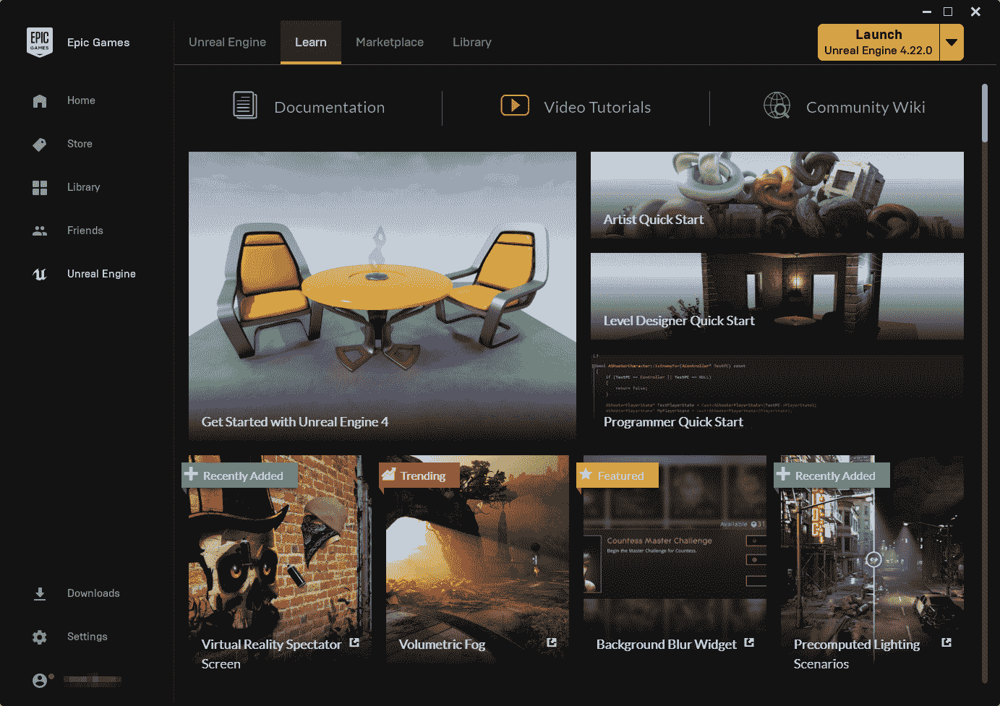

The Epic Games Launcher as of version 4.22; its layout changes fairly frequently, but the principles remain the same

在虚幻引擎选项卡的顶部，您会发现另外四个选项卡：

*   虚幻引擎
*   学习 / 记诵 / 得知 / 认识到
*   Markupce
*   图书馆 / 图书馆的藏书 / 资料室 / 文库

我们稍后将查看这些选项卡，但首先，请找到它们右侧的“安装引擎”(Install Engine)按钮。 默认情况下，此按钮会安装引擎的最新稳定版本。 我们开始吧。

# 安装发动机

点击 Install 按钮后，启动程序将切换到 Library 选项卡(如果尚未选中)，并要求您选择安装位置。 默认位置在这里通常是个不错的选择，但如果您想在其他地方安装引擎，可以浏览到一个新位置。

这个页面上还有一个选项按钮，我们应该花点时间来讨论一下它提供的选择：


Installation options allowing you to determine which components of Unreal Engine are set up on your machine

*   必须安装核心组件-这是运行编辑器所需的最低要求。
*   初学者内容包括许多可供您入门的有用资源，包括许多材质和模型以及高级照明贴图。 我们将在本书中的项目中使用这些资产，因此您应该安装它。
*   模板和功能包可以为您提供一系列优秀的项目作为您的游戏项目的起点，包括 VR 模板，我们将在本书中的几个项目中使用该模板。 您也应该安装这个。
*   引擎源是虚幻引擎区别于其他引擎的原因之一：虚幻引擎为你提供了引擎的全部 C++ 源代码。 这可能是开始学习 C++ 的一个很好的方法，当您确实需要了解某些东西是如何工作的，或者需要找出某些东西行为异常的原因时，这可能是一个救命稻草。 你不需要安装引擎源，是否安装由你自己决定，但它不会占用太多空间，所以真的没有理由不安装。 如果您希望进行任何 C++ 开发，那么您应该安装它。 安装后，您可以在安装引擎版本的目录中找到源代码，该目录位于`\Engine\Source`下。
*   如果您计划在 C++ 中进行调试，那么您将需要用于调试的编辑器符号。 没有它，您将无法在引擎源代码中设置断点或通过它跟踪执行。 不过，这些编辑器符号会占用大量空间，因此如果您不打算使用 C++ 进行开发或使用 Visual Studio 进行调试，您可以跳过它，如果您意识到需要的话，可以随时安装它。

这些选项可以在安装引擎版本后更改，所以如果您稍后改变主意是否要安装某个选项，这不是问题。 您可以随时添加或删除它们中的任何一个。 此外，如果您保留较旧版本的引擎(开发人员在维护遗留项目时通常会这样做)，那么使用选项卸载除核心组件之外的所有组件以节省空间并不是一个坏主意。

对于本书中的项目，默认选项为 FINE-Core Components、Starter Content、Templates 和 Engine Source。 如果您希望在 C++ 中进行开发或调试，请同时安装编辑器符号。

设置好选项后点击 Apply，然后安装引擎。 这需要一段时间。 (如果您想在等待期间跳到*了解虚幻*部分，则可以在安装完成后跳回此处。)

# 编辑您的 Vault 缓存位置

根据系统的设置，您可能需要更改 Unreal 存储其 Vault 缓存的位置。 Vault 缓存存储您从 Marketplace 下载的资源，例如项目和资源包。 默认情况下，它位于`C:\Program Files (x86)\Epic Games\Launcher\VaultCache`。您应该知道，它可能会变得相当大，因此，如果系统驱动器上的空间不足，您可能希望将其放在其他地方。

如果要执行此操作，请从 Epic Games 启动器中选择设置|编辑 Vault 缓存位置，选择一个新位置，然后单击应用。 然后，退出设置并退出 Epic Games 启动器(在系统托盘中找到它的图标，右键单击它，然后选择退出-只需关闭启动器窗口就可以最小化它，而不是退出它)。 当您重新启动启动器时，它将在新位置创建缓存。 请记住从旧位置删除旧的`VaultCache`目录。 (虽然您可以将缓存复制到新位置，但强制系统创建新缓存通常是一个更好的主意，因为这将消除许多您可能不再使用的剩余内容。)

# 设置派生数据缓存(DDC)

我们建议您进行一项额外的设置。 当您使用编辑器时，Unreal 会将资产编译成可供本地计算机硬件使用的形式。 与其强迫引擎每次都这样做，不如给它一个地方来存放这些编译后的资产，这样在第一次构建之后，一切都会加载得更快。

You don't have to do this, but it's a good idea. Materials especially will compile much faster if you do. If you're seeing messages such as the following, you definitely want to set up a DDC:


If you see this warning, be sure to set up your DDC as directed here. It will make a big difference.

虚幻将此工具称为**共享数据缓存**(**SDC**)或**派生数据缓存**(**DDC**)。 (这是一个与我们刚才提到的 Vault 缓存不同的缓存。)。 DDC 中的所有内容都会生成，这意味着可以随时清除其内容。 将在其位置生成新数据。 如果您更换显卡，清空 DDC 是个好主意，因为它将包含大量为旧显卡编译的资产。

设置 DDC 有两种选择：如果您在演播室环境中工作，则可以在网络可访问的位置设置*共享 DDC*。 要执行此操作，请按照此处的说明进行操作：[https://docs.unrealengine.com/en-us/Engine/Basics/DerivedDataCache](https://docs.unrealengine.com/en-us/Engine/Basics/DerivedDataCache)。

这里我们要讨论的是另一种选择：为单独开发设置*个本地 DDC*。 如果您所在的工作室已经设置了共享 DDC，则可以且应该跳过本地设置。

# 设置本地 DDC

打开 Windows 控制面板|系统和安全|系统，然后单击高级系统设置链接：

You can also get here by right-clicking This PC on any Windows Explorer pane, and selecting Properties.


Look for the Advanced system settings link on the left side of the System control panel

在高级系统设置窗格中，单击环境变量按钮：

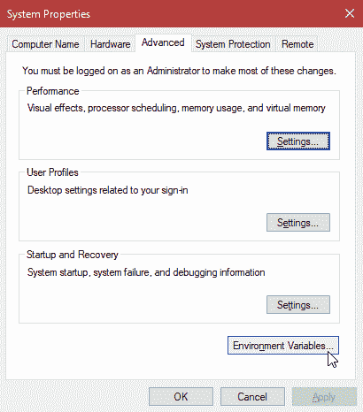

The Environment Variables button is found in System Properties | Advanced. You'll need admin privileges to edit it.

在出现的 Edit Environment Variable(编辑环境变量)对话框中，单击 New(新建)在用户变量或 System Variables(系统变量)部分创建新的系统变量。 (如果您使用前者，DDC 将适用于您的登录，但不适用于登录到同一台计算机的其他人。 如果将变量放入系统变量中，它将应用于所有用户。)

输入`UE-SharedDataCachePath`作为变量名，对于它的值，浏览到您想要存储派生数据的目录。 如果您正在构建包含大量艺术品的项目，您的 DDC 可能会占用超过 10 GB 的空间，因此请将其放在有空间的驱动器上：


Create a variable named UE-SharedDataCachePath and set it to the location where you'd like to store your DDC.

单击确定以保存它。 *您需要重新启动电脑才能生效*。

如果您的 DDC 开始从您不再处理的项目中积累大量杂散资产，或者如果您更换了视频硬件，则完全清除其内容是安全的；编辑器将重新生成缓存。

# 发动引擎

引擎安装好后，让我们启动它以验证一切是否正常工作。

单击 Epic Games 启动器左侧的启动按钮或库选项卡中引擎版本上的启动按钮：


The Library tab shows your installed engine versions, projects, plugins, and asset packs.

如果您以前从未在您的计算机上启动过虚幻引擎，它可能会要求您允许它安装一些必备组件。 随它去吧。 引擎还可能请求允许通过您的 Windows 防火墙进行通信。 让它也这么做吧。

如果一切正常运行，您应该会看到如下所示的窗口：


The Unreal Project Browser appears any time you launch the engine without specifying a project to load.

让我们创建一个空白的蓝图项目，以确保一切正常。 (我们将在下一章深入研究如何创建项目，但目前，我们只想测试所有内容。)

选择 New Project(新建项目)选项卡。 在 Blueprint 选项卡下，选择 Blank，并保留所有选项的默认值。 给它一个合理的位置，然后点击创建项目。

编辑器应该会打开您的新项目，您应该已经准备好了。

如果你是为桌面 VR(而不是移动设备)开发的，让我们快速测试一下，以确保一切正常。 如果您正在为移动 VR 进行开发，我们将在下一节中介绍这一点。

在编辑器工具栏中找到 Play 按钮右侧的下拉列表。 将其向下拉并选择 VR 预览：

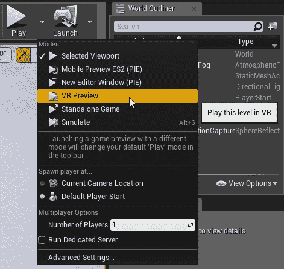

Once you've selected a play mode, this will become the Play button's default behavior until you change it. If VR Preview is disabled, check to be sure that your headset is properly connected and that the Oculus or Steam VR software is running and not displaying any warnings or errors. 

一旦你在 VR 中启动，你应该会在耳机中看到你的场景。 这可能不是世界上最激动人心的场景，你会出人意料地漂浮在地板上(我们将在下一章学习如何为 VR 正确设置场景)，但你应该在里面。 祝贺你!。 一切正常！

# 设置移动 VR

三星 Gear 和 Oculus Go 等移动 VR 头戴式耳机是独立于 PC 的设备，因此您不能像使用台式头戴式耳机那样简单地进入 VR 预览模式。 相反，您需要打包项目并将其部署到设备上，以便可以直接在耳麦上运行。 您必须设置一些东西才能实现这一点。

# 创建或加入 Oculus 开发人员组织

首先，如果你要为基于 Oculus 的移动 VR 平台进行开发，你需要在 Oculus 注册为开发者。 我们在这里假设您已经在 Oculus 上创建了一个帐户，因为您需要这样做才能使用耳机。 如果您还没有这样做，请先这样做，然后登录。

现在，导航到[https://dashboard.oculus.com/organizations/create/](https://dashboard.oculus.com/organizations/create/)，然后执行注册为开发人员的步骤。 如果您要加入现有组织，而不是创建自己的组织，请联系其管理员以将其添加到注册开发人员列表中。

# 在 Oculus Go 中将 VR 耳机设置为开发者模式

一旦您注册为开发者，您就可以使用 Oculus 移动应用程序将耳机设置为开发者模式。 在将您自己的项目部署到该设备之前，您需要这样做。

在应用程序中，导航至设置|[您的耳机]|更多设置|开发者模式，然后打开开发者模式。

If you're unable to do this, confirm that your Oculus account is associated with a developer organization.

# 安装 Android Debug Bridge(ADB)

三星 Gear 和 Oculus Go 都运行谷歌的*Android*操作系统。 您需要安装驱动程序才能使您的 PC 与 Android 设备通信。 为此，我们将安装**Android Debug Bridge**驱动程序。

导航至[https://developer.oculus.com/downloads/package/oculus-go-adb-drivers/](https://developer.oculus.com/downloads/package/oculus-go-adb-drivers/)的[ADB2.0]下载页面，下载并解压`.zip`文件，然后右键单击`android_winusb.inf`**或**，选择安装。

For additional information about ADB and how to use it to talk to Oculus Go and Samsung Gear headsets, check here: [https://developer.oculus.com/documentation/mobilesdk/latest/concepts/mobile-adb/#mobile-android-debug-intro](https://developer.oculus.com/documentation/mobilesdk/latest/concepts/mobile-adb/#mobile-android-debug-intro).

让安装完成，然后我们将安装 Android SDK。

# 设置 NVIDIA CodeWorks for Android

要为 Android 开发软件，您需要安装许多**软件开发工具包**(**SDK**)和其他资源，并将它们配置为相互配合。 幸运的是，使用 NVIDIA 的**CodeWorks for Android**安装程序可以很容易地做到这一点。

EPIC 包括发动机安装所需的安装程序。 导航到您安装虚幻引擎的目录并查找`Engine\Extras\AndroidWorks\Win64`。 运行位于以下位置的 Installer CodeWorksforAndroid 安装程序：

```cpp
C:\Program Files\Epic Games\UE_4.21\Engine\Extras\AndroidWorks\Win64\CodeWorksforAndroid-1R6u1-windows.exe
```

接受默认选项，完成后，*重新启动*您的计算机。

# 验证 HMD 是否可以与您的 PC 通信

一旦您在计算机重新启动后返回，我们希望检查您的 PC 是否可以与您的 Android 耳机通信。

导航到刚刚安装 Android SDK 的位置。 默认情况下，这将是`C:\NVPACK\android-sdk-windows`。 查找`platform-tools`目录。

在此目录中，按住*Shift**+右键单击*可打开包含`Open PowerShell window here`命令的上下文菜单。 如果在不按住*Shift*的情况下右键单击，则上下文菜单将不会包含 PowerShell。如果您使用的是较旧版本的 Windows 10，或者您禁用了 PowerShell，则*Shift*+右键单击将打开一个命令行。

在 PowerShell 中，键入`./adb devices`。

If you're using PowerShell, you must precede any call to launch a program with `./`. (Requiring `./` before an executable call is a safety feature that's standard on Unix-based systems to prevent you from accidentally launching an executable when you didn't mean to. Windows now follows this convention as well.) If you're using the legacy command prompt instead, you simply type the name of the executable: `adb devices`. It's a good idea to get into the habit of using PowerShell instead of the legacy command prompt. It's safer and you can do more with it.

请看下面的屏幕截图：


The adb devices command lists your currently-connected Android devices.

如果 Go 或 Gear 显示为*未经授权*，这意味着您的 PC 可以看到它，但耳机尚未授予 PC 与其对话的权限。 戴上耳机，接受应该出现在耳机上的确认对话框。 再次运行`adb devices`命令并确认耳机现在显示为设备。

# 为 Samsung Gear 生成签名文件

You do not need to create a signature file to deploy to Oculus Go or Quest.

对于 Samsung Gear 设备，您需要创建**Oculus 签名文件**(**osig**)。

按照[https://dashboard.oculus.com/tools/osig-generator/](https://dashboard.oculus.com/tools/osig-generator/)中的说明进行操作，并将生成的文件放在虚幻安装目录中的`\Engine\Build\Android\Java\assets`下。 如果资产目录尚不存在，请创建它。

For more information on signature files, check here: [https://developer.oculus.com/documentation/mobilesdk/latest/concepts/mobile-submission-sig-file/](https://developer.oculus.com/documentation/mobilesdk/latest/concepts/mobile-submission-sig-file/).

# 将测试项目部署到设备

现在我们已经安装了所有必需的软件，并验证了我们的 PC 可以看到我们的 Android 耳机，让我们创建一个项目并将其部署到设备上，以确保一切正常工作。

# 设置测试项目

从 EpicLauncher 启动虚幻引擎，然后在项目浏览器中选择新建项目。 选择 Blueprint 选项卡、空白模板，并将项目设置设置为 Mobile/Tablet、Scalable 3D 或 2D、No Starter Content。 选择项目的位置并创建它：

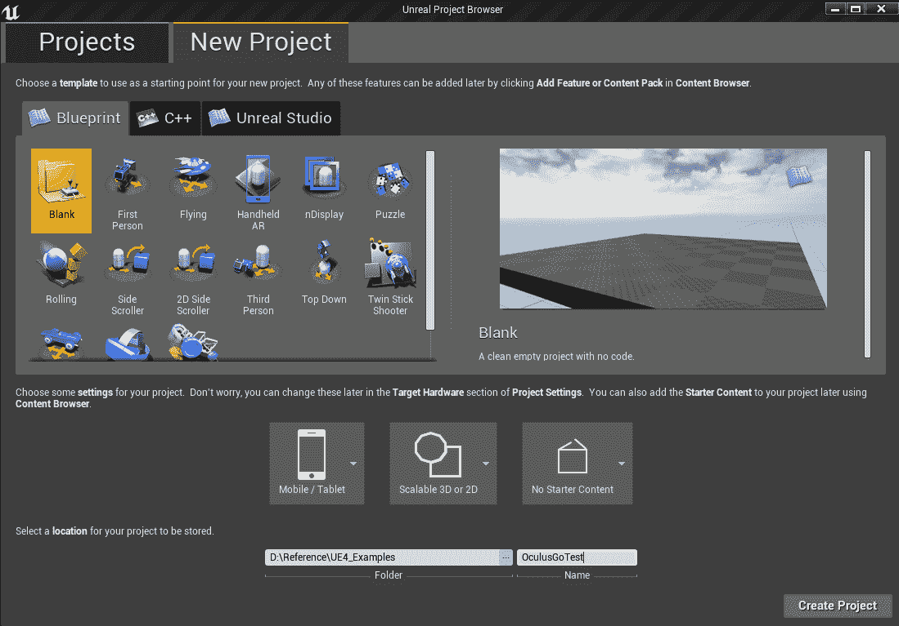

The options you set here determine what your project's starting settings will be, but you can change them later.

# 检查您的 OculusVR 插件是否已启用

项目启动后，选择设置|插件|虚拟现实，并验证是否启用了 OculusVR 插件。 (它应该已经是这样了。)

# 设置默认地图

由于我们将在 Gear 或 Go 上将此项目作为独立的可执行文件运行，因此我们需要告诉它在启动时打开什么地图。 将编辑器启动时创建的空图保存为*，并根据需要为其命名。*

选择编辑设置|项目设置|项目|地图和模式，并将刚刚保存的地图设置为编辑器启动地图和游戏默认地图。

# 清除默认移动触摸界面

通常，移动应用程序假定您将触摸屏幕来操作它们，但当然这不会发生在您的耳机中，所以我们需要从我们的项目中清除该默认设置。

从项目设置中，选择引擎|输入|移动，然后从默认触摸界面下拉列表中，选择清除选项，将其设置为无。

# 设置您的 Android SDK 项目设置

现在，我们需要配置我们的项目以部署到我们的 Android 耳机上。

在平台|Android|APK Packaging(平台|Android|APK 打包)下，点击立即配置，然后接受 SDK License(您只需要接受一次 License)：


Hitting the Configure Now button will write a project.properties file to your project's Build/Android directory.

我们还需要在此类别下设置几个设置：

*   最低 SDK 版本：21
*   目标 SDK 版本：21
*   在 KitKat 及更高版本的设备上启用全屏沉浸式：true

You'll see some older documentation tell you to set your minimum and target SDK versions to 19\. This is true for Samsung Gear, but for Oculus Go, you must select version 21.

向下滚动到高级 APKPackaging 部分，然后设置以下内容：

*   将用于部署到 Oculus Mobile 的 AndroidManifest 配置为 True

Older walkthroughs will refer to this setting as *Configuring the AndroidManifest for deployment to Gear VR*. Its name has been changed.

# 设置您的 Android SDK 位置

现在，选择 Platforms|Android SDK，并设置以下设置(根据 SDK 的安装位置进行调整)：

*   Android SDK 安装位置：北京`C:/NVPACK/android-sdk-windows`
*   Android NDK 位置：`C:/NVPACK/android-ndk-r12b`
*   蚂蚁位置：北京`C:/NVPACK/apache-ant-1.8.2`
*   JAVA 的位置：`C:/NVPACK/jdk1.8.0_77`
*   SDK 接口级别：`latest`
*   NDK 接口级别：`android-21`

请参阅以下屏幕截图：


Make sure the directories you specify here point to actual locations on your drive. Be aware that these directory names are going to change when you update your Android SDKs (which you must remember to do whenever you update your engine version. Make sure you're pointing to the correct directories for each of these after an update, or you'll run into some impressively cryptic errors).

# 启动测试项目

关闭您的项目设置，然后找到启动按钮旁边的下拉列表。 打开它，应该能看到你的手机 VR 耳机的序列号：

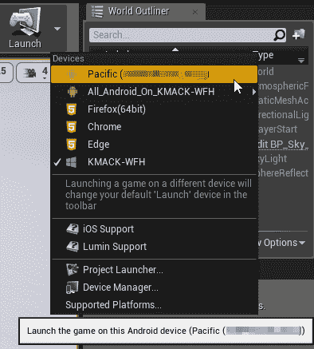

The devices listed here will vary depending on what platforms your project supports and what devices are found.

选择要启动的头戴式耳机。 编辑在准备好东西后，会有一小段时间没有反应，这是完全正常的。 要有耐心。 一旦编辑器再次做出响应，您应该会看到如下内容：


Android asset processing progress indicator

选择 Window|Developer Tools|Output Log(窗口|开发人员工具|输出日志)并不是一个坏主意，这样您就可以看到它在做什么，但这不是必需的。 点击 Show Output Log 链接也会做同样的事情。

Get in the habit of watching your output log. Lots of developers ignore this, but you shouldn't. You can learn a lot about what the engine is doing by watching the log.

第一次运行时需要一段时间，因为需要编译大量着色器。 随后的运行速度会快得多。

一旦这些资产被编译，虚幻将会把它们复制到你的设备上：


Deployment may take a while depending on how much data needs to be transferred to the device.

部署完成后，场景应在您的设备中运行：


Once this dialog indicates that the project is running on the device, you should be ready to test it.

戴上耳机，你应该置身于你的场景中。 祝贺你!。 您刚刚将一个项目部署到移动 VR 耳机上！

# 使用 Epic Games 启动器

在我们深入讨论之前，让我们先来看看 Epic Games 启动器--这里有大量有用的资料，您应该可以从这里开始学习。 花点时间四处看看，看看有什么资源可用，这是值得的。 我们很容易忽视这些资源，但如果您习惯于了解在哪里可以学习并在需要的时候找到信息，您将获得更远、更快的信息。

发射器的虚幻引擎选项卡分为四个主要部分：

*   虚幻引擎
*   学习 / 记诵 / 得知 / 认识到
*   Markupce
*   图书馆 / 图书馆的藏书 / 资料室 / 文库

让我们逐一来看一看。

# 虚幻引擎选项卡

虚幻引擎选项卡显示了精选的内容和项目，这些内容和项目绝对值得一探，但随着你使用引擎的时间越长，它们对你的关注度就会越高。 作为新用户，请特别注意主横幅正下方的那行图标。 这些都是宝贵的资源：


The Unreal Engine tab as of Unreal 4.22

*   的新闻和链接是跟上正在发生的事情的一个很好的方式；它主要集中在新的功能、事件和引擎的有趣使用方式上。 随着你在引擎上花费的时间越来越多，这是另一个对你来说更有意义的问题。
*   YouTube 链接会将您带到虚幻引擎 YouTube 频道。 这是找到深入教程、特色亮点和项目聚光灯的最佳地点之一。 在专题视频中有相当多的信息，特别是你在其他地方不太可能找到的信息。
*   AnswerHub 网站是开发者提问和回答问题的重要资源。 几乎任何时候你有问题，这里都应该是你搜索答案的第一个地方。 你找到你要找的东西的可能性很高。 不要羞于问你自己的问题，但在你跳进去问一些已经得到回答的问题之前，一定要努力搜索现有的问题和答案。 此外，试着把它发扬光大--如果你看到一个你知道如何回答的问题，就贡献自己的力量。 这就是社区的运作方式。
*   这些论坛是一个讨论与引擎相关的所有话题的地方，也是一个了解正在发生的事情的好地方。 大多数插件开发者也在论坛上与他们的用户保持联系。 这里有一个专门讨论 VR 和 AR 发展的论坛：[https://forums.unrealengine.com/development-discussion/vr-ar-development](https://forums.unrealengine.com/development-discussion/vr-ar-development)。
*   路线图链接将您带到一个 Trello 页面，该页面描述了即将发布的版本正在进行的工作以及更遥远的未来有什么计划。 在你虚幻开发生涯的早期，这对你来说可能没什么意义，但随着你对引擎的深入了解，那些即将到来的改变将开始变得重要起来。

# 学习 / 记诵 / 得知 / 认识到

这是发射器上最重要的资源之一。 你不会后悔在这里度过的时光。

让我们从最上面的栏开始：


从虚幻 4.22 开始的学习选项卡

*   文档链接可将您带到虚幻的文档主页[https://docs.unrealengine.com/en-us](https://docs.unrealengine.com/en-us)。 文档页面上的 Get Start with UE4 链接是学习艺术、关卡设计和编程管道基础知识的好地方。 如果你是虚幻引擎的新手，我们建议你先了解一下这些基础知识，这样你就能熟悉编辑器了。 你会有更好的时间来构建本书中的项目，如果你这样做了，你会从它们中得到更多的东西。 在完成了基础知识之后，当您需要在引擎中使用新工具或系统时，请将此文档页面作为您的标准参考。
*   视频教程链接可将您带到[https://academy.unrealengine.com/](https://academy.unrealengine.com/)，这是一个在线学习网站，包含大量围绕特定行业、角色、工作流程和概念的主题的详细视频教程。 这些都是有价值的课程，是理解引擎的不同部分如何组合在一起以允许您做任何需要做的事情的好方法。
*   社区维基页面不如其他页面有用。 正如我们之前提到的，不能保证此页面上的内容是最新的，甚至是正确的。 值得知道它就在那里，但在论坛和文档中搜索信息通常比在 Wiki 上搜索信息更好，因为论坛上的错误信息通常会很快被其他用户更正，而 Wiki 上的错误信息可能会溃烂。

# 内容示例项目

在这个栏下面，我们有几个指向快速入门指南和博客文章的特色链接，然后是引擎功能示例的集合。 其中最重要的是内容示例项目。 这里的所有项目对于特定主题都值得一看，但内容示例应该是您经常参考的。 我们现在就安装吧。

单击 Content Examples 项目以打开其详细信息页面，然后单击页面上的 Create Project 链接：

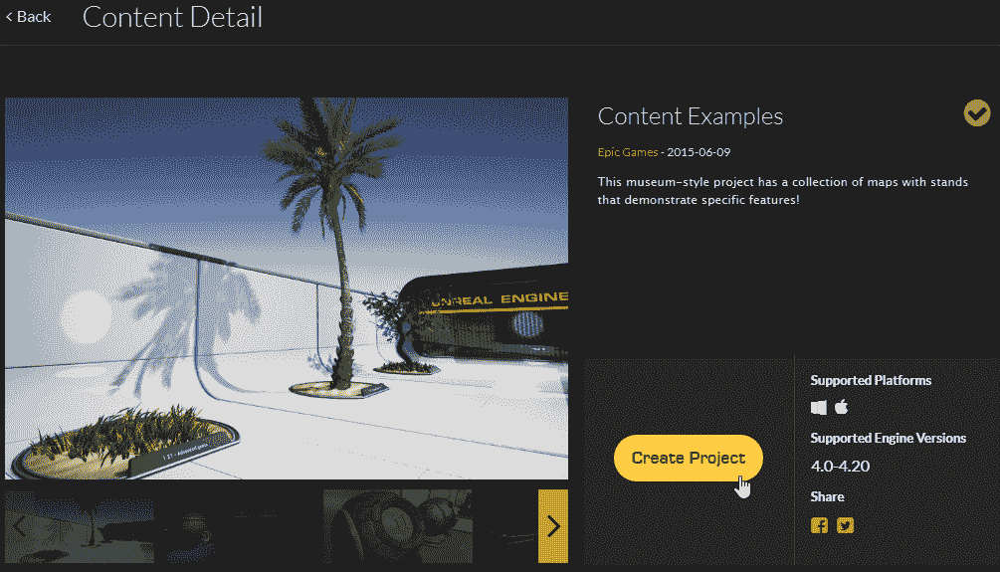

The Content Examples project detail page

系统将询问您要将项目放在哪里，以及要使用什么引擎版本来创建它。 把它放在合理的地方(专门为虚幻参考项目维护一个目录并不是个坏主意)，然后选择你最新的引擎版本。 单击创建以创建项目。 项目将在您创建后自动启动，稍后您可以从 Library 选项卡的 my Projects 部分访问它。 让我们允许项目启动，或者在创建项目后专门从您的库选项卡启动它：


When launching a project, note the Unreal Editor version number and the Loading progress.

在您第一次启动项目时，需要花费一些时间进行初始化，这是很自然的。 不真实是为您的机器构建资产。 如果它看起来在 45%或 95%时挂起了几分钟，不要担心-它不会的。它正在构建动画、着色器和其他资源。 随后的发射速度会快得多。

项目打开后，点击 File|Open Level(或*Ctrl*+*O*)打开其中一个演示地图。 点击 Play 按钮，然后使用标准**WASD**键盘控件四处移动并查看示例：


One of the demo levels contained within the Content Examples project

花点时间浏览一下这个项目，熟悉一下编辑器，了解一下虚幻能做些什么。 稍后，当您想要在您的项目中包含一些东西时，习惯于检查`Content Examples`中是否有一个示例可以让您抢先一步弄清楚它是如何完成的。

说真的，这是您可以使用的最有用、最容易被忽视的资源之一。 在`Content Examples`项目中有大量的好东西。

# 游戏概念和示例游戏

在学习页面的底部是一系列项目，说明具体的游戏概念和一系列示例游戏。 对于学习更高级的主题和了解虚幻引擎中完成的项目是什么样子，这些都是非常有价值的资源。 然而，这些项目的内容往往更高级，因为它们大多代表可发布状态的已完成游戏。 在下载并开始探索之前，您可能需要在引擎中花费一些时间。 现在，你应该知道他们就在那里。 如果你有好奇心，想要向前看，你可以随意挖掘。

# Markupce

在本书中，我们将使用 Marketplace 中的免费资产，因此您应该花一些时间来查看此选项卡：

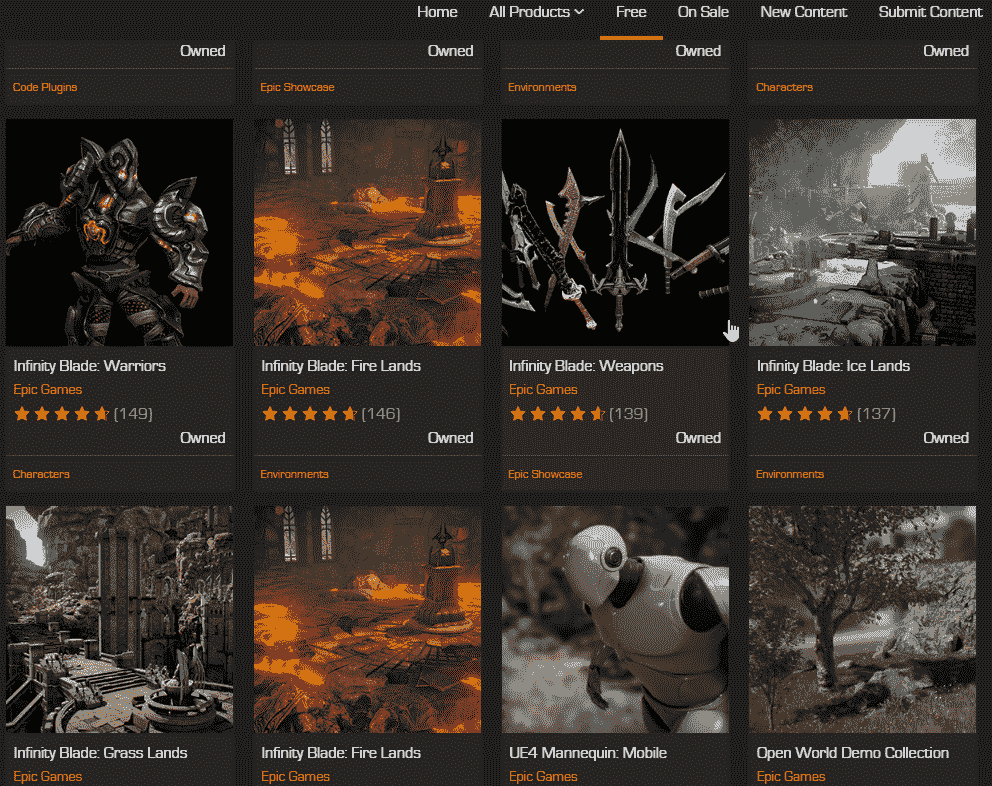

Marketplace content as of Unreal 4.20

EPIC 在市场上提供了数量惊人的高质量免费材料。 通常情况下，如果 Etic 取消了其内部开发的游戏，它将在 Marketplace 上免费提供游戏资产。 利用这一点，特别是在构建学习项目时。 来自*Infinity Blade*的资源对于 VR 中的项目特别有用，因为它们最初是为手机游戏设计的，因此它们针对 VR 的严格要求进行了合理的优化。 我们将在下一章开始构建时，看看如何将 Marketplace 内容添加到现有项目中。 也不要忽视网上市场上的付费材料。 其中很多内容都非常出色，无论您是将其用于原型，还是在您发布的图书中使用，它都可以在构建项目时给您提供巨大的帮助。

# 图书馆 / 图书馆的藏书 / 资料室 / 文库

在库选项卡中，您可以维护已安装的引擎版本，打开项目，以及访问从学习选项卡和 Marketplace 下载的插件和内容包的存储库：

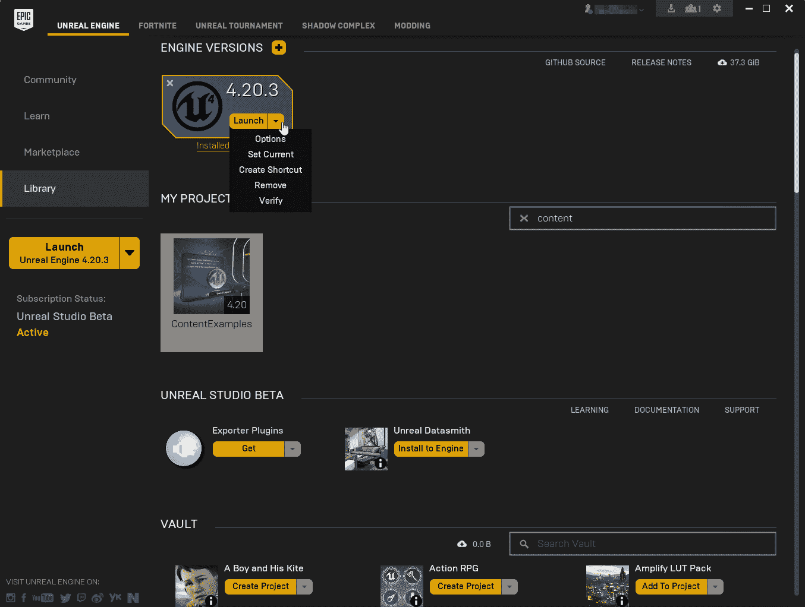

The Library panel as of Unreal 4.20

使用引擎版本部分可以更新已安装的引擎版本、安装新引擎版本以及修改其选项。

A quick word about engine versions: If you see an indicator appear on an installed engine version indicating that it can be updated, you should update it. Updates to engine releases, such as going from 4.20.2 to 4.20.3, are generally safe to apply, as they involve bug fixes but don't change the way anything works in ways that could break your project.

除了更新当前安装的引擎版本外，您还可以使用引擎版本标签旁边的+号添加其他已安装的版本。 这样，如果您需要打开尚未更新到当前版本的旧内容，则可以安装旧版本；如果您想测试下一版本中的内容，则可以安装预览版本。

Use caution when working in preview versions. They're intended to allow you to look ahead, but they aren't guaranteed to be stable. Don't put mission-critical work on a preview version. Work in release versions, and use previews to see what's coming or to see how you might need to update your project when you move to the new version.

“我的项目”部分允许您启动项目。 项目缩略图使用当前为其设置的引擎版本号进行标记。 通过启动较新的版本，然后将该项目打开到较新的版本，可以将项目更新到新的引擎版本。 执行此操作时，将显示一个对话框，询问您是否要复制项目或就地转换项目。 就地转换是危险的；建议您在副本上执行更新，以确保项目中没有任何内容与更新冲突。 (这就是就地转换选项隐藏在更多选项下面的原因……。 链接。)。 如果您有一个落后几个版本的非常老的项目，您通常会更幸运地一次转换一个版本，而不是试图跳过几个版本。 它可以工作，但是否工作将完全取决于您尝试跳过的版本数量以及项目中的内容：


The Convert Project dialog gives you a few options to determine how you want to handle an engine update. You don't have to launch your projects using the Epic Games Launcher; you can always navigate to where you saved the project and double-click the `.uproject` file directly to launch it in its associated engine version.

Vault 部分包含您拥有的所有内容-学习项目、插件和内容包。 您可以向现有项目添加插件或内容，并在此创建新项目。

大多数情况下，Library 选项卡将是您的默认选项卡，因为您将使用它来启动项目，但正如我们刚才提到的，不要忘记其他选项卡。

# 为 C++ 开发设置

此部分完全是可选的。 本书中的任何项目都不需要您使用 C++ 进行开发，但我们偶尔会为那些对深入研究感兴趣的人突出显示本机代码中的项目。 如果您不期望在代码中工作，或者如果代码页让您惊慌失措，那么跳过这一节和后面的一节是完全没有问题的。

It's absolutely not required to use C++ when developing in Unreal. The Blueprint visual scripting language is incredibly expressive, and there isn't much that it can't do. Most applications, including pretty advanced projects, can be built entirely in Blueprint. Many new Unreal users see the C++ support and worry that they'll have to learn the language to use the engine. You don't. (If you are interested in learning C++ though, this can be a great way to do it.)

还在这里吗？ 太棒了。 如果您计划用 C++ 进行开发，您需要的第一件事是用来构建代码的编辑器和编译器。 这种类型的应用程序称为**集成开发环境**(**IDE**)。 对于 Windows 中的 Unreal4.20 及更高版本的开发，您应该使用微软的**Visual Studio2017**(**VS2017**)。 Visual Studio 有几种风格，但对于在虚幻中进行开发，您不需要任何专业版或企业版功能。 免费的社区版拥有您需要的一切。

# 安装 Microsoft Visual Studio 社区

转到**Microsoft Visual Studio 社区**页面，即[https://visualstudio.microsoft.com/vs/community/](https://visualstudio.microsoft.com/vs/community/)，下载该安装程序。 运行安装程序时，您将看到以下几个选项：

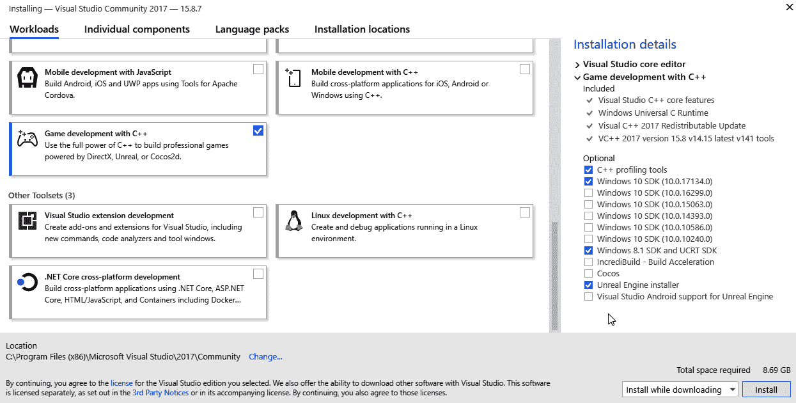

The Visual Studio Community 2017 Setup dialog determines which languages and development tasks your installation will be configured to handle.

在 WorkLoads 选项卡下，选择 Game Development with C++，然后在右侧的 Summary 侧栏上，确保选中了以下选项：

*   虚幻引擎安装程序(必需)
*   Windows 10 SDK(必需-默认情况下应已选中)
*   Windows 8.1 SDK 版本(VS 2017 需要-默认情况下应已选中)
*   C++ 性能分析工具(可选，但很有用)

如果您要为 Samsung Gear 或 Oculus Go 进行开发，请确保还包括以下内容：

*   Android 对虚幻引擎的支持(Gear or Go 开发需要)

这将安装 Java 开发工具包和 Android 工具，您将需要与 Gear and the Go 对话：


The Visual Studio 2017 Installation details panel allows you to determine which options are installed.

通过设置这些选项，您已经告诉 Visual Studio 包含 C++ 语言支持，并包含运行和开发 Unreal 所需的支持文件。

These settings are important. Visual Studio 2017 no longer automatically assumes that you're going to be developing in C++, so you need to select which languages you want it to support when you install it. If you realize later on that you missed something, use your Add and Remove Programs control panel to modify your VS2017 installation options.

# 推荐设置

在开始工作之前，您需要在 Visual Studio 中更改一些设置。 这些不是必需的，但确实会让它在虚幻中发挥得更好。 此处详细记录了它们：[https://docs.unrealengine.com/en-us/Programming/Development/VisualStudioSetup](https://docs.unrealengine.com/en-us/Programming/Development/VisualStudioSetup)。 浏览此页并进行建议的更改。

以下是该页面将要求您进行的更改的快速概述：

*   增加“标准”工具栏上“解决方案配置”控件的宽度，因为否则不真实的解决方案配置名称可能会太长而无法阅读。
*   确保“标准”工具栏上显示“解决方案平台”控件。 默认情况下，它应该已经存在。
*   如果关闭了生成完成但出现错误，请确保工具|选项|项目和解决方案|始终显示错误列表。
*   将“工具”|“选项”|“文本编辑器”|C/C++|“查看”|“显示非活动块”设置为 False。
*   确保未禁用工具|选项|文本编辑器|C/C++|高级下的 IntelliSense 选项。 更老的指令会告诉你禁用智能感知，因为它过去在虚幻的源代码中工作得很差。 现在情况不再是这样了，告诉您关闭它的说明现在已经过时了。 如果您过去关闭了 IntelliSense，现在将其重新打开。

# UnrealVS 插件

现在您已经安装了 UnrealEngine 并设置了 Visual Studio，我们将按顺序将 UnrealVS 插件安装到 Visual Studio 中，以简化您在使用 Unreal 时将在 Visual Studio 中执行的一些常见任务。

# 安装 UnrealVS 插件

确保 Visual Studio 已关闭，并导航到当前虚拟引擎版本的安装位置，然后在`Engine\Extras`下找到`UnrealVS`目录。 打开与您的 Visual Studio 版本对应的目录(在我们的示例中是 VS2017)，然后运行`UnrealVS.vsix`安装程序来安装插件。

For Unreal 4.20, install it in the standard location. For example, you'll find the plugin here:
`C:\Program Files\Epic Games\UE_4.20\Engine\Extras\UnrealVS\VS2017`.

# 打开 UnrealVS 工具栏

运行完插件安装程序后，打开 Visual Studio，右键单击工具栏的空白区域以设置活动工具栏。 打开`UnrealVS`工具栏：


Right-clicking an empty toolbar area in Visual Studio 2017 allows you to select which toolbars are visible.

这里有关于配置和使用 UnrealVS 的更多文档：https://docs.unrealengine.com/en-us/Programming/Development/VisualStudioSetup/UnrealVS[UnrealVS](https://docs.unrealengine.com/en-us/Programming/Development/VisualStudioSetup/UnrealVS)。 通过安装它并打开工具栏，你已经做了让它运行所需的一切，但看看这一页是值得的，以了解 UnrealVS 为你做了什么，以及你可以如何使用它。

# 不真实的调试支持

在做好准备之前，我们还需要做一件事，那就是在 Visual Studio 中为虚幻安装一个调试支持文件。

导航到引擎安装目录并找到`Engine\Extras\VisualStudioDebugging`。 在那里查找`UE4.natvis`文件并复制它。

将其粘贴到两个位置之一。

您可以将其安装到 Visual Studio 安装位置的以下路径中(您需要计算机上的管理员权限才能执行此操作)：

*   `[VisualStudioInstallPath]\Common7\Packages\Debugger\Visualizers\UE4.natvis`
*   示例：`C:\Program Files (x86)\Microsoft Visual Studio\2017\Community\Common7\Packages\Debugger\Visualizers`

或者，您也可以将其安装到您的个人`Documents`目录中。 如果在用户配置文件的`Documents`目录中进行检查，您应该会找到一个在安装 IDE 时自动为您创建的 Visual Studio 2017 目录。 如果此目录中已存在可视化器子目录，请在其中粘贴`UE4.natvis`。 如果没有，请创建目录并将 natvis 文件放在其中：

*   `[UserProfile]\Documents\Visual Studio 2017/Visualizers/UE4.natvis`
*   示例：`D:\OneDrive\Documents\Visual Studio 2017\Visualizers`

A `.natvis` file contains instructions to help Visual Studio display the contents of native data types defined within your particular solution. Unreal defines its own custom string type (`FString`), custom array types (`TArray`) and many others. `UE4.natvis` tells Visual Studio how to display the data contained within these types in a readable way when you're debugging.

# 把所有东西都测试一下

现在，我们准备好验证是否已正确设置了所有内容。 从 Epic Games 启动器启动您当前的引擎版本。 在 New Project 选项卡下，选择 C++。

如果您看到如下警告，请确保您已经安装了 Visual Studio 2017，并且是随 C++ 游戏开发一起安装的，并且选择了推荐的设置：


If you see this warning, you either haven't yet installed Visual Studio, or haven't set up the required installation options.

如果你已经安装了 VS2017，但你确实看到了一条警告，那就意味着你缺少了我们刚才提到的其中一个必备选项。 使用添加和删除程序控制面板修改 VS2017 安装并添加这些选项。

如果您没有看到任何警告，则表示您已经准备好创建一个快速测试项目。 让我们在 C++ 选项卡下选择一个带有默认选项的 Basic Code 模板，并为它选择一个位置和名称：


Creating a C++ project works similarly to creating a Blueprint project.

点击 Create Project(创建项目)，允许该工具为您创建一个新项目。 稍等片刻。 如果所有设置都正确，则虚幻编辑器应打开新创建的项目，Visual Studio 2017 应打开新创建的项目解决方案文件。 让我们现在关闭虚幻编辑器，从 VS2017 构建并启动新项目，看看这是如何完成的。

在 Visual Studio 的“解决方案资源管理器”选项卡中，在“游戏”树下找到新的项目解决方案。 右键单击它，然后选择 Set as Startup Project(设置为启动项目)：

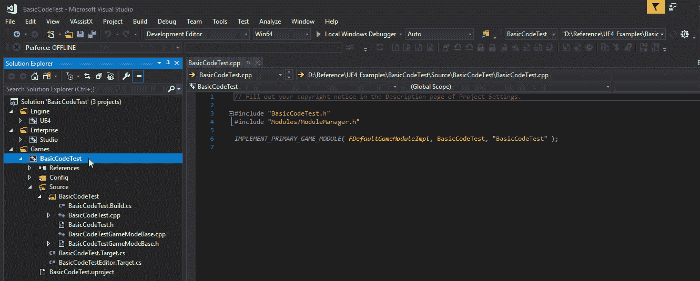

The Solution Explorer on the left side shows you what files are contained in your project. The Workspace on the right shows the contents of the currently-loaded file.

再次右键单击它，然后选择 UnrealVS Quick Build|Win64|DebugGame Editor。 你的项目应该开始建设了。

There are two solution configurations you'll commonly use when developing for Unreal in C++ : **DebugGame Editor** and **Development Editor**. Visual Studio is what's called an **optimizing compiler**, which means that it modifies your code somewhat when it compiles it to make it run faster. This has the advantage of letting you write easily readable code that still runs quickly after it's been compiled, but what this means in practice is that if you debug a development build, not every bit of data will be visible, because some variables will have been optimized out.

A debug build leaves everything as you wrote it, so it runs a little more slowly, but you can see exactly what each variable contains. Most of the time, you'll want to use the Development Editor configuration.

You'll see that in addition to DebugGame Editor and Development Editor, you also have DebugGame and Development configurations available. You won't use these when working in the editor; they don't include the editor and require your content to be cooked into a release-ready format. (We'll talk about cooking later on.)

在本例中，我们选择了 DebugGame Editor 配置，这样您就有机会看到编译器构建了一个尚未构建的配置。

一旦您的项目完成构建，请检查您的输出。 如果它看起来像这样，你就可以开始了：

```cpp
1>Deploying BasicCodeTestEditor Win64 DebugGame...
1>Total build time: 45.92 seconds (Parallel executor: 27.81 seconds)
1>Done building project "BasicCodeTest.vcxproj".
========== Build: 1 succeeded, 0 failed, 0 up-to-date, 0 skipped ==========
```

现在，在标准工具栏上，使用“解决方案配置”控件选择刚刚生成的调试编辑器配置：


The Solution Configurations control determines what type of build you're going to create.

按*F5*，或选择 Debug|Start Debug，从 Visual Studio 启动编辑器。 如果一切设置正确，您的项目应该会启动，并且 Visual Studio 窗口应该如下所示：

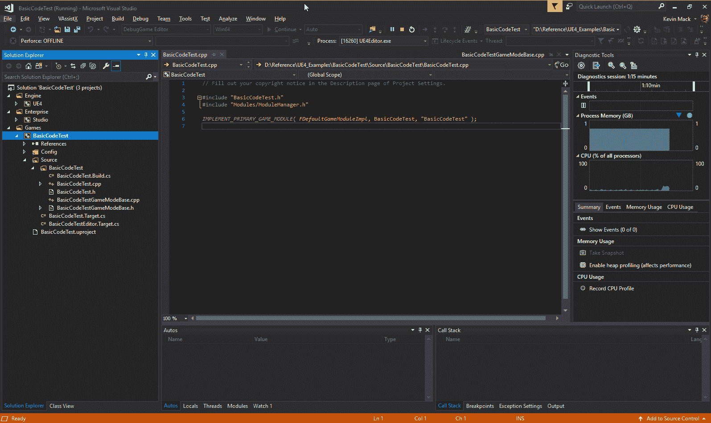

An Unreal C++ project loaded in Visual Studio Community 2017\. The orange bar at the bottom indicates that the project is running and Visual Studio's debugger is connected to it.

祝贺你!。 现在，您已经准备好使用 C++ 进行开发。

让我们来看一个快速示例，说明为什么这会如此有用。 在虚幻编辑器中自动创建的默认场景中，从世界大纲视图中选择地板。 在其上单击鼠标右键：


You can open C++ files directly from within the Unreal Editor.

地板是一个静态的网格演员。 选择打开`StaticMeshActor.h`的选项。 您将自动切换到 Visual Studio，并打开`StaticMeshActor`头文件：

If you're not able to open `StaticMeshActor.h`, check to be sure you installed the engine source for your engine version. Head to the Library tab, find the engine version you're running under Engine Versions, and select Options from the drop-down to the right of the Launch button. Add Engine Source if you hadn't already.


The C++ header file for the StaticMeshActor class describes the class and declares its functions.

这是虚幻引擎众多令人惊叹的事情之一-Epicc 给了你源代码-所有的一切。 对于编辑器中的任何对象、任何 Blueprint 节点或任何内容，您都可以查看其下面的源代码。 没有黑匣子。 再说一次，这绝不是你在虚幻中必须要做的事情--文档非常棒，但是如果你曾经面临一个谜团，并且真的需要弄清楚到底是怎么回事，能够阅读源代码可能是一个救命稻草。

# 从源代码构建虚幻

You absolutely do not need to download source code and build the engine from scratch for almost anything you'll realistically be doing with it. This section is included here so that you have the freedom to make engine changes if you ever need to, but you can safely skip this. It's rare even for professional developers to work from the bleeding edge source.

下一节甚至比上一节更具可选性。 只有当您打算修改引擎本身的行为时，或者如果您想要使用尚未捆绑到某个发行版中的新特性时，才需要这样做。 不过，这也是这款引擎的另一个优点--如果你真的需要它去做一些它还没有做的事情，你可以自己做改变。 此外，如果您对引擎进行了改进或可能对其他开发人员有用，则可以使用 GitHub 将您的更改贡献给 Epic.。 很多开发人员都这样做了，其最终结果是这个引擎以惊人的速度增长和改进。

不过，实际上，如果您并不预期需要，则可以跳过此步骤。 我们要深入了解一下这里的杂草。

# 设置 GitHub 帐户并安装 Git

虚幻引擎的源代码是通过一个名为**GitHub**的站点发布的。 **Git**是一个版本控制系统(用于管理代码修订并将其分发给用户的系统)，而 GitHub 是存放和共享 Git 存储库的集中位置。 要以允许您自己构建引擎的格式下载虚幻引擎源代码，您需要 Git 和 GitHub。

Lots of people confuse Git with GitHub. They're not the same thing. Git is a version control system that allows users to track changes to code, distribute those changes, and manage them in many other ways. GitHub is a website that allows users to store and share Git data. There are other sites that also allow you to do this, though GitHub is the largest, or you could set up a Git repository entirely on your own.

# 设置或登录您的 GitHub 帐户

如果你确实计划挖掘虚幻开发的绝对前沿，你首先需要的是一个**GitHub**账户。 前往[https://github.com/](https://github.com/)，然后登录，如果您还没有帐户，也可以注册。

# 安装 Git for Windows

访问[https://git-scm.com/](https://git-scm.com/)并下载 Windows 版 Git。 Git 是一种软件配置管理工具，它允许您将本地的虚幻源代码库与 Etic 提供的源代码同步。

使用默认选项安装它，但有一个例外：当安装程序询问您希望使用什么作为 Git 的默认编辑器时，当前选择的选项将是**Vim**。 Vim 对于那些已经习惯使用它的人来说非常棒，但是对于其他所有人来说，它可能非常违反直觉，因为它遵循了与您使用过的几乎任何其他应用程序完全不同的一组约定。 如果您还不是使用 Vim 并喜爱 Vim 的用户之一，那么您几乎肯定会想要选择不同的文本编辑器：


You can choose your preferred text editor as Git's default editor when you set Git up.

无论如何，在您的系统上拥有一个健壮的文本编辑器是一个好主意，因为它对于编辑配置文件和大量其他任务很有用。 常见的选择有**Visual Studio Code**、**Sublime Text**、**Notepad++**或**Atom**。 如果你有最喜欢的，请随意使用。 如果您不这样做，Visual Studio 代码是一个很好的选择，因为它是免费的，并且遵循与 Visual Studio 相同的约定。 如果你需要，在这里拿到：[https://code.visualstudio.com/](https://code.visualstudio.com/)。

# 安装 Git 大型文件存储

接下来，您需要安装**Git Large File Storage**(**Git-LFS**)。 这使得 Git 可以管理大的二进制文件，比如虚幻生成的文件。

转到 https://git-lfs.github.com/[Git-lfs](https://git-lfs.github.com/)，下载并安装它。

现在，您需要配置 Git 以使用 Git-LFS。 要执行此操作，请执行以下操作：

1.  打开 Git Bash-一个用于管理 Git 的命令行工具，它是在您刚刚安装 Git for Windows 时安装的。 在 Git Bash 中，键入`git lfs install`，然后按*Enter：*

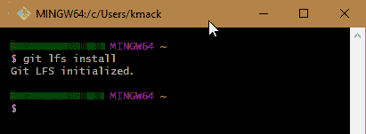

Git Bash is a terminal window specifically used to communicate with Git.

一旦看到 Git LFS 已经初始化，就可以关闭 Git Bash 了。

# 安装 Git GUI

It's not required that you use a GUI to operate Git. Many developers operate Git directly from the command line instead. Certain Git operations are easier to perform this way. The following instructions apply if you'd like to use a GUI for Git.

访问[https://desktop.github.com/](https://desktop.github.com/)并下载**GitHub 台式机**。 还有很多其他的 Git GUI 应用程序；另一个流行的选择是**Atlassian 的 SourceTree**，您可以在[https://www.sourcetreeapp.com/](https://www.sourcetreeapp.com/)上找到它，但为了简单起见，目前我们还是使用 GitHub Desktop。 在安装过程中，安装程序将要求您提供您刚刚创建的 GitHub 帐户的凭据。 在这里输入它们。

安装完成后，GitHub Desktop 应该会启动，您应该会看到如下所示的窗口：

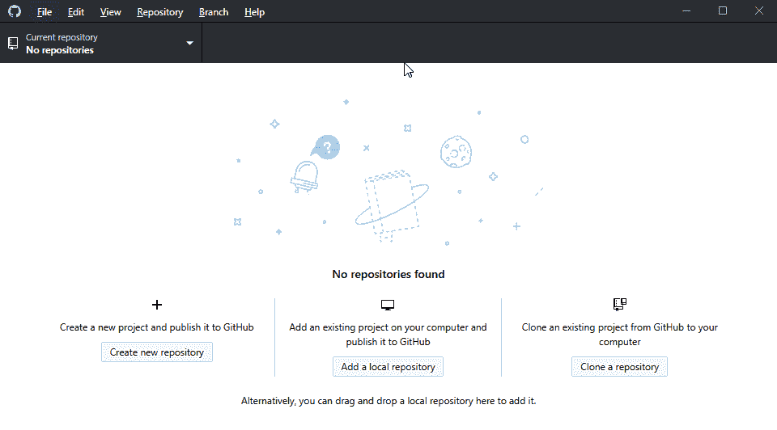

Git GUI's like GitHub Desktop aren't required to communicate with Git, but can be helpful when you're staring out.

# 将 GitHub 帐户连接到 Epic Games 帐户

导航至[https://www.unrealengine.com](https://www.unrealengine.com)，如果您尚未登录，请立即登录。 在页面左下角找到您的用户名，将鼠标悬停在其上即可显示下拉菜单。 选择 Manage Account(管理帐户)选项：

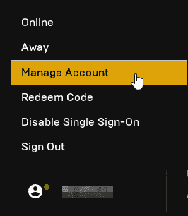

The account management link as of Unreal 4.22\. This opens a browser window to https://www.unrealengine.com/account/personal

请注意，Epic Games 启动器中的菜单会频繁更改。 您也可以通过导航到[https://www.unrealengine.com/account/personal](https://www.unrealengine.com/account/personal)来处理此步骤。 打开 Connected Accounts 选项卡，找到 GitHub 图标，然后点击 Connect 将您的 Epic 账户连接到 GitHub。 如果需要，您可以同意 EULA，如果系统要求您登录 GitHub，则可以登录 GitHub。 最后，如果授权实用程序要求，请单击授权 Epic Games 按钮。 您应该会收到一封电子邮件，确认您已经这样做了。 如果需要进一步帮助或出现问题，请查看[https://www.unrealengine.com/en-US/ue4-on-github](https://www.unrealengine.com/en-US/ue4-on-github)上的文档。

导航到[https://github.com/EpicGames/UnrealEngine](https://github.com/EpicGames/UnrealEngine)，确认一切设置正确。 如果您能够看到页面，则说明您已正确连接。 如果没有，请确保您已正确连接您的帐户并被授权查看 UnrealEngine 存储库。

A word about Git: Git is a phenomenally useful tool, but the work it does can seem fairly complex at first. Detailing all the things you should know about Git falls outside the scope of this book, but we highly recommend that you spend some time to learn what Git is and how it works if you plan to use it. This is a good place to start: [https://git-scm.com/book/en/v2/Getting-Started-Git-Basics](https://git-scm.com/book/en/v2/Getting-Started-Git-Basics). To understand how GitHub works with Git, start here: [https://guides.github.com/activities/hello-world/](https://guides.github.com/activities/hello-world/).

# 下载虚幻引擎源代码

现在，你准备好拉出源头了。 让我们来看看如何做到这一点。 导航到[https://github.com/EpicGames/UnrealEngine](https://github.com/EpicGames/UnrealEngine)，然后浏览页面。 这个页面上还有一个`ReadMe`文件。 强烈建议你读一读。

# 选择您的源分支

请注意，Epicc 维护着虚幻引擎存储库的多个分支：

*   发布分支包含经过测试的源代码，相当于您使用 Epic Games 启动器下载引擎获得的源代码。
*   Promoted 分支包含测试较少的代码，供 Etic 的设计者和艺术家在内部使用。 它相当稳定，包含的代码比发布分支上的代码更新，但也不太稳定。
*   主分支绝对是最尖端的，在 Etic 的工程师提交更改的那一刻，它或多或少就包含了一些更改。 但是，不能保证这些更改是稳定的，甚至不能进行编译。 不过，如果您计划为引擎做出贡献，您应该在此分支上：

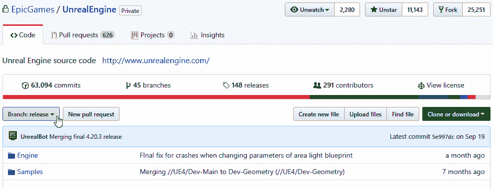

This view of the Epic Games / UnrealEngine GitHub repository allows you to choose your current branch and download its contents.

现在，让我们继续关注发布分支。 使用左上角附近的 Branch(分支)下拉菜单选择它。

# 派生存储库

我们要分叉这个存储库。 派生 Git 存储库会创建一个副本，允许您在不影响主存储库的情况下进行自己的更改。 点击右上角附近的叉子按钮。 这将为您创建一个包含刚才派生的源代码的个人存储库。

# 将存储库克隆到本地计算机

现在，你需要把它放到你的桌面上。 点击页面右侧的绿色克隆或下载按钮：

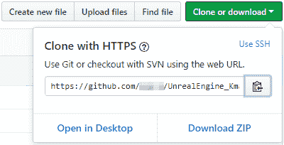

When cloning a repository, you have the option to choose your authentication method and how you'd like the content to be delivered.

这里有几个选择。

# 选项 1-使用 GitHub 桌面进行克隆

如果您使用 GitHub Desktop 作为 GUI，请选择在桌面中打开，并允许页面启动 GitHub Desktop。 GitHub Desktop 会询问您要将新存储库存储在哪里。 告诉它放在哪里，然后点击克隆：


Ensure that the location you choose for your local path has room to hold the engine and its content.

# 选项 2-从命令行克隆

如果您正在使用命令行，请单击存储库 URL 右侧的复制到剪贴板按钮，然后打开 Windows 命令提示符并导航到要存放本地存储库的目录。 在那里，键入`git clone`，然后粘贴您刚刚复制的 URL：

```cpp
git clone https://github.com/yourusername/UnrealEngine_YourFork.git
```

源代码现在将下载到您指定的位置。

# 正在下载引擎二进制内容

导航到您刚才下载虚幻引擎源代码的位置，并在那里查找`Setup.bat`文件。 运行它：


Unreal Engine content is delivered separately from the source code. You must run this .bat file before the engine can work.

此批处理文件现在将检查缺少或需要更新的引擎二进制内容，并将对其进行更新。 第一次运行它可能需要一段时间。

# 正在生成项目文件

接下来，在同一目录中找到`GenerateProjectFiles.bat`并运行它。 这将为 Visual Studio 创建`UE4.sln`解决方案文件，并为虚幻引擎的每个子项目创建所需的项目文件。 这应该运行得相当快。

# 打开并构建解决方案

在 Visual Studio 中打开新生成的`UE4.sln`文件。 确保设置了 Development Editor 解决方案配置，然后从解决方案资源管理器中右键单击`Engine/UE4`项目。 选择 UnrealVS Quick Build|Win64|Development Editor：

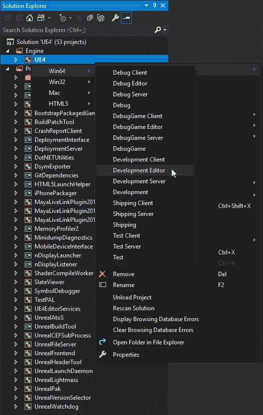

The Quick Build command allows you to select the build configuration you'd like to build. Most of the time, you'll only be interested in Development Editor or Debug Editor configurations.

这个构建将比我们之前运行的构建花费更长的时间，因为我们现在构建的是整个引擎，而不仅仅是一个游戏。

构建完成后，确保将 UE4 设置为启动项目(默认情况下)，然后按*F5*在调试器中启动它。

祝贺你!。 现在，您已经完全从源代码下载并构建了虚幻引擎。

# 使用 Etic 中的新更改更新您的叉子

EPIC 很快就会发布新的变化，这些变化还没有出现在你的分叉中。 多久将取决于您所在的分支机构。 如果您是发布分支，那么每隔几周就会有新的更改。 在升职的分店，他们每一两天就会来一次。 在主分支上，他们每隔几分钟就会来一次。 在所有这些情况下，您都需要更新您的 fork 才能获得新的更改。

您可以通过查看 Branch 选择器下面的栏来查看何时需要合并新的更改。 它指示自上次更新派生以来已发生的提交次数：

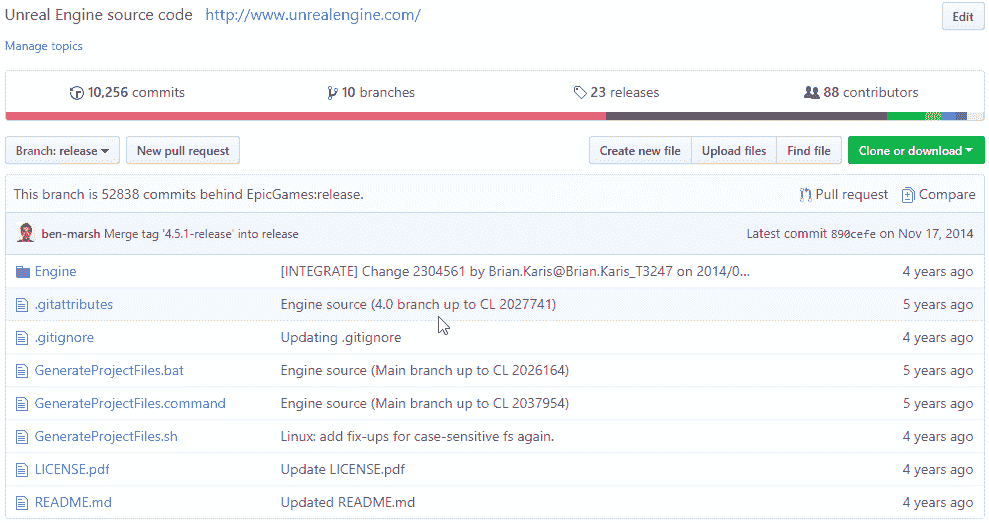

Here's an example of an ancient branch, far behind the current state of the release channel. We can see that it's over 52,000 changes behind. That's old. Dinosaurs roamed the earth when this code was last updated. We'll want to fix that.

# 选项 1-使用命令行同步更改

通过上游分支的更改使您的分支保持最新状态是真正更容易从命令行完成的操作之一。 我们建议您这样做。 让我们来告诉你整个过程。

# 设置上游存储库

我们已经从虚幻引擎源代码存储库派生了自己的存储库，并将其克隆到本地计算机。 现在，我们需要告诉我们的分支如何从原始项目(我们将称为**上游**存储库)中提取更改。 您只需要这样做一次。 在 gihub 中，打开原始的虚幻引擎存储库页面，点击[URL](https://github.com/EpicGames/UnrealEngine)，点击绿色的克隆或下载按钮，然后点击 https://github.com/EpicGames/UnrealEngine 右侧的复制到剪贴板按钮。 不要在桌面上打开或下载 ZIP。 这里您需要的只是 URL。

打开 Windows 命令提示符(请注意，如果您熟悉 UNIX 命令，也可以使用 Git Bash 执行此操作，如果您打算大量使用 Git，建议您这样做)，然后导航到克隆存储库的目录。 键入`git remote -v`，然后按*Enter*。 您应该看到这里列出了您的原始存储库，但没有上游存储库。 这就是我们接下来要设置的内容：


The results of a git remote -v command before you've added your upstream repository

现在，输入`git remote add upstream`，粘贴刚才复制的 URL：

```cpp
git remote add upstream https://github.com/EpicGames/UnrealEngine.git
```

让我们再次键入`git remote -v`来验证是否正确设置了上游回购：


The results of a git remote -v command after you've added your upstream repository

一切看起来都很好--我们的上游回购已经定好了。

For more information on forking a repo and preparing it to pull changes from the upstream depot, have a look at GitHub's documentation here: [https://help.github.com/articles/fork-a-repo/](https://help.github.com/articles/fork-a-repo/).

# 同步分叉

在我们的存储库目录中的命令提示符或 Git Bash 中，键入`git fetch upstream`：


Output from a git fetch upstream operation

现在，通过键入`git checkout`和分支名称，*签出您正在工作的任何分支。 例如，为发布分支键入`git checkout release`，为升级分支键入`git checkout promoted`，为主分支键入`git checkout master`。*

接下来，通过键入`git merge upstream/`，后跟分支机构的名称，将上游分支机构中的更改合并到本地分支机构中。 同样，如果您在 Release 分支上，则应该是`git merge upstream/release`。

最后，您需要将您的更改从本地计算机推送回您的 fork 在线存储库。 键入`git push origin master`以执行此操作。

# 回顾我们刚刚使用的 Git 命令

总结一下：任何时候您需要使您的分支机构与上游分支机构保持同步，请使用以下命令：

*   `git fetch upstream`
*   `git checkout [branch]`
*   `git merge upstream/[branch]`
*   `git push origin [branch]`

请参阅以下屏幕截图：


Command outputs in Git Bash.

# 选项-使用 Web GUI 同步更改

如果您更喜欢在线同步您的分叉，而不是使用命令行，请遵循以下步骤。

If you're using the command-line procedure for synchronizing your fork, you can skip this part, since it does the same job.

导航到 GitHub 上的 Fork 页面，点击工具栏右侧的比较按钮。 如果您在本地进行了更改，它们将出现在随后的比较窗口中。 (为了简单起见，让我们假设我们没有这样做，我们只是想从 Epic.获得新的代码。)。 要做到这一点，首先，点击比较页面上的切换基数链接。 这将颠倒比较，因此，我们将不再寻找本地分支上尚未转到 Etic 的更改，而是查找其他开发人员所做的尚未出现在我们的分支中的更改：


A list of changes on GitHub that haven't yet been merged to your fork

在这里，我们可以看到新的更改可以自动合并。 这是意料之中的，因为我们自己还没有进行任何引擎更换。 (管理您自己的虚幻引擎分支和 Etic 的分支之间的合并更改超出了本书的范围。)。 在我们的情况下，我们只想了解最新情况。

# 创建拉式请求

点击 Create Pull Request(创建拉取请求)按钮：

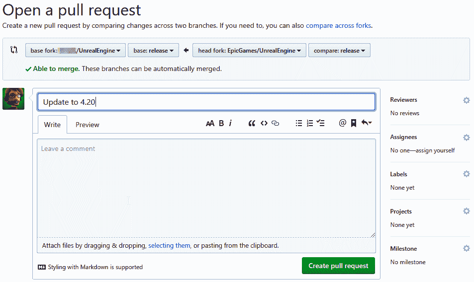

A new pull request to merge changes from the upstream branch to your own

为您的拉入请求指定一个名称，然后再次点击创建拉入请求以创建它。

您的拉取请求现在可供审核。 在这种情况下，既然您发起了它，您可以简单地接受它：

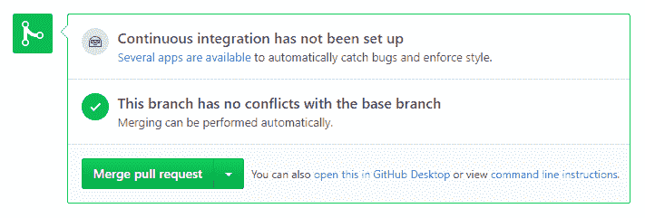

The pull request confirmation dialog

# 合并拉式请求

单击合并拉取请求以执行合并，然后单击确认合并以执行合并。

一旦合并完成，返回到您的叉子，您应该不再落后：

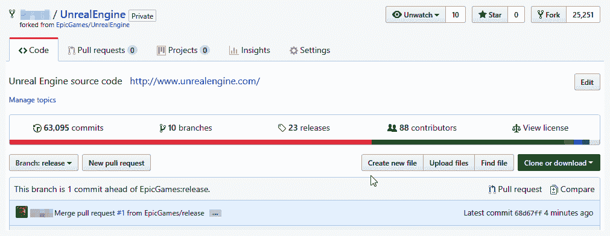

Comparison between our branch and the upstream branch. We can see that we're now in-sync.

# 将原点拉入到本地计算机

现在，您需要更新计算机上的本地副本。

返回到 GitHub 桌面，在您的虚幻引擎存储库中，查找 Fetch Origin 按钮。 单击此按钮可指示 GitHub Desktop 在远程存储库中查找尚未在本地复制的更改：


GitHub Desktop before we've fetched the new changes from the repo

在我们的案例中，我们有以下几点：


GitHub Desktop ready to pull changes to our local machine

现在是时候将这 52,000 个更改下载到我们的本地机器上了。 点击拉动原点可执行此操作。 GitHub 桌面将*签出*更改，并将其复制到本地计算机。 一旦完成此操作，我们应该会看到点击 Fetch Origin 不再产生任何要拉取的新文件-我们是最新的。

# 重新同步引擎内容并重新生成项目文件

无论您是使用命令行还是 GUI 来更新您的 fork，您现在都需要更新您的解决方案文件和项目文件，以反映您下载的新源代码。

If you're certain that no source files or assets have been added or removed, you can skip this part. When in doubt, run these operations to make sure your assets are current and that Visual Studio knows about changed files.

关闭 Visual Studio 后，重新运行引擎目录中的`Setup.bat`文件以更新二进制内容，然后重新运行`GenerateProjectFiles.bat`以更新 Visual Studio 文件。 这些程序的运行速度将比第一次快得多，因为它们只更新已更改的内容。

打开解决方案，生成并运行它。 您应该重新开始使用当前代码。

Very often, your startup project will change when you regenerate project files. If it does, right-click the project you'd like to launch and select Set as StartUp Project to reset it.

# 进一步介绍 GitHub 上的源代码

在修改和构建引擎源代码方面，我们可以讨论更多内容，但这超出了本书的范围。 不过，如果您需要比当前版本更新的代码，或者需要修改引擎，那么您在这里所学到的将允许您下载 Etic 最新的虚幻引擎代码并构建引擎。

如果您确实计划使用来自 GitHub 的虚幻源代码，那么花时间了解它是值得的。 这是一个强大的工具，但如果您不清楚它在做什么，它可能会令人费解。 此处提供帮助：[https://help.github.com/](https://help.github.com/)。

再说一次，大多数用户不需要这样做，但有时确实会发生这样的情况，支持新 VR 设备的代码在通过启动器进入发布分支和二进制发布通道之前很久就出现在升级或主分支上。 如果你需要的话，你现在应该知道如何使用最新和最好的软件。

# 其他有用的工具

在我们继续本章之前，让我们先花一点时间来讨论一下您可能想要设置的其他工具来处理虚幻。 这些都不是本书中的项目所必需的，但是它们值得了解，所以您需要知道在需要的时候去哪里查找它们。

# 一个优秀的健壮的文本编辑器

当你需要编辑较大的文本文件或替换文件中的大量文本时，记事本根本不会起作用。 我们建议您为此设置专用文本编辑器。 以下是几个选项：

*   **Visual Studio Code**([https://code.visualstudio.com/](https://code.visualstudio.com/))是一个功能强大的轻量级文本编辑器，支持多种语言，并包含许多有用的文本编辑工具。 这是免费的。
*   **Sublime Text**([https://www.sublimetext.com/](https://www.sublimetext.com/))是一个高度可定制的编辑器，具有大量针对各种语言的定制集成。 它是 80 美元，免费试用。
*   **Atom**([GitHub](https://atom.io/))是由 https://atom.io/开发的一个相对较新的编辑器，它支持大量额外的软件包安装程序，几乎可以对文本页面执行任何操作。 因为它是由 GitHub 制作的，所以它的 Git 集成非常棒。 而且是免费的。
*   **Notepad++**([https://notepad-plus-plus.org/](https://notepad-plus-plus.org/))速度快、重量轻，而且比大多数其他产品都要老，因此它有一批忠实的追随者。 它也是免费的。
*   **Vim**([https://www.vim.org/download.php](https://www.vim.org/download.php))是它自己的野兽。 它的用户界面约定与 Windows 中的任何其他约定没有任何相似之处，因此需要付出相当大的努力才能学习它们。 它的优点是，一旦用户学会了操作它的击键，他们就可以在文本文档中以惊人的速度导航，而不需要使用鼠标。 它几乎可以在任何可以计算的东西上运行。 只有当你已经在使用它，并且喜欢它，或者特别有兴趣学习它时，我们才推荐它。

这些或任何其他你熟悉和喜爱的文本编辑器都会运行得很好。 选一个你觉得合适的，然后坚持下去。

# 3D 建模软件

不真实的场景是由 3D 模型组成的，在开发过程中，您需要修改它们、清理它们，或者从头开始创建它们。 (你需要在多大程度上做到这一点，很大程度上取决于你在创作什么，与谁合作，以及你对市场或其他来源现有艺术品的依赖程度。)。 无论如何，在你的系统上安装一个可以编辑 3D 网格的工具是个好主意。

You'll commonly hear 3D modeling tools referred to as **Digital Content Creation** tools in the industry, usually shortened to **DCC**. If you hear someone refer to a DCC, they're generally talking about a 3D modeling tool such as Blender, Maya, or 3ds Max.

以下是几个选项：

*   **Blender**([https://www.blender.org/](https://www.blender.org/))是一个免费的开源 3D 建模程序，在独立开发社区中广泛使用。 有很多教程可以教你如何在 Blender 中创建资源，并让它们进入虚幻。 这是免费的。
*   **Autodesk Maya**([https://www.autodesk.com/products/maya/overview](https://www.autodesk.com/products/maya/overview))是一款专注于为媒体和娱乐创建内容的专业工具。 在过去的十年里，你在任何电影或游戏中看到的几乎每一种生物都很可能是在 Maya 中建模和制作动画的。 Maya 的订阅费用约为每年 1500 美元，但学生可以免费使用三年。
*   **Autodesk 3ds Max**([https://www.autodesk.com/products/3ds-max/overview](https://www.autodesk.com/products/3ds-max/overview))是一种专业建模工具，专注于为**建筑、工程和建筑**(**AEC**)以及产品设计创建内容。 它也通常用于媒体和娱乐，但它的动画工具比 Maya 中的工具要有限得多。 3ds Max 的定价与 Maya 相同-每年约 1,500 美元，并提供免费的学生许可。
*   **MODO**([https://www.foundry.com/products/modo#](https://www.foundry.com/products/modo#))是进入专业市场的较新产品，正在获得越来越多的拥趸。 值得一看。 订阅 Modo 的费用为 600 美元/年。

您选择的 DCC 将取决于您的预算以及您计划如何使用它。 一般来说，如果你是为了娱乐而制作 VR，Maya 会包含更多你需要的东西，但这绝不是绝对的。 对于建筑和产品设计，3ds Max 可能是您需要的。 对于独立游戏开发，你可能也可以使用 Blender。 做一些研究，找出最适合你特定需求的是什么。

在你的职业旅行中，你还会看到一些其他的工具。 你通常不会看到初学者使用它们，但它们是强大的工具，你应该知道它们是存在的，所以你可以考虑它们是否可能是你正在尝试做的事情的一个很好的解决方案：

*   **ZBrush**([http://pixologic.com/](http://pixologic.com/))是一个数字雕刻工具，用于创建非常详细的模型和曲面。
*   **Mudbox**([https://www.autodesk.com/products/mudbox/overview](https://www.autodesk.com/products/mudbox/overview))和 ZBrush 一样，是用于为模型添加精细细节的雕刻工具。
*   **Houdini**([https://www.sidefx.com/](https://www.sidefx.com/))是一个用于 3D 几何体和效果的程序创建工具。 如果你需要创造一座满是建筑的城市，一片长满藤蔓的森林，或者一个翻腾的火球，胡迪尼可能就是你要找的。
*   **Substance Painter**([https://www.allegorithmic.com/products/substance-painter](https://www.allegorithmic.com/products/substance-painter))是一种纹理绘制工具，允许美工人员将纹理直接绘制到 3D 模型上。
*   **Substance Designer**([https://www.allegorithmic.com/products/substance-designer](https://www.allegorithmic.com/products/substance-designer))是一个强大的材质创作工具，可用于创建高度多样化和逼真的基于物理的材质。

这些通常都是专家和专家工具，但有必要知道它们在那里以及它们做了什么。

# 图像编辑软件

你经常需要编辑纹理和 2D 图片。 你需要一个工具来做这件事，实际上你有两个选择可以认真考虑：

*   **Adobe PhotoShop**([https://www.adobe.com/products/photoshop.html](https://www.adobe.com/products/photoshop.html))是 2D 图像编辑的标准。 这是值得的。 Photoshop 的定价有一个秘诀：如果你将其作为独立应用程序订阅，则每月收费 20.99 美元，但如果你订阅摄影套餐，则每月只需 9.99 美元。
*   **GIMP**([https://www.gimp.org/](https://www.gimp.org/))是一个免费的开源图像编辑应用程序。 它缺乏 Photoshop 的许多功能，但如果你只是偶尔修改纹理，它可能就是你需要的全部。

您在 Photoshop 和 GIMP 之间的选择将取决于您的需求和预算。 如果你是专业人士，最好还是使用 Photoshop，但如果你不需要 Photoshop 的所有功能，GIMP 可能就足够了。

# 音频编辑软件

您有时需要为您的游戏和应用程序编辑声音和音乐。 您在这里也有几个选择：

*   **Audacity**([https://www.audacityteam.org/](https://www.audacityteam.org/))是一个免费的开源音频编辑解决方案，非常棒。 对于您需要做的大部分声音编辑工作，Audacity 可能是您所需要的全部。
*   **Adobe Audition**([https://www.adobe.com/products/audition.html](https://www.adobe.com/products/audition.html))是一款专业的音频编辑工具。 与 Audacity 相比，它的优势在于更高的质量效果和非破坏性的编辑工作流程，这意味着如果您对声音应用滤镜或效果，然后想要稍后更改它，您仍然可以这样做。 试镜是按月订阅的，也可以捆绑到 Adobe All Apps 订阅中。
*   **AVID Pro Tools**([https://www.avid.com/pro-tools](https://www.avid.com/pro-tools))是专业人士最常用的音频编辑软件，免费提供专业版|第一版，包含专业版的所有功能，但限制了您可以使用的输入和音轨数量。 这是否是一个适合您的解决方案，真的取决于您对音频编辑的预期程度，以及您计划如何处理它。

我们提到的所有选项都包括声音编辑，但对于声音创作，并不缺乏可用的工具和音频库。 对它们进行分类超出了本书的范围，因为音响设计本身就是一门艺术，而兔子洞又很深。 对于大多数在虚幻中开发 VR 应用的用户来说，从 Audacity 开始并不是一个坏主意，当你发现你需要做一些具体的事情时，再从那里开始。

# 简略的 / 概括的 / 简易判罪的 / 简易的

在本章中，我们安装了虚幻引擎，并了解了在设置它时可以使用的各种选项。 我们创建并启动了一个简单的测试项目来验证一切是否正常。 此外，对于那些为移动 VR 进行开发的人，我们学习了如何设置所需的驱动程序和软件开发套件，并设置了一个移动测试项目，并将其部署到我们的设备上。

在这一过程中，我们学会了如何使用 Epic Games 启动器-不仅作为保持引擎版本最新和启动项目的一种方式，而且还作为一个重要的学习和支持资源。 通过对启动器的探索，我们了解了如何从“社区”选项卡获取问题的答案，以及从“学习”选项卡在哪里可以找到文档和视频教程。 我们研究了非常有用的 Content Examples 项目，并查看了可以用来探索引擎中特定主题的其他项目。 我们看到 Marketplace 提供了大量的免费和付费内容，我们可以用来加速我们的项目，我们还学习了如何使用 Library 选项卡来维护我们的项目和引擎版本。

对于那些计划使用 C++ 进行开发的人，我们学习了如何设置我们的 Visual Studio 2017 开发环境并将其配置为使用虚幻，然后我们创建了一个简单的测试项目，以确保我们能够在虚幻中构建和运行我们自己的 C++ 代码。 为了更具冒险精神，我们学习了如何从 GitHub 下载虚幻引擎源代码，并完全从头开始构建引擎。

最后，我们简要介绍了开发人员在为虚幻引擎构建内容时通常会发现有用的其他工具，包括一系列满足各种需求的免费和付费解决方案。

在下一章中，我们将专门为 VR 构建我们的第一个项目。 (我们在本章中设置的快速项目允许我们测试我们的开发环境是否设置正确，但它们不是专门为 VR 设计的。)。 现在，我们将学习如何为 VR 设置正确的项目。 我们跳进去吧！