# 九、在 VR 中显示媒体

在之前的章节中，我们专注于为 VR 创建实时 3D 媒体，并花了大量时间关注玩家角色、界面元素和构建世界。 现在，我们将稍微改变一下方向，探索 VR 的另一个重要应用-在平板屏幕和身临其境的环境中显示电影。

VR 在这方面非常在行。 因为可以在耳机内创造近乎无限的空间，用户可以在巨大的虚拟屏幕上体验电影和媒体，而不会因此而分心。 这些屏幕也可以采用任何形状。 除了平面和曲面屏幕，整个环境的照片和电影可以呈现在围绕玩家的球体中，使他们感觉完全沉浸在空间中。 在本章中，我们将学习如何创造这些东西。

我们将特别介绍以下主题：

*   在虚拟屏幕上显示视频
*   从视频源的侧面和上方/下方显示立体声深度的视频
*   在 360 度球形环境中显示媒体
*   立体声显示 360 度媒体
*   创建交互式控件以允许播放器启动、停止和倒带其媒体

让我们开始学习如何播放电影吧！

# 设置项目

对于本章的项目，我们不需要以前工作中的任何内容，因此我们将从创建一个具有以下设置的新项目开始：

*   空白蓝图模板
*   移动/平板电脑硬件目标
*   可缩放的 3D 或 2D 图形目标
*   包含入门内容(我们将在本文中使用一些入门内容)

我们仍然需要为 VR 设置适当的设置，就像我们对每个项目所做的那样。 下面是小抄：

*   项目|描述|设置|在 VR 中启动：*True
*   引擎|渲染🙂|◄正向渲染器🙂|◄正向着色：🙂TRUE
*   引擎|环境光渲染|默认设置|环境光遮挡静态分数：0.false
*   引擎|渲染模式|默认设置|模式抗锯齿方法：*MSAA
*   引擎|渲染|VR|实例化立体声：*True
*   引擎|渲染|VR|11-13 轮询遮挡查询：11-13 真

设置完所有这些设置后，允许项目重新启动。 一旦您的项目重新打开，您就可以开始学习媒体在虚幻引擎中的工作方式了。

# 在虚幻引擎中播放电影

我们将从学习如何在虚幻引擎中播放电影和其他媒体开始。 当然，开始之前，我们需要一部电影来播放。

视频文件有一系列令人困惑的配置，关于它们，有几件事你应该知道。

# 了解容器和编解码器

大多数人在开始学习视频文件时遇到的第一个困惑是不理解包装视频文件的容器不一定能告诉您它是如何编码的。 让我们花点时间来谈谈这个问题。

视频文件由大量信息组成，所有信息都打包到一个文件中。 这是代表视频轨道的图像流。 通常，有音频，有时有字幕，有时也有其他更多的信息。 所有这些信息都捆绑在称为**容器**的包装格式中。 您一定见过扩展名为`.mp4`的视频文件。 这是 MPEG-4 容器格式使用的扩展名。 AVI 是微软的标准容器格式，还有许多其他格式。

不过，需要记住的是：容器格式指定了文件中这些不同部分的信息是如何保存在一起的，但它没有告诉我们视频流和音频流实际上是如何生成的。 仅仅因为您在文件上看到了`.mp4`扩展名，并不一定意味着它就能实现您想要使用它的目的。 您还需要考虑另一个因素：**编解码器**。

单词**编解码器**是单词**压缩器**和**解压缩器**的缩写组合。 原始状态的视频文件可能会变得很大。 多大?。 我们来算几个数字。 假设我们有一个 1080p 的视频文件。 其尺寸为 1920x1080 像素。 即每帧 2,073,600 像素。 假设我们以 24 位颜色(每通道 8 位)显示此视频文件，这允许我们显示 1600 多万种颜色，即每帧大约 50MB。 如果我们以每秒 30 帧的速度运行，这将消耗大约每秒 1.49G 字节。 你这么做会匆忙用完空间的。

我们通过在存储视频文件时对其进行大量压缩，然后在需要将其流传输到屏幕时进行实时解压缩来解决这一问题。 这项工作由编解码器处理。 它的压缩器组件负责获取原始的源视频，并将其打包成可以放在光盘上的格式，而它的解压缩器组件负责将其解包，以便可以显示。 关于视频编解码器如何工作的讨论占满了整本书，所以我们不会对此进行深入的讨论，但您需要知道的是，虽然存在许多编解码器，但并不是所有的编解码器都能与所有的软件解决方案一起工作，也不是所有的编解码器都能在所有的硬件配置上工作。 最常用、兼容性最广的编解码器称为**H.264**，但存在许多编解码器。 有些是为广泛使用而设计的，有些是专门为某些应用设计的，比如视频编辑。 花点时间了解这些是值得的。

那么，现在你知道了一个关于视频文件的秘密了。 容器不一定会告诉您有关编解码器的信息，您需要了解两者才能知道文件是否可以工作。 (所以下次你问别人他们给了你什么样的视频文件，他们回答说他们给了你`.mp4`，你就会知道他们还没有真正回答你的问题。)。 一些容器格式只适用于特定的操作系统或硬件，而其他格式，如`.mp4`，几乎可以在任何地方使用。

对于要与虚幻引擎一起使用的视频文件，通常应选择将其包装在`.mp4`容器中，并使用**H.264**编解码器对其进行压缩。有关支持的编解码器的更多信息，请查看以下链接：[https://docs.unrealengine.com/en-US/Engine/MediaFramework/TechReference](https://docs.unrealengine.com/en-US/Engine/MediaFramework/TechReference)。

We're not going to cover the topic of compressing your own video files here in this book – there's quite a lot to say about that, and quite a lot of information available online about how to do it. If you have access to the Adobe Creative Suite, the included Adobe Media Encoder application is an excellent tool for converting video into nearly any format you need. If you need a free video encoder, AVC Free is excellent and commonly used. You can find it at the following link: [https://www.any-video-converter.com/products/for_video_free/](https://www.any-video-converter.com/products/for_video_free/).

# 查找要测试的视频文件

让我们找到一个符合这些标准的文件。 如果我们导航到“Video for Everyone”测试页面，我们可以找到适合测试的视频。 转到[http://camendesign.com/code/video_for_everybody/test.html](http://camendesign.com/code/video_for_everybody/test.html)，找到`.mp4`容器格式的下载视频链接。 右键单击链接，然后选择将链接另存为...将`big_buck_bunny.mp4`视频文件保存到硬盘。

如果您的系统中尚未安装 VLC 媒体播放器，请从以下地址下载并安装：https://www.videolan.org/vlc/index.html[VLC](https://www.videolan.org/vlc/index.html)。 在实践中，您可以使用任何视频播放器来检查您的文件，但 VLC 是一个值得了解的好工具。 它几乎可以播放任何内容，并为您提供有关正在播放的文件的详细信息。 请参阅以下步骤：

1.  在 VLC 中打开刚刚下载的视频文件并播放。
2.  在某处暂停视频，点击*Ctrl*+*J*打开其编解码器信息：

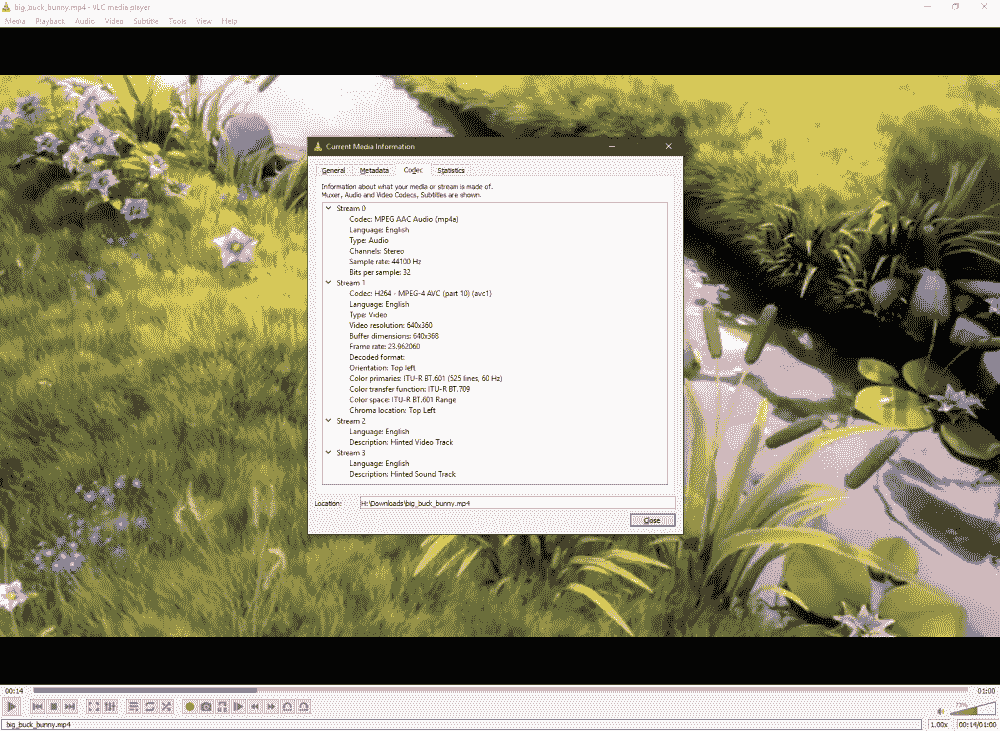

您可以在这里看到这个文件是使用 H.264 编码的，我们可以从它的文件扩展名中看到它使用了一个`.mp4`容器。 这个文件应该可以在虚幻中的任何平台上正常工作。

# 将视频文件添加到虚幻项目

让我们将此文件添加到我们的虚幻项目中。

对于其他资源类型，可以从虚幻编辑器中使用`Import`方法将其添加到项目中，但视频文件有所不同。 要将视频文件添加到虚幻项目，必须手动将其放置在名为`Movies`的`Content`文件夹的子目录中。

The name and location are important. The engine will look for movies in `Content/Movies` by default, and your movies may not package correctly if you put them in another location.

1.  在内容浏览器中，确保您位于根`Content`文件夹，然后单击鼠标右键以创建一个新文件夹。
2.  将其命名为`Movies`，如下图所示：

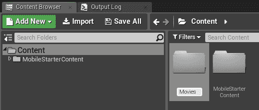

3.  从 Windows 资源管理器中，找到您下载的`.mp4`文件，并将其移动到项目的`Content\Movies`目录。 (您可以在内容浏览器中的此目录上单击鼠标右键，然后选择“在资源管理器中显示”以导航到该目录。)

# 创建文件媒体源资产

现在，返回到虚幻编辑器，在`Content/Movies`目录中，右键单击并选择创建高级资产|媒体|文件媒体源以创建新的文件媒体源资产。 使用与源资产相同的名称命名文件媒体源通常更容易，因此将其命名为`big_buck_bunny`更有意义，因为这是我们要附加的文件的名称：

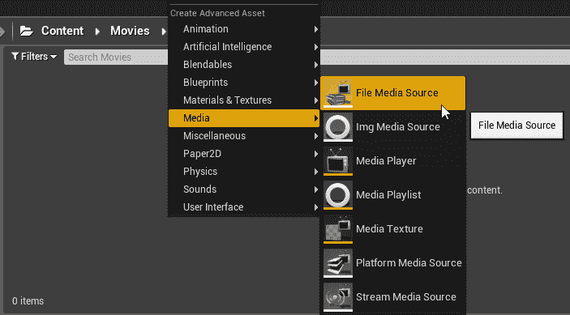

打开它并使用省略号(...)。 按钮选择您放置在`Content/Movies`目录中的视频文件作为其文件路径：

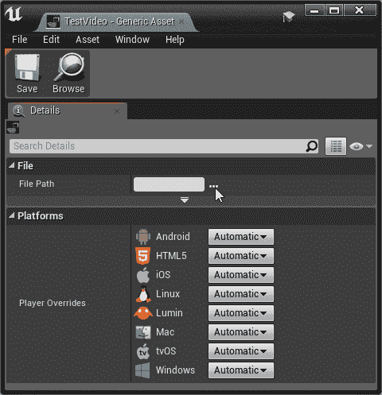

文件媒体源资产只是一个解析器，它允许媒体播放器在磁盘上查找电影。 媒体播放器指向文件媒体源，而那些文件媒体源指向`Movies`目录中的实际文件。

文件媒体源还提供一些附加选项：

*   高级 Precache File 选项可用于强制将整个媒体文件放入内存并从内存播放。
*   播放器覆盖列表允许您强制特定播放器解码特定平台上的媒体。 除非您确定需要覆盖自动选择，否则不要使用这些选项。

还有另外三种媒体源类型，虽然我们不会在这里深入探讨，但您应该了解它们：

*   **img**媒体源用于显示图像序列，即要作为电影连续流式传输的单个图像。 有关播放图像序列的详细信息，请查看以下链接：[https://api.unrealengine.com/INT/Engine/MediaFramework/HowTo/ImgMediaSource/index.html](https://api.unrealengine.com/INT/Engine/MediaFramework/HowTo/ImgMediaSource/index.html)。
*   **Stream**媒体源允许您指定在特定 URL 托管的视频文件进行播放。 有关更多信息，请查看以下链接：[https://api.unrealengine.com/INT/Engine/MediaFramework/HowTo/StreamMediaSource/index.html](https://api.unrealengine.com/INT/Engine/MediaFramework/HowTo/StreamMediaSource/index.html)。
*   **Platform**媒体源允许您指定不同的媒体在不同的硬件平台上播放。 有关详细信息，请查看以下链接：[https://api.unrealengine.com/INT/Engine/MediaFramework/HowTo/PlatformMedia/index.html](https://api.unrealengine.com/INT/Engine/MediaFramework/HowTo/PlatformMedia/index.html)。

# 创建媒体播放器

现在我们已经设置了媒体源，让我们创建一个媒体播放器来播放它：

1.  右键单击您的`Content/Movies`目录，然后选择创建高级资产|媒体|媒体播放器。 我们将对所有媒体资源使用相同的媒体播放器，因此通用名称(如：`MediaPlayer`)就可以了。 请参阅以下屏幕截图：

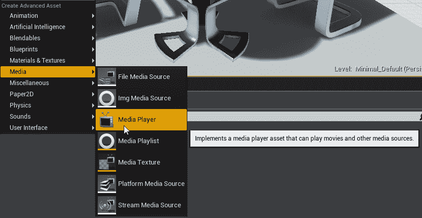

当您创建它时，会出现一个新的对话框，询问您是否要创建一个 Media Texture 资源来处理视频输出。 让我们允许它这样做，如以下屏幕截图所示：

我们也可以通过从内容浏览器创建 Media/Media 纹理资源来创建它，但这为我们省去了一步。

# 使用 Media 纹理

媒体纹理资源显示来自其绑定的媒体播放器资源的流式视频或图像。 如果您打开我们刚刚创建的一个，您会看到它绑定到了我们刚刚创建的媒体播放器：

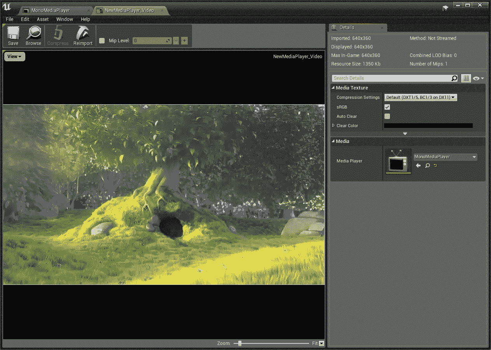

如果您的媒体纹理看起来是空白的，请不要担心。 它不会显示任何内容，直到您在其关联的媒体播放器上播放了一些内容。

通常，您会希望保留 Media Texture 的属性。 确保它绑定到您的媒体播放器，但您不太可能需要更改它的任何其他属性。

# 测试您的媒体播放器

打开您刚刚创建的新媒体播放器资源。 您应该会在可用媒体源列表中看到我们刚才设置的文件媒体源。 选择并播放它，以验证它是否可以在虚幻中播放：

确保为该文件源选择了 Play on Open(打开时播放)，并打开循环播放选项。

一旦我们验证了视频文件在我们的媒体播放器中播放，让我们将其添加到世界上的一个对象中。

# 向世界中的对象添加视频

由于我们在此项目中包含了入门内容，因此我们的项目不是使用空白地图启动，而是默认使用名为 Minimal Default 的简单地图启动，其中包含一对椅子和一张桌子。 我们可以将此作为电影回放地图的起点。 通过选择文件|当前另存为...保存地图，并将其另存为`Content/Chapter08/Maps/MoviePlayback2D`。 (请记住，最好将您的工作放到项目的`Content`目录的子目录中。 否则，当您迁移其他内容时，将会一团糟。)

如果您愿意，可以随意使用入门内容来安排更舒适的剧院或观众席。 我们不打算在这里讨论这一点，但是如果你准备好了，可以创建一个起居室或电影院布景，或者任何能激发你想象力的东西。

在我们的场景中，我们真正需要的是一个屏幕来显示我们的媒体。 请按照以下步骤创建一个应用：

1.  从“Modes”面板中，选择“Place|Basic|Plane”，然后将一个平面拖到场景中。
2.  将其位置设置为`(X=-730.0, Y=0.0, Z=210.0)`(或任何适合您构建的环境的位置)。
3.  将其旋转设置为`(Pitch=0.0, Yaw=-90, Roll=90)`(在编辑器中，其显示为`X=90.0, Y=0.0, Z=-90.0`)。
4.  将其比例设置为`(X=8.0, Y=4.5, Z=1.0)`。 通过这样做，我们已经将屏幕的形状与我们想要播放的视频的 16：9 宽高比相匹配。

现在，我们要将 Media 纹理指定给该平面：

1.  将我们为 Media Player 创建的 Media 纹理拖到平面上。
2.  将自动创建一种材质来显示纹理。

这就是如何让媒体进入 3D 场景。 指定使用 Media 纹理作为源的材质或材质实例，并确保该 Media 纹理指向回 Media Player。

# 使用媒体回放材料

我们应该看一下这份材料。 把它打开。 如果查看其材质属性，可以看到它是使用默认明暗处理模型的普通表面材质。 这里没什么特别的。

另一方面，纹理示例很有趣：

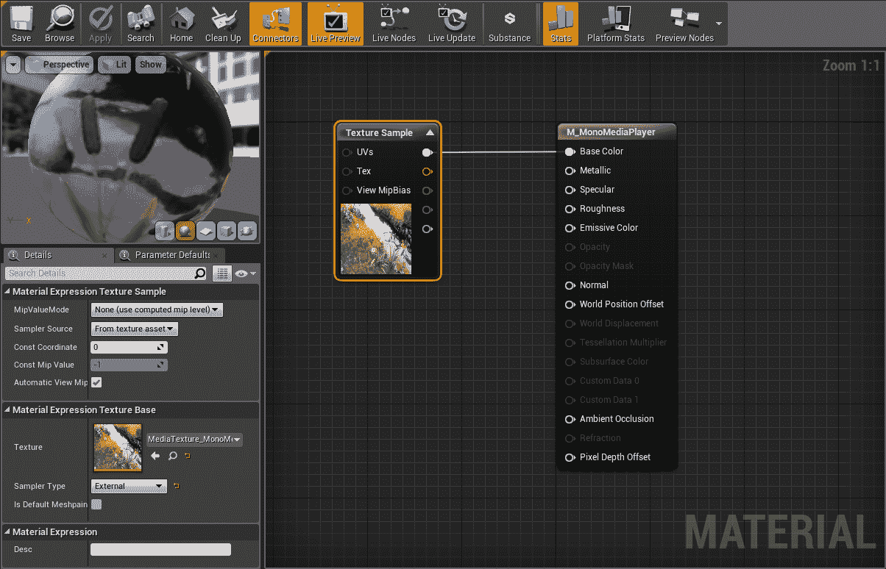

这里重要的细节是它的纹理源已经被设置为我们的媒体纹理，并且它的采样器类型已经被设置为`External`。 这将使它能够实时显示我们的媒体。 我们不久将对此材料做更多工作，但目前您可以关闭它。

# 将声音添加到我们的媒体播放中

我们还希望能够在场景中播放声音。 要执行此操作，请执行以下步骤：

1.  在我们的屏幕演员仍处于选中状态的情况下，单击其详细信息面板中的 Add Component 按钮。

2.  添加 Media Sound 组件并将其 Media Player 属性设置为我们的媒体播放器：

此媒体声音组件将播放关联的媒体播放器正在播放的任何音频。 默认情况下，它可以处理立体声音频，但也可以用于单声道或环绕音频源。

现在我们已经设置好了一切，并在世界上放置了一个带有视频素材和声音组件的对象，让我们让媒体播放器播放我们的测试视频。

# 播放媒体

我们将简单地从这里开始，在关卡开始时播放电影。 稍后，我们将采取更多措施来控制我们的媒体播放器。 请按照以下步骤开始：

1.  点击 Open Level Blueprint，如下图所示：

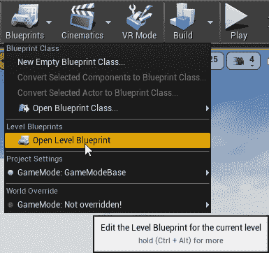

2.  创建一个新变量，并将其类型设置为 Media Player|Object Reference：

3.  编译蓝图并将变量的默认值从`None`更改为我们刚才创建的媒体播放器。
4.  *按住 Ctrl*键并将媒体播放器变量拖到事件图上。
5.  查找或创建 Event BeginPlay 节点。
6.  从 Media Player 变量中拖动一个连接器，并对其调用 Open Source。
7.  将呼叫的 Media Source 设置为我们从电影创建的文件媒体源：

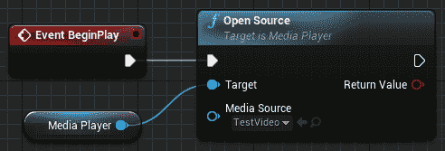

在你的 VR 预览中启动它，让我们看看会发生什么：

好的。 视频正在播放。 我们将花一点时间回顾一下我们是如何设置它的，然后我们将寻找改进的方法。 请参阅以下屏幕截图：

媒体播放的工作原理如下：

1.  要在引擎中播放的任何媒体都以`Content/Movies`中的文件开始。 源影片不会导入到引擎中，也不会显示在您的内容浏览器中。
2.  要在引擎中访问它，需要创建指向磁盘上媒体文件的文件媒体源资产。
3.  媒体通过 Media Player 对象播放，您可以通过 Blueprint 调用控制该对象。
4.  媒体纹理资源从其关联的媒体播放器中采样视频。 这些都包含在材质中。
5.  对象上的 MediaSound 组件从其关联的媒体播放器播放音频。 这些通常添加到在场景中充当屏幕的对象。

# 更深入地了解回放素材

让我们来看看我们可以用媒体播放材料做的几件事。 在这里做出正确的选择完全取决于你试图创造什么样的效果，所以我们将讨论一些你可能想要做的事情，但你需要自己决定它们是否适合你要做的事情。

我们首先要讨论的是屏幕对光线的反应。 我们为 Media 纹理创建的材质使用默认的光照着色模型。 这意味着环境中投射到该材质上的灯光将像往常一样影响该材质。 如果您想要的美学效果是这是空间中的一个物理屏幕，这可能正是您想要的，但是如果您的应用的目的是显示媒体本身，您可能不希望任何杂散光落在屏幕上并改变其颜色显示给观众的方式。

让我们来看看我们正在谈论的是什么。 从模式面板中，将一个点光源拖到场景上，并将其放在屏幕的正前方：

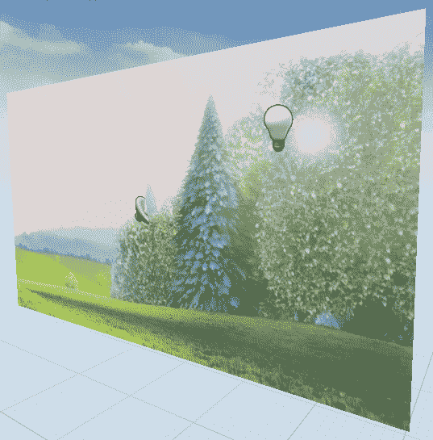

您将看到灯光会在屏幕上创建镜面反射高光，就像场景中的任何其他曲面一样。 如果我们关掉场景中其他的灯，情况会变得更糟。 现在，我们屏幕的某些部分变暗了，而其他部分则被剩余灯光的高光遮挡住了。

如果这是我们想要的，那很好，但如果不是这样，我们可以通过更改材质以使用无光着色模型并将视频信号馈送到其发射通道来纠正此问题。 让我们试一试：

1.  打开您的媒体素材。
2.  在选定输出节点的情况下，将材质的细节|材质|着色模型从默认照明更改为不照明：

3.  您将看到其基本色输入变为禁用状态。 *按住 Alt*并单击该输入可断开纹理采样与其的连接。
4.  而是将纹理采样的结果馈送到材质的发射颜色输入中。

保存材质并返回到场景。 现在，因为您的材质使用无灯光模型，所以它不再受世界上灯光的影响。 媒体的外观与其源中完全相同：

# 向我们的视频外观添加其他控件

我们还可以使用材质图对视频信号的显示方式进行大量额外控制。 我们来看一下这个：

1.  返回到您的材料。
2.  按住*S*键并在工作区中单击以创建标量参数。 将其命名为`Brightness`，并将其默认值设置为`1.0`。
3.  按住*M*键并单击以创建倍增节点。
4.  将纹理采样的输出乘以刚刚创建的`Brightness`参数。
5.  按住*S*键并单击以创建另一个标量参数。 将其命名为`Contrast`，并将其默认值保留为`0.0`。
6.  在图形中单击鼠标右键并创建`CheapContrast_RGB`节点。
7.  将乘法节点的结果连接到其 In(V3)输入，并将`Contrast`参数输入到其对比度输入。
8.  将结果输入材质的发射颜色输入：

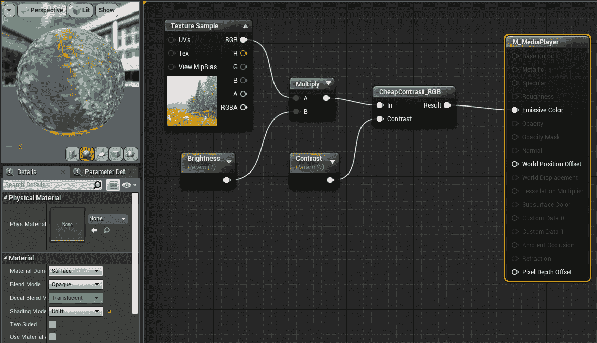

如您所见，我们现在已经创建了一个简单的材质，它使用两个标量参数来允许我们的用户控制图像的亮度和对比度。

让我们从该材质创建一个材质实例，以便可以实时查看这些参数的效果：

1.  在内容浏览器中的材料上单击鼠标右键，然后选择“材料实例操作”|“创建材料实例”。
2.  将材质实例拖到屏幕上以将其指定给对象。
3.  打开 Material 实例并尝试更改刚创建的`Brightness`和`Contrast`值。 (请记住，您需要选中参数旁边的复选框才能启用修改。)
4.  将材质的预览网格切换为立方体基本体，以便您可以更轻松地查看正在执行的操作：

我们可以在这里做很多事情，我们鼓励你去探索和了解更多关于你能做什么的事情。

现在你已经知道了在虚幻引擎中播放视频的基础知识，让我们开始深入研究一些 VR 特定的工作，并学习如何在立体 3D 中显示视频。

# 显示立体视频

让我们首先创建另一张地图来显示我们的立体视频屏幕。 在打开`MoviePlayback2D`场景的情况下，单击文件|将当前另存为...。 并将地图另存为`MoviePlayback3D`。

现在，我们需要找到一个立体视频文件进行测试。 它们就在网上，但很难找到，因为我们需要下载我们的。 Stereomaker.net 这里有几个示例文件：[http://stereomaker.net/sample/](http://stereomaker.net/sample/)。 从这里开始播放在 Hibaya 公园骑车的视频吧。 我们还可以在此处找到更多示例文件：[http://photocreations.ca/3D/index.html](http://photocreations.ca/3D/index.html)。 下载贝拉吉奥喷泉，拉斯维加斯，内华达州 3D 2048 x 2048 剪辑。 这将为我们提供一个并排的立体声剪辑和一个上下立体声剪辑，我们可以将其用于我们的实验。 Hibaya 剪辑被包装在一个`.AVI`容器中，但只要我们在 Windows 上运行该剪辑，它就可以工作。 要在另一个平台上运行它，我们必须使用 Adobe Media Encode 或 AVC 等应用来转换它：

1.  将这些文件放入您的`Content/Movies`目录中。
2.  为每个新视频文件创建文件媒体源资产。 同样，使用与磁盘上的影片剪辑匹配的文件媒体源的名称通常更容易。

现在，打开你的媒体播放器。 您应该会在可用文件列表中看到这些新剪辑，并且应该能够播放它们。 您应该会看到两个并排的帧，代表左右立体图像(请确保使用并排的立体视频进行第一个测试-我们稍后将在上面/下面处理)：

现在的诀窍是将并排或上下的图像解释为立体图像，并将一帧输入到左眼，而我们将另一帧输入到右眼。

我们将在我们的材料中处理这一点。 具体地说，我们要做的是修改提供给纹理 UV 贴图的纹理坐标。

A UV map determines the way a texture aligns itself on a mesh in a 3D space. By manipulating the texture coordinates we're using to apply textures in our material, we can choose to display only parts of the texture at a time.

打开您的媒体播放器素材。

由于我们希望此材质也能够处理单声道视频源，因此我们将使用静态切换参数在单声道和立体声模式之间切换。 这将允许我们将此材质用作主材质，但可以设置单独的材质实例来处理我们需要的任何特定设置。

Static Switch Parameters are valuable tools that you can use to build a lot of behavior into a master material, and derive material instances from it that handle specific cases. As an added benefit, when those materials are compiled, anything that's turned off by your static switches simply doesn't even compile into the material instance, so you get it essentially for free. What this means is that you can make fairly complex master materials and only pay for the parts you use by using static switches to turn off functionality that you're not using.

让我们向材质添加一个开关，这样就可以在不破坏单声道显示的情况下创建立体声路径：

1.  在材质编辑图形中单击鼠标右键，然后创建静态切换参数。 将其命名为`SplitStereoMedia`。
2.  右键单击并创建纹理坐标节点，然后将其输出馈送到切换参数的假输入中。 这将在图形中显示为 TexCoord 节点。

现在，是拆分图像的时候了。 当图像渲染到 VR 头戴式耳机时，它们在两个单独的通道中渲染，我们可以使用此信息来确定要显示图像的哪一侧。

# 显示一半视频

要拆分图像，我们首先需要访问纹理坐标的两个单独的轴，以便我们可以单独操作它们：

1.  从纹理坐标输入拖动输出，并从中创建 BreakOutFloat2Components 节点。
2.  按住*M*键并单击以创建乘法节点。
3.  将中断节点的 R 输出连接到倍增节点的 A 输入，并将其 Const B 参数设置为 0.5。

4.  创建一个附加向量节点，并将倍增的输出连接到 A 输入，并将断开节点的 G 输出连接到其 B 输入。
5.  将附加节点的结果输入分割立体声媒体切换器的 True Input。
6.  将切换节点的结果馈送到纹理采样的 UV 输入：

我们刚刚在这里做的是将纹理坐标分成两个通道，标记为 R 和 G。然后，我们将 R 通道切成两半，而不使用 G 通道，然后重新组合向量，并告诉我们的纹理示例使用结果将图像映射到它所应用的对象。

让我们测试一下它的功能：

1.  打开场景的级别蓝图。 它应该仍然包含对媒体播放器的开源调用。
2.  将其媒体源切换为并排视频。 因为我们需要一个地方来设置静态开关参数，所以我们需要一个新的 Material 实例来显示并排图像。
3.  复制刚才我们调整对比度和亮度时创建的材质实例。
4.  说出它的名字`MI_MediaPlayer_SBS`或类似的名称，以提醒我们它是用来并排显示立体声媒体的。
5.  打开它并将其 SplitStereoMedia 开关参数设置为 true。
6.  将其分配给您的 Screen 对象。

试试看。 现在，您应该只会看到屏幕上显示的视频的左侧帧。 您还看不到任何立体深度，因为我们仍然向每只眼睛显示相同的图像。

# 向每只眼睛显示视频的不同半部分

现在，让我们获得要在右眼显示的正确帧：

1.  返回到您的材料。
2.  在材质图形中单击鼠标右键，然后创建自定义节点。
3.  在其 Code 属性中，输入以下内容：`return ResolvedView.StereoPassIndex;`。
4.  将其输出类型设置为 CMOT Float 1。
5.  将其描述设置为 StereoPassIndex。

这将创建一个材质表达式自定义节点，该节点在渲染左眼时返回`0`，在渲染右眼时返回`1`。 我们可以使用此信息来选择为每只眼睛显示哪一半帧。

6.  按住*M*键并单击以创建乘法节点。
7.  将 StereoPassIndex 的输出传递到其 A 输入，并将其 const B 参数设置为 0.5：

8.  现在，按住*A*键并单击以创建一个添加节点。
9.  将 R 通道倍增的结果从纹理坐标馈送到其 A 输入。
10.  将相乘后的立体声通道索引的结果送入其 B 输入。
11.  将添加节点的结果馈送到附加节点的 A 输入：

再试一次。 现在，当您在 VR 头戴式耳机中观看视频图像时，应该会看到视频图像中的立体深度。

让我们花点时间来理解一下我们刚刚在这里创建的内容。

当我们打破纹理坐标并修改 R 值时，我们就是在修改纹理贴图的水平轴。 通过将其乘以 0.5，我们将纹理的一半溅到网格的整个表面上。 我们创建的立体过程索引节点为左侧立体过程返回值 0，为右侧立体过程返回值 1，因此当我们将该值乘以 0.5 时，左眼的值为 0，右眼的值为 0.5。 然后，当我们将该值添加到纹理坐标的 R 分量时，我们将它的宽度偏移了一半。 因此，当渲染左眼时，它只会将纹理空间一分为二，而当渲染右眼时，它会将其一分为二，并将其偏移一半，从而显示右眼帧。 这就是我们获得立体图像的方法。

# 显示立体视频上方/下方

修改我们的材质以处理立体声视频之上/之下是相当容易的。 我们只需要在 G 通道而不是 R 通道上进行操作。 请按照以下步骤开始：

1.  重新打开您的媒体播放器素材。
2.  创建新的静态切换参数节点。 将其命名为`OverUnderStereo`。
3.  *按住 Ctrl*并拖动 SplitStereoMedia 开关的 True 输入以将其移动到 OverUnderStereo 开关的 False 输入。
4.  将 OverUnderStereo 开关的输出连接到 SplitStereoMedia 开关的 True Input：

如果 OverUnderStereo 设置为 False，我们的材质将继续使用我们刚才设置的并排拆分。 现在，让我们在此设置为 True 时设置其行为。

5.  选择包含 BreakOutFloat2Components 节点的节点链，一直到附加节点，然后按*Ctrl+W*复制它们。
6.  将局部剖分节点的 R 输出直接连接到附加节点的 A 输入。
7.  将局部剖分节点的 G 输出连接到乘法节点的 A 输入。
8.  将添加节点的输出连接到附加节点的 B 输入。

我们刚刚交换了一些东西，所以现在我们在垂直轴上执行的操作与之前在水平轴上执行的操作相同。

9.  将乘法节点的输出从立体声通道索引馈送到新的加法节点的 B 输入。
10.  将纹理坐标馈送到局部剖切节点的输入。

11.  将附加节点的输出馈送到 OverUnderStereo 开关的 True Input：

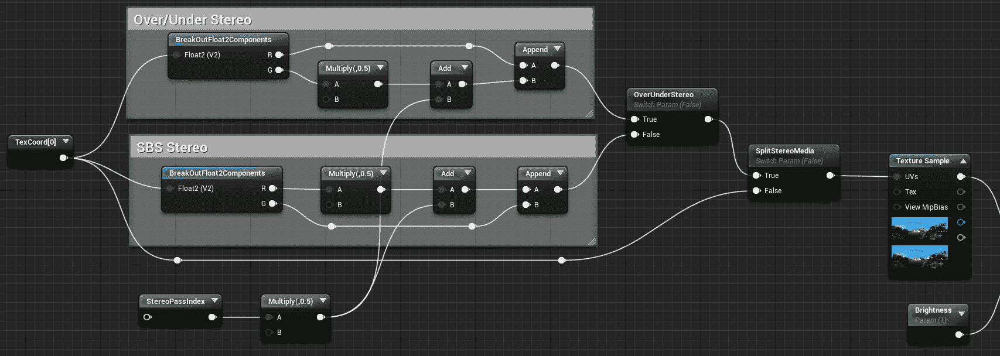

该材质现在可以处理单声道、并排立体声和立体声上方/下方。

现在，让我们来测试一下：

1.  关闭材质，然后在内容浏览器中，复制已从该材质创建的一个材质实例。
2.  确保其 SplitStereoMedia 参数设置为 True，并将其 OverUnderStereo 参数设置为 True。
3.  将其指定给场景中的屏幕对象。
4.  打开场景的 Level Blueprint，并将开源节点上的 Media Source 切换为 Over/Under 立体声视频。

启动它进入 VR 预览模式。 我们现在应该可以看到我们的超/欠立体声视频正确播放。

# 在 VR 中显示 360 度球形媒体

到目前为止，我们在虚拟现实中再现 2D 和 3D 传统屏幕的工作做得不错，但让我们更进一步，做一些我们在外部世界不容易做的事情。 VR 最引人注目和最常见的用途之一是显示围绕在观众周围的身临其境的 360 度视频。 即使是在单声道中，这也可以在用户中创造出相当深的临场感，并且可以相当容易地使用普通相机和拼接软件，或者是专门为创建球形图像而专门设计的专用相机来制作。

在很大程度上，显示球形媒体的工作方式与在平板屏幕上完全一样，但当然，我们的屏幕需要新的几何图形。

# 查找 360 度视频

首先，让我们找一段视频来播放。 这里有几个不错的选择：[https://www.mettle.com/360vr-master-series-free-360-downloads-page/](https://www.mettle.com/360vr-master-series-free-360-downloads-page/)。

水晶淋浴瀑布链接将我们带到一个 Vimeo 页面，让我们可以下载视频。 对于我们这里的测试，1080p 版本应该可以：

1.  下载视频并将其放入您的`Content/Movies`目录。
2.  为您的视频创建文件媒体源。
3.  在您的媒体播放器中检查它，以确保它可以播放。

现在，我们需要一个环境来展示它。

4.  创建一个新的空关卡，并将其命名为`MoviePlayback2DSpherical`(或者您喜欢的任何名称，真的-这是您的地图)。

# 创建球形电影屏幕

现在，我们将使用一个普通球体并将其修改为向内翻转其法线，以便我们在球体内部时可以看到材质：

1.  从模式面板中，抓取一个基本|球体演员并将其放入场景中。
2.  查看其详细信息面板，并在 Static Mesh 下，单击 Browse to Asset 按钮(放大镜)以将内容浏览器导航到球体的静态网格。 我们要把它复制一份。
3.  将 Sphere 静态网格从`Engine Content/BasicShapes`拖到项目的`Content`目录中(`Content/Chapter08/Environments`将是一个不错的选择)。 选择 Copy Here(复制到此处)以复制球体。
4.  将其重命名为`MovieSphere`。
5.  把它打开。
6.  从静态网格编辑器中，选择网格编辑选项卡。
7.  点击工具栏按钮激活编辑模式。
8.  拖动以选择网格的所有面。

9.  单击翻转按钮以反转其法线：

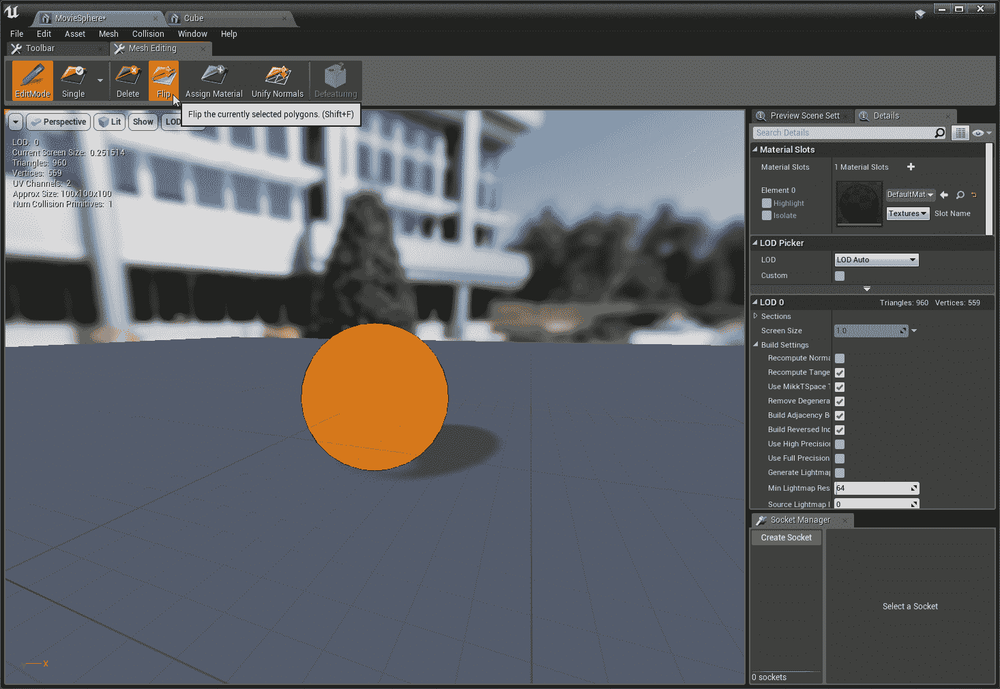

10.  保存它并关闭静态网格编辑器。
11.  在关卡中放置 MovieSphere 网格的一个实例，然后删除旧的球体。
12.  将其位置设置为(X=200.0，Y=0.0，Z=0.0)，并将其比例设置为 200.0(X=200.0，Y=200.0，Z=200.0)。
13.  选择 MovieSphere 后，将其 Materials_Element 0 设置为 MI_MediaPlayer_Mono 材质实例。
14.  点击添加组件，添加 MediaSound 组件，并将其关联的媒体播放器设置为您的媒体播放器。

现在，就像我们对前面的场景所做的那样，我们需要告诉媒体播放器加载我们的媒体。

15.  在地图的级别蓝图中，创建一个名为`MediaPlayer`的变量，将其类型设置为 Media Player|Object Reference，编译它，并将其默认值设置为您的 Media Player。
16.  使用新的 360 视频作为其 Media Source，对 Media Player 变量调用 Open Source。
17.  从事件 BeginPlay 执行此调用。

测试您的场景。 你现在应该看到这部电影在你周围播放。

# 播放 360 度立体视频

现在，我们将对 360 度立体视频做同样的事情。 在撰写本文时，360 度立体视频比 2D 视频要少得多，部分原因是它消耗了太多的磁盘空间，也因为它的制作难度要大得多，但可以合理地预期事情将继续发展。

同时，我们可以在这里找到一个可行的测试文件：[https://www.dareful.com/products/free-virtual-reality-video-sequoia-national-park-vr-360-stereoscopic](https://www.dareful.com/products/free-virtual-reality-video-sequoia-national-park-vr-360-stereoscopic)。

一如既往，下载该文件，将其放入 Content/Movies 目录，创建指向该文件的文件媒体源资源，然后在您的 Media Player 中对其进行测试，以确保其在您的系统上播放。

接下来，让我们复制 2D 球形测试贴图以用于 3D 测试：

1.  获取 MoviePlayback2DSpherical 地图，然后单击文件|将当前另存为...转到 MoviePlayback3DSpherical。
2.  选择 MovieSphere 资源并将其指定的材质更改为 OverUnder 材质实例。
3.  打开级别蓝图，并将 Open Source 节点更改为指向我们的新文件。

我们来测试一下。 我们有球面 3D，但我们的立体声是翻转的(至少在这个文件上)。 本应接近的一切看起来都很遥远。 我们可以通过向主材质添加另一个选项来更正此问题：

1.  打开您的媒体主素材。
2.  添加一个新的静态开关参数，并将其命名为 FlipStereo。
3.  将 StereoPassIndex 节点的输出拖动到 FlipStereo 开关的假输入中。

4.  创建一个 OneMinus 节点，将输出从 StereoPassIndex 拖动到其输入，并将其输出连接到 FlipStereo 开关的 True Input。
5.  将 FlipStereo 切换器的输出连接到乘法节点：

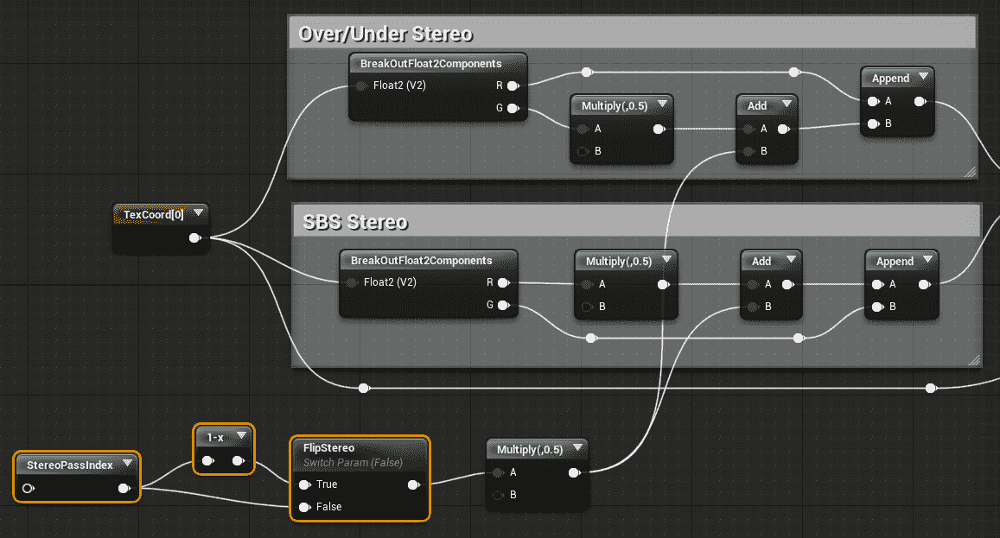

我们在这里所做的只是设置了一个选项，这样如果 FlipStereo 为真，我们将收到左眼为 1，右眼为 0 的结果，而不是反之亦然。

现在，让我们创建另一个 Material 实例来保存此选项设置，并将其应用于球体：

1.  复制 OverUnder 材质实例，并将其命名为类似于 MI_MediaPlayer_OverUnderFlied 的名称。
2.  打开新的 Material 实例，并将其 FlipStereo 参数设置为 True。
3.  将其应用于您的电影球体：

测试地图-现在您应该可以看到正确排序的立体图像。

花点时间四处看看。 这个视频以相当高的比特率运行，所以你可能会偶尔遇到帧丢失和一些透视故障，但立体声效果相当吸引人。 很明显，随着这项技术的发展，我们将能够做一些令人惊讶的工作。

# 控制您的媒体播放器

在我们结束本章之前，让我们先给玩家一些控制媒体播放器的方法。

我们可以在标高蓝图中做这项工作，这就是我们到目前为止一直在做的，但如果我们的项目中要有多个地图，这不是一个理想的解决方案。 我们最终会将 Blueprint 代码从一个级别复制并粘贴到另一个级别，如果我们更新其中一个级别，则必须记住更新其余级别。 这是一种糟糕的做法。

一个更好的想法是创建一个管理者角色，它包含我们管理媒体播放器所需的所有代码，并且我们可以直接进入任何需要支持它的级别。 这样，我们只需编写一次代码，当我们更新它时，效果随处可见。 我们开始吧。

# 创建媒体管理器

让我们在项目的内容目录中创建一个新的 BluePrints 子目录：

1.  在其中单击鼠标右键并选择 Create Basic Asset|Blueprint Class。
2.  对于其父类，选择 Actor。
3.  将其命名为`BP_MediaManager`。

到目前为止，我们一直在使用我们的关卡蓝图在我们的媒体播放器上打开媒体。 我们将首先将该功能转移到我们的媒体管理器中：

1.  打开 BP_MediaManager。
2.  创建名为`MediaPlayer`的新变量，并将其类型设置为 Media Player|Object Reference。
3.  编译它并将其默认值设置为您的媒体播放器。
4.  创建另一个名为`FileMediaSource`的新变量，并将其类型设置为文件媒体源|对象引用。
5.  将此变量的 Instance Editable 设置为 True，因为我们需要为每个映射在其上设置不同的值。
6.  将其 Category 设置为 Config，这样用户就可以清楚地知道他们必须编辑此值。

现在我们已经设置了变量，让我们使用这个演员的 BeginPlay 来加载我们的媒体。 首先，我们将重新创建我们在关卡蓝图中已经做过的事情：

1.  打开 BP_MediaManager 的事件图。
2.  *按住 Ctrl*键并将 MediaPlayer 变量拖到图形上。
3.  在上面调用 Open Source。
4.  *按住 Ctrl*键并将文件媒体源变量拖到图形上。
5.  右键单击它并选择 Convert to Valified Get。 (如果尚未设置文件媒体源，我们不想尝试打开它。)
6.  将执行行从 Event BeginPlay Get 拖到您的文件媒体源 GET 中。

7.  将 getter 的 Iis Valid 执行行拖到开源调用的执行输入中。
8.  将 Get 的输出拖到 Open Source Call 的 Media Source 输入中。
9.  右键单击并创建打印字符串节点。
10.  未设置将其输入字符串值设置为媒体管理器的文件媒体源！
11.  将 GET 的无效执行行拖到我们刚刚创建的打印字符串中：

现在，如果我们将该参与者放在任何级别并设置其文件媒体源，它将开始在项目的媒体播放器上播放该源。 如果在该级别中有一个对象，其材质读取指向该媒体播放器的媒体纹理，则我们正在播放的任何内容都将显示在那里。

Whenever you set up a system that could fail if the developer or user fails to do something, as is the case here with our File Media Source variable, get in the habit of using validated gets and printing out warnings if the get fails. You'll save yourself a lot of debugging time if you train yourself to write code that tells you on its own when something is wrong.

现在，让我们在当前级别中放置一个媒体管理器，并替换我们在级别蓝图中所做的工作：

1.  将 BP_MediaManager 的一个实例拖动到场景中，并将其位置置零。
2.  将其 Config|File Media Source(配置|文件媒体源)设置为您之前在场景中播放的任何媒体源。
3.  打开场景的关卡蓝图，删除我们之前放在 BeginPlay 上的代码。
4.  测试场景。 媒体应该仍在播放，但现在媒体管理器正在打开信号源。

对其他测试级别重复此操作，以便它们都使用媒体管理器蓝图。

现在我们的每个级别都使用 Media Manager 类的一个实例来操作 Media Player，我们可以更轻松地添加适用于任何地方的功能。

我们现在就开始吧。

# 添加暂停和恢复功能

让我们为我们的用户提供一种暂停和播放视频的方式：

1.  打开 BP_MediaManager。
2.  在其详细信息面板中，将 Input|Auto Receive Input 设置为 Player 0，并将 Block Input 设置为 True。
3.  右键单击其事件图，然后选择输入|键盘事件|空格键以创建新的键盘事件。
4.  再次右键单击并选择 Input|Gamepad Events|MotionController(R)Trigger 以创建另一个输入事件。
5.  *按住 Ctrl*键并将媒体播放器变量拖到图形上。
6.  拖动其输出并创建一个 IS PLAYING 节点。
7.  将分支节点连接到 IS 播放节点的结果。
8.  将按下的空格键执行行连接到分支节点的执行输入。 对触发器输入执行相同的操作。
9.  从 Media Player 变量拖动另一个连接器，并为其创建暂停节点。
10.  将分支节点的 True 执行行连接到暂停节点的执行输入。

11.  从 Media Player 变量拖动另一个连接器(或创建一个 Reroute 节点并从中进行分支)，然后创建一个 Play 调用。
12.  将分支节点的假执行线连接到播放节点：

我们在这里做了一些值得讨论的事情。

首先，我们使用了一种与以前不同的方法来捕获键盘和运动控制器输入。 到目前为止，我们所做的一切都依赖于 Project Settings 和`DefaultInput.ini`文件来捕获来自硬件设备的输入，并将其重新映射到命名的输入事件。 事实上，这仍然是一种更好的方法，但我们想向您展示另一种方法。 通常，使用直接在蓝图中映射的输入事件(如本例)制作系统原型是有意义的，然后一旦确定了系统，就将它们移到项目设置中，以便更容易地为不同的控制器重新映射它们。

同样需要注意的是，该对象只能听到输入，因为我们设置了它的 Auto Receive Input。 否则，默认情况下，它不会侦听来自其他设备的输入。

我们在这里所做的是查询媒体播放器，查看它当前是否正在播放任何内容，如果正在播放，则暂停，如果没有，则播放。

While we're not going to cover it here because it would become a project on its own, if you wanted to create a button-based user interface and use a widget interaction component to allow the user to interact with the controls, you could do so by having this Media Manager object own the interface and using the button events to manage the media player's behavior.

这是一个相当简单的示例，但它演示了几种可以与媒体播放器交互的方法。 您可以查询其状态、控制播放、打开新媒体，甚至为其分配事件，以便它在加载完媒体时做出响应。

# 将事件分配给媒体播放器

让我们演示一种在媒体播放器上使用事件的方法。 我们将关闭我们的媒体播放器的打开播放设置，取而代之的是，一旦文件打开完成，我们的媒体管理器就会播放该文件。 这是一个需要学习的重要模式，因为在调用 Open Source 之后，大型媒体文件不会立即准备好播放。 根据文件的大小和存储速度的不同，它们需要一段时间才能打开，因此最好在打开文件后指示媒体播放器监听文件加载完成的时间，然后开始播放。

在实践中，“打开时播放”设置已经做到了这一点，但了解此模式对您很有价值，这样您就可以在需要使用媒体播放器进行更复杂的操作时使用它。

让我们设置一下：

1.  打开媒体播放器资源并关闭其打开时播放设置。

如果您现在测试您的一个地图，您将看到媒体不再播放，直到您点击*空格键*或扣动扳机启动它。

2.  打开 BP_MediaManager 并找到您在 Event BeginPlay 上进行的 Open Source 调用。
3.  将分支节点连接到其返回值。

如果 Open Source 调用找到要打开的文件并且不能打开，则返回 True；如果无法打开，则返回 False。我们只希望我们的 Media Player 在知道文件实际上正在打开的情况下等待文件打开。

4.  从 Media Player 变量中拖动一个连接器，然后选择 Media|Media Player|Bind Event to OnMediaOpned。
5.  从绑定节点的事件输入拖动一个连接器，然后选择添加事件|添加自定义事件。
6.  将其命名为`MediaOpened`。
7.  从 Media Player 变量中拖动一个连接器，并对其调用 Play。

8.  将自定义事件的执行输出连接到 Play 调用的输入：

试试看。 您的媒体应在完成打开后播放。 在实践中，它的行为将完全像在公开赛上打球时一样，但这里有一些重要的事情要谈。

大多数函数调用只有在完成了它们应该做的任何工作之后才会继续执行。 开放源码有点不同。 这就是所谓的**异步任务**。 当您调用 Open Source 时，执行将立即继续，但任务本身将花费不确定的时间来完成。 在打开大文件、访问 Web 上的 URL 或执行任何其他任务时，您都会经常遇到这种情况，而您实际上不知道从什么时候开始需要多长时间。 当您调用**异步**(**异步**)任务时，它会启动，然后在将来某个时候结束。 您在其上调用异步任务的对象几乎总是在任务完成时引发某种类型的事件，这样您就可以在任务完成时执行您需要做的任何事情。

如果是 Media Player 对象上的 Open Source 任务，则当源完成打开时会调用 OnMediaOpned 事件。 通过将自定义事件绑定到此事件，我们告诉它在媒体完成打开时在蓝图中触发该事件，并在发生这种情况时调用媒体播放器上的`Play`方法。

When creating custom events for bindings, it's a good idea to create them by dragging out the event connector and creating the custom event from there, as we did in this example. This is because many bindings will require that their bound events include certain inputs (this is called a signature), and if you just create a basic custom event that doesn't match the required signature, it won't let you bind it. If you create your custom events directly from the event connector, it will automatically set up the correct signature for you. In this case, the bound event for OnMediaOpened is required to pass an Opened URL argument.

这是一个重要的模式，值得学习。 视频文件很大，有时对其进行操作需要时间。 了解您可以绑定到您的媒体播放器对象上的事件，并确保在您知道工作已经完成并成功之后，您正在做您想要做的任何事情。

You will, at some point in your travels, come across a developer who handles asynchronous tasks by putting delays into their blueprints. They will discover through trial and error that the call they're trying to make works if they delay it and fails if they try to do it immediately, so they just stick a delay on there with some random duration and call the bug fixed. You, however, are not going to do this. It's amateur hour stuff, and will just fail later on if they try to open a larger file or something else changes. The correct way to deal with async tasks is always to find out what event gets called when they finish, and then bind whatever else you need to do to that event. Never use a delay to solve a problem unless you can describe in positive terms why you know the delay is the correct solution. The correct solution is almost always a bound event that will work no matter how long the task takes.

现在，您已经看到了可以与媒体播放器对象交互的每种方式的示例。 我们已经轮询了它的状态，对它进行了调用，并将额外的代码绑定到它的事件上，这样当媒体播放器告诉我们发生了一些事情时，我们就可以响应了。 你可以用媒体播放器做更多的事情，我们鼓励你使用它。 尝试将事件绑定到其 OnEndReached 或其他可绑定事件。 尝试使用媒体播放器上的获取时间和持续时间调用来创建进度条。 你可以用这个做很多事情。

# 简略的 / 概括的 / 简易判罪的 / 简易的

在这一章中，我们学习了很多关于视频文件如何在虚幻引擎中播放的知识。 我们学习了一些关于容器和编解码器的知识，以及如何理解视频文件包含的内容，然后我们学习了在平面屏幕和球体上播放它们的各种方法。 我们学习了如何创建材质来显示 3D 视频和 2D 视频，并学习了如何创建媒体管理器类来管理其回放。

在下一章中，我们将了解多人联网在虚幻中是如何工作的。