# 在 VR 中创建多人体验

在本章中，我们将进入一些更高级的领域。 多层软件的编写要比单层应用复杂得多。 要想编写成功的多人游戏代码，你必须建立一个清晰的心理模型，了解正在发生什么，以及你的数据是如何从一台计算机传到另一台计算机的，这一事实是无法回避的。 好消息是这就是我们在这里要做的。 我们将在这一章中丢弃比平时多得多的理论，原因是，如果我们简单地向您介绍设置网络应用的步骤，这真的不会对您有所帮助。 您必须了解网络是如何工作的，才能了解您需要如何构建应用。 但别担心--我们将尝试在理论和实际例子之间交替使用，这样您就可以亲身了解这些东西是如何工作的。

我们还需要清楚的是，网络是一个大话题，而且是相当先进的。 我们在这一章中不会有篇幅来复习这门技术的每一个黑暗角落，但如果你在完成这一章时很好地理解了网络应用是如何组合在一起的，主要部分是什么，以及信息通常是如何流动的，我们就会认为这是一次成功的学习。 如果你在一个相当清晰的状态下理解了这一点，那么当你学习更多关于这个主题的知识时，你就会很好地理解你所看到的。

在本章中，我们将学习执行以下操作：

*   使用虚幻的客户端-服务器模型来确保重要的游戏事件发生在服务器上
*   将参与者从服务器复制到连接的客户端
*   复制变量并在其值更改时自动调用函数
*   创建一个棋子，使其在拥有棋子的玩家看来比在其他玩家眼里看起来更不一样。
*   使用远程过程调用调用远程计算机上的事件

我们跳进去吧！

# 测试多人会话

在我们开始讨论网络是如何工作的之前，让我们先来了解一下如何启动多人会话。 有很多方法可以做到这一点。 最简单的方法是直接从编辑器中启动多人会话，大多数情况下，当您测试网络复制时，这样做就可以了。 要进行更全面的测试，或者如果您需要其中一个会话在 VR 中运行，您可以启动两个独立的游戏会话并将它们连接起来。 稍后在讨论会话类型时，我们将展示如何做到这一点的示例。

# 从编辑器测试多人游戏

幸运的是，虚幻编辑器使得在一台机器上从编辑器中设置多人会话变得相当容易。 要执行此测试，我们将使用**内容示例**项目：

If you haven't already downloaded the Content Examples project, do so now by selecting Content Examples | Create Project from the Unreal Engine | Learn tab in your Epic Games Launcher. You should get into the habit of always keeping a current version of Content Examples installed on your system and using it for reference.

1.  打开“Content Examples”项目，然后打开“Network_Feature”级别。

2.  选择工具栏的播放选项按钮旁边的下拉列表，并将多人选项|玩家数量设置为 2。请参阅以下屏幕截图：

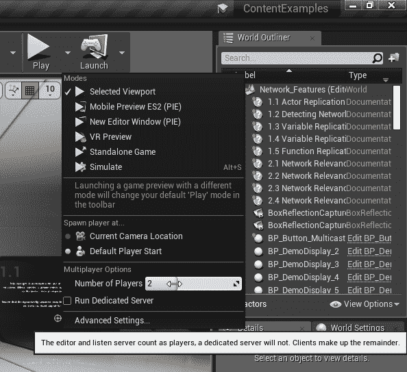

3.  选择新建编辑器窗口(PIE)以启动多人会话，如以下屏幕截图所示(遗憾的是，我们不能在一台机器上使用多人选项来支持多人 VR 会话)：

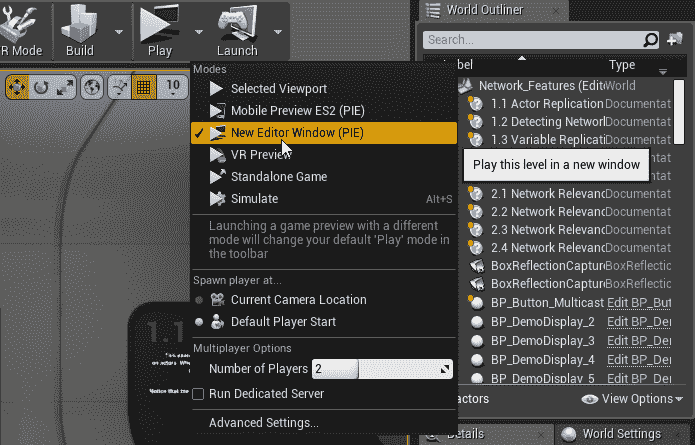

探索同时作为服务器和客户端播放的场景。 请注意服务器上显示的内容和客户端上显示的内容之间的差异。 我们稍后将更深入地研究这些问题：


在此示例中，左侧的重影在服务器上可见，但在客户端上不可见，因为尚未将其设置为复制到客户端。

花点时间在我们到目前为止所描述的上下文中理解这些显示告诉您的信息，但如果有些内容仍然模糊，请不要担心-我们将在接下来的练习中更多地使用这些想法。

有关编辑器中多人测试选项的其他信息，请参阅此处的文档：[https://docs.unrealengine.com/en-us/Gameplay/HowTo/Networking/TestMultiplayer](https://docs.unrealengine.com/en-us/Gameplay/HowTo/Networking/TestMultiplayer)。

# 了解客户端-服务器模型

现在我们有了一个可以玩的跑步测试，让我们先来了解一下理论。在我们讨论下一个概念的同时，让这个测试水平保持开放并探索它并不是一个坏主意。

要了解多人游戏如何在虚幻中工作，您首先需要了解信息如何在连接的游戏会话之间移动，以及如何对游戏环境进行更改。 这是无计可施的。 要想成功地编写多人游戏代码，你必须建立一个清晰的心理模型，否则你最终会遇到很多麻烦。 多人游戏的调试很有挑战性--如果有些东西不起作用，你不能简单地在你的蓝图中设置一个断点，然后追查到底发生了什么。 很多时候，你所知道的就是一些你认为应该发往另一台机器的信息却没有发到那里。 如果你花时间去了解社交网络是如何工作的，你就会更容易地找出问题出在哪里，当某些事情没有按照你预期的那样工作时。 多人游戏绝对不是你可以在黑暗中刺伤就能调试的东西。

那么，让我们来了解一下虚幻中的网络是如何工作的。

为了开始思考这一点，让我们设想一个场景。 假设您已经创建了一个多人射击游戏，并且两个玩家加入了一个会话，并且都在玩。 其中一名球员瞄准并开火，现在我们需要向两名球员展示发生了什么。

乍听起来很简单，但事实并非如此。

玩家 A 正在瞄准，但这发生在玩家 A 的游戏实例上。 玩家 B 的游戏实例怎么知道玩家 A 在哪里，更不用说他们瞄准的地方了？ 玩家 A 开火。 玩家 B 的游戏实例如何发现发生了这种情况？ 现在，有人需要弄清楚 A 的投篮是否击中了 B 的头像。 谁知道枪击中没打中？ 如果玩家 B 的网络连接速度很慢，而关于玩家 A 的目标位置的信息还没有到达，该怎么办？ 如果让两个游戏实例来决定射门是否命中，他们不会同意。 谁的意见会赢呢？

第一个问题的答案-玩家 B 的游戏实例如何知道玩家 A 的移动和动作-通过一个称为**Replication**的过程来处理。 当玩家 A 移动时，他们的化身的移动被**复制**到玩家 B 的游戏实例，而当玩家 B 移动时，他们的移动被复制到玩家 A 的游戏实例。

最后一个问题的答案--谁来决定射击命中是否由**服务器**处理--值得花一些时间来理解这一点。

虚幻引擎使用**客户端-服务器**模型进行网络管理。 这意味着实际上只有一个连接到游戏会话的游戏实例可以对实际发生的事情做出重要决定。 服务器是**权威的**，而客户端不是。 如果服务器和客户端对刚发生的事情得出两个不同的结论，那么服务器的观点就是被使用的那个。

In a **peer-to-peer** model, everybody would be equal. Peer-to-peer network architectures are relatively easy to set up, but they come at a high cost: when one of the connected peers gets out of sync with the other, nobody knows which one's state is actually true. That may be fine for a demo or a class project but would be absolutely unacceptable in an environment where players actually cared about the outcomes. We need to know without question what the actual state of the game and all its players is, and the client-server model gives us a reliable way to do this.

以下是实际发生的情况：

1.  玩家 A 移动，他们的移动被复制到服务器，服务器将他们的移动复制到所有其他连接的游戏实例。
2.  玩家 B 和任何其他连接的玩家会在他们的游戏会话中看到一个**代理**，它会告诉他们服务器说玩家 A 的头像在哪里。
3.  当玩家 A 瞄准并开火时，玩家 A 的客户端实际上向服务器发送一个请求，告诉它它想要开火，然后服务器实际确定它是否可以开火。
4.  如果服务器确定玩家 A 有弹药，处于正确的状态，或者游戏规则指定的任何东西，它就会发射武器，并告诉所有连接的游戏实例它是这样做的。
5.  服务器也一直在接收玩家 B 的重复移动，因此它拥有判断玩家 A 的射门是否命中所需的信息。
6.  如果确定是这样，它就会降低玩家 B 的健康或采取一切必要措施来响应此事件，并通知所有连接的客户端玩家 B 被击中。

7.  然后，每个客户端更新其本地状态信息，播放热门动画和效果，并更新其 UI：

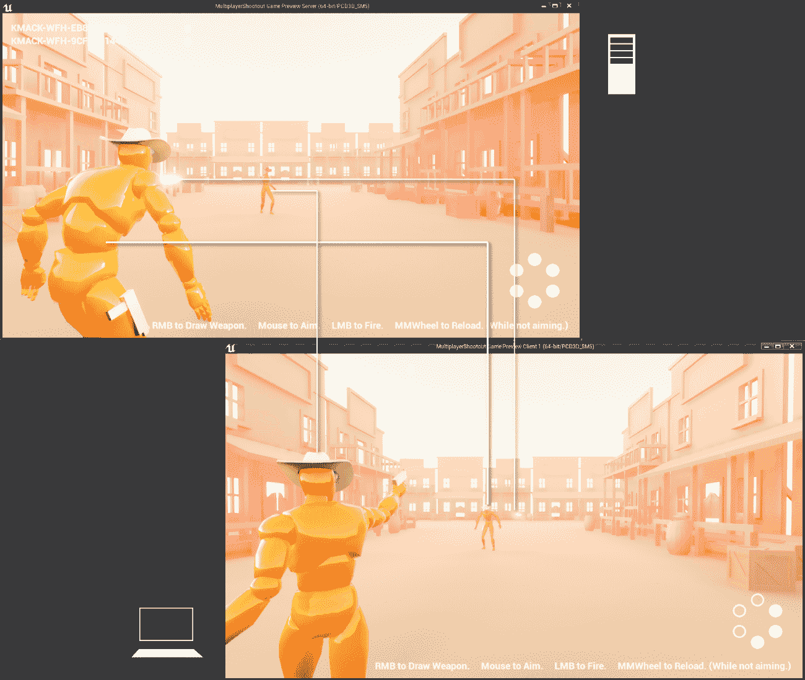

The top panel represents the server's view, while the bottom panel is the client's view. Lines have been added to indicate objects whose states can change and need to be replicated to clients.

虚幻的网络架构效率惊人，这也是为什么像*堡垒之夜*这样的游戏即使在大量玩家同时连接的情况下也能实时运行的原因。 造成这种情况的原因有很多，其中很多都在您作为开发人员的控制之下。 我们将在本章后面深入讨论几个重要的问题。

现在，让我们来仔细看看几个重要的概念。

# 服务器

术语**服务器**指的是多玩家环境中的**网络授权机构**。 你会听到这些术语可以互换使用。 技术文档将倾向于使用术语*网络授权*，因为这更准确地描述了它的真实含义，而您阅读的大多数其他材料将称其为*服务器*。 两者指的是同一件事。

A great deal of the time, when something goes wrong in your networked application, it's going to be because you allowed a client to try to change the game state when instead it needed to ask the network authority to make the change.

该体系结构的工作原理如下：服务器*托管*游戏，并允许多个客户端与其连接并来回传递数据。 通信发生在客户端和服务器之间，客户端几乎从不直接相互通信：

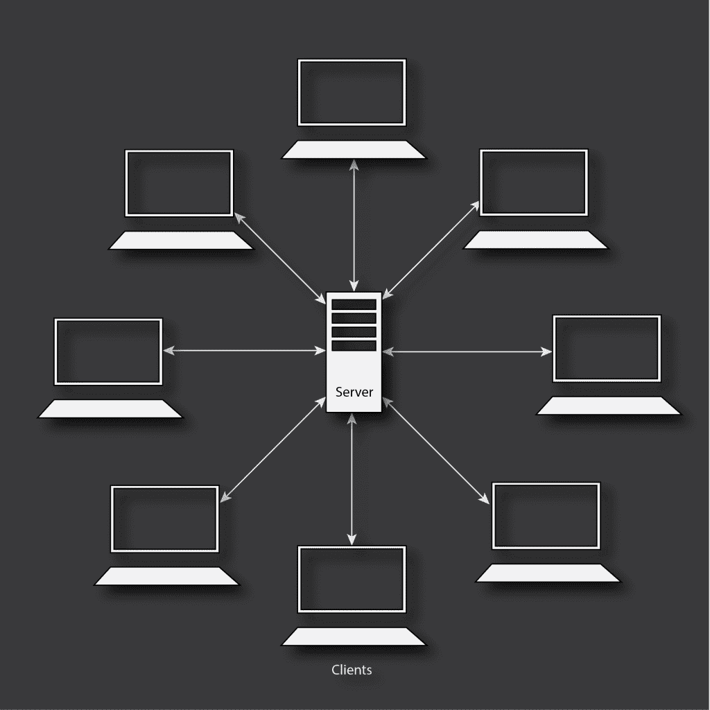

当玩家执行动作时，有关玩家正在做什么或想要做什么的信息将从该玩家的客户端发送到服务器。 服务器验证此信息并做出响应，告诉连接的客户端它所做的决定。

例如，如果你在一个多人游戏中移动你的玩家头像，你实际上根本没有在本地移动你的头像。 相反，您的客户端将告诉服务器您想要移动，然后服务器将确定您如何移动并将您的新位置复制回您的客户端和其他连接的客户端。

客户之间看似直接的消息也是如此。 如果您向另一个客户端发送聊天消息，实际上是将其发送到服务器，然后服务器决定哪个客户端或一组客户端应该接收该消息。

如前所述，服务器是负责维护多人会话的实际**权威状态**的网络授权机构。 **权威**这一概念是关于网络的最重要的概念之一，当我们看到实际示例时，您将看到我们所做的几乎每件事都在检查权威。 如果你在头脑中清楚地知道谁应该被允许做出改变，并检查以确保任何改变确实是由被允许做出改变的实体所做的，你就会走在游戏的前面。

A good rule of thumb to follow is this: if any other player would care about this change, it belongs on the server. If nobody else would care, do it locally. So, if you're playing a visual effect that doesn't matter to the game, don't bother running it on the server, but if you're changing a player's health or moving them around, do that on the server, since everybody else is going to need to agree on it.

除了确保一次只有一种对游戏重要的描述之外，还有另一个原因说明维护单一网络权威很重要，那就是确保玩家不会轻易通过修改他们的客户端来作弊。 当重要决策留给服务器时，服务器可以相当容易地覆盖被黑客攻击的客户端上的结果。 如果玩家想要开枪，一定要让他们的客户告诉服务器，然后让服务器决定他们是否有足够的弹药，是否被允许射击。 切勿在客户端直接处理重要的游戏事件。 只有在服务器允许的情况下才允许它们发生。 永远不要相信客户。

# 监听服务器、专用服务器和客户端

可以在虚拟网络环境中运行的游戏会话有三种基本类型：两种类型的服务器和一种客户端类型。

# 侦听服务器

当您运行**Listen 服务器**时，您的计算机将充当游戏会话的主机和该游戏会话的权限，但它也在运行客户端。 如果你曾经在虚幻中设置过网络游戏，它可能看起来像是在运行点对点会话，但实际情况是这样的。 侦听服务器对于本地播放器几乎是不可见的-它看起来不像是一个单独的运行进程，但实际上它与本地客户端是完全分开的，就像它在另一台机器上一样。

以下命令行参数将使用未煮熟的编辑器数据启动侦听服务器：

```cpp
UE4Editor.exe ProjectName MapName?Listen -game
```

通常，使用这些命令最简单的方法是创建包含参数的快捷方式，或者编写一个简单的`.bat`文件。

以下`.bat`文件将使用内容示例项目的 Network_Feature 映射启动侦听服务器：

```cpp
set editor_executable="C:\Program Files\Epic Games\UE_4.21\Engine\Binaries\Win64\UE4Editor.exe"
set project_path="D:\Reference\UE4_Examples\ContentExamples\ContentExamples.uproject"
set map_name="Network_Features"

%editor_executable% %project_path% %map_name%?listen -game -log -WINDOWED -ResX=1280 -ResY=720 -WinX=32 -WinY=32 -ConsoleX=32 -ConsoleY=752
```

在本例中，我们为可执行文件位置、项目路径和映射名称设置变量，只是为了使文件更易于读取和编辑。 我们还打开日志并明确设置窗口大小和位置，以便更容易地看到正在发生的事情，并适合屏幕上的其他会话。

# 专用服务器

**专用服务器**没有在同一会话中运行的客户端。 它不接受输入或呈现输出，因此可以将其优化为比侦听服务器运行成本更低。 因为专用服务器比完整的游戏客户端小得多，因为它们不需要包括任何要呈现给玩家的东西，所以您可以将它们中的许多服务器放在一台机器上进行托管。 您现有的游戏可执行文件可以被告知作为专用服务器运行，或者开发人员可以选择为专用服务器编译单独的可执行文件，这可以进一步阻止作弊，并可以使可执行文件在磁盘上的占用空间小得多。

此命令将使用编辑器数据启动专用服务器：

```cpp
UE4Editor.exe ProjectName MapName -server -game -log
```

请注意，我们已选择打开此会话的日志。 这是因为专用服务器不会打开呈现窗口，因此可见的日志对于了解它在做什么至关重要。

我们可以修改前面的`.bat`文件以启动专用服务器：

```cpp
set editor_executable="C:\Program Files\Epic Games\UE_4.21\Engine\Binaries\Win64\UE4Editor.exe"
set project_path="D:\Reference\UE4_Examples\ContentExamples\ContentExamples.uproject"
set map_name="Network_Features"

%editor_executable% %project_path% %map_name% -server -game -log

```

在本例中，我们用`-server`参数替换了`?listen`指令，当然我们不需要任何窗口放置规范，因为专用服务器不会打开游戏窗口。

# 客户

**客户端**是联网应用和播放器之间的接触点。 如果我们使用的是侦听服务器，则客户端可能与服务器运行在同一系统上；如果客户端连接到远程主机或专用服务器，则客户端可能完全独立运行。 客户端负责接受来自玩家的输入，通过**远程过程调用**(**RPC**)将该输入传送到服务器，并通过复制从服务器接收关于游戏状态的新信息。

以下命令将启动客户端：

```cpp
UE4Editor.exe ProjectName ServerIP -game
```

请注意，在前面的示例中，`ServerIP`是您尝试连接的服务器的 IP 地址。 如果要连接到在您自己的计算机上运行的服务器进行测试，默认的主地址`127.0.0.1`将连接到在本地计算机上运行的服务器。

此`.bat`文件将启动连接到同一台计算机上运行的服务器的客户端：

```cpp
set editor_executable="C:\Program Files\Epic Games\UE_4.21\Engine\Binaries\Win64\UE4Editor.exe"
set project_path="D:\Reference\UE4_Examples\ContentExamples\ContentExamples.uproject"

%editor_executable% %project_path% -game 127.0.0.1 -log -WINDOWED -ResX=1280 -ResY=720 -WinX=1632 -WinY=32 -ConsoleX=1632 -ConsoleY=752
```

同样，`-log`和窗口大小参数是完全可选的-如果您将快捷方式设置为在窗口启动时将窗口放置在彼此之间，则测试多人会话会更容易。

现在我们已经做了一些初步的实验，并讨论了一些基本的想法，让我们建立我们自己的测试项目，这样我们就可以执行我们自己的实验了。

# 测试多人 VR

要在 VR 中测试多人游戏，通常需要网络上有两台独立的 PC。 有时可以在一台机器上测试多人 VR，但当第二个 3D 应用启动时，一些 VR 耳机驱动程序会自动向正在运行的 3D 应用发送退出信号。

As of Unreal 4.21, the HTC Vive plugin automatically shuts down an existing Unreal session if a second one starts up. (The code that does this lives in `FSteamVRHMD::OnStartGameFrame(),` but unfortunately there's no easy way for users of the installed binaries to change this behavior.) The Oculus HMD plugin does not automatically quit existing sessions, so if you're using an Oculus Rift, you'll likely be able to test multiplayer on a single machine, but if you're using a Vive, you'll need two PCs.

如果您想尝试一下，只需将`-vr`关键字添加到任何启动字符串。

服务器启动字符串如下所示：

```cpp
%editor_executable% %project_path% %map_name%?listen -game -vr -log -WINDOWED -ResX=1280 -ResY=720 -WinX=32 -WinY=32 -ConsoleX=32 -ConsoleY=752
```

并且，客户端启动字符串如下所示：

```cpp
%editor_executable% %project_path% -game -vr 127.0.0.1 -log -WINDOWED -ResX=1280 -ResY=720 -WinX=1632 -WinY=32 -ConsoleX=1632 -ConsoleY=752
```

当然，如果你想在一台机器上进行测试，一次只能设置一个会话来使用 VR。

因为对于许多用户来说，在一台机器上测试多人 VR 是不切实际的，所以我们将主要以 2D 形式演练我们的多人游戏示例，这样您就可以在一个可以合理支持测试的环境中学习概念。 不过，我们仍将介绍您需要做的某些特定操作，以使玩家角色的动画对耳机和运动控制器的移动做出适当的响应，因此您将以良好的基础退出本章，为开始使用多人 VR 打下良好的基础。

# 设置我们自己的测试项目

正如我们在上一章中所做的那样，我们将从创建一个具有以下设置的干净项目开始：

1.  空白蓝图模板
2.  移动/平板电脑硬件目标
3.  可缩放的 3D 或 2D 图形目标
4.  没有入门内容

和往常一样，下面是我们的项目设置小抄：

1.  引擎|渲染🙂|◄正向渲染器🙂|◄正向着色：🙂TRUE
2.  引擎|环境光渲染|默认设置|环境光遮挡静态分数：0.false
3.  引擎|渲染模式|默认设置|模式抗锯齿方法：*MSAA
4.  引擎|渲染|VR|实例化立体声：*True
5.  引擎|渲染|VR|11-13 轮询遮挡查询：11-13 真

然而，我们将为这项测试设置一个不同的值，因为我们将主要在平板电视上工作，以简化学习这一具有挑战性的主题：

*   项目|描述|设置|在 VR 中开始：0false

设置完所有这些设置后，允许项目重新启动。

# 添加环境

让我们给自己一些环境资产来玩耍，这样我们就不会被困在一个空的水平上。

打开你的 Epic Games Launcher，找到《无限之刃：冰雪奇缘》套装。 将其添加到您的项目中。

If you're unable to add a content pack to a project because it says it's not compatible with your current project version, you can very often get around this just by adding the content pack to a project built with the highest version the content pack allows, and then migrating its assets to your new project. So, for example, if I'm trying to add Ice Lands to a 4.21 project, and the launcher tells me I can't because Ice Lands has only been flagged as compatible with 4.20, I can add the content to a 4.20 project and then migrate it to a 4.21 project. Most of the time, this will work.

这可能需要一段时间。 添加这些资产后，打开您的项目。 我们将首先创建一个新的游戏模式来设置我们自己的多人会话。

# 创建网络游戏模式

还记得很久以前我们提到过，游戏模式负责制定游戏规则吗？ 在多人游戏中，这具有额外的意义，因为正如我们已经提到的，重要的游戏事件应该只在服务器上发生。 如果您将这两个考虑因素放在一起，那么当多人游戏正在进行时，您应该不会感到惊讶，因为当多人游戏正在进行时，只有一种游戏模式，并且它驻留在服务器上。

对于开发人员来说，这意味着如果您编写直接与游戏模式对话的代码，当您在单人会话中测试时，它将运行得很好，但当您尝试在多人会话中测试它时，它将失败，因为游戏模式将不会出现在客户端上。 这让许多新的多人开发人员感到困惑，所以现在是快速浏览一下虚幻的网络框架并了解不同对象所在位置的好时机。

# 网络上的对象

当考虑多人游戏框架中的对象时，您可以认为它们占据了四个不同的域：

*   仅服务器：对象仅存在于服务器上。
*   服务器和客户端：所有对象都存在于服务器和每个客户端上。
*   服务器和拥有客户端：这些对象存在于服务器和拥有它们的客户端上，但它们不存在于任何其他客户端上。
*   仅拥有客户端：这些对象仅存在于拥有它们的客户端上。

请参阅以下屏幕截图：

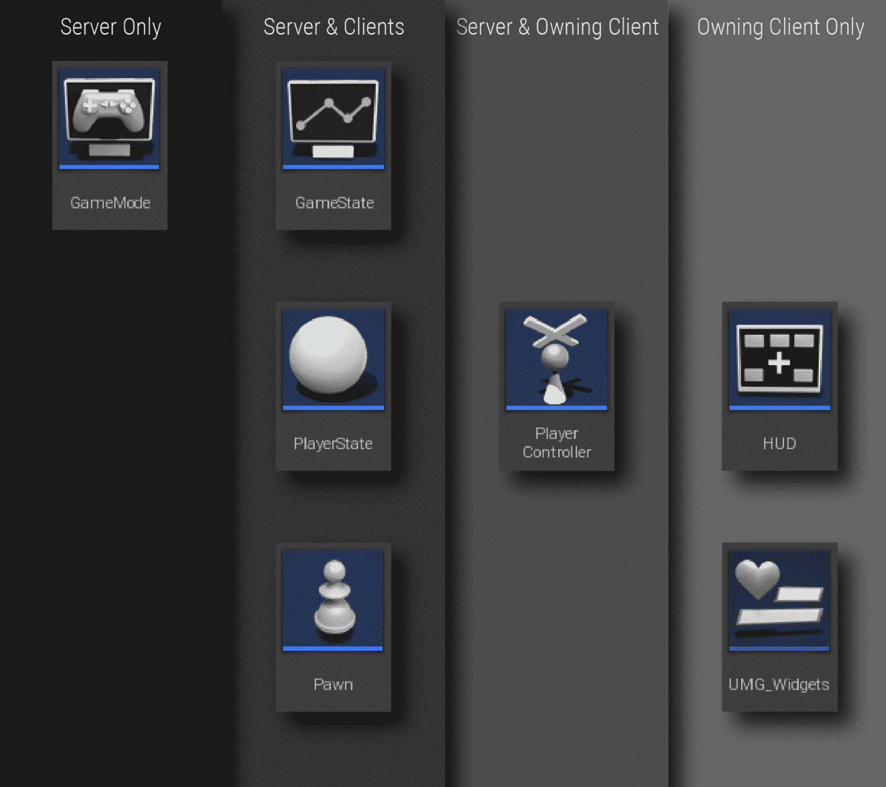

虽然乍一看这似乎是一个学术观点，但你真的需要理解这一点。 在你早期的网络生涯中，你会不止一次地尝试与一个不在你想象中的地方的物体进行交流，因为在单人会话中，你永远不需要考虑这一点。 在一个单人游戏中，所有的东西都生活在同一个空间里。 在多人游戏中，他们没有，你需要知道他们在哪里。

让我们从另一个角度来看这个问题：


Diagram based on Cedric Neukirchen's excellent Multiplayer Network Compendium, found here: http://cedric-neukirchen.net/2017/02/14/multiplayer-network-compendium/

在上图中，您可以看到以下内容：

*   服务器拥有 GameMode，没有客户端可以访问它。
*   服务器和每个连接的客户端都可以看到游戏状态。 这里只有一个。
*   服务器和每个连接的客户端可以看到每个客户端的播放器状态。
*   服务器和每个连接的客户端都可以看到每个客户端的棋子。
*   服务器可以看到每个连接的客户端的播放器控制器，但客户端不能看到其他客户端的播放器控制器。
*   HUD 和 UI 元素只存在于客户端，其他人不知道它们。

让我们简要讨论一下这些对象在多人游戏方面的作用。

# 仅服务器对象

正如我们刚才提到的，游戏模式只存在于服务器上。 它掌管着游戏，是发生什么事的唯一权威。 根据设计，客户端不能直接访问游戏模式。 我们已经看到，游戏模式负责决定为游戏创建哪些对象类。 在多人游戏中，游戏模式通常会承担额外的责任，比如选择玩家会加入哪支球队、棋子出现在哪里，以及比赛是准备开始还是准备结束。

游戏模式也适用并执行游戏规则。 让我们假设我们的游戏地图被分成了几个部分，这些部分可能会变成危险区域，如果玩家留在里面就会受到伤害。 游戏模式将负责确定哪个部分变得危险，以及何时发生。

不过，这引发了一个问题。 如果游戏模式只存在于服务器上，客户端无法看到，那么客户端如何发现哪些部分是危险的，哪些部分不是危险的呢？

这就是下一层对象的用武之地--那些同时存在于客户端和服务器上的对象。

# 服务器和客户端对象

当客户端需要获取有关游戏状态的信息时，它们会从**游戏状态**获取信息，该状态由服务器所有，但会复制到客户端。 我们还没有真正讨论复制，所以现在您可以将其视为从服务器发送到连接的客户端的对象的副本。 游戏模式从游戏状态读取信息并写入，服务器通过复制将更新后的游戏状态的副本发送给所有连接的客户端。

回到前面的例子，如果游戏模式只是将关于哪些区域是危险的信息存储在其自身包含的变量中，则没有人会知道这一点。 如果游戏模式将此信息存储在复制到客户端的游戏状态上，则客户端可以从游戏状态读取此信息并做出响应。

如果我们的游戏模式也在更新每个玩家的分数呢？ 我们应该把这些信息放在哪里呢？ 我们当然知道它不应该进入游戏模式，因为没有人能在那里看到它。 我们可以将其置于游戏状态，并为每个玩家维护一组分数，但是有一个更好的位置来存储这些信息。 游戏状态为每个连接的客户端维护一个由**玩家状态**对象组成的数组。 这是一个理想的位置，用于放置适用于单个玩家但其他玩家需要了解的信息，例如玩家的得分。

我们已经熟悉了棋子所做的工作--这些是玩家在虚拟世界中的化身。 它们被保存在服务器上，并被复制到客户端，这样其他玩家就可以看到它们的移动和其他状态信息。

# 服务器和拥有客户端对象

我们在前面已经看到，播放器控制器负责管理来自播放器的输入和显示给播放器的输出。 它拥有摄像头和 HUD，并处理输入事件。 多人游戏中连接的每个客户端都有一个与之关联的玩家控制器，并且可以像在单人会话中一样访问它。 服务器也知道每个客户端的播放器控制器发生了什么，但是客户端无法看到彼此的播放器控制器的任何信息。

# 仅拥有客户端对象

最后，像 UI 显示小部件这样的对象只存在于它们所应用的客户机上。 服务器不知道或不关心它们，其他任何客户端也不知道或关心它们。 这些都是纯粹的本地对象。

我们知道，要把很多理论强加给你，但正如我们所说，这是很重要的。 如果您花一点时间将所描述的结构内部化，那么编写多层应用就不会那么令人困惑了。

话虽如此，让我们回到一些动手的工作上来。

# 创造我们的网络游戏模式

我们将使用这个登录在不同的产卵点产生不同的玩家。 在我们继续之前，让我们跳到我们的地图并添加第二个玩家开始对象：

1.  从模式面板中，选择 Basic|Player Start，将其拖到地图上的某个位置，然后保存地图：

Remember to use the *P* key to verify that your spawn point is on an area with a valid navmesh. (We don't actually need the navmesh yet, but this is a good way to verify that the floor collision is good in the location you've chosen and that it's inside the gameplay area.) 


Here we've added a second player start at the other end of the map from the first.

现在，让我们创建一个游戏模式来管理我们的网络游戏：

1.  打开新项目后，在内容浏览器中为其创建一个目录。 将其命名为`Multiplayer`(或您喜欢的任何名称)。
2.  在此目录中创建一个 BluePrints 子目录。
3.  右键单击以创建基本资产|蓝图类|游戏模式基础。 将其命名为`BP_MultiplayerGameMode`。

If you look in the Content Examples project's BP_GameMode_Network, you'll see that it implements its own player start selection in Event OnPostLogin. You don't need to do this. The native GameModeBase class does it for you. If you did want to create special rules for selecting player starts (to select them by team, for example, the correct way to do this is to override the ChoosePlayerStart function. To do this, select Functions | Override | Choose Player Start, and put whatever logic you want in the resulting graph).

4.  打开设置|项目设置|项目|地图和模式，然后将默认游戏模式设置为我们的新游戏模式。

让我们来测试一下：

5.  选择工具栏的游戏选项按钮旁边的下拉列表，并将多人选项|玩家数量设置为 2。
6.  从 Play 按钮中选择 Play This Level in a New Window 以启动双人测试。

你应该看到一个玩家在原来的产卵点产卵，另一个玩家在你刚刚创建的新产卵点产卵。

# 创建网络客户端 HUD

让我们向客户端添加一个简单的 HUD，这样我们就可以向用户显示有关游戏的信息。 再说一次，如果我们计划这款游戏只在 VR 中运行，我们不会使用 HUD 对象，而是将其作为一个附加的小部件在 3D 中构建。 我们之所以在这里这样做，是因为我们在这一章中有相当多的内容要涵盖，我们希望将重点放在网络上。

虽然我们将继续专注于为这一章创建 2D HUD，但我们可以利用这个机会增加一点安全性，以确保我们不会试图在 3D 空间中显示 2D 元素。

让我们创建一个新的 HUD 来使用：

1.  在项目的 BluePrints 目录中，右键单击 Create Basic Asset|Blueprint Class，然后展开 All Class 扩展器并选择 HUD 作为您的类。 请参阅以下屏幕截图：

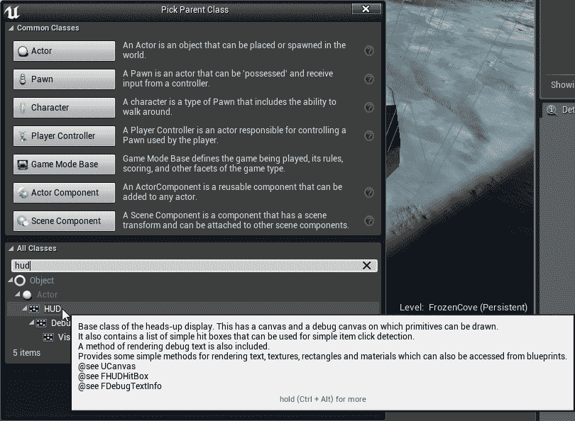

2.  点击选择按钮以创建它。
3.  将其命名为`BP_MultiplayerHUD`。
4.  打开我们的新游戏模式，并将此 HUD 设置为其 HUD 类。

# 为我们的 HUD 创建小部件

现在，让我们创建一个小部件来显示在我们的 HUD 上：

1.  右键单击或选择 Add New|User Interface|Widget Blueprint，然后将生成的小部件命名为`WBP_NetworkStatus`。
2.  打开其设计器面板，并将一个文本块拖到面板的左下角。

Note that because we're creating a 2D interface in this case, we don't specify an explicit screen size; instead, we're allowing it to fill the screen. As you'll recall from our earlier UI work, when you're building a widget for 3D use, you'll want to specify its size.

3.  将文本块的锚点设置在左下角。
4.  将其位置 X 设置为 64.0，将位置 Y 设置为-64.0。
5.  将其对齐方式设置为 X=0.0，Y=1.0。
6.  将其命名为`txt_ClientOrServer`。
7.  单击其内容|文本条目旁边的绑定按钮为其创建绑定，然后选择创建绑定：

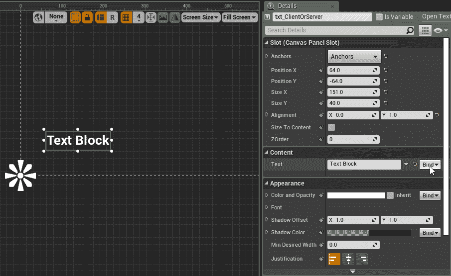

在生成的函数图中，我们将检查此小部件拥有的播放器控制器是客户端还是服务器，并相应地设置此小部件的文本：

1.  创建一个 Get Owning Player 节点。
2.  将生成的播放器控制器引用从其返回值中拖动，然后调用 Has Authority on 它。
3.  根据 Has Authority 调用的结果创建一个 Select 节点。
4.  将 Select 节点的返回值拖到函数的返回值中。
5.  在 Select 节点的 False 条目中键入`Client`，在其 True 条目中键入 Server：


让我们在这里谈谈几件事。

还记得我们如何将服务器描述为*网络授权*吗？ 这有权限检查现在正在测试，以查看拥有的播放器控制器是否驻留在服务器上。 无论何时编写网络代码，您都将非常频繁地测试权限，因为根据代码是在客户端还是在服务器上运行，您通常必须执行一些不同的操作。 把这一点作为一个非常重要的概念牢记在心。 检查权限就是如何指定哪些行为发生在服务器上，哪些行为发生在客户端。

还请注意 Get Owning Player 节点上的闪电和屏幕图标。 在单人游戏中，我们并不关心这个图标，但在多人游戏中它很重要。 此图标表示有问题的呼叫将仅在客户端上发生，不能在服务器上使用。 在这种情况下，这是可以的。 如果您还记得前面的关系图，那么 HUD 及其拥有的小部件只存在于客户端，所以这个仅限客户端的调用将会起作用。 它返回的播放器控制器引用可以存在于客户端或服务器上，这就是为什么我们将从 Has Authority 检查中获得有效结果的原因。

当您仔细考虑此问题时，请重新参考网络框架图。

# 将小部件添加到我们的 HUD

现在，我们要将此小部件添加到我们的 HUD 中：

1.  打开 HUD 的事件图并查找或创建 Event BeginPlay 节点。
2.  创建启用了头戴式显示器的节点。
3.  使用其结果创建分支。
4.  从 Branch 节点的 False 输出中，拖动并创建一个 Create Widget 调用。
5.  将其 Class 设置为我们刚刚创建的小部件蓝图。
6.  创建一个 Get Owning Player Controller 节点，并将其结果提供给 Create Widget 节点的 Owning Player 输入。
7.  拖出 Create Widget 节点的返回值，并在其上调用 Add to Viewport：


我们刚刚在这里做的是检查我们是否在 VR 中，如果没有，则创建网络状态小部件的一个实例，并将其添加到 HUD 中。

If you wanted to implement a 3D widget for use in VR, this would be a reasonable place to do it. You could create a 3D widget in much the same way we did before, and use a Get Owning Pawn call to grab the player pawn and attach the widget's containing actor to it. It would be equally reasonable to create a 3D widget on the pawn as we did earlier, and hide or destroy it if an Is Head Mounted Display Enabled check returned false.

我们来测试一下。 您应该看到一个标记为服务器的会话，以及另一个标记为客户端的会话。

现在，尝试选中播放菜单上的运行专用服务器复选框，然后再次运行：

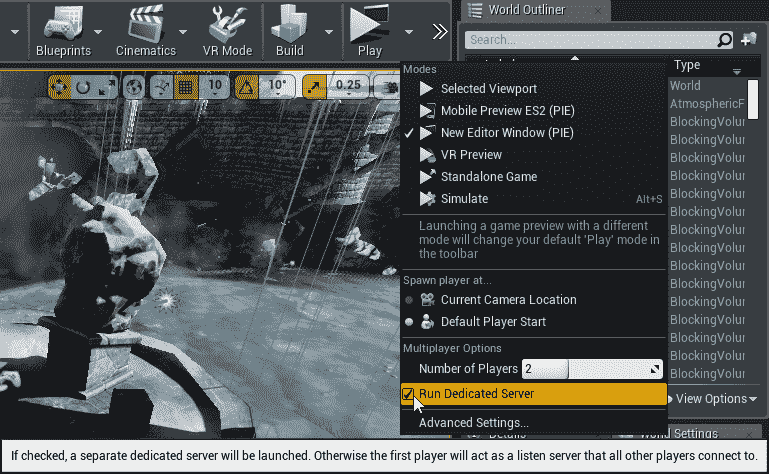

这一次，您将看到两个会话都表明它们是客户端。 这里发生的情况是，一个专用的服务器以不可见的方式产生，两个玩家都作为客户端连接到它。 运行此测试后，取消选中再次运行专用服务器。 在下一节中，我们需要一个可见的服务器和客户端。

# 网络复制

既然我们已经讨论了一些关于服务器和客户端的内容，那么让我们更多地了解信息是如何在它们之间移动的。

第一个也是最重要的概念是**复制**。 复制是一个过程，通过该过程，存在于一个系统上的参与者或变量值被传递到另一个连接的系统，以便也可以在那里使用。

这带来了一个重要的问题：只有您选择复制的那些项目才会与其他连接的系统进行通信，这是有意为之的。 虚幻的网络基础设施是为提高效率而设计的，保持这种效率的一个主要方法，特别是当你有很多玩家的时候，就是只发送你绝对需要通过网络发送的信息，并且只发送给那些真正需要接收的人。 想一想一个大范围的游戏，比如*堡垒之夜*。 如果每个连接的玩家的每一条数据都被发送到每个其他玩家，那么它就不能运行。 虚幻可以处理非常大的玩家群体，它通过让开发人员完全控制要复制的内容和复制给谁来做到这一点。 然而，伴随着这种权力而来的是责任。 如果您不告诉参与者或变量进行复制，它就不会复制，您也不会在连接的机器上看到它。

让我们从一个简单的例子开始，看看它是如何工作的。

# 创建复制执行元

比方说，我们想要使用一面旗帜来标记游戏中的某个东西，重要的是让所有玩家都能看到它在哪里。

我们可以从为旗帜创建一个演员开始，所以让我们先做这个：

1.  在`Blueprints`文件夹中，右键单击以选择创建基本资产|蓝图类|执行元。 我们可以给我们的演员起名`BP_ReplicatedFlag`。 把它打开。
2.  选择添加组件|静态网格。
3.  将零部件的静态网格属性设置为`/Game/InfinityBladeIceLands/Environments/Ice/Env_Ice_Deco2/StaticMesh/SM_Env_Ice_Deco2_flag2`。
4.  选择静态网格组件后，选择添加组件|骨架网格以创建附加到旗杆静态网格的子骨架网格。
5.  将零部件的骨架网格属性设置为`/Game/InfinityBladeIceLands/Environments/Ice/EX_Envimg/Meshes/SK_Env_Ice_Deco2_BlowingFlag3`。
6.  将骨架网格组件的位置设置为 270.0(X=40.0，Y=0.0，Z=270.0)，并将其比例设置为 B(X=1.8，Y=1.8，Z=1.8)。
7.  将静态网格组件拖到根组件上，并将其设置为新的根组件。
8.  添加一个点光源组件并将其位置设置为 270.0(X=40.0，Y=0.0，Z=270.0)，以便我们的旗帜突出。

# 仅在服务器上派生执行元

现在，让我们将我们的旗帜派生到级别中，但仅在服务器上：

1.  从模式面板中，将一个目标点拖动到地图上的某个位置。 将其命名为`FlagSpawnPoint`。
2.  打开关卡蓝图，在 FlagSpawnPoint 仍处于选中状态的情况下，在事件图中单击鼠标右键以创建对它的引用。
3.  查找或创建 Event BeginPlay 节点。
4.  从此节点拖动执行线并创建 Switch Has Authority 节点。
5.  从 Switch Has Authority 节点的 Authority 输出拖动执行行，然后从 Class 节点创建一个派生执行元。
6.  将其 Class 设置为我们刚刚创建的 BP_ReplicatedFlag 执行元。
7.  将输出从引用拖动到标高中的标志产生点，并对其调用 Get Actor Transform。
8.  将变换馈送到繁殖节点的繁殖变换中：


运行它。 您将在服务器上看到该标志，但在客户机上看不到它。 让我们把这件事谈一谈，看看为什么会这样。

在前面的屏幕截图中，我们在`BeginPlay`上做的第一件事是检查我们是否有权限。 同样，*网络授权*只是服务器的另一个术语。 如果我们有权限，也就是说我们在服务器上运行，我们就会在我们提供的位置生成标志。 如果我们不在服务器上，就不会生成它，这就是为什么我们在客户机视图中看不到它的原因。

这是一个需要记住的重要模式。 当我们谈到确保重要的游戏事件只在服务器上发生时，我们就是这样做的。 检查您是否有权限，只有当您有权限时才执行操作。

# 将执行元复制到客户端

当然，在本例中，我们也希望在客户端上看到该参与者，但目前我们无法看到，因为它只存在于服务器上。 让我们将其更改为*复制的*参与者：

1.  打开我们的旗帜参与者的蓝图，并在其 Details|Replication 部分中，将 REPLICATES 设置为 TRUE：


再试一次。 现在，我们还可以看到客户端上的标志。

通过指示该参与者应该进行复制，我们现在已经告诉服务器将生成的对象也发送到所有连接的客户端。 您可能已经注意到，在测试时，您可以看到另一个玩家的位置表示为一个漂浮在空间中的灰色球体。 这是因为我们当前使用的默认棋子类也设置为复制。 (如果您有兴趣在源代码中看到这一点，请打开`<Your Engine Install location|\Engine\Source\Runtime\Engine\Private\DefaultPawn.cpp`，您将看到构造函数中的`bReplicates`设置为 true。)

# 复制变量

让我们更进一步，想象一下我们放在旗帜上的点灯对我们的游戏是有意义的。 如果是这种情况，我们需要确保只有服务器更改其值，并且所有客户端都可以看到该值是什么。 这意味着我们需要确保在更改之前拥有权限，然后我们需要将更改复制到连接的客户端。

1.  打开标志的蓝图，然后在 Variables 部分中，添加一个名为`bFlagActive`的布尔变量。
2.  编译并保存您的蓝图。
3.  在事件图中的 Event BeginPlay 上，添加 Switch Has Authority 节点。
4.  从授权执行行中，按住*Alt*并拖动`bFlagActive`的设置器，并将其设置为 False。
5.  按事件节点创建设置计时器，并将其连接到您的`bFlagActive`设置器。
6.  将其时间设置为 3.0，并将其循环属性设置为 True。
7.  创建一个自定义事件并将其命名为`ToggleFlagState`。
8.  将红色连接器(顺便说一句，这称为**Event Delegate**)从定时器连接到自定义事件。
9.  *按住 Alt*的同时将`bFlagActive`的另一个设置器拖到图形上，并将其连接到 ToggleFlagState 事件。
10.  *按住 Ctrl*的同时将`bFlagActive`的 getter 拖到图形上。
11.  从其输出创建一个 Not Boolean 节点，并将其结果连接到设置器的输入：


我们刚才所做的是，如果我们在服务器上，初始化`bFlagActive`变量，然后设置一个循环计时器，该计时器每三秒将其值反转到相反的值。

You have two Set Timer event types available to you. You can set timers to call functions by name when they trigger, or to call events. If you're working in the event graph, it's often more readable to connect an event directly to the timer's delegate connector. If you're working inside a function, where events are not available to you, call a function by name instead.

现在，我们需要给自己一种看旗帜变化状态的方法：

1.  查找或创建事件记号节点。
2.  将对点光源的引用拖到图表上。
3.  创建设置强度节点，并在点光源上将其调用。
4.  *Ctrl*按住 Ctrl 的同时将`bFlagActive`变量的 getter 拖到图形上。
5.  拖出其结果并从中创建一个 Select 节点。
6.  将选择节点的返回值连接到设置强度节点的新强度输入。
7.  将选择节点的 False 值设置为 0.0，将其 True 值设置为 5000.0：

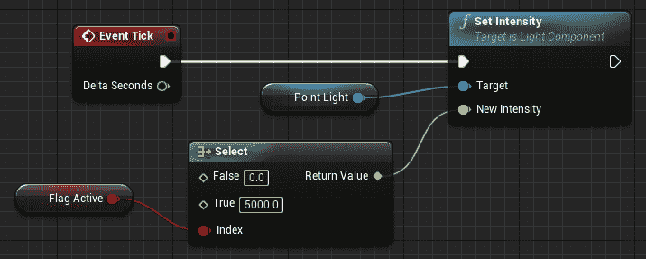

您可能还记得，我们并不热衷于 TICK 事件上的投票值。 这是一种浪费且普遍草率的技术。 别担心-我们马上就会找到更好的方法来做这件事。

不过，与此同时，让我们来测试一下。

我们可以看到我们的灯在服务器上打开和关闭，但在客户端上看不到。 你现在也许能猜到为什么会这样。 由于我们的权限检查，我们只更改了服务器上`bFlagActive`的值，并且我们永远不会将此更改告知任何客户端。 解决这个问题相当简单：

1.  选择`bFlagActive`变量，并在其详细信息部分将 Variable|Replication 设置为 Replicated：


再次运行您的测试。 现在，您应该还会看到客户端上标志的状态发生了变化。

这提出了一个重要的观点。 仅仅因为一个参与者被复制并不意味着它的任何属性(除了它们的初始状态)都被复制。 再说一次，这是经过深思熟虑的。 您不想通过网络发送任何不需要发送的内容。 流量的每一点都会增加带宽负载，并增加添加额外播放器的成本。 默认情况下，虚幻只复制您告诉它复制的内容。

# 使用 RepNotify 通知客户端值已更改

现在，我们刚才提到，计时上的轮询值是浪费的，因为它在每次更新时都会执行操作，即使不需要这样做。 对事件作出反应几乎总是一个更好的主意。

事实证明，使用复制变量很容易做到这一点：

1.  选择您的`bFlagActive`变量，并在其 Details|Variable 块中，将其 Replication 属性设置为 RepNotify，而不是 Replicated。
2.  请看一下您的函数列表。 刚刚自动添加了一个名为`OnRep_bFlagActive`的新函数。
3.  选择事件标记上的所有内容，然后按*Ctrl*+*X*将其删除。
4.  打开新的`OnRep_bFlagActive`函数并将所有内容粘贴到其中，将该函数的执行行连接到您设置的强度节点：

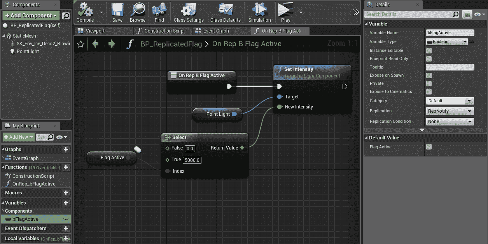

这是响应值更改的更有效方式。 每当变量从服务器接收到新值时，其复制设置为 RepNotify 的变量的`OnRep`函数将被自动调用。 这使得响应这些更改变得简单而高效，如果我们想要在通过复制到达新值时触发粒子系统等效果或执行其他操作，我们现在有了一个自然的位置来执行此操作。

If you need something to happen when a new value arrives on a client through replication, use RepNotify to create an OnRep function, and do the operation there.

到目前为止，我们构建的示例相当简单，但它实际上说明了许多非常重要的点。 我们已经讨论了对象在网络框架中的位置，如何确定操作是发生在网络授权机构(服务器)上还是远程(客户端)会话上，如何确定参与者是否从服务器复制到客户端，以及如何将新值复制到客户端并响应它们的更改。 现在，让我们更进一步，开始构建一些看起来更像游戏的东西。

# 为多人游戏创建网络感知棋子

既然我们已经了解了信息是如何从服务器移动到客户端的，那么让我们来看看玩家操作是如何从客户端传递回服务器的。 为了做好准备，我们将走一条捷径，添加一个已经可以执行一些基本操作的棋子，然后我们将直接开始让这些操作在多人设置中工作的任务。

# 添加第一人称棋子

我们将通过添加第一人称模板中的棋子来设置自己：

1.  创建或打开使用蓝图|第一人称模板创建的项目。
2.  选择 Content|FirstPersonBP|BluePrints|FirstPersonCharacter，并将此角色迁移到我们的工作项目中。

现在，我们需要告诉我们的游戏模式使用它。

3.  打开 BP_MultiplayerGameMode，并将其默认 Pawn Class 设置为我们刚迁移到的 FirstPersonCharacter。

我们来测试一下。 我们应该在这里看到一些问题。 我们的投射物在看不见的墙上反弹。 当玩家开火时，我们在另一台机器上看不到它的发生。 另一位玩家的代表只是作为第一人称武器出现。 我们会把这些都修好的。

# 设置碰撞响应预设

首先，让我们解决碰撞问题。 虽然它与网络没有直接关系，但它会让人分心，而且不难纠正：

1.  选择一个阻挡我们投射物的阻挡卷：


2.  查看它的详细信息|碰撞|碰撞预设，看看它使用的是什么碰撞预设。

我们可以看到它使用的是隐形墙预设。 可能，这个预设阻止了很多我们不希望它阻止的东西。 对于我们的游戏，我们真的只想阻止棋子。

3.  打开“设置”|“项目设置”|“冲突”，然后展开“预设”部分。
4.  找到不可见墙预设，然后单击编辑按钮：


Here we've found and selected the InvisibleWall collision preset from the Engine | Collision | Preset list.

果然，我们可以看到它挡住了一切，除了可见性。 让我们把这个换了吧。 将其设置为忽略跟踪类型中除典当之外的所有内容：


我们还需要对我们的射弹进行更改：

5.  打开`Content/FirstPersonBP/Blueprints/FirstPersonProjectile`，然后选择其`CollisionComponent`。
6.  在“详细信息|冲突”下，将其“冲突预设”属性设置为“Overlate AllDynamic”。

就目前而言，这就足够了。 这些墙不再阻挡任何东西，只阻挡棋子，投射物也不再试图弹离世界上的物体。

解决了这个问题后，让我们继续设置我们的网络。

# 设置第三人称角色网格

我们要做的第一件事是使用合适的第三人称网格来获取我们的远程棋子。 让我们添加我们需要的内容：

1.  从内容浏览器中，单击添加新功能|添加功能或内容包...，然后选择蓝图功能|第三人称：

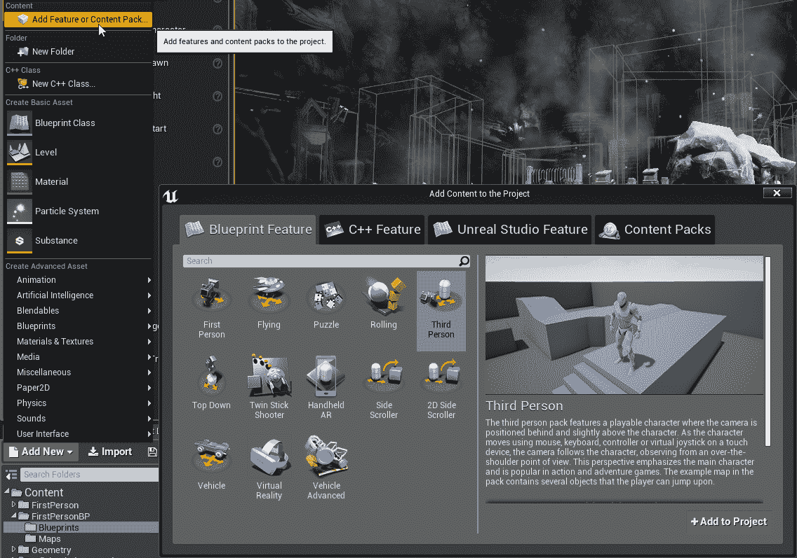

Here we're adding the Third Person content pack to our project.

2.  将其添加到您的项目中。

现在，我们将修改我们的棋子以使用第三人称网格：

3.  打开 FirstPersonCharacter 的蓝图，然后点击添加组件|骨架网格。 确保选择执行元或其 CapsuleComponent，以便将此新组件创建为 CapsuleComponent 的子级。
4.  将新零部件命名为`ThirdPerson`。
5.  将其详细信息|网格|骨架网格设置为刚刚随第三人称内容一起提供的 sk_mannequin 网格。
6.  将其 Details|Animation|Anim Class 设置为使用我们第三人称包中的 Third Person_AnimBP_C 动画蓝图。
7.  调整其位置，使其与胶囊适当对齐(将其位置 Z 值设置为-90.0，将其旋转 Z(偏航)值设置为-90.0 就足够了)：


如果我们现在运行它，我们会看到第三人称网格挡住了我们的相机视野。 我们希望向其他玩家显示此网格，但为我们隐藏它：

1.  跳转到 FirstPersonCharacter 的事件图表页面，找到其 Event BeginPlay 节点。
2.  稍微向外拖动 Event BeginPlay 节点以给自己留出一些工作空间。
3.  右键单击并将 IS 本地控制的节点添加到图形中。
4.  从您的 IS 本地控制节点创建一个分支，并将 Begin Play 的执行输出连接到该分支。
5.  将对`ThirdPerson`组件的引用拖到图表上。
6.  调用 Set Hidden in Game，将 New Hidden 设置为 true。
7.  从分支节点的 True 输出执行此 Set Hidden in Game 调用。
8.  将 Set Hidden in Game 的执行输出连接到 Event BeginPlay 曾经馈送到的 Branch 节点。
9.  将 IS 本地控制分支的`False`输出连接到 IS 头戴式显示器启用分支的输入。

In an instance such as this, it's a good idea to double-click your execution lines to create reroute nodes to avoid crossing under other nodes, and to make it clear where the conditional part of an execution begins and ends. This has no effect on the behavior of the blueprint, but it can improve its readability.

您的图形现在应该类似于下面的屏幕截图：


检查参与者是否受本地控制是您在网络开发中经常要做的事情。 当然，在单人环境中，这不是一个考虑因素，所有东西都是本地控制的，但是一旦您处理通过复制到达的对象，通常情况下，如果它们属于其他人，您可能希望以不同的方式对待它们。

You can also achieve this by setting the ThirdPerson component's Details | Rendering | Owner No See setting to True. This flag, and its companion, Only Owner See, can also be used to make certain things visible only to owners or invisible to them. You'll have to expand the Advanced area of the Rendering options to see it. For this example, we chose to use the Is Locally Controlled check because there are so many other cases in which it will be used, but it's worth it to know that these shortcuts exist.

让我们再次运行它，现在您将看到远程角色的第三人称网格和本地控制角色的第一人称网格。

# 调整第三人称武器

对于第三人称角色来说，武器放在一个奇怪的地方。 我们来解决这个问题：

1.  打开`Content/Mannequin/Character/Mesh/UE4_Mannequin_Skeleton`并在骨架树中找到 HAND_R 骨骼。
2.  右键单击骨骼，然后选择添加套接字：

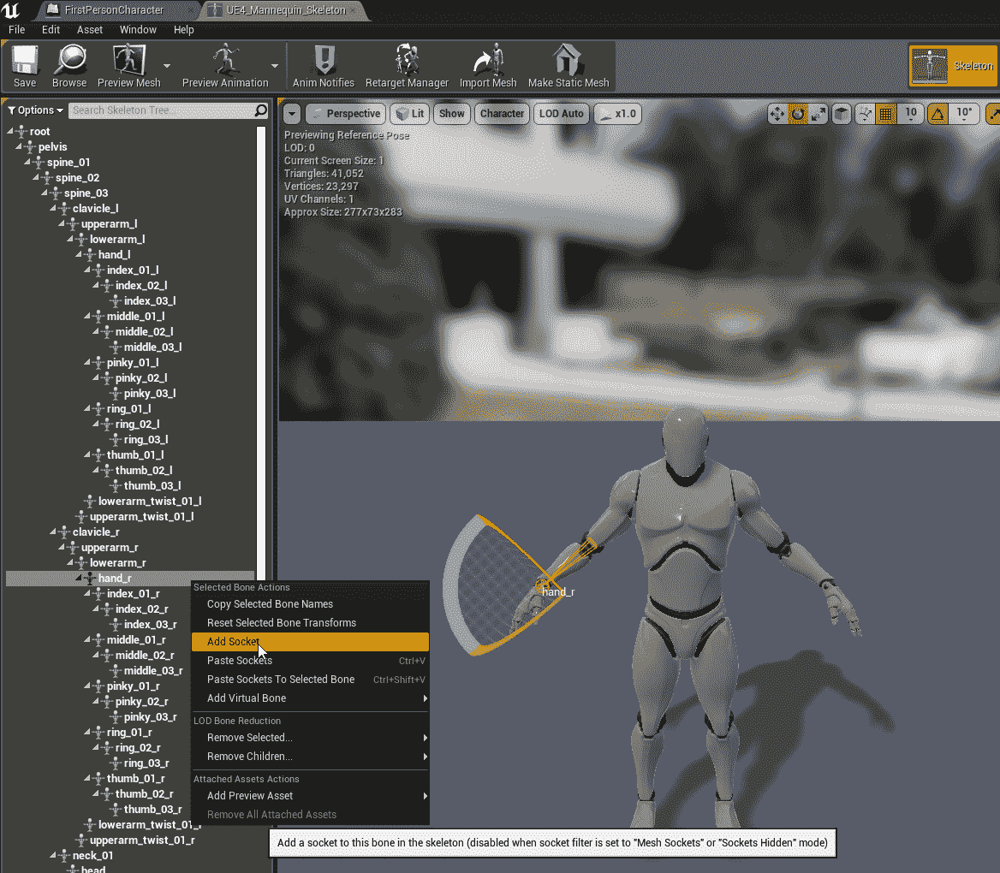

Right click the hand_r bone and select Add Socket here.

3.  将新套接字命名为`Weapon`。
4.  在套接字上单击鼠标右键(Right)并选择“添加预览资源”(Add Preview Asset)，然后选择“SK_FPGun”作为预览。
5.  移动插座，直到武器看起来与手正确对齐。 (将相对位置设置为 X=-12.5，Y=5.8，Z=0.2，并将最大相对旋转角度 Z(Yaw)值设置为 80.0 似乎就足够好了。)

现在，我们需要将武器连接到我们刚刚制作的插座上，但仅供远程玩家使用：

6.  跳回我们的 FirstPersonCharacter 事件图表，找到 Event BeginPlay 节点。
7.  从 IS 本地控制的分支的 False 输出中，连接 AttachToComponent(FP_Gun)节点。

We've seen this before, but again, as a reminder, there are two versions of AttachToComponent—one works on actors, while the other works on components. Select the one that's bound to your FP_Gun component.

8.  将第三人称组件拖到 AttachToComponent 节点的父输入中。
9.  在套接字名称中输入在骨架上创建的套接字的名称。 (武器)：

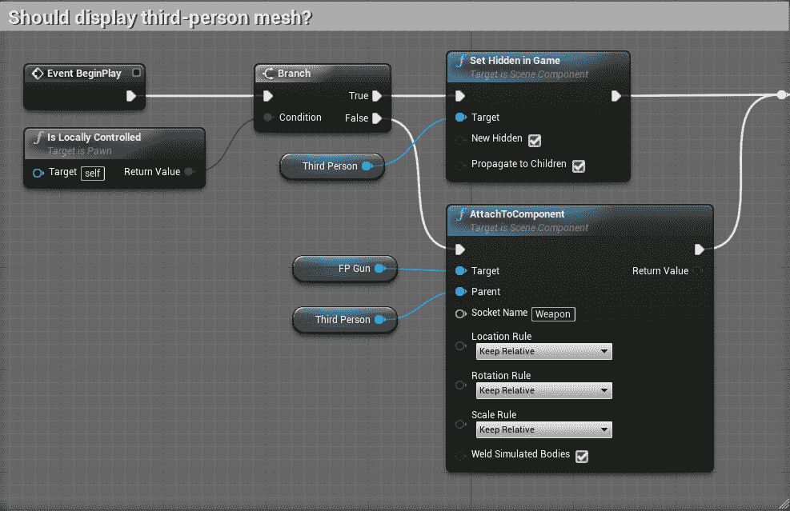

再运行一次。 武器现在应该放在更合理的位置。 它没有瞄准其他玩家瞄准的地方，因为我们没有在第三人称动画蓝图中添加任何东西来处理这个问题。 添加此功能超出了本章的范围，因为它确实让我们脱离了网络，所以出于我们在这里的游戏的目的，我们将让它保持原样。

我们需要做的下一件事是确保当玩家开枪时，服务器处理射门，并将其复制到其他客户端。

# 复制玩家动作

正如我们之前看到的，在目前的版本中，当其他玩家开火时，玩家看不到它。 我们将非常简单地开始，首先确保投射物在生成时从服务器复制到客户端：

*   打开 FirstPersonProjectile 蓝图，并在其 Details|Replication 部分中，将 REPLICATES 设置为 TRUE。

现在运行它，您将看到如果您在服务器上发射武器，客户端可以看到投射物，但是如果您在客户端发射武器，服务器就看不到它。

花点时间在脑海中形成一个清晰的图景来解释为什么会这样。 复制是单向的：从服务器到客户端。 在前面的示例中，当我们在服务器上生成标志时，我们在客户机上看到了它，因为我们已经告诉服务器复制它。 同样的事情现在也发生在投射物上。 那么，问题是，客户端如何告诉服务器它需要生成投射物？

# 使用远程过程调用与服务器对话

答案通过一个称为**远程过程**(**RPC**)的过程得到。 远程过程调用是从一个系统发出的、打算在另一个系统上运行的调用。 在我们的例子中，当我们想要发射武器时，我们将让客户端向服务器发出一个 RPC，告诉它我们想要发射，服务器将处理实际发射武器。

让我们将棋子的触发方法更改为使用 RPC：

1.  打开 FirstPersonCharacter 蓝图的事件图，并查找 InputAction Fire。
2.  在附近的某个地方，创建一个自定义事件。 称之为`ServerFire`。
3.  在自定义事件的详细信息中，将其 Graph|Replices 值设置为在服务器上运行：

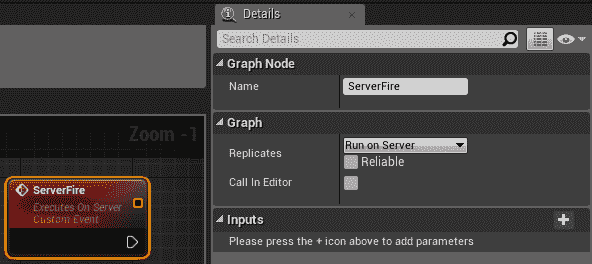

现在，让我们准备好使用这个呼叫。 我们要做的第一件事就是将那些与游戏相关的、应该在服务器上运行的东西和那些纯粹是装饰性的、可以在客户端运行的东西分开。

让我们创建一个附加的 Custom 事件来处理非必要的客户端内容。

1.  创建自定义事件并将其命名为`SimulateWeaponFire`。

Unreal developers commonly follow a naming convention whereby non-essential cosmetic aspects of a network action are named with the prefix *simulate*. This indicates to the reader that this function is safe to run on the client and contains only non-state-changing actions (sounds, animations, particles, those sorts of things). It also indicates to the reader that the function in question is safe to skip on a dedicated server.

2.  抓取 Play Sound at Location 调用和 GetActorLocation 调用，将它们从 SpawnActor FirstPersonProjectile 节点断开，然后将它们连接到新的 SimulateWeaponFire 事件。

3.  删除来自 InputTouch 节点的 FingerIndex 的分支馈送。 它没有行刑线，这意味着它什么都不做。 这简直是乱七八糟；有人没有费心清理这张图。

到目前为止，部分更新的图形应该如下所示：

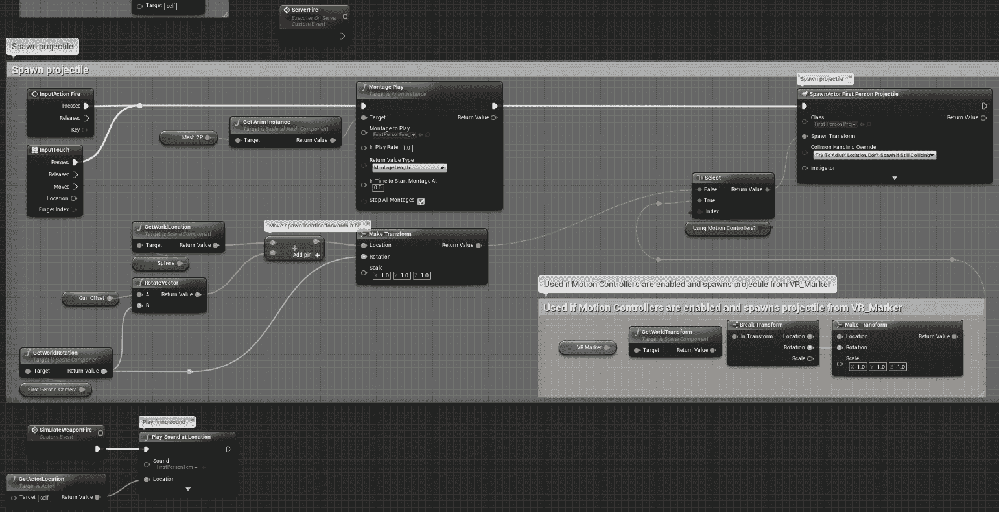

The Spawn Projectile method from the Third Person content pack we migrated into our project

4.  现在，抓取 Monage play 调用，将其从当前所在的执行线断开，并将其放到 SimulateWeaponFire 执行线上。

我们现在所做的是把所有纯粹是装饰性的东西移到它自己的活动中，可以单独调用。

This is a good convention to follow even when you're developing a single-player application because it makes it easy to see which chunks of code are actually changing things and which ones are cosmetic. It's a worthwhile practice to get into the habit of keeping them separate.

现在我们已经创建了`SimulateWeaponFire`事件并填充了它，我们将确保在任何接收输入的系统上调用它：

1.  现在，在蒙太奇播放节点以前所在的位置调用 SimulateWeaponFire，以便在任何时候听到此输入事件时都会调用它。

2.  在模拟武器射击调用之后添加一个具有权威的交换机节点。
3.  将开关节点的 Authority 输出连接到 SpawnActor 第一人称投射调用。
4.  从它的远程分支调用我们之前创建的 ServerFire 节点。
5.  将 ServerFire 节点的执行输出提供给 SpawnActor 第一人称投射节点的输入。

现在，您的 SpawnProjectle 图形应该类似于下面的屏幕截图：

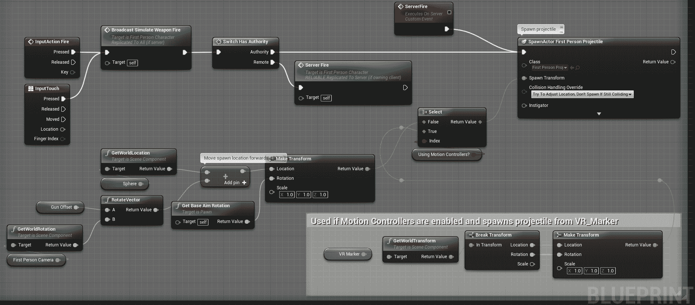

而且，SimulateWeaponFire 图表应该如下面的屏幕截图所示：


试试看。 瞄准对于客户端来说是不正确的，因为我们不会做任何事情将客户端的武器瞄准发送到服务器，但是你现在应该可以看到射弹的产生，并听到双向的射击声音了。

让我们改进一下这个。

目前，炮弹的产卵旋转来自第一人称相机。 当从客户端通信到服务器时，这是不起作用的，因为服务器不知道有关该摄像机的任何信息。 让我们将其替换为服务器知道的值：

*   在图表中右键单击以创建获取基础目标旋转节点，并将其馈送到生成变换节点，替换摄影机的 GetWorldRotation 中的输入：


再试一次。 在服务器上看到客户端投射物的原点仍然不正确，但是瞄准旋转现在是正确的。 (修复原点确实需要我们构建一个合适的第三人称动画蓝图，这超出了本章的范围。)

让我们来谈谈到目前为止这是如何运作的。 这里嵌入了一个重要的模式，值得内化。

当火输入事件到达时，我们检查是否有权产生粒子。 如果我们这样做了，我们就会继续生产它。 但是，如果我们不这样做，我们会对服务器进行远程过程调用，告诉它生成它。 是的，然后我们在本地客户机上看到它，因为它已被复制。

多人游戏中的大多数游戏事件都将按照此模式编写。 为了清楚起见，这里有一个简化的示例：

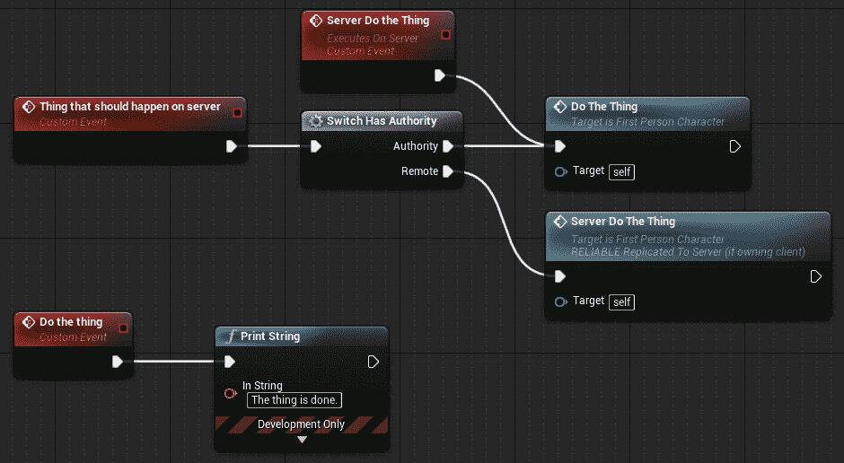

在前面的屏幕截图中，Do the Thing 调用将仅在服务器上运行。 如果触发它的事件发生在服务器上，它就会运行，如果事件发生在客户端，则客户端调用 Server do the thing RPC，然后它处理调用 do the thing。 这个模式值得铭记。 你会经常用到的。

There's a common convention among Unreal developers whereby we prefix the names of the RPCs that run on the server with the prefix *Server*. You don't have to do this, but it's a good idea, and Unreal developers will cast disapproving glances your way if you don't. It makes it much easier to see which functions are RPCs and which ones run locally.

# 使用多播 RPC 与客户端通信

我们编写的代码还有另一个问题，如果您是在一台机器上测试，将很难检测到这个问题：模拟的声音和动画只在拥有的客户机上播放。 如果我们在两台不同的机器上玩，而另一个玩家在我们附近开枪，我们就不会听到声音。

为什么不行？

在前面的截图中，当本地客户端接收到输入事件时，它调用`Simulate`方法播放声音和动画，然后检查它是否有权决定是自己产生抛射物还是让服务器处理它。 但是，如果有另一个玩家站在旁边怎么办？

玩家 A 的客户端将把 RPC 发送到服务器以产生投射物，所以每个人都会看到这一点，但是模拟射击事件的调用只在玩家 A 的机器上发生过。 玩家 A 的棋子在玩家 B 的机器上的表示(我们称此表示为*远程代理*)从未被告知播放动画，因此它没有。

我们可以使用另一种类型的 RPC 来解决这个问题，称为**多播事件**。

You'll often hear developers referring to multicast events as **net multicast** events, or as **broadcast** events. These terms refer to the same thing. By convention, just as server RPC event names are prefixed with *server*, multicast events are often named with *broadcast* as a prefix. This is a less-commonly-followed convention than the *server* prefix and you don't have to do it, but you'll have an easier time following your blueprints later on if you make this a habit.

因为我们已经将模拟方法抽象为它们自己的事件，所以这并不难做到：

*   选择您的 SimulateWeaponFire 事件，并在其详细信息|图形中，将其复制属性设置为多播：

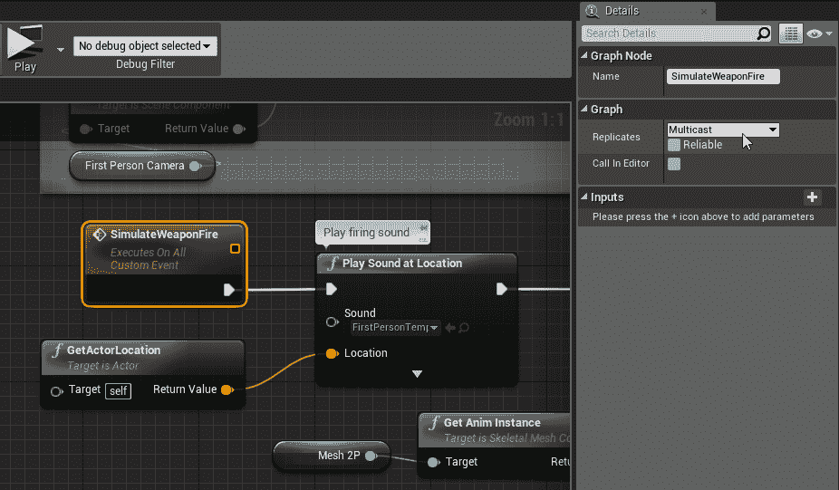

这将执行的操作是将此事件发送到服务器，并指示其向下发送到所有连接的客户端。

现在，当玩家 A 开火时，产生投射物的调用将只在服务器上发生，但是播放射击声音和动画的调用将在网络中玩家 A 的棋子的每个表示上发生。

如果愿意，可以将`SimulateWeaponFire`事件重命名为`BroadcastSimulateWeaponFire`。 一些开发人员遵循这一惯例，而另一些开发人员则不这样做。不过，一般来说，您向自己和其他开发人员提供的有关您正在做什么的信息越多，您或他们调试或维护代码就越容易。

# 客户端 RPC

还有一种类型的 RPC，我们不打算在这里进行演示，但是为了完整起见，我们应该对其进行讨论。 假设您正在服务器上运行一个操作，您需要专门调用拥有您正在操作的对象的客户端。 您可以通过将事件设置为在所属客户端上运行来完成此操作。

# 可靠的 RPC

在决定如何复制函数调用时，我们必须做出最后一个决定，那就是是否使调用可靠。

要理解此标志的含义，我们需要了解一些关于网络的重要内容。 互联网是一个不可靠的东西。 仅仅因为您向地球另一端的某人发送了 RPC，就绝对不能保证它一定会到达那里。 数据包总是会丢失。 这不是不真实的事情；这是现实世界中的事情。 作为一名开发人员，您需要做出的选择是如何处理这一点。

如果 RPC 对游戏很重要，比如发射武器，那就让它可靠。 这将指示网络接口重新发送它，直到它从另一个系统接收到已接收到呼叫的确认。 但是，这会增加您的网络流量，因此只对您关心的呼叫执行此操作。 如果你只是在广播一个装饰性的呼叫，比如武器的声音，那就让它变得不可靠，因为如果你的游戏没有收到，你的游戏就不会中断。 然而，开火的呼声应该是可靠的，因为它是否发生对玩家和游戏都很重要。

让我们现在进行此更改：

1.  找到您的 ServerFire 自定义事件，并在其 Details|Graph 中将其 Reliable 属性设置为 true。
2.  让你的 Broadcast SimulateWeaponFire 事件变得不可靠，因为它只是在播放一些不够重要的事件，不值得阻塞网络。

# 走得更远

网络是一个实质性的话题，老实说，我们在这里只触及了皮毛。 我们写这篇文章的目的是给你一个坚实的心理模型，从中你可以了解虚幻的网络框架是什么样子，以及你需要理解哪些东西才能在其中工作。

这是一件令人头晕目眩的事情，可能会让新开发人员感到相当困惑。 网络发展的诀窍是建立一个清晰的心理模型，了解正在发生的事情。 从容不迫地理解这些概念，你就会轻松得多。

这里有一些我们没有讨论的话题，比如主持会议和让其他人能够加入其中，以及相当多关于网络如何工作的细节，比如相关性。 这些事情是值得理解的，有一些很好的资源可以让你进一步理解。

首先，检查您的内容示例项目中的网络示例地图，并花一些时间了解它们显示的内容。 接下来，Cedric Neukirchen 的*多人网络纲要*，或[http://cedric-neukirchen.net/2017/02/14/multiplayer-network-compendium/](http://cedric-neukirchen.net/2017/02/14/multiplayer-network-compendium/)，是了解虚幻的网络框架如何工作的优秀资源。 Unreal 的文档在这里：[https://docs.unrealengine.com/en-us/Gameplay/Networking](https://docs.unrealengine.com/en-us/Gameplay/Networking)，根据您在这里所学到的内容，花一些时间浏览它的多人对决项目是绝对值得的。

# 简略的 / 概括的 / 简易判罪的 / 简易的

这一章比其他章节涉及更多的理论，如果它的很大一部分内容还在被理解，这是完全没有问题的。

在本章中，我们谈到了虚幻的客户端-服务器架构，以及哪些对象位于哪些域中。 很重要的一点是，对这个结构有一个良好的工作知识。 我们还了解了信息和事件如何通过复制和远程过程调用在计算机之间移动。

我们希望本章为您提供了一个良好的基础，让您在深入研究网络并真正探索其工作原理时能够站稳脚跟。 对自己要有耐心，花时间去尝试。

我们现在已经谈到了使用虚幻引擎开发 VR 需要知道的大量事情。 接下来，我们将看看一些工具和插件，它们可以极大地加速您在 VR 中的工作。 根据您在这本书中到目前为止所学到的内容，您应该准备好深入挖掘它们，并了解它们如何帮助您开发和节省大量时间。