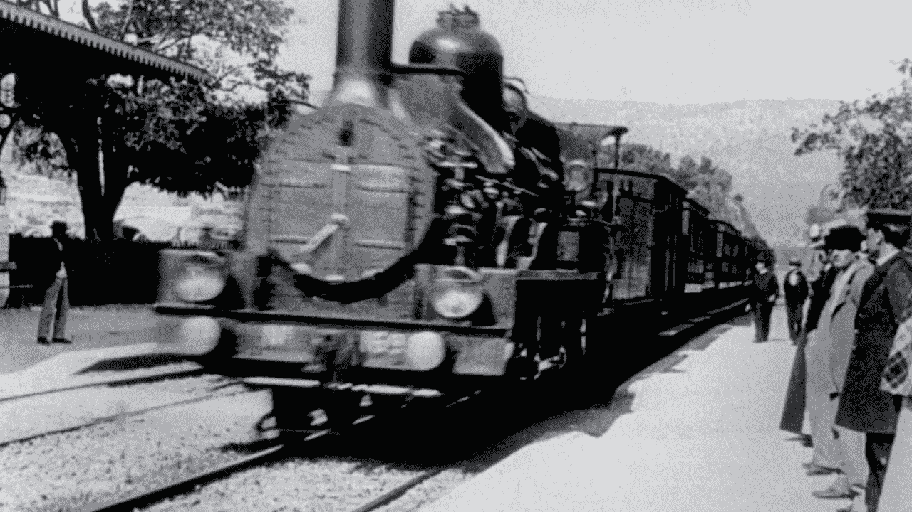

# 从这里到哪里去？

我们诚挚地祝贺您。

通过达到这一点，您已经完成了比许多有抱负的开发人员更多的工作，这是一个不小的成就。 在你作为 VR 创作者的旅程中，你能培养的最有价值的资产是你的坚持不懈和做这项工作的意愿。 读完这本书，你已经表现出了敬业精神和看透一切的愿望，这将使你有别于其他人。 花点时间认识到你自身的这一品质。

到目前为止，您可能已经注意到，我们撰写这本书的重点与其他许多教程的重点不同。 有很多材料可以告诉你该按什么按钮，但问题是--知道这些并不能让你成为一名优秀的开发人员。 通过学习如何思考你试图解决的挑战，以及如何使用你必须解决的工具，你可以在这方面做得很好。 为此，我们多次离题讨论为什么某些东西是这样工作的，或者它还可以如何使用。 在你继续自我教育的同时，继续这个想法。 花时间学习*为什么*会让你走得更远，而不是简单地学习*什么*。 后者可能会随着下一次软件更新而改变，通常不适用于其他任何情况。 我们做事的根本原因往往不会改变。 训练自己认识到，要了解一件事，你必须能够描述它为什么是这样的。 在这本书的整个过程中，我们一直试图让你习惯于思考这些*为什么*的问题，并给你一些工具来让你自己更好地区分这些问题。

我们希望你从这本书中学到了很多你在开发虚拟现实时可以用到的东西，但是，老实说，如果你仅仅得到了这两个认识，那就值得了：

*   成功来自于坚持不懈和愿意做这项工作。
*   关注*为什么*而不是*什么*

在本书的整个过程中，我们还试图证明另一个重要的事实：**开发是迭代的**。 我们一起做的许多例子都涉及解决问题和改变我们的解决方案，因为我们发现了新的问题或更好的做事方式。 在这样做的过程中，我们试图重建开发人员在我们解决问题时真正思考的方式。 这是一个一步一步进行的过程。 通过专注于下一步，做好做下一步所需的一切工作，在不清楚下一步应该是什么的时候，不要放弃或屈服于气馁，你几乎可以创造出你想象中的任何东西。

你会发现自己经常问自己，为什么你看到了你所做的结果，或者为什么你需要修复的问题可能会发生。 成为一名高效的开发人员不是要记住很多东西，而是要建立有效的思维方式，这样你才能找到解决问题的方法。

把这件事记在心里。 你正在走上一个前沿，为一种我们几乎完全不知道其规则和词汇的媒介而发展，我们都在一起，学习什么是有效的，以及我们如何帮助虚拟现实发展成为我们感觉到的艺术形式。 你将面临一些未知答案的挑战，因为它们还没有得到解决。 也许你会是第一个发现它们的人。

# 最后一句话

就在我们写这篇文章的时候，虚拟现实正处于十字路口。

在 Oculus Rift 和 HTC Vive 发布后的几年里，围绕 VR 的活动和兴趣掀起了一股热潮，然后随着时间的推移，这种兴趣平息了下来。是不是有很多人拿出他们的 VR 耳机去参加派对或演示，然后又把它们收起来--为什么？

嗯，这件事的发生有几个原因。

第一个是技术问题，在这里，我们需要诚实地告诉自己，这是第一代技术。“让这些耳机工作的实际情况是令人震惊的，但它们有局限性。”第一代技术太昂贵，太难为主流消费者设置。这些耳机长时间佩戴不舒服，镜头和屏幕的限制结合在一起，提醒用户他们正在使用的技术，打破了存在。 视场狭窄，镜头稍有偏差就会使图像模糊，低屏幕分辨率使像素边界可见(可怕的*屏蔽门*效应)。硬件开发人员知道这一点，但他们也知道，克服新兴技术成长的痛苦的唯一方法就是克服它们。

提前几年想一想，你就会发现这些问题是如何急匆匆地开始消失的。 屏幕分辨率只会不断提高，即使屏幕变得更轻，需要的电量也更少。 光波导可能会取代我们现在使用的重型菲涅尔透镜，极大地减轻耳机的重量，扩大它们的视野。 外部传感器很快就会成为过去式，因此设置 VR 头戴式耳机将不需要你咀嚼三个 USB 端口或在墙上安装基站。 越来越好的独立耳机和可以与基础 PC 无线通信的基于 PC 的耳机将很快成为标准。 这些都是非常可以解决的问题，有理由预计它们不会很快成为重大问题。

然后就是模拟器病的问题了。 在 VR 淘金热的最初几年，开发商往往对此非常天真，或者变得多疑。 通常，后者是对前者的回应。 我们都有了原来的 DK1 和 DK2，并立即开始制定运动计划，就像我们在平板电视上所做的那样，我们让自己生病了。 所以，然后我们把钟摆摆向另一个方向，把它传送到各个地方。 这两个极端都不是必须的。 我们正在学习更多关于我们可以做什么来移动玩家的观点的工作，我们也鼓励你尝试这一点。 有一些解决方案可以奏效。 另一个现实是，人们习惯了模拟器，就像他们在海上的船上一样。 在 20 世纪 90 年代初，第一人称枪手引发晕动病也很常见。 这种情况已经不再发生了，一方面是因为渲染技术的进步，另一方面也是因为玩家已经习惯了它们。 VR 也出现了类似的效果。 要意识到模拟器的不适，设计你的软件来减轻它的影响，但不要生活在致命的恐惧中：探索。 想一想还有什么办法能行得通。 早期的电影制作人必须弄清楚如何移动摄像机才能逃脱惩罚，以及哪些剪辑可以奏效。 这是一回事。 我们将通过实验来解决这一挑战。 边境不是受规则约束的地方。 我们还不认识他们。

最后一个挑战尤其是你在哪里发挥作用。 我们真的不知道我们能用这项技术做些什么。 任何告诉你我们*已经*弄明白这一点的人都不是在发挥他们的想象力。 我们才刚刚开始。

在 Rift and the Vive 第一次发布之后的淘金热中，开发人员在很大程度上将这种媒介视为他们已经知道的任何媒介的更新版。 电影人认为这是一种 3D 电影设备。 游戏界人士认为它是一款身临其境的游戏设备。 两个人都不是真的做对了。

这种媒介的语言几乎没有被发现，这使得这里成为一个令人兴奋的玩耍之地。 我们已经建议你几次询问那些试图告诉你在虚拟现实中你不能做什么的人，在这里我们想更进一步。 故意打破这些界限。 试一试你知道不会奏效的事情，因为一百次中只有一次，它们可能会成功。 把积极的想法和想象力投入到你探索虚拟现实的工作中。 让媒体告诉你它是如何工作的。 我们坚信，虚拟现实或其某种变体将成为 21 世纪的定义媒介。 如果你真的想通了，就很难用其他方式令人信服地辩解了。 沉浸和身临其境的好处实在是太明显了。 但我们需要弄清楚这些东西到底是如何运作的。 我们知道一些基础知识，但还远不能全面了解。 早期的电影观众在观看卢米埃兄弟拍摄的火车进站的电影时，很难想象有任何东西会接近电影最终演变成什么样子。 接受这一点，这里也是如此。 我们才刚刚开始学习我们可以用这种媒介做些什么，也才刚刚开始弄清楚我们如何才能做到这一点。 这次探索中最激动人心的部分就在我们面前。 请看下图：

A frame from L'Arrivée d'un Train en Gare de la Ciotat *(*The Arrival of a Train at la Ciotat Station*)*, by Auguste and Louis Lumière

在这本书中，我们真的试图给你一个开始这次冒险的基础。 我们想让你了解虚拟现实作为媒介的基础，但我们也想让你思考开发和虚幻引擎的方式，这将使你能够进行这种探索。 我们真诚地希望我们能够在这方面有所帮助。 虚拟现实对我们很重要，显然对你也很重要，否则你不会读完这本书。 让我们来创作一些艺术作品吧。

真诚地感谢你和我们一起走过这段旅程。